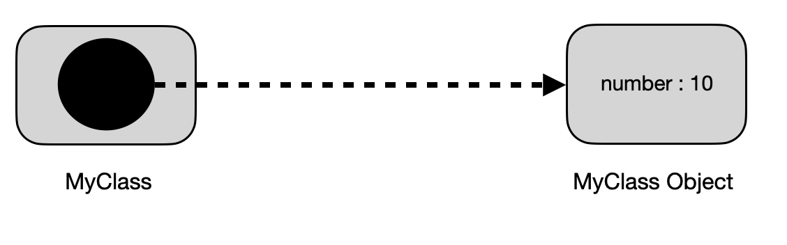

## 과제 5 : 클래스   
### 목표   
자바의 Class에 대해 학습하세요.

### 학습할 것(필수)    
* 클래스 정의하는 방법
* 객체 만드는 방법 (new 키워드 이해하기)   
* 메소드 정의하는 방법   
* 생성자 정의하는 방법   
* this 키워드 이해하기   
### 과제(Optional)   
* int 값을 가지고 있는 이진 트리를 나타내는 Node 라는 클래스를 정의하세요.   
* int value, Node left, right 를 가지고 있어야 합니다.   
* BinaryTree라는 클래스를 정의하고 주어진 노드를 기준으로 출력하는 bfs(Node node)와 dfs(Node node) 메소드를 구현하세요.   
* DFS는 왼쪽, 루트, 오른쪽 순으로 순회하세요.   

----------

### Class   

Class 는 각 instance 를 만들기위한 청사진 혹은 프로토타입 이다. 쉽게 비유하자면, 붕어빵 (Object)이 있고 그 붕어빵을 만들기 위한 붕어빵 틀이 있는데, 
이 붕어빵 틀을 Class 라고 한다. 붕어빵 틀을 통해 만들어진 각 붕어빵들을 instance 라고 한다.    

### Class 선언   

Class 는 다음과 같이 선언할 수 있다.    
```java
public class ClassExample {
    // 생성자, 필드, 메서드 등등
}
```

최상위 레벨의 Class 에는 오로지 public 과 default(no modifier) 접근 제어지시자 만 사용할 수 있다.   
Class 의 body 부분 {} 에는 instance 의 life cycle 동안 제공될 모든 코드들이 존재하게 된다.   
{새 객체를 초기화할 생성자, 클래스 및 객체의 상태를 표현하는 필드 그리고 클래스 및 객체의 행동을 구현하는 메서드}   

Class 는 또한 extends 키워드와  implements 키워드를 통해 상위 클래스 및 인터페이스의 정보를 제공할 수 있다.   

```java
public class ClassExample extends SuperClassExample implements InterfaceExample {
    //생성자, 필드, 메서드 등등
}
```

### 메서드 정의   
method 란 클래스 내부에 선언되며, 객체와 관련된 서브 루틴이다.   
method 는 선언된 클래스의 멤버 변수에 대한 접근 권한을 갖는다.   
method 는 다음과 같이 선언할 수 있다.   

```java
public class ClassExample {
    public void methodExample (int number, String text) throws Exception {
        // ....
    }
}
```
메서드는 보통 다음의 요소를 가지고 있다.   
* 접근제어 지시자   
* 반환 타입 : void 일 경우 반환값을 갖지 않는다.   
* 메서드 이름    
* 파라미터 리스트 : () 로 감싸진 부분에 작성 된다.   
* 예외 리스트 : throws 키워드를 통해 명시할 수 있다.   
* 메서드 body : {} 로 감싸진 부분 이다.   

위의 요소중 메서드 이름과 파라미터 타입을 메서드 시그니처 라고 한다.   
위의 코드를 예로 들면 메서드 시그니처는 methodExample(int, String) 가 된다.   

### 메서드 Overloading   

자바에서 메서드를 메서드 시그니처를 통해 구별할 수 있기 때문에, method overloading을 지원한다.    
따라서 같은 이름의 메서드 이더라도 파라미터 타입이 다르거나, 파라미터의 갯수가 다르면 선언이 가능하다.   
하지만 반환타입은 메서드 시그니처가 아니기 때문에 반환 타입만 다른 경우는 선언 할 수 없다.   

```java
public class ClassExample {
    public void methodExample(int number , String text) {
        // ...
    }
    public void methodExample(int number) {
        // ...
    }
    public void methodExample(String text) {
        // ...
    }
}
```

### 생성자 선언    
* 생성자 (Constructor)란 Class 를 통해 인서턴스를 생성시 호출되는 서브루틴을 말한다.   
* 생성자는 메서드의 선언과 비슷하지만, 반환값을 가지고 있지 않기 때문에 엄밀히 말하자면 함수라고 할 수 없다.   
* 생성자를 통해 여러 필드를 초기화 할 수 있다.   
* 생성자의 파라미터 갯수, 혹은 파라미터 타입이 다르다면 여러 생성자를 가질 수 있다.   
* 어떠한 생성자도 선언하지 않을 경우, 컴파일러가 자동적으로 어떠한 파라미터도 가지지 않는 디폴트 생성자를 생성 한다.   
* 컴파일러가 만들어주는 디폴트 생성자의 경우, 상위 클래스(super class)의 no-argument 생성자를 호출하기 때문에 상위 클래스의 no-argument 생성자를 확인하는게 좋다.   
* 만약 상위 클래스에서 no-argument 생성자가 존재하지 않고, 하위 클래스는 컴파일러에 의해 디폴트 생성자가 생성되는 경우에는 컴파일러 에러가 발생 한다.    
* 어떠한 생성자다로 선언되어 있으면, 컴파일러는 디폴트 생성자를 만들지 않는다.   

생성자는 다음과 같이 선언할 수 있다.   
생성자는 반환값을 가지지 않고, 이름은 클래스의 이름과 동일해야 한다.   
```java
public class ClassExample {
    private int number; 

    //기본 생성자 선언
    public ClassExample() {
        System.out.println("ClassExample constructor");
    }

    //int 값을 파라미터로 받는 생성자
    public ClassExample(int number) {
        this.number = number;
    }
}
```

### 필드 선언   

변수에는 다음과 같은 종류가 존재 한다.   
* 클래스의 멤버 변수 - 필드라고 한다.   
* 메서드나 코드 블럭내의 변수 - 지역변수 라고 한다.   
* 메서드 선언에 있는 변수 - 파라미터 라고 한다.   

필드(Field)는 접근제어 지시자, 타입 그리고 이름으로 구성된다.   
필드를 선언하는 방법은 기존의 지역변수를 선언하듯이 Class 의 body 부분에 변수를 선언하면 된다.   
```java
public class ClassExample {
    private int number;
    private String text;
}
```

### 필드의 접근 제한   

Class 의 필드는 접근제어 지시자를 통해 외부로부터 접근을 제한할 수 있다.   
제한되는 범위는 다음 표와 같다.   
|---|클래스내부|동일패키지|상속받은클래스|이외의 영역|
|:---|:---:|:---:|:---:|:---:|
|private|O|X|X|X|
|default(no modifier)|O|O|X|X|
|protected|O|O|O|X|
|public|O|O|O|O|

### 필드 초기화   

필드를 초기화하는 방법은 여러가지가 있습니다.   
* 필드 선언과 동시에 초기화   
 - 가장 간단한 방법이다. 필드를 선언하자 마자 초기 값을 같이 선언하는 방식이다.   
 - 클래스의 모든 인스턴스는 동일한 초기화 값을 가지는 장점이 있다.   
```java
public class ClassExample {
    private int number = 10; // number 필드를 10으로 초기화 한다.
}
```

* 생성자를 통한 초기화    
 - 필드를 선언하고 필드의 초기화는 생성자에 작성하는 방식이다.   
 - 이 방식을 통해 인스턴스 생성시, 원하는 값으로 초기화할 수 있는 장점이 있따.   
```java
public class ClassExample {
    private int number;

    public ClassExample(int number) {
        this.number = number; //생성자의 파라미터를 통해 필드를 초기화 한다.   
    }
}
```

* Static 초기화 블럭을 통한 초기화   
 - 클래스 변수(static이 붙은 멤버 변수)를 초기화 하는 방법 이다.   
 - 이 방법을 통해 클래스 변수 초기화시, 다양한 로직을 함께 적용할 수 있는 장점이 있다.   
 - static 초기화 블럭은 클래스내 어느곳이든 작성이 가능하며, 여러개 작성할수 있다. 또한 static 초기화 블럭은 작성된 순서에 따라 호출되는것이 보장 된다.   
 - static 초기화 블럭을 대체하는 방법으로는 private static 메서드를 사용하는 것이다. private static 메서드를 사용하면 static 변수를 다시 초기화 할때 재사용 할 수 있는 장점이 있다.   
```java
public class ClassExample {
    private static final String text;
    private static final int number = init();

    static {
        // 코드 블럭을 통해, 단순히 값의 주입뿐만 아니라 다양한 로직을 사용할 수 있다.
        text = "test";
    }

    // private static 메서드를 통해 static 초기화 블럭을 대체할 수 있다. 
    private static int init() {
        return 10;
    }
}
```

* 초기화 블럭을 통한 초기화   
 - 인스턴스 변수를 초기화 하는 방법이다.   
 - 보통 생성자를 통해 초기화할수도 있지만, 초기화 블럭을 통해 필드를 초기화 할수도 있다.   
 - 초기화 블럭은 자바 컴파일러를 통해 모든 생성자에 복사된다. 따라서 여러 생성자안에 공유하고자 하는 코드를 초기화 블럭으로 분리할 수 있다.   
 - 초기화 블럭을 대체하는 방법으로 final 메서드를 선언하는 방법이다.   

초기화 블럭은 다음과 같이 선언할 수 있다. 앞서 봤던 static 초기화 블럭과 형태는 같지만 static 키워드는 존재하지 않는다.   
```java
public class ClassExample {
    {
        System.out.println("초기화 블럭입니다. 자바 컴파일에 의해 모든 생성자에 복사된다. ");
    }

    public ClassExample() {
        System.out.println("no-argument 생성자 이다. ");
    }
    public ClassExample(String str) {
        System.out.println("String만 받는 생성자 이다.");
    }
    public ClassExample(int nunmber) {
        System.out.println("int 만 받는 생성자 이다.");
    }
    public ClassExample(String str, int number) {
        System.out.println("String과 int를 받는 생성자 이다.");
    }
 }
```

### 파라미터에 대해   
파라미터는 메서드를 선언에 있는 변수들을 의미한다. Argument 는 실제 메서드가 실행될 때 전달되는 실제 값을 의미한다.   
1. 파라미터 타입   
 - 메서드에 사용되는 파라미터는 어떠한 타입이든 지정할 수 있다.   
 - 만약 메서드를 전달하고 싶으면, lamda 표현식이나 메서드 참조 를 사용해야 한다.   
2. Aribitrary Number of Arguments   
 - vargargs 라는 구조 (... 키워드) 를 이용하여 메서드에 여러개의 값을 전달 할 수 있다.   
 - 이러한 방식은 몇개의 argument가 필요한지 알 수 없을 떄, 유용하게 사용 할 수 있다.   
 - 전달된 변수는 배열로 취급되어 다루어지게 된다.   
```java
public class MyClass{ 
    // ... 을 이용하여 vargargs 구조를 선언한다.   
    public void arbitraryNumberOfArgumentsMethod(String... texts) {
        //전달된 texts 변수는 배열로 취급된다. 
        if(texts[0] != null) {
            System.out.println(texts);
        }
    }
}

public class Main {
    public static void main(String[] args) {
        MyClass myClass = new MyClass();
        myClass.arbitraryNumberOfArgumentsMethod("text1","text2","text3"); //필요한 만큼 데이터를 추가할 수 있다.
    }
}
```
3.파라미터 이름   
 - 메서드나 생성자를 선언할 때, 파라미터의 이름을 정의할 수 있다. 이때 정의된 파라미터의 이름은 메서드 내에서 전달된 argument를 참조할때 사용된다.   
 - 파라미터의 이름은 메서드의 범위내에서 유니크해야 한다. 따라서 메서드나 생성자내에서 동일한 이름의 지역 변수를 선언할 수 없다.   
 - 만약 파라미터의 이름이 클래스의 필드 이름과 동일한 경우, 파라미터는 메서드의 범위내에서 필드를 가려버린다. 이런 경우 이름을 통해 필드에 접근할 수 없게되기 때문에, 
 필드에 접근하기 위해 this 키워드를 사용해야 한다.   
```java
public class MyClass {
    private int number;

    public MyClass(int number) {
        // 파라미터에 사용된 number라는 이름이 필드의 이름과 동일하여 필드를 가려버리게 된다.
        // 아래와 같이 호출할 경우, number는 파라미터의 number를 의미한다. 
        number = number;
    }
}
```
4. Primitive 데이터 타입의 Arguments   
Primitive 데이터 타입의 argument는 메서드에 value 로써 전달된다. 즉, 전달된 argument 의 데이터를 변화시키더라도 그 유효성은 메서드 내에서만 
한정되기 때문에 메서드 외부에는 영향을 끼치지 않는다.   
```java
public class Main {
    public static void main(String[] args) {
        int number = 10;
        method1(number);

        System.out.println(number); //10을 출력한다. 
    }
    
    public static void method1(int number) {
        number = 20;

        System.out.println(number); //20을 출력한다.
    }
}
```
5. Reference 데이터 타입의 Arguments   
Reference 데이터 타입의 파라미터 또한 메서드에 value 로써 전달된다. 즉, 전달된 참조는 메서드가 종료되고 나서도 여전히 똑같은 
객체를 참조하고 있다는 의미이다. 하지만 전달된 객체의 필드 값을 메서드 내에서 변경할 경우, 이 변경 사항은 적용되게 된다.   
```java
public class MyClass {
    public int number;

    public MyClass(int number) {
        this.number = number;
    }
}

public class Main {
    public static void main(String[] args) {
        MyClass myClass = new MyClass(10);
        MyClass myClass2 = new MyClass(10);

        method1(myClass, 20);
        System.out.println(myClass.number); // 20을 출력한다. 참조되는 객체의 필드값이 변경되었고, 이는 적용된다.

        method2(myClass2);
        System.out.println(myClass2.number); // 10을 출력한다. 참조 객체는 변경되지 않기 때문에 최초 10의 값을 그대로 가진다.
    }

    public static void method1(MyClass myClass, int number) {
        myClass.number = number;
        System.out.println(myClass.number); // 20 을 출력한다. 위에서 20으로 변경하였기 때문이다.

        MyClass = new MyClass(30);

        System.out.println(myClass.number); // 새로운 객체를 할당하였기 때문에, 30을 출력한다.
    }

    public static void method2(MyClass myClass) {
        myClass = new MyClass(40);

        System.out.println(myClass.number); // 새로운 객체를 할당하였기 때문에, 40을 출력한다. 
    }
}
```
### Object   
Object (객체) 란 물리적으로 존재하거나 추상적으로 생각할 수 있는 것을 말한다. 자바 프로그램에서는 메서드를 호출하여 상호작용하는 여러 수많은 객체를 생성하게 된다.   

Ojbect 생성   
이미 앞서 우리는 Class 가 생성자를 제공하고, 이 생성자를 통해 객체를 생성할 수 있다는 것을 배웠다. 보통 객체를 생성할 때, 우리는 다음과 같이 코드를 작성하게 된다.   
```java 
public class MyClass {
    private int number;

    public MYClass(int number) {
        this.number = number;
    }
}

public class Main {
    public static void main(String[] args) {
        MyClass myClass = new MyClass(10); // 객체를 생성하는 코드
    }
}
```
위 코드에서 Object의 생성과정은 총 3가지의 파트로 나누어 진다.   

 1. 선언 
  - MyClass myClass는 사용할 MyClass 타입의 myClass 라는 이름의 변수를 선언한 코드이다.    
  - 단순히 원하는 클래스 타입의 변수를 선언한다고 객체가 생성되지 않는다. 일반적으로 클래스 타입의 변수만 선언하게되면, 선언된 변수는 어떠한 참조도 가지고 있지 않게 된다. 따라서 선언만된 변수에 
  접근하려고 하면 컴파일 에러가 발생하게 된다.   
 2. 인스턴스화   
  - new 연산자를 통해 클래스로부터 객체가 생성되게 된다. 이를 인스턴스화라고 한다.    
  - new 연산자는 생성자라고 불리는 단 하나의 argument가 요구 된다.   
  - new 연산자를 사용하게되면 새 객체를 위해 메모리가 할당되며, 해당 메모리에 대한 참조를 반환한다.   
  - new 연산자를 통해 반환되는 참조는 꼭 변수에 해당될 필요는 없다. 반환되는 참조는 표현식에서 바로 사용할 수도 있다. 이런경우, 반환된 참조는 JVM에 의해 메로리가 해제된다.   
  - new 연산자는 클래스의 생성자와는 상관이 없다. 쉽게 이야기하자면, new 연산자는 자바 버전의 malloc 이라고 할 수 있다.   
  - 위 코드에서는 new 연산자를 통해 반환된 참조를 myClass 라는 변수에 할당한 것이다.   
  - 인스턴스화라는 말의 의미는 객체를 생성한다는 의미이다.   
 3. 초기화   
  - new 연산자가 호출된 후, 클래스의 생성자가 호출됨으로써, 생성될 객체가 가질 데이터가 초기화 된다.   

즉 위의 코드에서 생성되는 변수 및 객체는 다음과 같이 그려질 수 있다.   
   

### Object 사용   
 1. 필드 참조   
 - 객체의 필드는 각 필드의 이름에 의해 접근할 수 있다.   
 - 객체 외부의 코드에서 객체의 필드에 접근하는 방법은 객체의 참조나 표현식에서 dot(.) 연산자를 사용하여 할 수 있다.   
 - 필드 참조는 접근제어 지시자에 의해 접근이 제한 될 수 있다.   
 2. 메서드 호출   
 - 객체의 메서드 또한 각 메서드 이름을 통해 호출할 수 있다.   
 - 객체의 메서드 호출 또한 dot(.) 연산자를 사용하여 할 수 있다.   
 - 메서드 호출 또한 접근제어 지시자에 의해 접근이 제한 될 수 있다.   

```java
public class MyClass {
    private int number;
    public String text;

    public MyClass(int number) {
        this.number = number;
    }

    public void method1() {
        System.out.println("method1 호출");
    }

    public void method2() {
        System.out.println("method2");
    }
}

public class Main {
    public static void main(String[] args) {
        MyClass myClass = new MyClass(10); // 객체를 생성하는 코드

        //System.out.println(myClass.number); // 접근 제어 지시자가 private 이기 때문에 컴파일 에러가 발생한다. 

        System.out.println(myClass.text); // 접근제어 지시자가 public 이기 때문에 dot 연산자를 사용하여 접근이 가능하다.   

        myClass.method1(); // 객체의 메서드 또한 dot 연산자를 이용하여 호출할 수 있다. 

        //myClass.method2(); // 접근 제어 지시자가 private이기 때문에 컴파일 에러가 발생한다.
    }
}
```
 3. 객체의 메모리 관리   
 - 몇몇 object-oriented 언어에서는 프로그래머가 직접 생성한 모든 객체를 추적하고 사용이 끝나면 제거해줘야 한다. 하지만 자바 언어에서는 Garbage Collector 에 의해 생성된 객체가 
 필요 없어질 경우 제거되게 된다. 이를 garbage collection 이라고 부른다.   
 - 보통 더이상 참조되지 않는 객체가 garbage collection 의 대상이 된다. 만약 변수에 할당된 참조일 경우, 그 변수가 범위 (scope)를 벗어나게 되면 삭제된다. 또한 변수에 null을 할당하여 명시적으로 
 객체 참조를 삭제할 수 있다.   
 - garbage collector 는 적절한 시기라고 판단되면, garbage colletion 을 자동으로 실행한다.   

### this 키워드   
인스턴스의 메서드나 생성자에서 사용되는 this 라는 키워드는 현재의 객체를 가리킨디ㅏ. 따라서 this 키워드를 통해 현재의 객체 내의 필드나 메서드를 참조할 수 있다.   
 1. this 키워드를 이용한 필드 참조    
 보통 파라미터의 이름이 멤버 변수의 이름과 같으면, 파라미터가 멤버 변수를 가려버리기 때문에, 멤버 변수를 참조할 수 없게 된다.   
 이런 경우, this 키워드를 사용하게되면 현재 인스턴스의 멤버 변수를 참조 할 수 있게 된다.   
```java
public class MyClass {
    private int number;
    private String text;

    public MyClass(int number, String text) {
        //number = number; // 여기에 사용된 number는 멤버 변수가 아닌 파라미터로 들어오는 number를 가리키는 것이다.
        this.number = number; // this 키워드를 사용하면 현재 인스턴스의 멤버 변수를 가리키게 된다.
        this.text = text;
    }
}
```
 2. this 키워드를 이용한 생성자 호출   
 생성자내에서 this 키워드를 사용하면 같은 클래스내의 다른 생성자를 호출할 수 있다. 이러한 방법은 명시적 생성자 호출 이라고 한다.   
```java
public class MyClass {
    private int number;
    private String text;

    public MyClass() {
        this(10, "test"); // int 와 String 타입을 갖는 생성자를 호출한다.
    }

    public MyClass(int number, String text) {
        this.number = number;
        this.text = text;
    }
}
```

### Nested Class   
자바 프로그래밍에서는 한 클래스 내부에 다른 클래스를 선언할 수 있다. 이러한 클래스를 Nested Class , 즉 중첩클래스라고 한다.   
Nested Class 는 두가지의 카테고리로 나누어진다.   
 1. static 키워드를 이용한 경우, static nested class 라고 한다.   
 2. static 키워드를 이용하지 않은 경우, inner class 라고 한다.   
```java
public class OuterClass {
    static class StaticNestedClass {

    }
    class InnerClass {

    }
}
```
중첩 클래스는 중첩 클래스를 둘러싼 클래스의 멤버이기 떄문에, 둘러싼 클래스의 필드에 얼마든지 접근이 가능하다(private 로 되어 있어도 접근이 가능하다).   
하지만 static 으로 선언한 중첩클래스의 경우 필드에 접근이 불가능 하다.   

중첩클래스 또한 둘러싼 클래스의 멤버이기 때문에, 모든 접근제어 지시자를 사용할 수 있다.   
 - 중첩 클래스를 사용하는 이유    
  - 한 곳에서만 사용되는 클래스들을 논리적으로 그룹화할 수 있기 때문이다.   
  - 캡슐화를 증가시킬 수 있기 때문이다.   
  - 좀더 읽기 쉽고 유지보수하기 쉬운 코드로 이어질 수 있기 때문이다.   

### Static Nested Class   
Static Nested Class는 바깥 클래스의 변수나 메소드에 직접 접근이 불가능하다. 따라서 바깥 클래스의 변수나 메소드에 접근 하기 위해서는 그 클래스의 객체 참조를 사용해야 한다.   

Static Nested Class 는 일반적으로 선언하는 클래스처럼 사용된다. 따라서 단순히 패키징을 보다 편하게 하기 위해 사용된 클래스라고 이해하면 된다.   

Static Nested Class 는 바깥 클래스의 이름을 통해 접근할 수 있다.   
```java
public class OuterClass {
    public static class StaticNestedClass {

    }
}
public class Main {
    public static void main(String[] args) {
        OuterClass.StaticNestedClass staticNestedClass = new OuterClass.StaticNestedClass();
    }
}
```

### Inner Class    
Inner Class 는 객체의 메서드나 필드에 바로 접근이 가능하지만, Inner Class 는 인스턴스와 관련되기 때문에(정확히는 인스턴스의 멤버 변수로써 정의되기 떄문에) static 멤버 변수를 가질 수 없다.   
```java
public class OuterClass {
    public class InnerClass {
        static int NUMBER = 10; // 컴파일 에러 발생
        static final int IMMUTABLE_NUMBER = 10; // 선언 가능
    }
}
```
위의 코드를 보면 단순히 static 키워드만 쓴 멤버 변수는 컴파일 에러가 발생하게 된다. 그러한 이유는 Inner Class 는 바깥 클래스의 인스턴스에 종속적인데, 바깥 클래스에 대한 인스턴스를 여러개 생성한 경우, 
어떤 인스턴스의 static 멤버 변수 값이 옳은 것인지 알 수 없기 때문이다. 하지만 final 키워드를 사용하게 될 경우 값이 컴파일 시점에 결정되고 변경될 수 없기 때문에 사용이 가능하다.   

Inner Class 를 인스턴스화 하기 위해서는 먼저 바깥 클래스를 인스턴스화 해야 한다. 그 후, 바깥 클래스의 인스턴스를 이용하여 Inner Class 객체를 만들 수 있다.   
```java
public class OuterClass {
    public class InnerClass {

    }
}

public class Main {
    public static voiid main(String[] args) {
        OuterClass outerClass = new OuterClass();

        OuterClass.InnerClass innerClass = outerClass.newInnerClass();
    }
}
```
Inner Class 에 바깥 클래스의 멤버 변수와 동일한 멤버 변수가 존재할때, {바깥 클래스의 이름}.this.{멤버 변수} 로 바깥 클래스의 멤버 변수에 접근할 수 있다.   

```java
public class OuterClass {
    private int number = 20;

    public class InnerClass {
        private int number = 30;

        public void method(int number) {
            System.out.println(number); // 10이 출력된다. 
            System.out.println(this.number); // 30이 출력된다.
            System.out.println(OuterClass.this.number); // 20 이 출력된다.
        }
    }
}

public class Main {
    public static void main(String[] args) {
        OuterClass outerClass = new OuterClass();
        OuterClass.InnerClass innerClass = outerClass.new InnerClass();

        innerClass.method(10);
    }
}
```

### Local Class   

Local Class 란 코드 블럭 ( {} ) 안에 정의된 클래스를 의미한다. Local Class 는 특정 메소드 내에서만 필요한 객체가 필요할 때 주로 사용된다.   
```java
public class Main {
    public static void main(String[] args) {
        boolean result = hasInvalid("V1111111111", "V123456789", "E123456789");
        System.out.println(result); // true 출력

        boolean result2 = hasInvalid("V111111111", "V123456789");
        System.out.println(result2); // false 출력
    }
    
    public static boolean hasInvalid(String... values) {
        boolean result = false;
        final int length = 10;
        final String prefix = "V";

        class Value {
            private String prefix = "";
            private String number = "";

            Vlaue(String value) {
                if(value.length() == length) {
                    this.prefix = value.subString(0,1);
                    this.number = value.subString(1, value.length());
                }
            }

            public String getPrefix() {
                return this.prefix;
            }

            public String getNumber() {
                return this.number;
            }
        }

        for(String value : values) {
            Value valueObject = new Value(value);
            if(!prefix.equalsIgnoreCase(valueObject.getPrefix()) || valueObject.getNumber().length() != 9) {
                result = true;
            }
        }
        return result;
    }
}
```
### Anonymous Class   
Anonymous Class 는 이름이 없다는 것만 제외하면 Local Class 와 동일하다. 따라서 Local Class 를 한번만 사용해야 하는 경우에 사용 할 수 있다. 
또한 Anonymous Class 선언과 동시에 인스턴스화가 가능하다.   

Anonymous Class 는 표현식이기 때문에, 다른 표현식에서 사용이 가능하다.   

Anonymous Class 는 다음과 같이 선언할 수 있다.   
```java 
public class Main {
    public static abstract class MyAbstractClass {
        priavate int number;

        public MyAbstractClass(int number) {
            this.number = number;
        }

        public void method() {

        }
    }

    interface MyInterface {
        public void method();
    }

    public static void main(String[] args) {
        // 선언과 동시에 인스턴스화를 할 수 있다.
        MyInterface MyInterface = new Interface() {
            public void method() {
                System.out.println("method 호출");
            }
        };

        MyInterface.method(); // 'method 호출' 이 출력된다.

        MyAbstractClass myAbstractClass = new MyAbstractClass(10) {
            @Override
            public void method() {
                System.out.println(super.number);
            }
        };

        myAbstractClass.method(); // 10이 출력된다.
    }
}
```
Anonymous Class 표현식은 다음으로 구성된다.    
 - new 연산자.   
 - 구현하고자 하는 클래스 혹은 인터페이스의 이름.   
 - 구현하고자하는 클래스의 생성자와 동일한 arguments를 가진 괄호. 인터페이스의 경우 빈 괄호 사용한다.   
 - 클래스를 정의한 body 부분. 메서드는 선언할 수 있지만, 명령어는 선언할 수 없다.   

Anonymous Class 에는 다음과 같은 제약사항이 있다.   
 - Anonymous Class 는 final 혹은 effectively final 이 아닌 지역 변수에 접근할 수 없다.   
 - Anonymous Class 는 중첩클래스처럼 바깥 클래스의 변수와 동일한 이름으로 선언시 바깥 클래스의 변수를 가리게 된다.   
 - Anonymous Class 에는 static 초기화 블럭 및 멤버 interface 를 선언할 수 없다.   
 - Anonymous Class 는 상수 변수에 한해서만 static 멤버 를 가질 수 있다.   
 - Anonymous Class 에는 생성자를 정의할 수 없다.   

Anonymous Class 는 다음과 같은 사항은 허용 된다.   
 - Anonymous Class 는 바깥 클래스의 멤버에 접근할 수 있다.   
 - Anonymous Class 에는 필드, 추가 메서드, instance 초기화 블럭 및 Local class를 선언할 수 있다.   

 
