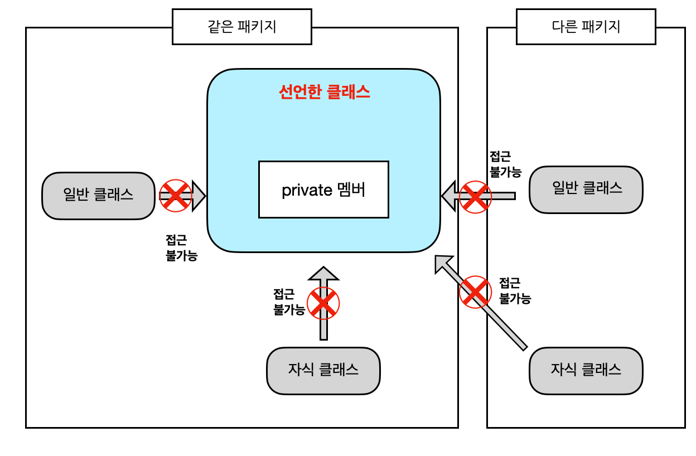

## 과제 6 : 상속   

### 목표 : 자바의 상속에 대해 학습하세요.   

### 학습할 것 (필수)      
* 자바 상속의 특징   
* super 키워드   
* 메소드 오버라이딩   
* 다이나믹 메소드 디스패치 (Dynamic Method Dispatch)   
* 추상 클래스   
* final 키워드   
* Object 클래스   

-------------

### 상속   

상속이라는 단어의 뜻과 마찬가지로 자바에서도 상속은 부모클래스의 변수와 메소드를 물려받는 것을 말한다.   
이런 상속은 코드의 재사용성을 통해 코드의 간결성을 확보해준다.   

* 상속 받틑 클래스 = 하위클래스 = 자식클래스 = 서브클래스   
* 상속 해주는 클래스 = 상위클래스 = 부모클래스 = 슈퍼클래스   

```java
class 자식클래스명 extends 부모클래스명 {

}
```

자바의 상속은 extends 라는 키워드를 통해 이루어진다.   

### 상속의 대상   

위에서 말한 대로 상속을 받으면 부모클래스의 변수와 메소드를 가져다 쓸 수 있다. 하지만 모두 다 사용 가능한 것은 아니다. 
접근지정자에 따라 상속하여도 사용할 수 없는 변수 및 메소드들이 생겨난다.

접근제어자
|접근제어자|같은클래스멤버|같은패키지멤버|자식클래스멤버|그외의영역|
|:---:|----|----|----|----|
|public|yes|yes|yes|yes|
|protected|yes|yes|yes||
|default|yes|yes|||
|private|yes||||

public 접근제어자   
public 으로 선언된 클래스 멤버 및 메서드는 프로그램 어디에서나 접근이 가능하다.   
    

default 접근제어자   
자바에서 기본적으로 명시되는 접근제어자로 접근제어자를 따로 몇시하지 않을ㄷ 때 해당 권한을 가지게 된다.   
해당 권한으로 선언되었을 때는 같은 패키지만 접근이 가능하다.   
   

private 접근제어자   
외부로부터는 접근할 수 없게 해주는 접근제어자로 정보은닉을 위한 접근제어자 이다. 선언한 클래스 이외에는 어느 패키지에서도 접근할 수 없다.   
(이에 접근하기 위해 보통 getter/setter를 설정하여 사용한다.)   
     

protected 접근제어자   
default 접근제어자에서 권한이 하나 더 추가된 접근제어자 이다. 다른패키지에서 해당 클래스를 상속받을 경우 사용권한이 생기게 된다.   
     

### 상속의 특징   
 1. 상속은 단일 상속만 가능하다.   
 ```java
 class 자식클래스명 extends 부모클래스명1, 부모클래스명2 {
     // 불가능 하다.
 }
 ```
 2. 자바의 계층 구조 최상위에는 java.lang.Object 클래스가 존재한다.   
 3. 자바에서는 상속의 횟수에 제한을 두지 않는다.   
 ```java
 class A{}
 class B extends A{}
 class C extends B{}
 //상속에는 횟수제한이 없다.
 ```
 4. 부모의 메소드와 변수만 상속되며, 생성자는 상속되지 않는다.   
 부모의 메소드는 재정의하여 사용가능하다.(오버라이딩)   

### super 키워드    
super 키워드는 자식클래스가 부모클래스로부터 상속받은 멤버를 사용하고자 할때 사용된다.   
```java
class Parent {
    int a = 10;
}

class Child extends Parent {
    int a = 20;

    void childMethod() {
        System.out.println(a);          // 20
        System.out.println(this.a);     // 20
        System.out.println(super.a);    // 10
    }
}
```
위와 같이 super를 사용하면 부모클래스에 선언된 속성 값을 가져올 수 있다.   

super 키워드와 this 키워드의 기능이 비슷하듯 this()와 super() 키워드 역시 기능이 비슷하다.   
super() 키워드는 this() 와 마찬가지로 생성자를 호출하는 함수로, 자기자신이 아닌 부모클래스의 생성자를 호출한다.   
```java 
class Canvas2D {
    int x;
    int y;

    public Canvas2D(int x, int y) {
        this.x = x;
        this.y = y;
    }
}

class Canvas3D extends Canvas2D {
    int z;

    public Canvas3D() {
        this(100,200,300);
    }

    public Canvas3D(int x, int y, int z) {
        super(x, y);
        this.z = z;
    }
}
```
다음과 같이 부모클래스의 해당 속성들을 모두 초기화 할 수 있다.   

### 메소드 오버라이딩(Overriding)   
상속은 부모의 메소드를 가져다 사용할 수도 있지만 이를 가져와 재정의 할 수도 있다.   
```java 
public class A {
    public void print() {
        System.out.println("A");
    }
}

public class B extends A {
    // 메소드 오버라이딩 - A를 상속받았으나 함수를 재정의
    public void print() {
        System.out.println("B");
    }
}

public class Test {
    public static void main(String[] args) {
        B b = new B();
        b.print();      // B를 출력
    }
}
```
오버라이딩은 위와 같이 부모의 함수를 재정의하는 기능이다. 그렇기 때문에 함수명, 리턴값, 파라미터가 모두 동일해야 한다.   

### 메소드 오버로딩(Overloading)   
메소드 오버라이딩을 설명할 때 같이 나오는게 메소드 오버로딩이다. 이름이 비슷하여 헷갈리는 경우가 있기도 한다. 둘 다 자바의 다형성을 위한 기능이기에 
설명을 같이 하는 경우가 많이 있다.   
```java
public class A {
    public void print() {
        System.out.println("A");
    }

    public void print(int a) {
        System.out.println("A" + "_" + a);
    }
    
    public void print(int a, int b) {
        System.out.println("A" + "_" + a + "B" + "_" + b);
    }
}
```
오버로딩은 메소드와 리턴값은 같지만 매개변수가 다른 것을 의미 한다. 매개변수의 타입과 갯수에 따라 오버로딩이 성립된다.   

### 메소드 디스패치 (Method Dispatch)   
메소드 디스패치는 어떤 메소드를 호출할 것인지 결정하여 실제로 실행시키는 과정을 말한다. 이런 메소드 디스패치에는 정적 메소드 디스패치(Static Method Dispatch), 
동적 메소드 디스패치(Dynamic Method Dispatch), 더블 디스패치(Double Dispatch) 세 가지가 존재한다.   

### 정적 메소드 디스패치 (Static Method Dispatch)   
```java 
public class A {
    public void print() {
        System.out.println("A");
    }
}

public class B extends A {
    // 메소드 오버라이딩 - A를 상속 받았으나 함수를 재정의
    public void print() {
        System.out.println("B");
    }
}

public class Test {
    public static void main(Strint[] args) {
        B b = new B();
        b.print();          // B를 출력
    }
}
```
Overring의 예제 역시 정적 메소드 디스패치 이다.   

메인 함수에서 b.print()를 호출했을 때 우리는 클래스 B의 오버라이딩 된 함수가 불릴 것이라고 알고 있다.   
우리가 이미 알고 있는 것과 같이 컴파일러 역시도 이 메소드를 호출하고 실행시켜야 되는 것을 명확하게 알고 있는 것을 정적 메소드 디스패치라고 부른다.   
 - 컴파일 시점에서, 컴파일러가 특정 메소드를 호출할 것이라는 걸 명확하게 알고 있는 경우   
 - 컴파일 시 생성된 바이트 코드에도 이 정보가 그대로 남아있다.   
 - 런타임(실행 지점) 이 되지 않아도 미리 결정하는 개념이다.   
 - 함수를 오버로딩하여 사용하는 경우, 인자의 타입이나 리턴타입 등에 따라 어떤 메서드가 호출 될지 명확하기 떄문에 역시 '미리 알 수 있다' 고 할 수 있다.   
 - 상위 개념인 Super 클래스가 존재하더라도, Sub sub = new Sub() 와 같이 서브 클래스를 레퍼런스로 선언하고 서브 클래스의 인스턴스를 만든다면 이 역시도 Static Dispatch에 해당한다.   

### 동적 메소드 디스패치 (Dynamic Methdo Dispatch)   
동적 메소드 디스패치는 정적 디스패치와는 다르게 컴파일러가 어떤 메소드를 호출해야 되는지 모르는 것을 말한다.   
```java 
class A {
    private BB bb;

    A(BB bb) {
        this.bb = bb;
    }

    void print() {
        bb.print();
    }
}

class B implements BB {
    public void print() {
        System.out.println("B");
    }
}

class B1 implements BB {
    public void print() {
        System.out.println("B1");
    }
}

interface BB {
    void print();
}
```
위의 예제에서 BB라는 interface는 B , B1 으로 각각 구현되고 있다. 또한 A라는 클래스는 이런 BB라는 추상 클래스를 받아 bb.print()라는 함수를 사용하고 있다.   

그렇다면 여기서 A클래스의 print()함수를 사용하면 어떤 함수가 호출될까? 아마도 해당 함수의 객체를 선언할 때에 할당 된 Object를 보고 어떤 함수를 실행할 지 결정하게 될 것이다.   
우리는 이렇게 유추가 가능하지만 컴팡리러는 이에 대해 알 수 있는 방법이 없다.   
 즉, 컴파일러는 어떤 함수가 실행될 지 전혀 모르는 것이다. (B클래스의 print()를 가져와야 할지, B1클래스의 print()를 가져와야 할 지 아는 시점은 런타임 시점일 것이다.)   

이처럼 컴파일러가 어떤 메소드를 호출해야 될지 모르는 것을 우리는 동적 메소드 디스패치라고 부른다.   

### 더블 디스패치 (Double Dispatch)   
더블 디스패치는 동적 디스패치를 두 번 하는 것을 의미한다.   
```java
interface Post {
    void postOn(SNS sns);
}

class Text implements Post {
    public void postOn(SNS sns) {
        sns.post(this);
    }
}

class Picture implements Post {
    public void postOn(SNS sns) {
        sns.post(this);
    }
}

interface SNS {
    void post(Text text);
    void post(Picture picture);
}

class Facebook implements SNS {
    public void post(Text text) {
        // text -> facebook
    }
    public void post(Picture picture) {
        // picture -> facebook
    }
}

class Twitter implements SNS {
    public void post(Text text) {
        // text -> twitter
    }
    public void post(Picture picutre) {
        //picture -> twitter
    }
}

public static void main(String[] args) {
    List<Post> posts = Arrays.asList(new Text(), new Picture());
    List<SNS> sns = Arrays.asList(new Facebook(), new Twitter());

    posts.forEach(p -> sns.forEach(s -> p.postOn(s)));
}
```
위는 더블 디스패치에 대한 예제이다. 해당에서는 총 두번의 다이나믹 디스패치가 이루어진다.   

1) Post에서 어떤 구현체의 postOn을 사용할 지   
2) postOn에서 SNS의 어떤 구현체의 post 함수를 사용할지   

이렇게 두번의 다이나믹 디스패치를 거치게 되면 구현체를 생성하는 것에 자유로워지게 된다.   

```java
// 코드 추가시
class Instagram implements SNS {
    public void post(Text text) {
        // text -> instagram
    }
    public void post(Picture picture) {
        // pictrue -> instagram
    }
}
```

### 방문자 패턴 (Visitor Pattern)   
방문자 패턴이란 알고리즘을 객체 구조에서 분리시켜 디자인하는 패턴을 말한다. 주로 데이터와 메소드를 구분하기 위해 사용한다. 이런 반문자 패턴은 더블 디스패치를 이용한 대표적인 패턴이라 할 수 있다.    

쇼핑몰의 고객을 등급별로 나누고 등급에 따라 차별화된 혜택을 주기로 한다. 고객 등급은 Gold, VIP가 있고 혜택은 포인트 , 할인 혜택이 있다. 
고객 등급별 혜택을 줄 수 있는 확장 가능한 해결책을 찾아보자.   

Benifit 인터페이스에 혜택을 받을 Member 별로 실행 가능한 메소드를 정의한다.   
```java
public interface Benefit {
    void getBenefit(GoldMember member);
    void getBenefit(VipMember member);
}
```
Benefit 인터페이스를 구현하는 실제 혜택에 대한 구상 클래스를 구현한다.   
```java
public class DiscountBenefit implements Benefit {
    @Override 
    public void getBenefit(GoldMember member) {
        System.out.println("Discount for Gold Member");
    }
    
    @Override
    public void getBenefit(VipMember member) {
        System.out.println("Discout for VIP Member");
    }
}
```
```java
public class PointBenefit implements Benefit {
    @Override
    public void getBenefit(GoldMember member) {
        System.out.println("Point for Gold Member");
    }

    @Override
    public void getBenefit(VipMember member) {
        System.out.println("Point for Vip Member");
    }
}
```
등급별 멤버가 혜택을 받을 수 있는 메소드를 Member 인터페이스에 추가한다.   
```java
public interface Member {
    void getBenefit(Benefit benefit);
}
```
Member 인터페이스를 구현하는 부분을 보면 인자로 받은 benefit의 getBenefit 메소들르 호출하는데 이 메소드의 파라미터로 현재 멤버 인스턴스를 넘기도록 한다. 
다른 Member가 추가되더라도 구현 부분은 benefit.getBenefit(this); 이 한줄만 넣으면 된다.   
```java
public class GoldMember implements Member {
    @Override
    public void getBenefit(Benefit benefit) {
        benefit.getBenefit(this);
    }
}
```
```java 
public class VipMember implements Member {
    @Override
    public void getBenefit(Benefit benefit) {
        benefit.getBenefit(this);
    }
}
```
이제 이 메소드를 실행할 클라이언트 코드를 작성하고 실행해본다.   
```java 
public class Main {
    public static void main(String[] args) {
        Member goldMember = new GoldMember();
        Member vipMember = new VipMember();
        Benefit pointBenefit = new PointBenefit();
        Benefit discountBenefit = new DiscountBenefit();

        goldMember.getBenefit(pointBenefit);
        vipMember.getBenefit(pointBenefit);
        goldMember.getBenefit(discoutBenefit);
        vipMember.getBenefit(discountBenefit);
    }
}
```
```
Point for Gold Memeber
Point for Vip Member
Discount for Gold Member
Discount for Vip Member
```
원하는 결과가 똑같이 출력 됐다. Free Rent를 추가해보자. 혜택을 추가하기 위해서는 Free Rent를 위한 Benefit 구상 클래스를 하나 추가하기만 하면 된다.   
```java 
public class FreeRentBenefit implements Benefit {
    @Override
    public void getBenefit(GoldMember member) {
        System.out.println("FreeRent for Gold Member");
    }

    @Override
    public void getBenefit(VipMember member) {
        System.out.println("FreeRent for Vip Member");
    }
}
```
```java 
public class Main {
    public static void main(String[] args) {
        ...
        Benefit freeRentBenefit = new FreeRentBenefit();
        ...
        goldMemeber.getBenefit(freeRentBenefit);
        vipMember.getBenefit(freeRentBenefit);
    }
}
```

적용해야 할 대상 객체가 잘 바뀌지 않고(특히 갯수), 적용할 알고리즘이 추가될 가능성이 많은 상황일 때 사용을 고려해 봐야 한다. 다시 말하면 
Member 등급은 Gold, Vip, Green 으로 고정이거나 추가될 가능성이 작으면서 혜택은 앞으로 계쏙해서 추가될 가능성이 있을 때를 말한다. 
왜냐면 Member가 추가되면 모든 Benefit 클래스를 수정해야 하기 때문이다.    
또한 대상 객체가 가지는 동작과 객체를 분리해 코드의 응집도를 높이고자 할 때 사용할 수 있다. 멤버별 혜택에 대한 로직을 보기 위해서는 Benefit의 구상 클래스만 
보면 쉽게 파악할 수 있다.    

### 추상클래스   

추상 클래스는 클래스를 만들기 위한 일종의 설계도로 인스턴스를 생성할 수 없는 클래스이다. 이를 사용하기 위해서는 반드시 자식 클래스에서 
상속을 받아 클래스를 모두 구현해야만 한다.   
```java 
// 추상클래스 선언방법 
abstract class 클래스이름 {
}
```

이런 추상클래스는 반드시 하나 이상의 추상 메서드를 포함하고 있으며, 생성자와 멤버변수, 일반메서드 모두 가질 수 있다.   
1) 자체 인스턴스 생성 불가능   
2) 생성자와 멤버변수, 일반 메서드 모두를 가질 수 있다.   
3) 하나 이상의 추상 메서드를 포함한다.   

추상 메서드   
```java
abstract 리턴타입 메서드이름();
```
추상클래스는 메서드의 선언부만 작성하고 구현부는 미완성인 채로 남겨두는 메서드를 말한다. 추상클래스는 보통 주석을 통해 어떤 기능을 수행하는지 알려주고, 구현부는 각각 상속받는 자식클래스마다 
다르게 구현된다.   
1) 메서드의 선언부만 작성하고, 구현부는 미완성이다.   
2) 자식클래스는 반드시 추상메서드를 구현해야하며, 만약 구현하지 않을 경우 자식클래스도 추상클래스가 되어야 한다.   
3) 추상 메서드의 접근 지정자에는 private를 사용할 수 없다.(자식 클래스에서 받아 구현해야 하므로...)   

인터페이스(interface)    
추상클래스 하면 나오는 개념이 인터페이스 이다. 인터페이스는 추상 클래스의 일종으로 추상클래스 보다는 추상화 정도가 높아 일반 메서드나 
멤버변수를 가질 수 없다. 오직 추상 메서드와 상수만을 멤버로 가질 수 있는 것이 인터페이스다.   

```java 
interface 인터페이스이름 {...} 

interface B{...}
interface C{...}
interface D{...}
class k{}

// 인터페이스는 다중 상속이 가능
interface A extends B, C, D {

}

// 구현한다는 의미로 사용 
class A extends K implements B, C {...}
```
인터페이스의 모든 멤버 변수는 public static final 이어야 하며, 이를 생략할 수도 있다. 또한 메서드 역시 모두 public abstract 이어야 하며, 이를 생략 가능하다.   

이런 인터페이스는 같은 인터페이스 끼리만 상속이 가능하며, 상속과는 다르게 다중 상속이 가능하다.   
```java
// 인터페이스를 이용한 다형성   
public interface MyInterface {
    int value = 10;
    int calculate(int a);
}

public class CalA implements MyInterface {
    public int calculate(int a) {
        return value + a;
    }
}

public class CalB implements MyInterface {
    public int calculate(int a) {
        return value * a;
    }
}

public class Main{
    public static void main(String[] args) {
        // 인터페이스 다형성 예제
        MyInterface add = new CalA();
        MyInterface multiply = new CalB();
        
        System.out.println(add.calculate(20));
        System.out.println(multiply.claculate(20));
    }
}
```

### final 키워드    

final 키워드는 엔티티를 한 번만 할당하겠다 라는 의미로 자바에서는 총 세가지 의미로 사용된다.   

1) final 변수    
final 변수는 우리가 흔히 아는 상수를 의미한다. 생성자나 대입연산자를 통해 한번만 초기화 가능한 변수 이다.   
2) final 메서드   
final 이 선언된 메서드는 자식 클래스에서 재정의 하려 할 때 컴파일 오류가 발생한다. 클래스를 구현시 명시적으로 Override 메서드를 막고 싶을때 사용하면 좋다.   
3) final 클래스   
해당 클래스를 상속할 수 없음을 의미한다. 상속을 할 수 없기 때문에 상속 계층에서 마지막 클래스라는 의미이다.   

### Object 클래스   

|메서드|설명|
|:----|:-----|
|boolean equals(Object obj)|두 객체가 같은 지 비교한다.(같으면 true,틀리면 false)|
|String toString()|객체의 문자열을 반환한다.|
|protected Object clone()|객체를 복사한다.|
|protected void finalize()|가비지 컬렉션 직전에 객체의 리소스를 정리할때 호출한다.|
|Class getClass()|객체의 클래스형을 반환한다.|
|int hashCode()|객체의 코드값을 반환한다.|
|void notify()|wait된 스레드 실행을 재개할 때 호출한다.|
|void notifyAll()|wait된 모든 스레드 실행을 재개할 때 호출한다.|
|void wait()|스레드를 일시적으로 중지할 때 호출한다.|
|void wait(long timeout)|주어진 시간만큼 스레드를 일시적으로 중지할 때 호출한다.|
|void wait(long tinmeout,int nanos)|

모든 클래스는 정의할 때부터 명시적으로 java.lang.Object 클래스를 상속 받게 된다. 그러므로 위에 정의된 Object 함수들은 어떤 클래스에서도 호출이 가능하다.   
