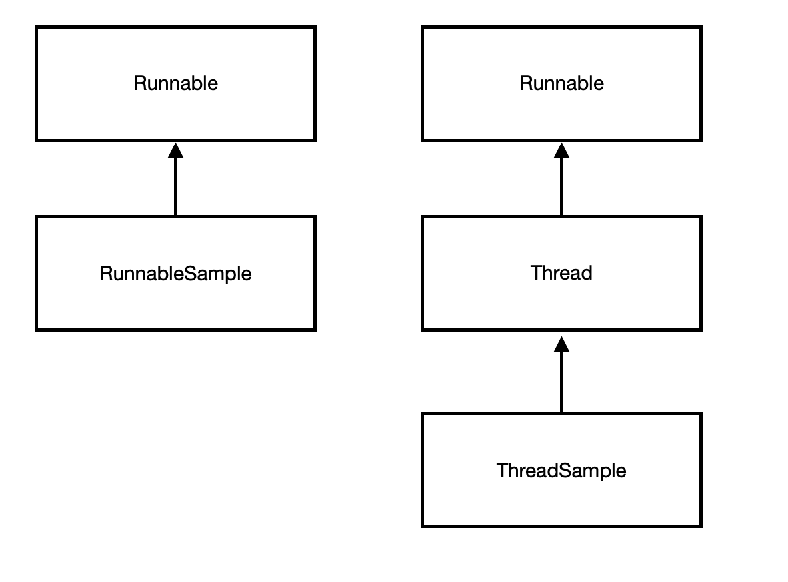

## 10주차 과제 : 멀티쓰레드 프로그래밍   

### 목표 : 자바의 멀티쓰레드 프로그래밍에 대해 학습하세요.   

### 학습할 것(필수)   
* Thread 클래스와 Runnable 인터페이스   
* 쓰레드의 상태   
* 쓰레드의 우선순위   
* Main 쓰레드   
* 동기화   
* 데드락    

-----------------------
먼저 프로세스와 쓰레드에 대해 알아보자   
#### Process 란   
* 단순히 실행 중인 프로그램이라고 볼 수 있다.   
* 사용자가 작성한 프로그램이 운영체제에 의해 메모리 공간을 할당 받아 실행 중인 것을 말한다. 이러한 프로세스는 프로그램에 사용되는 데이터와 메모리 등의 자원 그리고 쓰레드로 구성이 된다.   

#### Thread 란   
* 프로세스 내에서 실제로 작업을 수행하는 주체를 의미한다.   
* 모든 프로세스에는 1개 이상의 쓰레드가 존재하여 작업을 수행한다.   
* 두개 이상의 쓰레드를 가지는 프로세스를 멀티 쓰레드 프로세스라고 한다.   
* 경량 프로세스라고 불리며 가장 작은 실행 단위이다.   

### Thread 클래스와 Runnable 인터페이스    
쓰레드를 생성하는 방법은 크게 두 가지 방법이 있다.   
1. Runnable 인터페이스를 사용   
2. Thread 클래스를 사용   

* Thread 클래스는 Runnable 인터페이스를 구현한 클래스이므로 어떤 것을 적용 하느냐의 차이 이다.   
* Runnable 과 Thread 모두 java.lang 패키지에 포함되어 있다.   

#### Thread 클래스   
```java 
package java.lang;

class Thread implements Runnable {
    private static native void registerNatives();
    static {
        registerNatives();
    }
        (생략)
}
```

#### Runnable 인터페이스   
```java 
package java.lang;

@FunctionInterface 
public interface Runnable {
    public abstract void run();
}
```

#### 어느 걸 사용해야 하는 건가?    
* Thread 클래스가 다른 클래스를 확장할 필요가 있을 경우에는 Runnable 인터페이스를 구현하면 되며, 그렇지 않은 경우는 Thread 클래스를 사용하는 것이 편하다.   
   

ThreadSample   
```java 
public class ThreadSample extends Thread {
    @Override
    public void run() {
        System.out.println("This is ThreadSample's run() method.");
    }
}
```

RunnableSample   
```java 
public class RunnableSample implements Runnable {
    @Override
    public void run() {
        System.out.println("This is RunnableSample's run() method.");
    }
}
```
RunThreads   
```java 
public class RunThreads {
    public static void main(String[] args) {
        runBasic();
    }

    public static void runBasic() {
        RunnalbeSample runnable = new RunnableSample();
        new Thread(runnable).start();
        ThreadSample thread = new ThreadSample();
        thread.start();
        System.out.println("RunThreads.runBasic() method is ended.");
    }
}
```
결과   
```java  
This is RunnableSample's run() method.
RunThreads.runBasic() method is ended.
This is ThreadSample's run() method.
```
* 이러한 경우도 나온다.   
* start() 메서드가 끝날 때까지 기다리지 않고, 그 다음 줄에 있는 thread 라는 객체의 start() 메서드를 실행한다. 새로운 쓰레드를 시작하므로 run() 메서드가 종료될 때까지 기다리지 않고 다음 줄로 넘어가게 된다.   

#### Thread 는 순서대로 동작 하는가?   
#### 예제   
RunMultiThreads   
```java 
public class RunMultiThreads {
    public static void main(String[] args) {
        runMultiThread();
    }

    public static void runMultiThread() {
        RunnableSample[] runnable = new RunnableSample[5];
        ThreadSample[] thread = new ThreadSample[5];
        for(int loop = 0 ; loop < 5 ; loop++) {
            runnable[loop] = new RunnableSample();
            thread[loop] = new ThreadSample();

            new Thread(runnable[loop]).start();
            thread[loop].start();
        }
        System.out.println("RunMultiThreads.runMultiThread() mnethod is ended");
    }
}
```
결과   
```java 
This is RunnableSample's run() mehtod.
This is ThreadSample's run() method.
This is RunnalbeSample's run() method.
This is ThreadSample's run() method.
This is ThreadSample's run() method.
This is ThreadSample's run() method.
This is ThreadSample's run() method.
This is RunnableSample's run() method.
This is RunnalbeSample's run() method.
RunMultiThreads.runMultiThread() method is ended
This is RunnalbeSample's run() method.
```
* 실행하면 순서대로 실행 하지 않는다. 컴퓨터의 성능에 따라 달라질 수도 있으며 매번 결과가 다르다.   
* run() 메서드가 끝나지 않으면 애플리케이션은 종료 되지 않는다.   

#### Thread sleep 메서드   
sleep 메서드는 주어진 시간 만큼 대기를 하게 된다.   
|리턴 타입|메서드 이름 및 매개 변수|설명|
|----|----|----|
|static void|sleep(long millis)|매개 변수로 넘어온 시간(1/1000초)만큼 대기한다.|
|static void|sleep(long millis,int nanos)|첫 번째 매개변수로 넘어온 시간(1/1000초)+두번째 매개 변수로 넘어온 시간 (1/1,000,000,000초)만큼 대기한다.|


출처 : https://sujl95.tistory.com/63
