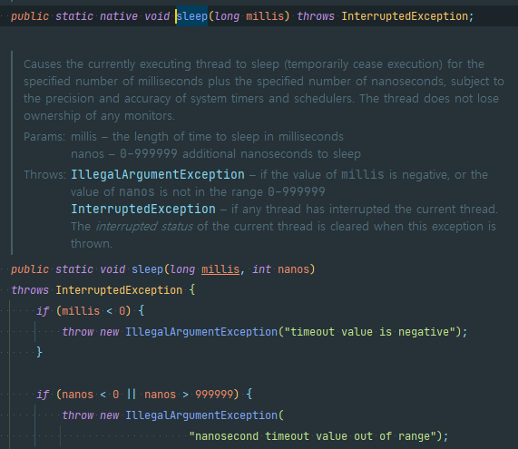
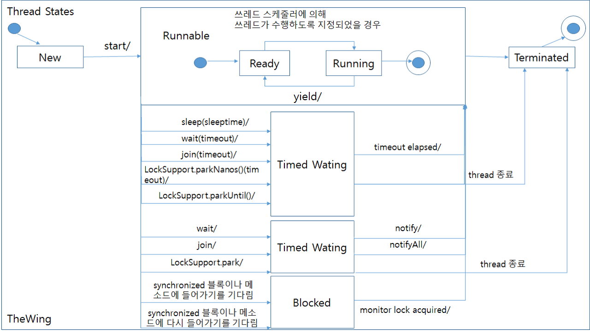
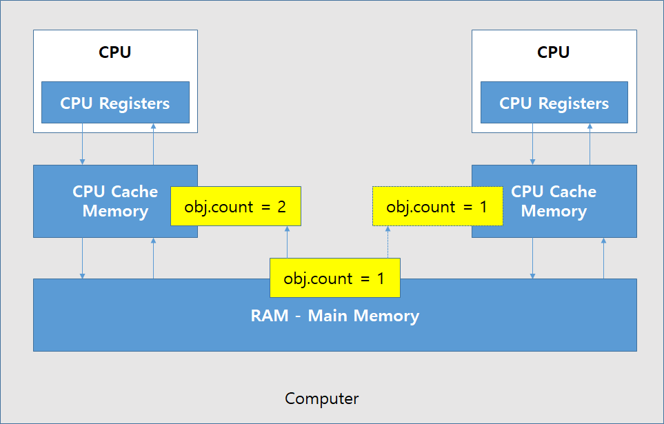

## 10주차 과제 : 멀티쓰레드 프로그래밍   

### 목표 : 자바의 멀티쓰레드 프로그래밍에 대해 학습하세요.   

### 학습할 것(필수)   
* Thread 클래스와 Runnable 인터페이스   
* 쓰레드의 상태   
* 쓰레드의 우선순위   
* Main 쓰레드   
* 동기화   
* 데드락    

-----------------------
먼저 프로세스와 쓰레드에 대해 알아보자   
#### Process 란   
* 단순히 실행 중인 프로그램이라고 볼 수 있다.   
* 사용자가 작성한 프로그램이 운영체제에 의해 메모리 공간을 할당 받아 실행 중인 것을 말한다. 이러한 프로세스는 프로그램에 사용되는 데이터와 메모리 등의 자원 그리고 쓰레드로 구성이 된다.   

#### Thread 란   
* 프로세스 내에서 실제로 작업을 수행하는 주체를 의미한다.   
* 모든 프로세스에는 1개 이상의 쓰레드가 존재하여 작업을 수행한다.   
* 두개 이상의 쓰레드를 가지는 프로세스를 멀티 쓰레드 프로세스라고 한다.   
* 경량 프로세스라고 불리며 가장 작은 실행 단위이다.   

### Thread 클래스와 Runnable 인터페이스    
쓰레드를 생성하는 방법은 크게 두 가지 방법이 있다.   
1. Runnable 인터페이스를 사용   
2. Thread 클래스를 사용   

* Thread 클래스는 Runnable 인터페이스를 구현한 클래스이므로 어떤 것을 적용 하느냐의 차이 이다.   
* Runnable 과 Thread 모두 java.lang 패키지에 포함되어 있다.   

#### Thread 클래스   
```java 
package java.lang;

class Thread implements Runnable {
    private static native void registerNatives();
    static {
        registerNatives();
    }
        (생략)
}
```

#### Runnable 인터페이스   
```java 
package java.lang;

@FunctionInterface 
public interface Runnable {
    public abstract void run();
}
```

#### 어느 걸 사용해야 하는 건가?    
* Thread 클래스가 다른 클래스를 확장할 필요가 있을 경우에는 Runnable 인터페이스를 구현하면 되며, 그렇지 않은 경우는 Thread 클래스를 사용하는 것이 편하다.   
    

ThreadSample   
```java 
public class ThreadSample extends Thread {
    @Override
    public void run() {
        System.out.println("This is ThreadSample's run() method.");
    }
}
```

RunnableSample   
```java 
public class RunnableSample implements Runnable {
    @Override
    public void run() {
        System.out.println("This is RunnableSample's run() method.");
    }
}
```
RunThreads   
```java 
public class RunThreads {
    public static void main(String[] args) {
        runBasic();
    }

    public static void runBasic() {
        RunnalbeSample runnable = new RunnableSample();
        new Thread(runnable).start();
        ThreadSample thread = new ThreadSample();
        thread.start();
        System.out.println("RunThreads.runBasic() method is ended.");
    }
}
```
결과   
```java  
This is RunnableSample's run() method.
RunThreads.runBasic() method is ended.
This is ThreadSample's run() method.
```
* 이러한 경우도 나온다.   
* start() 메서드가 끝날 때까지 기다리지 않고, 그 다음 줄에 있는 thread 라는 객체의 start() 메서드를 실행한다. 새로운 쓰레드를 시작하므로 run() 메서드가 종료될 때까지 기다리지 않고 다음 줄로 넘어가게 된다.   

#### Thread 는 순서대로 동작 하는가?   
#### 예제   
RunMultiThreads   
```java 
public class RunMultiThreads {
    public static void main(String[] args) {
        runMultiThread();
    }

    public static void runMultiThread() {
        RunnableSample[] runnable = new RunnableSample[5];
        ThreadSample[] thread = new ThreadSample[5];
        for(int loop = 0 ; loop < 5 ; loop++) {
            runnable[loop] = new RunnableSample();
            thread[loop] = new ThreadSample();

            new Thread(runnable[loop]).start();
            thread[loop].start();
        }
        System.out.println("RunMultiThreads.runMultiThread() mnethod is ended");
    }
}
```
결과   
```java 
This is RunnableSample's run() mehtod.
This is ThreadSample's run() method.
This is RunnalbeSample's run() method.
This is ThreadSample's run() method.
This is ThreadSample's run() method.
This is ThreadSample's run() method.
This is ThreadSample's run() method.
This is RunnableSample's run() method.
This is RunnalbeSample's run() method.
RunMultiThreads.runMultiThread() method is ended
This is RunnalbeSample's run() method.
```
* 실행하면 순서대로 실행 하지 않는다. 컴퓨터의 성능에 따라 달라질 수도 있으며 매번 결과가 다르다.   
* run() 메서드가 끝나지 않으면 애플리케이션은 종료 되지 않는다.   

#### Thread sleep 메서드   
sleep 메서드는 주어진 시간 만큼 대기를 하게 된다.   
|리턴 타입|메서드 이름 및 매개 변수|설명|
|-----|-----|--------|
|static void|sleep(long millis)|매개 변수로 넘어온 시간(1/1000초)만큼 대기한다.|
|static void|sleep(long millis,int nanos)|첫 번째 매개변수로 넘어온 시간(1/1000초)+두번째 매개 변수로 넘어온 시간 (1/1,000,000,000초)만큼 대기한다.|

#### sleep 예제    
```java 
public class EndlessThread extends Thread {
    public void run() {
        while(true) {
            try {
                System.out.println(System.currentTimeMillis());
                Thread.sleep(1000);
            } catch (InterruptedException e) {
                e.printStackTrace();
            }
        }
    }
}
```
* 위 예제를 실행하면 무한으로 실행하게 되니 직접 실행을 중지 해줘야 한다. Thread.sleep() 메서드를 사용할 때는 항상 try-catch 로 묶어줘야 한다. 적어도 InterruptedException 으로 예외 처리를 해줘야 한다. 
왜냐하면 sleep() 메서드는 InterruptedException 예외를 던질 수도 있다고 선언 되어 있기 떄문이다.   
    


### 쓰레드의 상태   
쓰레드의 현재 상태를 나타낸다   
|상태|의미|
|--|-----|
|NEW|쓰레드 객체는 생성되었지만,아직 시작되지 않은 상태|
|RUNNABLE|쓰레드가 실행중인 상태|
|BLOCKED|쓰레드가 실행 중지 상태이며,모니터 락(monitor lock)이 풀리기를 기다리는 상태|
|WAITING|쓰레드가 대기중인 상태|
|TIMED_WAITING|특정 시간만큼 쓰레드가 대기중인 상태|
|TERMINATED|쓰레드가 종료된 상태|

     

#### Thread.join()    
* join(), join(0)    
    해당 쓰레드가 종료될 때까지 기다린다.   
* join(60000)   
    60초 동안 기다린다.   
* 매개변수에 음수를 넣으면 IllegalArgumentException 예외발생    

#### interrupt()    
* 현재 수행중인 쓰레드를 중단시킨다.   
* 그냥 중지 시키지는 않고 InterruptedException 예외를 발생시면서 중단시킨다. sleep()과 join() 메서드에서 발생한다고 했던 예외이다.   

#### stop()   
* 안정상의 이유로 deprecated되었다. 이 메서드를 사용하면 안된다.   
```java
public void checkJoin() {
    SleepThread thread = new SleepThread(2000);
    try {
        thread.start();
        thread.join(5000);
        thread.interrupt();
        System.out.println("thread state(after join)="+ thread.getState());
    }catch (InterruptedException ie) {
        ie.printStatckTrace();
    }
}
```

```java 
Sleeping Thread-0
Stopping Thread-0
thread state(after join)=TERMINATED
```

#### Thread 상태확인 메서드   
|리턴타입|메서드 이름 및 매개변수|설명|
|----|----|------|
|void|checkAccess()|현재 수행중인 쓰레드가 해당 쓰레드를 수정할 수 있는 권한이 있는지를 확인한다.만약 권한이 없다면 SecurityException이라는 예외를 발생|
|boolean|isAlive()|쓰레드가 살아 있는지를 확인한다. 해당 쓰레드의 run() 메서드가 종료되었는지 안 되었는지를 확인|
|boolean|isInterrupted()|run()메서드가 정상적으로 종료되지 않고,interrupt() 메서드의 호출을 통해서 종료되었는지를 확인하는데 사용|
|static boolean|interrupted()|현재 쓰레드가 중지되었는지를 확인|

#### Thread static 메서드 목록   
|리턴타입|메서드 이름 및 매개변수|설명|
|----|----|------|
|static int|activeCount()|현재 쓰레드가 속한 쓰레드 그룹의 쓰레드 중 살아 있는 쓰레드의 개수를 리턴|
|static Thread|currentThread()|현재 수행중인 쓰레드의 객체를 리턴|
|static void|dumpStack()|콘솔 창에 현재 쓰레드의 스택 정보를 출력|

#### Object 클래스에 선언된 쓰레드와 관련있는 메서드들   
|리턴타입|메서드 이름 및 매개변수|설명|
|----|----|-------|
|void|wait()|다른 쓰레드가 Object 객체에 대한 notify()메서드나 notifyAll() 메서드를 호출할 때까지 현재 쓰레드가 대기하고 있도록 한다.|
|void|wait(long timeout)|wait() 메서드와 동일한 기능을 제공하며, 매개변수에 지정한 시간만큼 대기한다.즉, 매개변수 시간을 넘어 섯을 때에는 현재 쓰레드는 다시 깨우넌다.여기서의 시간은 밀리초로 1/1000초 단위이다. 만약 1초간 기다리게 할 경우에는 1000을 매개 변수로 넘겨주면 된다.|
|void|wait(long timeout,int nanos)|wait() 메서드와 동일한 기능을 제공한다. 하지만 wait(timeout)에서 밀리초 단위의 대기시간을 기다린다면, 이 메서드는 보다 자세한 밀리초+나노초(1/1000000000초) 만큼만 대기한다. 뒤에있는 나노초의 값은 0~999999사이의 값만 지정할 수 있다.|
|void|notify()|Object 객체의 모니터에 대기하고 있는 단일 쓰레드를 깨운다.|
|void|notifyAll()|Object 객체의 모니터에 대기하고 있는 모든 쓰레드를 깨운다.|

예제   
StateThread   
```java
public class StateThread extends Thread {
    private Object monitor;

    public StateThread(Object monitor) {    //1
        this.monitor = monitor;
    }

    public void run() {
        try {
            for(int loop=0 ; loop < 10000; loop++) {    //2
                Stgring a = "A";
            }
            synchronized(monitor) {
                monitor.wait();     //3
            }

            System.out.println(getName() + "is notified");
            Thread.sleep(1000); //4
        }catch (InterruptedException ie) {
            ie.printStackTrace();
        }
    }
}
```
1. monitor라는 이름의 객체를 매개 변수로 받아 인스턴스 변수로 선언해 두었다.     
2. 쓰레드를 실행중인 상태로 만들기 위해서 간단하게 루프를 돌면서 String 객체를 생성한다.   
3. synchronized 블록 안에서 monitor 객체의 wait() 메서드를 호출했다.   
4. wait() 상황이 끝나면 1초간 대기했다가 이 쓰레드는 종료한다.   

```java 
Object monitor = new Object();
StateThread thread = new StateThread(monitor);  //1
try {
    System.out.println("thread state = " + thread.getState());
    thread.start(); //2
    System.out.println("thread state(after start) = " + thread.getState());

    Thread.sleep(100);
    System.out.println("thread state(after 0.1 sec) =" + thread.getState());

    synchronized(monitor) {
        monitor.notify();   //3
    }

    Thread.sleep(100);
    System.out.println("thread state(after notify) = " + thread.getState());

    Thread.join();  //4
    System.out.println("thread state(after join) = " + thread.getState());
}catch (InterruptedException ie) {
    ie.printStackTrace();
}
```
1. StateThread 의 매개변수로 넘겨줄 monitor라는 Object 클래스 객체를 생성한다.     
2. 쓰레드 객체를 생성하고 시작한다.    
3. monitor 객체를 통하여 notify() 메서드를 호출   
4. 쓰레드가 종료될 때까지 기다린 후 상태를 출력    

```java 
thread state = NEW
thread state(after start) = RUNNABLE
thread state(after 0.1 sec) = WAITING
Thread-0 is notified.
thread state(after notify) = TIMED_WAITING
thread state(after join) = TERMINATED
```

* wait() 메서드가 호출되면 상태는 WAITING 상태가 된다. 누군가가 이 쓰레드를 꺠워줘야만 이 WAITING 상태에서 풀린다. interrupt() 메서드를 호출하여 대기 상태에서 풀려날 수도 있겠지만, notify() 메서드를 호출해서 풀어야 InterruptedException 도 발생하지 않고, wait() 이후의 문장도 정상적으로 수행하게 된다.    
```java
Object monitor = new Object();
StateThread thread = new StateThread(monitor);
StateThread thread2 = new StateThread(monitor);
try{
    System.out.println("thread state = " + thread.getState());
    thread.start();
    thread2.start();
    System.out.println("thread state(after start) = " + thread.getState());

    Thread.sleep(100);
    System.out.println("thread state(after 0.1 sec) = " + thread.getState());

    synchronized(monitor) {
        monitor.notify();
    }

    Thread.sleep(100);
    System.out.println("thread state(after notify) = " + thread.getState());

    thread.join();
    System.out.println("thread state(after join) = " + thread.getState());
    thread2.join();
    System.out.println("thread2 state(after join) = " + thread2.getState());
}catch (InterruptedException ie ) {
    ie.printStackTrace();
}
``` 

```java
thread state = NEW
thread state(afetr start) = RUNNABLE 
thread state(after 0.1 sec) = WAITING 
Thread-0 is notified.
thread state(after notify) = TIMED_WAITING
thread state(after join) = TERMINATED
```
* 결과가 이상 없다고 생각할 수도 있지만 thread2 는 notify 되지 않았고 끝나지도 않았다. 왜냐하면 자바에서 notify() 메서드를 먼저 대기하고 있는 것부터 그 상태를 풀어주기 때문이다. 좀 무식하게 풀어주려면 다음과 같이 synchronized 블록을 수정해주면 된다.   
```java 
synchronized(monitor) {
    monitor.notify();
    monitor.notify();
}
```

* 이렇게 하면 두 개의 쓰레드 모두 wait() 상태에서 풀린다. 그런데 monitor 객체를 통해서 wait() 상태가 몇 개인지 모르는 상태에서는 이와같이 구현하는 것은 별로 좋은 방법이 아니다. notifyAll() 메서드를 사용하는 것을 권장한다.   
```java 
synchronized(monitor) {
    monitor.notifyAll();
}
```
결과
```java 
thread state = NEW 
thread state(after start) = RUNNABLE 
thread state(after 0.1 sec) = WAITING 
Thread-1 is notified.
Thread-0 is notified.
thread state(after notify) = TIMED_WAITING
thread state(after join) = TERMINATED
thread2 state(after join) = TERMINATED 
```

### 쓰레드의 우선순위   
자바에서 각 쓰레드는 우선순위 (priority)에 관한 자신만의 필드를 가지고 있다. 이러한 우선순위에 따라 특정 쓰레드가 더 많은 시간 동안 작업을 할 수 있도록 설정한다.   
|필드|섫명|
|----|------|
|static int MAX_PRIORITY|쓰레드가 가질 수 있는 최대 우선순위를 명시함|
|static int MIN_PRIORITY|쓰레드가 가질 수 있는 최소 우선순위를 명시함|
|static int NORM_PRIORITY|쓰레드가 생성될 때 가지는 기본 우선순위를 명시함|

getPriority()와 setPriority() 메서드를 통해 쓰레드의 우선순위를 반환하거나 변경 할 수 있다. 쓰레드의 우선순위가 가질 수 있는 범위는 1부터 10까지이며, 숫자가 높을수록 우선순위 또한 높아진다.    
하지만 쓰레드의 우선순위는 비례적인 절댓값이 아닌 어디까지나 상대적인 값일 뿐이다. 우선순위가 10인 쓰레드가 우선순위가 1인 쓰레드보다 10배 더 빨리 수행되는 것이 아니다. 단지 우선순위가 10인 쓰레드는 1인 쓰레드보다 좀 더 많이 실행 큐에 포함되어, 좀 더 많은 작업 시간을 할당받을 뿐이다.   

에제
ThreadWithRunnable   
```java
class ThreadWithRunnable implements Runnable {
    public void run() {
        for(int i=0 ; i<5 ; i++ ) {
            System.out.println(Thread.currentThread().getName());   // 현재 실행중인 쓰레드의 이름을 반환함. 
            try {
                Thread.sleep(10);
            }catch (InterruptedException e) {
                e.printStackTrace();
            }
        }
    }
}
```
Thread02   
```java
public class Thread02 {
    public static void main(String[] args) {
        Thread thread1 = new Thread(new ThreadWithRunnable());
        Thread thread2 = new Thread(new ThreadWithRunnable());
        thread2.setPriority(10);    // Thread-1의 우선순위를 10으로 변경함.

        thread1.start(); // Thread-0 실행
        thread2.start(); // Thread-1 실행 
        System.out.println(thread1.getPriority());
        System.out.println(thread2.getPriority());
    }
}
```

결과    
```java 
5
10
Thread-1
Thread-0
Thread-1
Thread-0
Thread-1
Thread-0
Thread-1
Thread-0
Thread-1
Thread-0
```
main() 메서드를 실행하는 쓰레드의 우선순위는 언제나 5이다.   
main() 메서드 내에서 생성된 쓰레드 Thread-0 의 우선순위는 5로 설정되는 것을 확인할 수 있다.   

### Main 쓰레드   
* 자바는 실행 환경인 JVM(Java Virtual Machine) 에서 돌아가게 된다. 이것이 하나의 프로세스이고 Java를 실행하기 위해 우리가 실행하는 Main() 메서드가 메인 쓰레드이다.    
```java 
public class MainMethod {
    public static void main(String[] args) {

    }
}
```
* public static void main(String[] args) {} 이것이 메인 쓰레드이고 메인 쓰레드의 시작점을 선언하는 것이다.    
* 따로 쓰레드를 실행하지 않고 main() 메서드만 실행하는 것을 싱글 쓰레드 어플리케이션 이라고 한다.   
    

#### 멀티 쓰레드 애플리케이션    
* 아래 그림과 같이 메인 쓰레드에서 쓰레드를 생성하여 실행하는 것을 멀티 쓰레드 애플리케이션 이라고 한다.   
    

#### Daemon Thread   
* Main 쓰레드의 작업을 돕는 보조적인 역할을 하는 쓰레드이다.   
* Main 쓰레드가 종료되면 데몬 쓰레드는 강제적으로 자동 종료가 된다. (어디까지나 Main 쓰레드의 보조 역할을 수행하기 때문에, Main 쓰레드가 없어지면 의미가 없어지기 때문이다.)   

#### Daemon Thread 사용   
* Main 쓰레드가 Daemon 이 될 쓰레드의 setDaemon(true) 를 호출해주면 Daemon 쓰레드가 된다.   

예제   
DaemonThread   
```java 
public class DaemonThread extends Thread {
    public void run() {
        try {
            Thread.sleep(Long.MAX_VALUE);
        }catch (Exception e) {
            e.printStackTrace();
        }
    }
}

public void runCommonThread() {
    DaemonThread thread = new DaemonThread();
    thread.start();
}
```
이렇게 실행하면 long의 최대값 만큼 대기하게 된다.   
runDaemonThread   
```java 
public void runDaemonThread() {
    DaemonThread thread = new DaemonThread();
    thread.setDaemon(true);
    thread.start();
}
```
* 프로그램이 대기하지 않고 그냥 끝나버린다. 즉 데몬 쓰레드는 해당 쓰레드가 종료되지 않아도 다른 실행중이 일반 쓰레드가 없다면 멈춰버리게 된다.   

#### 데몬쓰레드를 만든 이유 ? 
* 예를 들어 모니터링하는 쓰레드를 별도로 뛰워 모니터링 하다가, Main 쓰레드가 종료되면 관련된 모니터링 쓰레드가 종료되어야 프로세스가 종료될 수 있다. 모니터링 쓰레드를 데몬 쓰레드로 만들지 않으면 프로세스가 종료될 수 없게 된다. 이렇게 부가적인 작업을 수행하는 쓰레드를 선언할 때 데몬 쓰레드를 만든다.   


### 동기화 (synchronize)    
* 여러 개의 쓰레드가 한 개의 리소스를 사용하려고 할 때 사용 하려는 쓰레드를 제외한 나머지들을 접근하지 못하게 막는 것이다.   
* 이것을 쓰레드에 안전하다고 한다. (Thread-safe)   
* 자바에서 동기화 하는 방법은 3가지로 분류된다. 
    1.Synchronized 키워드   
    2.Atomic 클래스   
    3.Volatile 키워드   
#### Synchronized 키워드   
* Java 예약어 중 하나이다.   
* 변수명이나, 클래스 명으로 사용이 불가능하다.   

#### Synchronized 사용방법   
* 메서드 자체를 synchronized 로 선언하는 방법 (synchronized mehtods)   
* 다른 하나는 메서드 내의 특정 문자만 synchronized 로 감싸는 방법 (synchronized statements) 이다.   

#### Synchroniozed 적용하지 않은 예제   
CommonCalculate   
```java 
public class CommonCalculate {
    private int amount;
    public CommonCalculate() {
        amount = 0;
    }

    public void plus(int value) {
        amount += value;
    }

    public void minus(int value) {
        amount -= value;
    }

    public int getAmount() {
        return amount;
    }
}
```
ModifyAmountThread   
```java 
public class ModifyAmountThread extends Thread {
    private CommonCalculate calc;
    private boolean addFlag;

    public ModifyAmountThread(CommonCalculate calc, boolean addFlag) {
        this.calc = calc;
        this.addFlag = addFlag;
    }

    public void run() {
        for (int loop = 0 ; loop < 10000 ; loop++) {
            if(addFlag) {
                clac.plus(1);
            } else {
                clac.minus(1);
            }
        }
    }
}
```
RunSync   
```java 
public class RunSync {
    public static void main(String[] args) {
        RunSync runSync = new Runsync();
        runSync.runCommonCalculate();
    }
    
    public void runCommonCalculate() {
        CommonCalculate calc = new CommonCalculate();   // 1
        ModifyAmountThread thread1 = new ModifyAmountThread(calc, true);    // 2
        ModifyAmountThread thread2 = new ModifyAmountThread(calc, true);    // 2

        thread1.start();    // 3 
        thread2.start();    // 3
        try {
            thread1.join();     // 4
            thread2.join();     // 4
            System.out.println("Final value is " + calc.getAmount());   // 5
        } catch(InterruptedException e) {
            e.printStackTrace();
        }
    }
}
```
결과로 value 가 20000 이 나오지 않는다.   
```java 
Final value is 19511
```

3. 각 쓰레드를 실행한다.   
4. try - catch 블록 안에서는 join() 이라는 메서드를 각각의 쓰레드에 대해서 호출 join() 에서드는 쓰레드가 졸료될 때까지 기다리는 메서드   
5. join() 이 끝나면 calc 객체의 getAmount() 메서드를 호출한다. getAmount() 메서드의 호출 결과는 join() 메서드 수행 이후이므로, 모든 쓰레드가 종료된 이후의 결과이다. join() 메서드 겨로가는 join() 메서드 수행이후 이므로, 모든 쓰레드가 종료된 이후의 결과이다.   

5번 반복 시키는 예제   
```java 
RunSync runSync = new RunSync();
for (int loop = 0 ; loop < 5 ; loop++) {
    runSync.runCommonCalculate();
}
```
결과   
```java 
Final value is 19511
Final value is 12515 
Final value is 16621 
Final value is 15161
Final value is 17515
``` 
원하는 결과인 20000 이 나오지 않는다.   

#### Synchronized 적용 예제 (메서드)   
commonCalculate   
```java 
public class CommonCalculate {
    private int amount;
    public CommonCalculate() {
        amount = 0;
    }

    public synchronized void plus(int value) {
        amount += value;
    }

    public synchronized void minus(int value) {
        amount -= value;
    }

    public int getAmount() {
        return amouint;
    }
}
```
결과 
```java 
Final value is 20000
Final value is 20000
Final value is 20000
Final value is 20000
Final value is 20000
```
원하는 결과인 20000 이 정상적으로 출력이 된다.    
블록으로 객체를 받아 락을 걸 수 있다.   

#### Synchronized 적용 예제 (block)    
synchronized 에 this 를 사용하는 것은 메서드에 synchronized 에 붙이는 것과 다르지 않다.   
그러나 this가 아닌 다른 object 별로 lock을 걸게되면 락 걸리는 것이 다르다.   
```java 
public class CommonCalculate {
    privagte int amount;
    private int interest;

    public static Object interestLock = new Object();
    public CommonCalculate() {
        amount = 0;
    }
    public void addInterest(int value) {
        synchronized (interestLock) {
            interest += value;
        }
    }

    public void plus (int value) {
        synchronized(this) {
            amount += value;
        }
    }

    public void minus (int value) {
        synchronized(this) {
            amount -= value;
        }
    }

    public int getAmount() {
        return amount;
    }
}
```
결과   
```java 
Final value is 20000
Final value is 20000
Final value is 20000
Final value is 20000
Final value is 20000
```
결과는 synchronized 와 동일하게 20000 으로 나오게 된다.   

#### Atomic   
* Atomicity(원자성) 의 개념은 '쪼갤 수 없는 가장 작은 단위' 를 뜻한다.   
* 자바의 Atomic type 은 Wrapping 클래스의 일종으로, 참조 타입과 원시 타입 두 종류의 변수에 모두 적용이 가능하다. 사용시 내부적으로 CAS(Compare - And - Swap) 알고리즘을 사용해 lock 없이 동기화 처리를 할 수 있다.   
* Atomic Type 경우 volatile 과 synchronized 와 달리 java.util.concurrent.atomic 패키지에 정의된 클래스이다.   
* CAS 는 특정 메모리 위치아ㅗ 주언진 위치의 value 를 비교하여 다르면 대체하지 않는다.   
* 사용법은 변수를 선언할 때 타입을 Atomic Type  으로 선언해주면 된다.   
    ex) AtomicLong   

#### 주요 클래스    
* AtomicBoolean   
* AtomicInteger   
* AtomicLong   
* AtomicIntegerArray   
* AtomicDoubleArray   

#### 주요 메서드   
* get()   
    - 현재 값을 반환   
* set(newValue)   
    - newValue 로 값을 업데이트 한다.   
* getAndSet(newValue)   
    - 원자적으로 값을 업데이트하고 원래의 값을 반환한다.   
* CompareAndSet(expect, update)   
    - 현재 값이 예상하는 값 (=expect) 과 동일하다면 값을 update 한 후 true 를 반환한다. 예상하는 값과 같지 않다면 update는 생략하고 false를 반환   
* Number 타입의 경우 값의 연산을 할 수 있도록 addAndGet(delta), getAndAdd(delta), getAndDecrement(), getAndIncrement(), incrementAndGet() 등의 메서드를 추가로 제공   
     

#### Compare-And-Swap(CAS) 란?   
* 메모리 위치의 내용을 주어진 값과 비교하고 동일한 경우에만 해당 메모리 위치의 내용을 새로 주어진 값으로 수정을 한다.   
* 즉, 현재 주어진 값(=현재 쓰레드에서의 데이터)과 실제 데이터와 저장된 데이터를 비교해서 두 개가 일치할 때만 값을 업데이트 한다. 이 역할을 하는 메서드가 compareAndSet() 이다. 즉, synchronized 처럼 임계영역에 같은 시점에 두개 이상의 쓰레드가 접근하려 하면 쓰레드 자체를 blocking 시키는 메커니즘이 아니다. AtomicInteger의 연산 메서드들이 어떻게 구현된건지 코드를 타고 들어가다 보면 이렇게 유사한 형식으로 do-while 문이 쓰이는 것을 볼 수 있다.   
     

#### Atomic 예제   
```java 
public class AtomicTypeSample {
    public static void main(String[] args) {
        AtomicLong atomicLong = new AtomicLong();
        AtomicLong atomicLong1 = new AtomicLong(123);
        long expectedValue = 123; 
        ling newValue = 234;

        System.out.println(atomicLong.compareAndSet(expectedValue, newValue));

        atomicLong1.set(234);

        System.out.printlon(atomicLong1.compareAndSet(234,newValue));

        System.out.println(atomicLong1.compareAndSet(expectedValue,newValue);

        System.out.println(atomicLong.get());

        System.out.println(atomicLong1.get());
    }
}
```
결과   
```java 
false 
true 
false 
0
234
```

#### Volatile   
* volatile keyword 는 Java 변수를 Main Memory 에 저장하겠다 라는 것을 명시하는 것이다.   
* 매번 변수의 값을 Read 할 때마다 CPU cache 에 저장된 값이 아닌 Main Memory 에서 읽는 것이다.   
* 또한 변수의 값을 Write 할 때마다 Main Memory 에 까지 작성하는 것이다.   
     

* volatile 변수를 사용하고 있지 않는 MultiThread 애플리케이션은 작업을 수행하는 동안 성능 향상을 위해서 Main Memory에서 읽은 변수를 CPU Cache 에 저장하게 된다.   
* 만약 Multi Thread 환경에서 Thread 가 변수 값을 읽어올 때 각각의 CPU Cache에 저장된 값이 다르기 때문에 변수 값 불일치 문제가 발생하게 된다.   

예제    
* SharedObject를 공유하는 두 개의 Thread 가 있다.   
    - Thread-1 는 counter 값을 더하고 읽는 연산을 한다.( Read & Write)   
    - Thread-2 는 counter 값을 읽기만 한다.(Only Read)   
```java 
public class SharedObject {
    public int counter = 0;
}
```

* Thread-1만 counter 변수를 증가시키지만 CPU Cache 에만 반영되어 있고 실제로 Main Memory 에는 반영이 되지 않았다. 그렇기 때문에 Thread-2 는 count 값을 계속 읽어오지만 0을 가져오는 문제가 발생한다.   
     
다른 쓰레드에 의해 아직 Main Memory에 다시 기록되지 않았기 때문에 Thread 가 변수의 최신 값을 보지 못하는 문제를 "가시성" 문제라고 한다. 한 쓰레드의 업데이트는 다른 Thread 에 표시 되지 않는다.   

#### 어떻게 해결을 하는지?    
* volatile 키워드를 추가하게 되면 Main Memory 에 저장하고 읽어오기 때문에 변수 값 불일치 문제를 해결 할 수 있다.   
```java 
public class SharedObject {
    public volatile int counter = 0;
}
```

#### 언제 사용하는지?   
* Multi Thread 환경에서 하나의 Thread 만 read & Write 하고 나머지 Thread 가 read 하는 상황에서 가장 최신의 값을 보장한다.   

#### volatile 성능에 영향?   
* volatile 는 변수의 read와 write 를 Main Memory 에서 진행하게 된다.   
* CPU Cache 보다 Main Memory 가 비용이 더 크기 때문에 변수 값 일치를 보장해야 하는 경우에 volatile 을 사용하는 것이 좋다.   


출처 : https://sujl95.tistory.com/63
