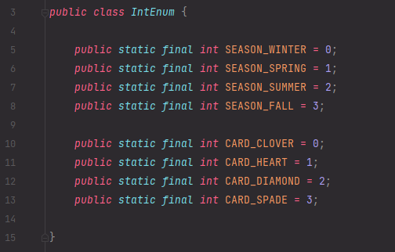
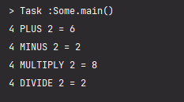
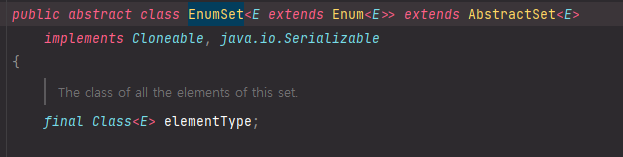

## 11주차 과제 : Enum   

### 목표 : 자바의 열거형에 대해 학습하세요.   

### 학습할 것(필수)   
* enum 정의하는 방법   
* enum이 제공하는 메소드 (values()와 valueOf())   
* java.lang.Enum   
* EnumSet   

-----------------------------

### 열거형이란?   
컴퓨터 프로그래밍에서 열거형(enumerated type, enumeration), 이넘(enum)은 요소, 멤버라 불리는 명명된 값의 집합을 이루는 자료형 이다. 
열거자 이름들은 일반적으로 해당 언어의 상수 역할을 하는 식별자 이다.    

일부 열거자 자료형은 언어에 기본적으로 포함되어 있을 수 있다.   
boolean 자료형을 예로 들면 거짓(false) 과 참(true) 와 같이 미리 정의된 열거형으로 볼 수 있다.   
수많은 언어는 사용자들이 새로운 열거형을 정의할 수 있게 하고 있다.   

### 열거형의 장점    
개발을 진행할 때 Enum을 통해 얻는 기본적인 장점들은 아래와 같다.    
* 문자열을 비교해, IDE 의 적극적인 지원을 받을 수 있다.   
    - 자동완성, 오타검증, 텍스트 리팩토링 등등   
* 허용 가능한 값을들 제한 할 수 있다.   
* 리팩토링시 변경 범위가 최소화 된다.   
    - 내용 추가가 필요하더라도, Enum 코드위에 수정할 필요가 없다.   

#### 아래는 Java 에서 얻을 수 있는 Enum 의 장점이다.   
* 확실한 부분과 불확실한 부분을 분리할 수 있다.   
    - A 값과 B 값이 실제로 동일한 것인지, 전혀 다른 의미인지    
    - 코드를 사용하기 위해 추가로 필요한 메서드들은 무엇인지    
    - 변경되면 어디까지 변경해야 하는 것인지   
* 문맥(Context)을 담을 수 있다.   
    - A 라는 상황에서 "a"와 B라는 상황에서 "a"는 똑같은 문자열 "a"지만 전혀 다른 의미이다.   
    - 문자열은 이를 표현할 수 없지만, Enum 은 이를 표현할 수 있다.   
    - 이로인해 실행되는 코드를 이해하기 위해 추가로 무언가를 찾아보는 행위를 최소화 할 수 있다.   

### Enum 정의하는 방법   

enum 을 정의하는 방법은 간단하다.   
아래와 같이 '{ }' 안에 상수의 이름을 나열하기만 하면 된다.   
```
enum 열거형 이름 {상수명1, 상수명2, ... 상수명n}
```
예를 들어 동서남북 4방향을 상수로 정의하는 열거형 Direction 은 다음과 같다.   
```java 
enum Direction {EAST, SOUTH, WEST, NORTH}
```
열거형에 정의된 상수를 사용하는 방법은 '열거형이름.상수명' 이다. 마치 클래스의 static 변수를 참조하는 것과 같다.   

```java 
enum Direction {EAST, SOUTH, WEST, NORTH} 

public class Unit {
    int x; 
    int y;
    Direction dir;  // 열거형을 인스턴스 변수로 선언 

    void init() {
        dir = Direction.EAST;   // 유닛의 방향을 EAST 로 초기화 
    }
}
```
열거형 상수는 필드를 가질 수 있다. 필드를 추가하는 방법은 추가하고 싶은 필드를 정의하고 생성자의 인자로 추가한 뒤 각각의 상수에 값을 입려갛면 된다.    
아래는 int 타입을 필드로 갖는 열거형 이다.   
```java 
enum Direction {
    EAST(1), SOUTH(5), WEST(-1), NORTH(10);

    private int value;
    Dircetion(int value) {
        this.value = value;
    }

    public int getValue() {return value;}
}
```

또한 열거형의 생성자는 접근제어자가 묵시적으로 private 이기 때문에 외부에서는 열거형의 생성자를 호출 할 수 없다.   
```java 
enum Direction {
    ...
    Direction(int value) {  // private Direction(int value)와 같다.
    ...
    }
}
```

### enum 상수간의 비교   
열거형의 상수간의 비교에는 '==' 을 사용할 수 있다. equals() 가 아닌 '=='로 비교가 가능하다는 것은 그만큼 빠른 성능을 제공한다는 얘기 이다.   

그러나 '<', '>' 와 같은 비교연산자는 사용할 수 없고 compareTo() 는 사용가능 하다.   

```java 
Direction dir;

if(dir == Direction.WEST) {
    ...
}else if (dir > Direction.WEST) {
    // 에러. 열거형 상수에 비교연산자는 사용 불가능
}else if (dir.compareTo(Direction.WEST) > 0) {
    // compareTo() 는 사용 가능 
}
```
switch 문의 조건식에도 열거형을 사용 할 수 있다.   

```java 
void move() {
    switch(dir) {
        case EAST : x++;
            break;
        case WEST : x--;
            break;
        case SOUTH : y++;
            break;
        case NORTH : y--;
            break;
    }
}
```
switch 문에 열거형을 사용할 때 주의할 점은 case 문에 열거형 타입의 이름은 적지 않고 상수의 이름만 적어야 한다는 제약이 있다. ( 'case Direction.EAST' 가 아닌 'case EAST'만 적여야 한다.)   

### Java 의 열거형   
(참고 : http://docs.oracle.com/javase/1.5.0/docs/guide/language/enums.html )   

#### int Enum 패턴( Java 5 이전의 열거형)   
Java 5 이전 버전까지는 열거형을 나타내는 표준 방식이 int Enum 패턴 이였다. 패턴은 아래와 같이 사용한다.   
    
int Enum 패턴은 아래와 같은 단점을 가지고 있다.   
* Not type_safe   
    계절에 정의된 int값 (0~3 의 정수값) 과 다른 int 정수값을 통과시킨다던지, 두개의 계절을 함께 추가할 수 있었다. 타입이 달라도 값이 같다면 조건식으로 비교했을 때 결과가 true 가 된다.   
    ex) "IntEnum.SEASON_WINTER == IntEnum.CARD_CLOVER" 이 조건식은 true 를 반환한다. (원하는 결과는 false 가 되어야 한다.)   

* No name_space   
    다른 int Enum 타입과는 충돌을 피하려면 int 열거형의 상수 앞에 문자열을 붙여야 한다.   
    (예제에서는 "SEASON_/CARD_" 를 의미한다.)   

* Brittleness (취성/ 변경에 약함)   
    int Enum 은 컴파일 타입 상수 (static) 이므로 상수의 값이 바뀌면, 해당 상수를 참조하는 모든 소스를 다시 컴파일 해야한다.   

* Printed values are uniformative (출력으로 어떤 정보도 알 수 없다.)   
    int Enum 은 단지 정수이기 때문에, 출력해보면 숫자만 출력된다. 우린느 숫자를 보고 무엇을 나타내는지, 심지어 어던 타입인지에 대해서 알 수 없다.   

#### Enum 키워드를 이용한 열거형 ( Java 5 이후 )   
Java 5.0 부터는 열거 유형에 대한 언어적 지원을 얻었다.   

Java의 열거형은 다른 프로그래밍 언어의 열거형보다 더욱 강력한 점이 있다.   
* enum 키워드로 하는 클래스를 정의한다. (enum type 이라고 한다.)   
* int Enum 의 단점을 모두 해결한다.   
* 열거형 타입에 어떤 메서드와 필드를 추가하고 인터페이스를 구현하는 등의 작업도 수행할 수 있다.   
* enum type 은 모든 Object 메서드의 고품질 구현을 제공한다. 이들은 Compareble, Serializable, 직렬 방식(Serial form) 이며 enum type 의 변경사항을 수용할 수 있도록 설계 되었다.   

아래는 enum type 으로 만든 트럼프카드 덱을 만드는 Card 클래스 예제 이다.   
Card 클래스는 변경할 수 없으며, 각 Card 의 인스턴스는 하나만 생성되므로 equals 또는 hashCode 메서드는 재정의 할 필요가 없다.   
```java 
import java.util.ArrayList;
import java.util.List;

public class Card {
    public static void main(String[] args) {
        List<Card> deck = Card.newDeck();

        for(Card card : deck) {
            System.out.println(card);
        }
    }

    public enum Rank { TWO, THREE, FOUR, FIVE, SIX, SEVEN, EIGHT, NINE, TEN, 
        JACK, QUEEN, KING, ACE}

    public enum Suit { CLOVER, DIAMOND, HEART, SPADE }

    private final Rank rank;
    private final Suit suit;

    private Card(Rank rank, Suit suit) {
        this.rank = rank;
        this.suit = suit;
    }

    public Rank rank() {return rank;}
    public Suit suit() {return suit;}
    public String toString() {return rank + " of " + suit;}

    // 카드를 담을 덱   
    private static final List<Card> protoDeck = new ArrayList<>();

    // 덱을 기본상태로 초기화  
    static {
        for (Suit suit : Suit.values()) 
            for (Rank rank : Rank.values()) 
                protoDeck.add(new Card(rank, suit));
    }

    // 기본 덱을 복사해서 반환 
    public static ArrayList<Card> newDeck() {
        return new ArrayList<Card>(protoDeck);
    }
}
```
    

위의 코드는 대략 30줄 정도로 매우 짧다.   
만약 Type_safe 한 열거형을 직접 만드려면 Card 클래스의 코드는 훨씬 길어진다.   

Card 생성자는 Rank 와 Suit 라는 두개의 매개 변수를 사용한다.   
* Card(Rank rank, Suit suit)   

하지만 사용자가 실수로 매개변수의 순서를 Suit, Rank 로 바꿔서 생성자를 호출한다면?   
enum type 에서는 컴파일러가 친절하게 오류를 알려준다. (int enum 패턴은 런타임에 알려준다.)   

    

#### 상수 특정 메서드 (constant-specific method)   
enum type 에 필드나 행동(메서드)를 추가할 수 있다. 하나의 메서드에 대해 각각의 열거형 상수는 다른 행동을 정의 할 수 있다. 아래는 열거형 상수가 4가지 기본 산술 연산을 나타내고 eval 메서드가 연산을 수행하는 enum type의 예제이다.   
```java 
public enum Operation {
    PLUS, MINUS, MULTIPLY, DIVIDE;

    int eval (int x, int y) {
        switch(this) {
            case PLUS : return x + y;
            case MINUS : return x - y;
            case MUTIPLY : return x * y;
            case DIVIDE : return x / y;
        }
        throw new AssertionError("잘못된 산술 연산식" + this);
    }
}

class Some { 
    public static void main(String[] args) {
        int result = Operation.PLUS.eval(1,2);  // 호출 하는 법   
        System.out.println(result);
    }
}
```
위의 예제는 잘 작동하지만 throw 문 없이는 컴파일 에러가 발생한다.   
(switch 문 바깥에 return 할게 없기 때문에 반환값을 정의해주거나 AssertionError를 throw 해줘야 한다.)   

또 다른 단점으로 Operation 에 새로운 열거형 상수를 추가할 때마다 switch문에 새로운 case를 추가해야 한다는 점이다. 
만약 추가하는 것을 잊어버리고 새로운 열거형 상수로 연산을 진행하면 eval 메서드는 실행에 실패하고 AssertionError 를 throw 하게 된다.   

이러한 문제를 해결하는 방법으로 각 열거형 상수에 다른 행동을 정의하는 방법이 있다.    
enum type 에서 추상 메서드를 선언하고 각 상수에 구체적인 메서드로 재정의 할 수 있다.   
이러한 방법을 상수 특정 메서드(constant-specific method) 라고 한다.    
아래는 상수 특정 메서드를 사용한 예제이다.   
```java 
public enum Operation {
    PLUS       {int eval(int x, int y) {return x+y;}},
    MINUS      {int eval(int x, int y) {return x-y;}},
    MULTIPLY   {int eval(int x, int y) {return x*y;}},
    DIVIDE     {int eval(int x, int y) {return x/y;})};

    // 연산을 위한 추상 메서드 
    abstract int eval(int x, int y);
}

class Some {
    public static void main(String[] args) {
        int x = 4;
        int y = 2;
        for (Operation op : Operation.values()) {
            System.out.println("%d %s %d = %d%n", x, op, y, op.eval(x, y));
        }
    }
}
```
     

### Java enum 의 내부적인 구현 모습   
```
enum Direction {EAST,SOUTH, WEST, NORTH} 
```
사실 위의 열거형 상수 하나하나 {EAST,SOUTH,WEST,NORTH} 는 Direction 의 객체이다.   
만약 클래스로 구현한다면 아래와 같은 모습이 된다.   
```java 
public class Direction {
    static final Direction EAST = new Direction("EAST");
    static final Driection SOUTH = new Direction("SOUTH");
    static final Direction WEST = new Direction("WEST");
    static final Direction NORTH = new Direction("NORTH");

    private String name;

    private Direction(String name) {
        this.name = name;
    }
}
```
Direction 클래스의 static 상수 EAST,SOUTH,WEST,NORTH 의 값은 객체의 주소이고, 이값은 바뀌지 않는 정적(static) 값이므로 '==' 으로 비교가 가능한 것 이다.   

모든 열거형은 추상 클래스 Enum(java.util.Enum)의 자손이므로, Enum을 흉내 내어 MyEnum 을 작성하면 다음과 같다.   
```java 
import java.io.Serializable;

abstract class MyEnum<T extends MyEnum<T>> implements Comparable<T>, Serializable {
    static int id = 0;  // 객체에 붙일 일려번호 (0부터 시작) 

    public int ordinal;
    public String name;

    public int ordinal() { return ordinal; }

    MyEnum(String name) {
        this.name = name;
        ordinal = id++;     // 객체를 생성할 때 마다 id의 값을 증가시킨다.   
    }

    public String name() {
        return name;
    }

    public String toString() {
        return name; 
    }

    public int compareTo(T t) {
        return ordinal - t.ordinal();
    }

    public boolean equals(Object object) {
        return this == other;
    }

    public int hashCode() {
        return super.hashCode();
    }

    public final Class<T> getDeclaringClass() {
        Class<?> clazz = getClass();
        Class<?> zuper = clazz.getSuperclass();
        return (zuper == Enum.class) ? (Class<T>)clazz : (Class<T>)zuper;
    }
}
```
객체가 생성될 때 마다(열거형 상수가 생성될 때 마다) 번호를 붙여서 인스턴스 변수 ordinal 에 저장한다.   
그리고 Comparable 인터페이스를 구현해서 열거형 상수간의 ordinal 값을 비교하도록 compareTo 메서드가 구현되어 있다.   

클래스에 추상 메서드 (abstract method) 를 추가하면, 클래스도 추상 클래스가 되어야 한다.   
그리고 각각의 클래스 타입 static 상수들도 추상 메서드를 구현해줘야 한다. 아래의 코드를 ㅂ면 이해가 쉽게 될 것이다.   
```java 
abstract class MyOperation extends MyEnum {
    static final MyOperation PLUS = new MyOperation("PLUS") {
        int eval(int x, int y) {return x+y;}
    };
    static final MyOperation MINUS = new MyOperation("MINUS") {
        int eval(int x, int y) {return x-y;}
    };
    static final MyOperation MULTIPLY = new MyOperation("MULTIPLY") {
        int eval(int x, int y) {return x*y;}
    };
    static final MyOperation DIVIDE = new MyOperation("DIVIDE") {
        int eval(int x, int y) {return x/y;}
    };

    String name;

    MyOperation(String anme) {  // 상수의 이름을 인자로 받는 생성자 
        super(name);
    }

    abstract int eval(int x, int y);
}
```
abstract int eval(int x, int y) 추상 메서드를 각각의 PLUS, MINUS, MULTIPLY, DEVIDE 상수에서 구현하고 있다.   
위의 코드는 아래의 코드와 같다. 아래의 코드와 비교해보면 어떤 구조인지 더욱 잘 보인다.   
```java 
public enum Operation {
    plus        {int eval(int x, int y) {return x+y;}};
    MINUS       {int eval(int x, int y) {return x-y;}};
    MULTIPLY    {int eval(int x, int y) {return x*y;}};
    DEVIDE      {int eval(int x, int y) {return x/y;}};

    // 연산을 위한 추상 메서드 
    abstract int eval(int x, int y);
}
```

### enum 이 제공하는 메서드 (values() 와 valueOf())   

* values() : 열거형의 모든 상수를 배열에 담아 반환한다.   
    - 다음과 같이 사용 할 수 있다.    
        - Direction[] arr = Direction.values();

* valueOf(String name) : 열거형 상수의 이름으로 문자열 상수에 대한 참조를 얻을 수 있게 해준다.   
    - 다음과 같이 사용 할 수 있다.   
        - Direction d = Direction.valueOf("WEST");
        - Direction.WEST == Direction.valueOf("WEST");  // true 반환   

        
위의 두 가지 메서드 'values()' 와 'valueOf()' 는 자바의 모든 열거형에 컴파일러가 자동으로 추가해 준다.   

values() 와 valueOf() 가 진짜 추가되는지 보기위해 디컴파일된 .class 파일을 봤지만 나오지 않아서 바이트 코드를 열어보면 다음과 같다.   
* http://www.youtube.com/watch?v=XRmxIp8mJ-o (IntelliJ에서 바이트 코드 보는법 
```java 
// class version 52.0 (52)
// access flags 0x4030
// signature Ljava/lang/Enum<Lstudy11th/Directioen;>;
// declaration: study11th/Directioen extends java.lang.Enum<study11th.Directioen>
final enum study11th/Directioen extends java/lang/Enum {

  // compiled from: Unit.java

  // access flags 0x4019
  public final static enum Lstudy11th/Directioen; EAST

  // access flags 0x4019
  public final static enum Lstudy11th/Directioen; SOUTH

  // access flags 0x4019
  public final static enum Lstudy11th/Directioen; WEST

  // access flags 0x4019
  public final static enum Lstudy11th/Directioen; NORTH

  // access flags 0x101A
  private final static synthetic [Lstudy11th/Directioen; $VALUES

  // access flags 0x9
  public static values()[Lstudy11th/Directioen;
   L0
    LINENUMBER 3 L0
    GETSTATIC study11th/Directioen.$VALUES : [Lstudy11th/Directioen;
    INVOKEVIRTUAL [Lstudy11th/Directioen;.clone ()Ljava/lang/Object;
    CHECKCAST [Lstudy11th/Directioen;
    ARETURN
    MAXSTACK = 1
    MAXLOCALS = 0

  // access flags 0x9
  public static valueOf(Ljava/lang/String;)Lstudy11th/Directioen;
   L0
    LINENUMBER 3 L0
    LDC Lstudy11th/Directioen;.class
    ALOAD 0
    INVOKESTATIC java/lang/Enum.valueOf (Ljava/lang/Class;Ljava/lang/String;)Ljava/lang/Enum;
    CHECKCAST study11th/Directioen
    ARETURN
   L1
    LOCALVARIABLE name Ljava/lang/String; L0 L1 0
    MAXSTACK = 2
    MAXLOCALS = 1

  // access flags 0x2
  // signature ()V
  // declaration: void <init>()
  private <init>(Ljava/lang/String;I)V
   L0
    LINENUMBER 3 L0
    ALOAD 0
    ALOAD 1
    ILOAD 2
    INVOKESPECIAL java/lang/Enum.<init> (Ljava/lang/String;I)V
    RETURN
   L1
    LOCALVARIABLE this Lstudy11th/Directioen; L0 L1 0
    MAXSTACK = 3
    MAXLOCALS = 3

  // access flags 0x8
  static <clinit>()V
   L0
    LINENUMBER 3 L0
    NEW study11th/Directioen
    DUP
    LDC "EAST"
    ICONST_0
    INVOKESPECIAL study11th/Directioen.<init> (Ljava/lang/String;I)V
    PUTSTATIC study11th/Directioen.EAST : Lstudy11th/Directioen;
    NEW study11th/Directioen
    DUP
    LDC "SOUTH"
    ICONST_1
    INVOKESPECIAL study11th/Directioen.<init> (Ljava/lang/String;I)V
    PUTSTATIC study11th/Directioen.SOUTH : Lstudy11th/Directioen;
    NEW study11th/Directioen
    DUP
    LDC "WEST"
    ICONST_2
    INVOKESPECIAL study11th/Directioen.<init> (Ljava/lang/String;I)V
    PUTSTATIC study11th/Directioen.WEST : Lstudy11th/Directioen;
    NEW study11th/Directioen
    DUP
    LDC "NORTH"
    ICONST_3
    INVOKESPECIAL study11th/Directioen.<init> (Ljava/lang/String;I)V
    PUTSTATIC study11th/Directioen.NORTH : Lstudy11th/Directioen;
    ICONST_4
    ANEWARRAY study11th/Directioen
    DUP
    ICONST_0
    GETSTATIC study11th/Directioen.EAST : Lstudy11th/Directioen;
    AASTORE
    DUP
    ICONST_1
    GETSTATIC study11th/Directioen.SOUTH : Lstudy11th/Directioen;
    AASTORE
    DUP
    ICONST_2
    GETSTATIC study11th/Directioen.WEST : Lstudy11th/Directioen;
    AASTORE
    DUP
    ICONST_3
    GETSTATIC study11th/Directioen.NORTH : Lstudy11th/Directioen;
    AASTORE
    PUTSTATIC study11th/Directioen.$VALUES : [Lstudy11th/Directioen;
    RETURN
    MAXSTACK = 4
    MAXLOCALS = 0
```
바이트 코드를 보면 values() 와 valueOf() 가 추가된 것을 볼 수 있다.   

* String name() : 열거형 선언에 선언된대로 정확하게 열거형 상수의 이름을 문자열로 반환한다.   
* int ordinal() : 열거형 상수가 정의된 순서를 반환한다. (0부터 시작)   
    - 보통 잘 사용하지 않으며, EnumSet 과 EnumMap 과 같은 정교한 열거 기반 자료구조에서 사용하도록 설계 되었다.   
* Class<T> getDeclaringClass() : 열거형 상수의 열거형 타입에 해당하는 Class 객체를 반환한다.   
    - 두 개의 열거형 상수 e1 과 e2 가 있을 때, e1.getDeclaringClass() == e2.getDeclaringClass() 가 true 인 경우에만 동일한 열거형 타입이다.   
    ( 이 메서드가 반환하는 Class 객체는 상수 특정 클래스 본문이 있는 열거형 상수에 대해 Object.getClas()가 반환한 값과 다를 수 있다.)   
```java 
class Some {
    public static void main(String[] args) {
        System.out.println("Operation.PLUS.getDeclaringClass() : " + Operation.PLUS.getDeclaringClass());
        System.out.println("Operation.PLUS.getClass() : " + Operation.PLUS.getClass());
        System.out.println(Operation.MINUS.getDeclaringClass() == Operation.PLUS.getDeclaringClass());
        System.out.println(Operation.MINUS.getClass() == Operation.PLUS.getDeclaringClass());
    }
}
```
getDeclaringClass() 메서드 예제    
```
> Task : Some.main() 
Operation.PLUS.getDeclaringClass() : class study11th.Operation 
Operation.PLUS.getClass() : class study11th.Operation$1
true
false
```
실행 결과    


### java.lang.Enum   

Enum 클래스는 모든 java 언어 열거타입의 상위 클래스이다.   
    

유일한 생성자   
protected Enum(String name, int ordinal) : 유일한 생성자로 프로그래머는 이 생성자를 호출 할 수 없다.   
열거형 선언(enum 키워드 사용) 에 대한 응답으로 컴파일러에서 내보낸 코드에 사용된다.   

메서드   
java.util.Enum 클래스에 정의된 메서드   
* compareTo(E o) : ordinal 을 기준으로 지정된 객체와 비교한다. 크면 양수 작으면 음수 같으면 0을 반환 한다.   
* equals(Object other) : 지정된 객체(other)가 열거형 상수와 같으면 true 를 반환 한다.   
* finalize() : 해당 Enum 클래스가 final 메서드를 가질 수 없게 한다.   
* getDeclaring() : 열거형 상수의 열거형 타입에 해당하는 Class 객체를 반환한다.   
* hashCode() : 열거형 상수의 해시 코드를 반환한다.   
* name() : 열거형 상수의 이름을 반환한다.   
* ordinal() : 이 열거형 상수가 정의된 순서를 반환한다.   
* toString() : 열거형 상수의 이름을 반환한다. (재정의 해서 개발자에게 더욱 친근하게 사용할 수 있다.)    
* valueOf(Class<T> enumType, String name) :   


### EnumSet   

열거형 타입과 함께 사용하기 위한 특별한 Set 구현체 이다.   

enum set의 모든 요소는 set을 만들 때 명시적으로 또는 암묵적으로 지정된 단일 열거형 타입에서 가져와야 한다.   
enum set은 내부적으로 비트 벡터 (Bit Vector) 로 표현한다. 비트 벡터를 사용하면 메모리 사용을 크게 주일 수 있다. 
EnumSet 을 구현할 때 공간 및 시간 성능은 기존 int 기반 "비트 플래그(bit flag)"의 대안으로 사용할 수 있을 만큼 고수준 이어야 한다. 
대량작업( 예를들어 : containAll 및 preserveAll) 도 인수가 enum set 인 경우 매우 빠르게 실행되어야 한다.   

iterator 메서드에 의해 반환된 iterator 는 자연순서 (열거형 상수가 선언된 순서)로 요소를 순회한다.   

Null 요소는 허용되지 않는다. null 요소를 삽입하려고 하면 NullPointException 이 발생한다.   
하지만 null 요소가 있는지 테스트하거나 제거하려는 시도는 제대로 동작한다.   

대부분의 Collection 구현과 마찬가지로 EnumSet은 동기화 되지 않는다. 여러 쓰레드가 동시에 enum set에 접근하고 적어도 하나의 쓰레드가 집합을 수정하는 경우 외부적으로 동기화되어야 한다. 
이것은 일반적으로 enum set을 자연스럽게 캡슐화 하는 일부 객체에서 동기화하여 수행된다.   
이러한 개체가 없으면 Collections.synchronizedSet(Set<T>) 메서드를 사용하여 set 을 "래핑" 해야한다.   
이것은 실수로 동기화 되지 않은 접근을 방지하기 위해 생성시 최선의 행동 이다.   
아래와 같이 사용할 수 있다.   
```
Set<MyEnum> set
=Collections.synchronizedSet(EnumSet.noneOf(MyEnum.class));
```

#### EnumSet 의 생성자   
EnumSet 클래스에는 생성자가 존재하지 않는다. 존재하지 않은 이유는 이 목록의 가장 아래에서 다루겠다.   

#### EnumSet 의 메서드   
* public static <E extends Enum<E>> EnumSet<E> noneOf(Class<E> elementType)      
    - 매개변수로 받은 요소 타입을 사용하여 비어있는 enum set을 생성한다.   
* public static <E extends Enum<E>> EnumSet<E> allOf(Class<E> elementType)   
    - 매개변수로 받은 타입의 모든 요소(열거형 상수들)를 포함하는 enum set을 만든다.   
* public static <E extends Enum<E>> EnumSet<E> copyOf(EnumSet<E> s)   
    - 매개변수로 받은 EnumSet과 동일한 타입을 사용하여 동일한 요소를 포함하는 enum set을 만든다.   
* public static <E extends Enum<E>> EnumSet<E> copyOf(Collection<E> c)   
    - 매개변수로 받은 Collection 으로 초기화 된 enum set을 만든다.   
    (지정된 Collection 이 EnumSet 인스턴스인 경우 copyOf(EnumSet<E> s) 와 동일하게 작동한다.)   
    - 그렇지 않다면 지정된 Collection에 하나 이상의 요소가 있어야 한다.   
    (새 enum set 의 요소 타입을 결정하기 위해)   
* public static <E extends Enum<E>> EnumSet<E> complementOf(EnumSet<E> s)    
    - 매개 변수의 EnumSet<E> s 에 포함되어 있지 않은 요소들을 포함하는 (차집합) enum set을 만든다.   
```
enum Month {JAN, FEB, MAR, APR, MAY}   

EnumSet<Month> enumSet1 = EnumSet.of(Month.JAN);

EnumSet<Month> enumSet2 = EnumSet.complementof(enumSet1);

=========== 결과 ===========
enumSet1 -> [JAN]
enumSet2 -> [FEB,MAR,APR,MAY]
===========================
```

* public static <E extends Enum<E>> EnumSet<E> of(E e1)   
  public static <E extends Enum<E>> EnumSet<E> of(E e1, E e2)   
  public static <E extends Enum<E>> EnumSet<E> of(E e1, E e2, E e3)   
  public static <E extends Enum<E>> EnumSet<E> of(E e1, E e2, E e3, E e4)      
  public static <E extends Enum<E>> EnumSet<E> of(E e1, E e2, E e3, E e4, E e5)      

    - 매개변수로 받은 요소를 포함하는 열거형 집합을 만든다. 이 메서드의 오버로딩은 1~5개의 요소가 있는 enum set 집합을 초기화하기 위해 존재한다. 가변인자 기능을 사용하는 여섯번째 오버로딩 메서드도 있다.   
    하지만 가변인자를 사용하면 느리게 실행될 수 있으므로 1~5 개의 요소만 초기화 하는 것이라면 이 메서드를 사용하는 것이 좋다.   

* @SafeVarargs   
  public static <E extends Enum<E>> EnumSet<E> of(E firt, E... rest)   
    - 가변인자 기능을 사용하는 of 메서드의 여섯번째 오버로딩 이다. 가변인자를 사용하지 않는 of 메서드 보다 느리게 실행될 수 있다.   

* public static <E extends Enum<E>> EnumSet<E> range(E from, E to)   
    - 매개변수 from 과 to 의 범위의 모든 요소를 포함하는 enum set 을 만든다. 반환된 set 에는 to 까지 포함된다.   
    (from 과 to 는 열거형 상수를 의미한다.)   

```java 
import java.util.EnumSet;

public class Example {
    public static void main(String[] args) {
        EnumSet<Month> enumSet1 = EnumSet.allOf(Month.class);
        EnumSet<Month> enumSet2 = EnumSet.range(Month.FEB, Month.APR);

        for(Month month : enumSet1) {
            System.out.print(month + " ");
        }

        System.out.println();

        for(Month month : enumSet2) {
            System.out.print(month + " ");
        }
    }
}

enum Month {
    JAN, FEB, MAR, APR, MAY
}
```

```
> Task : Example.main()
EnumSet.allOf : JAN FEB MAR APR MAY
EnumSet.range : FEB MAR APR   
```
실행 결과   

#### EnumSet 에 new 연산자를 사용하지 않는 이유   
EnumSet 은 다른 컬렉션들과 달리 new 연산자를 사용할 수 없다.   
정적 팩토리 메서드 (static factory method) 만으로 EnumSet의 구현 객체를 반환받을 수 있다.   
```
// Month 의 열거형을 다룰 수 있는 Enum set 을 반환 
EnumSet enumSet1 = EnumSet.noneOf(Month.class);

// Month 의 모든 열거형 상수를 가지고 있는 enum set 을 반환 
EnumSet enumSet2 = EnumSet.allOf(Month.class);
```

      
EsumSet 클래스는 추상 클래스 였다.   

EsumSet 의 내부를 보면 abstract 클래스이기 때문에 객체로써 생성 및 사용이 불가능하다.   
      
EnumSet 클래스의 noneOf() 메서드   

EnumSet 클래스의 noneOf() 메서드를 보면 내부적으로 EnumSet 을 상속받은 RegularEnumSet 과 JumboEnumSet 을 생성해서 반환해주고 있다. 
(상속받은 두개의 클래스 역시 생성자가 public 하지 않아서 사용자가 임의로 생성자를 호출 할 수 없는 구조이다. -> 메서드를 통해서만 객체를 반환받을 수 있다.)   

#### EnumSet 은 왜 생성자를 사용자가 호출할 수 없게 만들었을 까?   

* 사용자 편의성 1- 사용자는 어떤 구현객체가 적합한지 몰라도 상관없다.   
    - RegularEnumSet 은 원소의 개수가 적을 때 적합하고, JumboEnumSet 은 원소의 개수가 많을 때 적합 하지만, 이는 EnumSet의 구현체들은 모두 알고 있는 사용자가 아니라면 복잡한 선택지가 될 수 있다. 
    하지만 EnumSet 을 가장 잘 알고있는 EnumSet을 개발한 개발자가 구현 객체를 반환해 준다면 EnumSet을 사용하는 입장에서는 어떤 구현체가 적합한지 고려하지 않아도 된다.   

* 사용자 편의성 2- 사용자는 빈번하게 EnumSet 초기화 과정을 간단히 진행할 수 있다.   
    - EnumSet 이 다루는 Enum 의 모든 원소들을 Set에 담는 행위는 빈번하게 수행될 것으로 예상되는 일이다. 이러한 경우를 대비해서 EnumSet의 allOf() 라는 메서드를 사용하면 
    모든 Enum 요소가 담겨있는 EnumSet을 쉽게 반환받고 사용할 수 있다.   

* EnumSet 의 확장성과 유지보수의 이점   
    - EnumSet 을 유지보수하는 과정에서 RegularEnumSet 과 jumboEnumSet 이외에 다른 경우를 대비하는 구현클래스가 추가 된다고 하여도 내부에 감추어져 있기 때문에, EnumSet을 사용하던 기존의 코드에는 전혀 영향이 없다. 
    심지어 RegularEnumSet 이 삭제된다 하더라도 사용자에게 영향이 없다. 이는 EnumSet 의 확장성의 큰 이점으로 작용할 수 있다.   


### EnumMap   

enum Type 키와 함께 사용하기 위한 특수한 Map 구현체 이다. enum map의 모든 키는 map 이 생성될 때 명시적으로 또는 암시적으로 지정된 단일 열거형 타입에서 가져와야 한다. 
enum map 은 내부적으로 배열로 표시된다. EnumMap 은 매우 간결하고 효율적 이다.   

enum map은 열거형 상수가 선언된 순서로 키의 순서가 유지된다. 이는 컬렉션 뷰 (keySet(), entrySet(), values()) 의 반환값에도 반영된다.   

Null 요소는 허용되지 않는다. null 요소를 삽입하려고 하면 NullPointException 이 발생한다.   
하지만 null 요소가 있는지 테스트하거나 제거하려는 시도는 제대로 동작한다.   

대부분의 컬렉션 구현과 마찬가지로 EnumMap 은 동기화되지 않는다. 여러 쓰레드가 동시에 enum map 에 접근하고 쓰레드 중 하나 이상이 map 을 수정하는 경우 외부에서 동기화 해야 한다. 
일반적으로 enum map 을 자연스럽게 캡슐화하는 일부 객체에서 동기화하여 수행 된다. 이러한 객체가 없으면 Collections.synchronizedMap(Map<K,V>) 메서드를 사용하여 맵을 "래핑" 해야한다. 
이는 실수로 동기화 되지 않은 접근을 방지하기 위해 생성시 가장 최선의 방법 이다.   

```
Map<EnumKey, V> m = Collections.synchronizedMap<new EnumMap<EnumKey, V> (...));
```

#### EnumMap 의 생성자    

* public EnumMap(Class<K> keyType)    
    - 매개변수로 받은 keyType 을 사용하는 EnumMap 을 만든다.   
* public EnumMap(EnumMap<K, ? extends V> m)   
    - 매개변수로 받은 요소와 동일한 매핑을 가지는 EnumMap 을 만든다.   
* public EnumMap(Map<K, ? extends V> m)   
    - 매개변수로 받은 Map 요소에서 초기화 된 enum map 을 만든다. 지정된 EnumMap의 인스턴스인 경우 생성자는 EnumMap(EnumMap <K, extends V> m) 과 동일하게 작동한다. 
    그렇지 않으면 지정된 맵에 하나 이상의 매핑이 포함되어 있어야 한다. (새 enum map 의 키 타입을 확인하기 위해)    
    매개변수가 EnumMap 이 아니고 매핑이 하나도 없다면 IllegalArgumentException 을 발생 시킨다.   

#### EnumMap 의 메서드   
* public int size()    
    - 이 EnumMap 의 키-값 매핑 수를 반환한다.   
* public boolean containsValue(Object value)   
    - EnumMap 이 value 값을 매핑한 키가 존재한다면 (하나 이상이라면) true 를 반환한다.   
* public boolean containsKey(Object key)   
    - EnumMap 에 매개변수의 key 가 존재한다면 true 를 반환한다.   
* public V get(Object key)   
    - key 에 매핑되는 값을 반환하거나 Map 에 key 가 없을 경우 null 을 반환한다.   
    즉 이 Map 에 키 k에서 값 v 로의 매핑이 포함되어 있으면 (key == k), 이 메서드는 v 를 반환한다.   
    그렇지 않으면 null 을 반환한다.   

    반환값이 null 이라고 해서 반드시 Map 에 반드시 Map 에 key 에 대한 매핑이 포함되어 있지 않음을 나타내는 것은 아니다. 
    명시적으로 key 를 null로 매핑할 수도 있다. containsKey 연산을 사용하여 이 두 경우를 구분할 수 있다.   

* public V put(K key,V value)   
    - key 와 value 를 매핑하여 EnumMap 에 넣는다. 만약 이미 동일한 key 값을 가지고 있다면 해당 value 값으로 덮어쓴다.   
* public V remove(Object key)   
    - key 가 존재하는 경우 Map 에서 key 를 삭제하고 key 에 맹핑되어 있던 value 를 반환한다.   
* public void putAll(Map<? extends K,? extends V> m)   
    - 매개변수 m 에 있는 모든 요소들을 이 Map 에 삽입한다. 이미 존재하는 key 라면 새로운 값으로 대체된다.   
* public void clear()   
    - 이 Map 에 모든 매핑을 삭제한다.   
* public Set<K> keySet()   
    - 이 Map 에 포함된 키의 Set 뷰를 반환한다. Set 의 interator 는 자연순서(열거형 상수가 선언된 순서) 로 키를 반환한다.   
* public Collections<V> valuse()   
    - 이 Map 에 포함된 값의 Collection 뷰를 반환한다. Collection 의 iterator 는 해당 key 가 map 에 나타나는 순서대로 값을 반환한다. 이는 자연스러운 순서( 열거형 상수가 선언된 순서) 이다.    
* public Set<Map.Entry<K,V> entrySet()   
    - 이 Map 에 포함된 매핑의 Set 뷰를 반환한다. 반환된 집합은 Map.keySet() 에 설명된 일반 계약을 따른다. Set 의 iterator 는 해당 키가 맵에 나타나는 순서대로 매핑을 반환한다. 이는 자연스러운 순서(열거형 상수가 선언된 순서) 이다.   


출처 : https://parkadd.tistory.com/50
