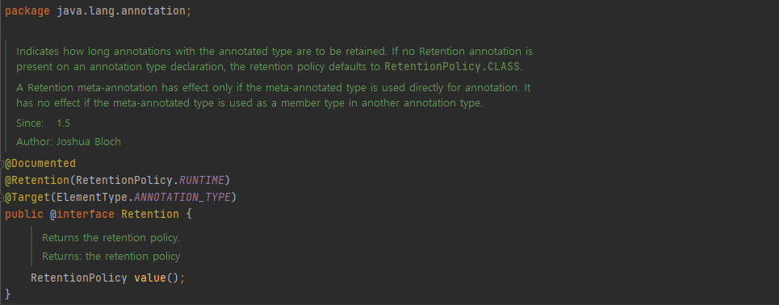
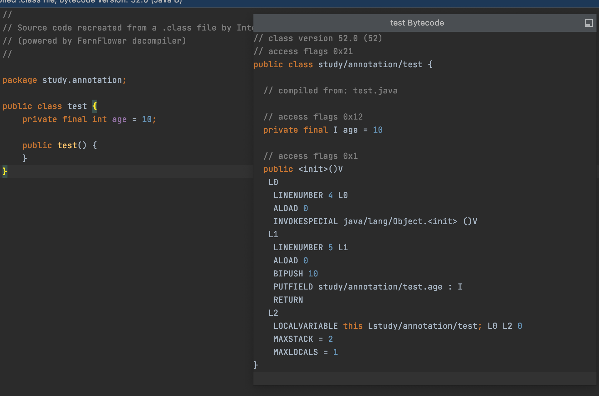
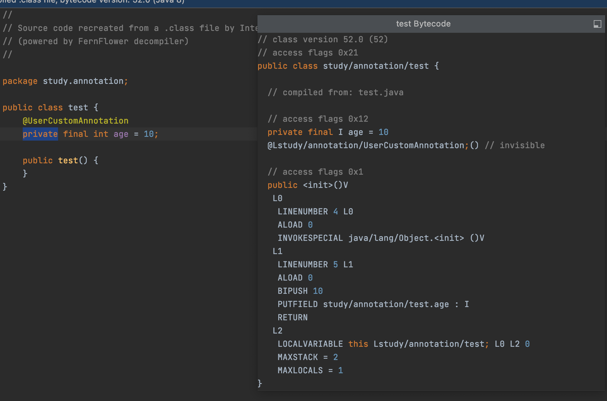
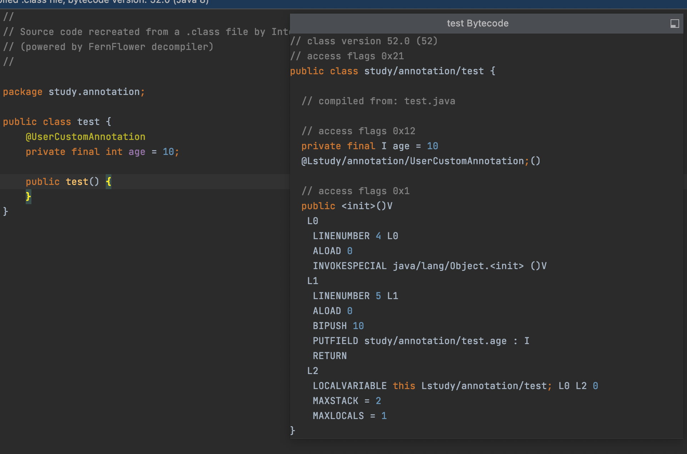
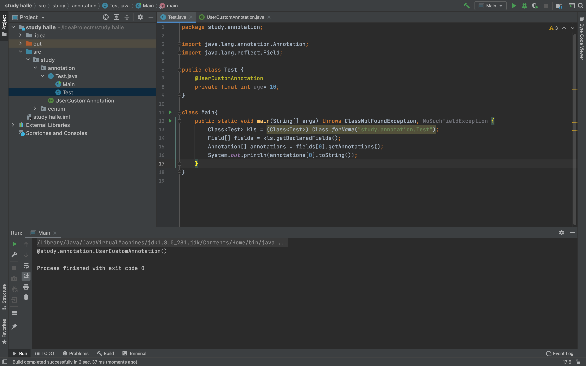
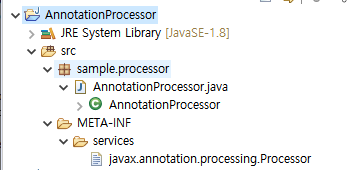
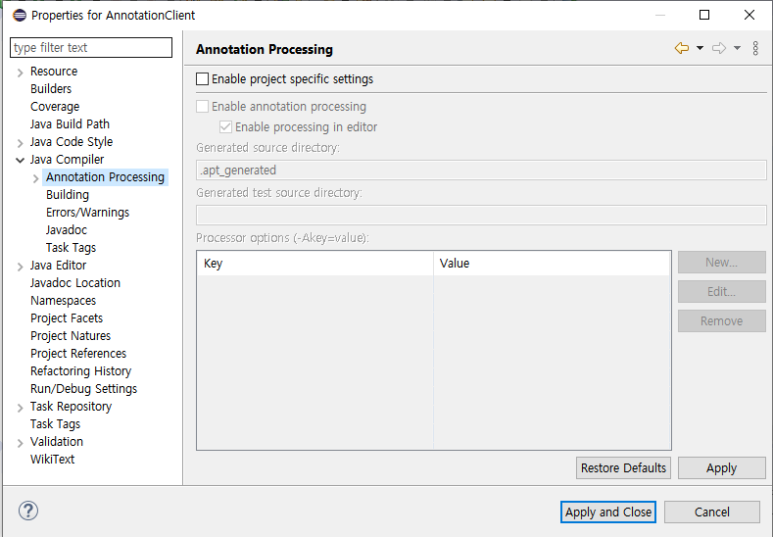
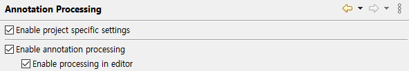
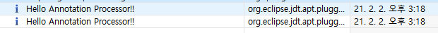

## 12 주차 과제 : 애노테이션 (Annotation)   

### 목표 : 자바의 애노테이션에 대해 학습하세요.   

### 학습할 것(필수)   
* 애노테이션 정의하는 방법   
* @retention   
* @target   
* @documented    
* 애노테이션 프로세서   

------------------------

### 애노테이션의 탄생이유
```
탄생 이유는 프로그래머에게 그들의 코드에 대한 메타데이터를 자신의 코드에 직접적으로 기술할 수 있는 것을 제공하기 위함이다.
어노테이션이 만들어 지기전에 프로그래머가 자신의 코드를 기술하는 방법은 transient 키워드를 사용한다던가, 주석 (comments)를 통하여, 인터페이스를 이용하는 등등 중구난방 이였다. 
그리고 여러타입의 어플리케이션에서 코드를 기술하는 메커니즘은 주로 XML 이 사용되어졌는데 이것은 그리 좋은 방법은 아닌게 코드와 XML (XML 은 코드가 아니다) 사이에 디커플링이 발생되고 이것은 어플리케이션을 유지보수하기 힘들게 한다. 
출처: https://hamait.tistory.com/315 [HAMA 블로그]
```

자바 애노테이션은 JDK 5 부터 추가된 기능으로 소스코드에 추가적인 정보를 제공하는 메타 데이터 이다.   
메타데이타 이기 때문에 비즈니스 로직에 직접적인 영향을 주지 않지만, 이 메타데이터 정보에 따라서 실행 흐름을 변경할 수 있는 코딩이 가능하여 단지 애노테이션 추가만으로 더 깔끔한 코딩이 가능해질 수 있다.   

* 메타데이터   
    - 데이터에 대한 데이터이다.(데이터를 위한 데이터라고도 말한다.)   
    즉, 특정 데이터에 대한 설명을 의미하는 데이터. (자신의 정보를 담고 있는 데이터)   
```java
@FunctionalInterface
interface sampleInterface {
    void start();
    // void run();   // 메서드가 두개가 올 수 없다.
}
```
예를 들면, @FunctionalInterface 는 인터페이스의 추상 메서드를 "1개"로 제한한다.   
그렇기에 개발자들은 해당 애노테이션 제약조건에 맞춰서 코딩을 진행해야 한다.   

#### 애노테이션의 용도   
* @Override 애노테이션처럼 컴파일러를 위한 정보를 제공하기 위한 용도   
* 스프링 프레임워크의 @Controller 애노테이션처럼 런타임에 리플렉션을 이용하여 특수 기능을 추가하기 위한 용도    
* 컴파일 과정에서 애노테이션 정보로부터 코드를 생성하기 위한 용도 (@Getter / @Setter)   

### 빌트인 애노테이션   
빌트인 애노테이션이란 자바에서 기본적으로 제공해주는 애노테이션으로 컴파일러 경고 및 에러를 생성하여 코드를 형식에 맞게 제한한다.   
그렇기에 프로그램의 오류를 방지할 수 있도록 일관되게 적용하는 것이 좋다.   
java.lang 패키지에 속하며, 총 6개의 애노테이션이 존재한다.   
* Override   
    - 선언한 메서드가 오버라이드 되었다는 것을 나타낸다.   
    만약, 상위 클래스 또는 인터페이스에서 해당 메서드를 찾을 수 없다면 컴파일 에러를 발생 시킨다.   
* Deprecated   
    - 메서드를 사용하지 않는 것이 좋다고 권유를 한다.   
    만약 사용한다면 경고를 일으킨다.   
* SuppressWarnings   
    - 컴파일 경고를 무시하고 실행되도록 한다.   
* SafeVarargs    
    - 제네릭과 같은 가변인자 매개변수를 사용할 때의 경고를 무시한다.   
* FunctionalInterface   
    - 함수형 인터페이스인지를 검사한다.   
    즉, 메서드가 없거나 두개 이상 되면 컴파일 오류가 난다.   
    - 람다를 위한 인터페이스를 지정하는 것이기도 하다.   
* Native   
    - 애노테이션이 달린 필드가 네이티브 코드에서 참조할 수 있는 상수임을 나타낸다.   

### 메타 애노테이션   
메타 애노테이션 이란 애노테이션을 정의할 때,   
애노테이션에 대한 부가적인 기능이나 제약조건을 정의하기 위한 애노테이션이다.   
* Target   
    - Annotation 이 적용될 범위를 지정한다.   
    - value 값으로는 ElementType 의 enum 상수값이 사용되며 다중 선택도 가능하다.   
* Retention   
    - Annotation 의 LifeCycle 을 지정한다.   
    즉, 애노테이션이 메모리에 유지되는 시간을 지정한다.   
    - value 값으로는 RetentionPolicydml enum 상수값이 사용된다.   
* Inherited   
    - 애노테이션이 하위 클래스에서도 적용될 수 있도록 상속된다.   
* Documented   
    - JavaDoc 생성시 Annotation 에 대한 정보도 함께 생성한다.   
* Repeatable   
    - 지정한 애노테이션을 사용처에서 중복해서 정의할 수 있게끔 해준다.   

### @Retention   
   

어느 시점까지 애노테이션의 메모리를 가져갈 지 설정하는 것으로, 일종의 애노테이션의 범위 라고도 할 수 있다.   
즉, 어느 시점까지 애노테이션의 영향을 미치는지 결정한다.   

Retention 애노테이션의 ( ) 에 들어올 수 있는 값은 RetentionPolicy 타입이다.   

   

RetentionPolicy 은 enum 타입으로 SOURCE, CLASS, RUNTIME 상수가 존재한다.   
* RetentionPolicy.SOURCE   
    - 소스 코드에서만 사용할 수 있으며 컴파일시에 메모리가 제거된다.   
    사실상, 애노테이션을 주석처럼 사용하는 경우다.   
* RetentionPolicy.CLASS   
    - 컴파일시에는 컴파일러가 애노테이션의 메모리를 가져가지만 실질적으로 런타임시에는 사라진다.   
    런타임시에 사라진다는 것은 리플렉션으로 선언된 애노테이션 데이터를 가져올 수 없게 되는 것을 의미한다.   
    - @Retention 을 선언하지 않았을 경우 설정되는 디폴트 값이다.   
* RetentionPolicy.RUNTIME   
    - 애노테이션을 런타임까지 사용할 수 있다.   
    - JVM 이 .class 파일에서 런타임 환경을 구성하고 런타임을 종료할 때까지 메모리는 살아있다.   
    - 리플렉션으로 선언된 애노테이션 데이터를 가져올 수 있다.   

#### RetentionPolicy.SOURCE 테스트    
```java 
import java.lang.annotation.*;

@Documented
@Inherited 
@Retention(RetentionPolicy.SOURCE)   
@Target(ElementType.FIELD)
public @interface UserCustomAnnotation {}

public class test {
    @UserCustomAnnotation
    private final int age = 10; 
}

class Main {
    public static void main(String[] args) {

    }
}
```
#### RetentionPolicy.SOURCE 결과   
    
* 클래스 파일로 변환되면서 애노테이션 정보가 사라진 것을 알 수 있다.   

#### RetentionPolicy.CLASS 테스트   
```java
import java.lang.annotation.*;

@Documented
@Inherited 
@Retention(RetentionPolicy.CLASS)   
@Target(ElementType.FIELD)
public @interface UserCustomAnnotation {}

public class test {
    @UserCustomAnnotation
    private final int age = 10; 
}

class Main {
    public static void main(String[] args) {

    }
}
```
#### RetentionPolicy.CLASS 결과   
    
* 클래스 파일로 변환되어도 명시적으로 선언되어 있는 것을 알 수 있다.   
* 단, //invisible 이라는 키워드가 붙은 것처럼 런타임시에는 사용되지 않는다.   

#### RetentionPolicy.RUNTIME 테스트   
```java
import java.lang.annotation.*;

@Documented
@Inherited 
@Retention(RetentionPolicy.RUNTIME)   
@Target(ElementType.FIELD)
public @interface UserCustomAnnotation {}

public class test {
    @UserCustomAnnotation
    private final int age = 10; 
}

class Main {
    public static void main(String[] args) {

    }
}
```
#### RetentionPolicy.RUNTIME 결과   
    
* 단순히 코드상으로는, CLASS 와 큰 차이점은 없어보인다   
* CLASS 바이트코드 때는 삽입되었던, //invisible 이 사라진 것을 알 수 있다.   

#### 리플랙션으로 비교   
CLASS   
```java 
import java.lang.annotation.*;

@Documented
@Inherited
@Retention(RetentionPolicy.CLASS)
@Target(ElementType.FIELD)
public @interface UserCustomAnnotation {
}
```
```java
import java.lang.annotation.Annotation;
import java.lang.reflect.Field;

public class Test {
    @UserCustomAnnotation
    private final int age = 10;
}

class Main {
    public static void main(String[] args) throws ClassNotFoundException, NoSuchFieldException {
        Class<Test> kls = (Class<Test>) Class.forName("study.annotation.Test");
        Field[] fields = kls.getDeclaredFields();
        Annotation[] annotation = fields[0].getAnnotations();
        System.out.println(annotation[0].toString());
    }
}
```
#### CLASS 결과   
    

* 분명히 RetentionPolicy.CLASS 는 바이트 코드상으로 존재한다.   
* 하지만, 런타임시에는 사용되지 않으므로 리플렉션을 통해 데이터를 가져올 수 없다.   

RUNTIME    
```java 
import java.lang.annotation.*;

@Documented
@Inherited
@Retention(RetentionPolicy.RUNTIME)
@Target(ElementType.FIELD)
public @interface UserCustomAnnotation {
}
```
```java
import java.lang.annotation.Annotation;
import java.lang.reflect.Field;

public class Test {
    @UserCustomAnnotation
    private final int age = 10;
}

class Main {
    public static void main(String[] args) throws ClassNotFoundException, NoSuchFieldException {
        Class<Test> kls = (Class<Test>) Class.forName("study.annotation.Test");
        Field[] fields = kls.getDeclaredFields();
        Annotation[] annotation = fields[0].getAnnotations();
        System.out.println(annotation[0].toString());
    }
}
```
#### RUNTIME 결과    
    

* RetentionPolicy.CLASS 와 달리, 리플렉션을 통해 데이터를 가져올 수 있다는 것을 알 수 있다.   

### @Target   
    

@target 은 애노테이션이 생성될 수 있는 위치를 지정한다.   
@target 애노테이션 ()에 들어올 수 있는 값은 ElementType 타입이다.   
또한, [] 배열 타입으로 선언되었기에, 여러 ElementType 타입을 지정할 수 있다.   

``` java   
public enum ElementType {
    TYPE,               // 클래스, 인터페이스, 이넘 선언시 
    FIELD,              // 멤버 변수 선언시  
    METHOD,             // 메서드 선언시 
    PARAMETER,          // 매개 변수 선언시 
    CONSTRUCTOR,        // 생성자 선언시 
    LOCAL_VARIABLE,     // 지역 변수 선언시 
    ANNOTATION_TYPE,    // 애노테이션 타입 선언시 
    PACKAGE,            // 패키지 선언시 
    TYPE_PARAMETER,     // 매개 변수 타입 선언시 
    TYPE_USE            // 타입 사용시 
}
```

### @Documented   
@Documented 는 메타 데이터 애노테이션 이다.   
애노테이션을 정의할 때 @Documented 형태로 적용하여,    
해당 애노테이션을 사용하는 클래스가 javadoc 과 같은 문서화 될 때,   
해당 애노테이션이 적용되었음을 명시하도록 한다.   

```java  
@Documented
@Inherited      // @Documented 사용하는 클래스의 하위 클래스에도 자동으로 적용  
@Retention(RetentionPolicy.RUNTIME)     // 어느 시점까지 애노테이션의 메모리를 가져갈 지 설정,
public @interface InWork {
    String value();
}
```
```java
@InWork(value = " ")
public class MainApp {...}
```
    


### 커스텀 애노테이션 정의   

애노테이션은 크게 3가지로 분류된다.   
    1. 마커 애노테이션 (Marker Annotation)   
    2. 싱글 값 애노테이션 (Single Value Annotation)   
    3. 멀티 값 애노테이션 (Multi Value Annotation)   
사실, 애노테이션 () 에 주어지는 값에 따라 분류된 것인데   
마커 애노테이션부터 차근차근 value 를 넣으면서 정의하는 방법으로 기술해 보겠다.   

### 마커 애노테이션   
마커애노테이션은 멤버를 포함하지 않으며 데이터로 구성되지 않는다.   
단지, 마커 애노테이션의 목적은 애노테이션의 선언을 표시하는 것이다.   
그렇기에 마커 애노테이션은 존재만으로도 정의한 이유가 충분하다.   

대표적인 예로 @Override 가 존재한다.   
애노테이션에 별다른 멤버를 추가하지 않아도, 메서드가 오버리이딩 조건을 충족하는지 검증을 해준다.   

#### 애노테이션 정의하기   
```
[접근지정자] @interface [애노테이션 이름] {}
```
```java
public @interface CustomUserAnnotation {}
```
애노테이션을 정의하는 방법은 간단하다.   
하지만, 위와 같은 형태는 단순한 골격일뿐 아무런 역할도 수행하지 못한다.   
```java 
@Retention(RetentionPolicy.RUNTIME)
@Target(ElementType.METHOD)
public @interface CustomUserAnnotation {}
```
애노테이션이 최소한의 기능을 수행하기 위해 @Retention() 과 @Target() 은 지정해 준다.   
@Retention() 의 경우 선언하지 않으면 디폴트로 RetentionPolicy.CLASS 가 설정된다.   
@Target() 의 경우 선언하지 않으면 모든 요소에서 해당 애노테이션을 사용할 수 있다.   

```java 
@Inherited
@Documented
@Retention(RetentionPolicy.RUNTIME)
@Target(ElementType.METHOD)
public @interface CustomUserAnnotation {}
```
이외에도 다른 Meta 애노테이션들도 적용해 줄 수 있다.   

### 싱글 값 애노테이션   
싱글 값 애노테이션은 () 안에 한 개의 멤버값을 허용하는 애노테이션이다.   
```
[접근지정자] @interface [애노테이션 이름] {
    [public] 자료형 멤버이름();
}
```
```java 
@Inherited
@Documented
@Retention(RetentionPolicy.RUNTIME)
@Target(ElementType.METHOD)
@interface CustomUserAnnotation {
    String name();
}
```
애노테이션 안에 멤버를 정의하는 밥법은 public 자료형 멤버이름(); 형태로 진행하면 된다.   
여기서, public 이외에 다른 접근지정자는 컴파일 에러가 발생하고, public 은 생략 가능하다.   

```java 
class Sample {
    @CustomUserAnnotation(name = "herohe")
    public void go() {
        System.out.println("annotationTest");
    }
}
```
당연한 이야기이지만 애노테이션에 멤버를 선언했으므로 외부에서 애노테이션을 사용하면 해당 멤버값을 넣어주어야 한다.   

```java
@Inherited
@Documented
@Retention(RetentionPolicy.RUNTIME)
@Target(ElementType.METHOD)
@interface CutomUserAnnotation {
    String value();
}
```
```java
class Sample {
    @CutomUserAnnotation("herohe")
    public void go() {
        System.out.println("annotationTest");
    }
}
```
애노테이션 멤버의 이름을 value() 로 주었을 경우, 외부에서 호출시 () 에 멤버 = 형식을 생략할 수 있다.   

```java 
@Inherited
@Documented
@Retention(RetentionPolicy.RUNTIME)
@Target(ElementType.METHOD)
@interface CustomUserAnnotation {
    String name() default "user";
}
```
default 키워드를 이용하면 멤버의 기본값을 넣을 수 있다.   
```java 
@CustomUserAnnotation   // (name = "herohe") 넣어줘도 된다.
public void go() {
    System.out.println("annotationTest");
}
```
디폴트 키워드를 넣으면 외부에서는 애노테이션에 해당 멤버값을 넣지 않아도 된다.   

메타 애노테이션중 하나인 @Repeatable() 은 그 쓰임새가 많이 다르다.   
@Repeatable() 가 선언된 애노테이션을 다른 애노테이션에서 배열로 선언해야 한다.   
```java 
@Repeatable(value = Colors.class)  
public @interface Color {
    String value();
}

@Retention(RetentionPolicy.RUNTIME)
public @interface Colors {
    Color[] value();
}

class Sample {
    @Color("red")
    @Color("blue")
    @Color("green")
    public void color() { }
}
```
애노테이션에 멤버를 정의했을 때, 단순한 자료형으로만 정의했을 경우 멤버를 1가지 밖에 넣지 못한다.   
이는 애노테이션도 마찬가지이다.   

그렇기 때문에 중복되서 사용될 애노테이션을 만들고 중복되서 사용될 애노테이션을 포함할 수 있는 배열을 가진 애노테이션을 만들어야 한다.    
이떄, 배열을 가진 애노테이션은 value() 라는 이름을 꼭 가져야 한다.   

```java 
public class Annotation {
    @Repeatable(value = Colors.class) 
    public @interface Color {
        String value();
    }
    @Color("green")
    @Color("blue")
    @Color("red")
    public class RGBColor {}

    @Color("green")
    public class GreenColor {}

    @Test 
    public void repeatableAnnotationTest() {
        RGBColor rgbColor = new RGBColor ();
        GreenColor greenColor = new GreenColor();

        Colors rgbColors = rgbColor.getClass().getAnnotation(Colors.class);
        Colors[] rgbColorArray = rgbColor.getClass().getAnnotationsByType(Color.class);

        Colors greenColors = greenColor.getClass().getAnnotation(Colors.class);
        Color[] greenColorArray = greenColor.getClass().getAnnotationByType(Color.class);

        System.out.println("rgbColors : " + rgbColors);
        System.out.println("rgbColorArray : " + rgbColorArray);
        System.out.println("rgbColorArray.length : " + (rgbColorArray != null ? rgbColorArray.length : 0));
        System.out.pritnln("greenColors : " + greenColors);
        System.out.println("greenColorArray : " + greenColorArray);
        System.out.println("greenColorArray.length : " + (greenColorArray != null ? greenColorArray.length : 0));
    }
}
```
```
실행결과
rgbColrs : @me.herohe.module.test.common.AnnotationTest$Colors(value=[@me.herohe.module.test.common.AnnotationTest$Color(value=green),
@me.herohe.module.test.common.AnnotationTest$Color(value=blue), @me.herohe.module.test.common.AnnotationTest$Color(value=red)])
rgbColorArray : [me.herohe.module.test.common.AnnotationTest$Color;@1996cd68]
rgbColorArray.length : 3
greenColors : null
greenColorArray : [me.herohe.module.test.common.AnnotationTest$Color;@3339ad8e]
greenColorArray.length : 0
```
위 코드를 통해 알 수 있는 점은    
* GreenColor 클래스는 @Color 애노테이션이 1개만 정의되어 있어 @Colors 로 묶이지 않고 getAnnotation(Colors.class) 로 가져올 경우 null 을 반환한다.   
* 반면, RGBColor 클래스는 @Color 애노테이션이 3개나 정의되어 있어 getAnnotation(Colors.class) 로 가져올 시 3개의 Color 값을 가지고 있다.   

### 멀티 값 애노테이션   
멀티 값 애노테이션은 () 안에 여러 멤버값을 허용하는 애노테이션 이다.   
```java 
@Inherited
@Documented
@Retention(RetentionPolicy.RUNTIME)
@Target(ElementType.METHOD)
public @interface CustomUserAnnotation {
    String name();
    int age();
}

class Sample {
    @CustomUserAnnotation(name = "herohe", age = 30)
    public void go() {
        System.out.println("annotationTest");
    }
}
```
단순히 싱글 값 애노테이션에서 멤버가 하나 증가된 방법이다.   

### 애노테이션 프로세서    
애노테이션 프로세서는 컴파일 타임에서, 사용자 정의 애노테이션의 소스코드를 분석하고 처리하기 위해 사용되는 hook 이다.   
컴파일 에러나 경고를 발생시키거나, 소스코드(.java)와 바이트코드(.class)를 내보내기도 한다.   

대표적인 예로 우리가 자주 사용하는 Lombok 과 JPA 가 있다.   
Lombok 은 애노테이션 프로세서를 사용하여 표준적으로 작성해야 할 코드를 개발자 대신 생성해 준다.   
    1. 애노테이션 클래스를 생성한다.   
    2. 애노테이션 파서 클래스를 생성한다.   
    3. 애노테이션을 사용한다.   
    4. 컴파일하면, 애노테이션 파서가 애노테이션을 처리한다.   
    5. 자동 생성된 클래스가 빌드 폴더에 추가된다.   

### 애노테이션 프로세서 2
* 컴파일시 애노테이션을 찾아서 그에 맞는 소스 코드를 만들어주는 javac 빌드툴의 일종이다.    
* 애노테이션을 사용하기 위해서는 애노테이션 프로세서가 필요하다.   
* 모든 애노테이션 프로세서는 AbstractProcessor 추상클래스를 상속 받아야 한다.   
```java 
package javax.annotation.processing;

import java.util.Set;
import java.util.HashSet;
import java.util.Collections;
import java.util.Object;
import javax.lang.model.element.*;
import javax.lang.model.SourceVersion;
import javax.tools.Diagnostic;

public abstract class AbstractProcessor implements Processor {
    protected ProcessingEnvironment processingEnv;
    private boolean initialized = false;

    protected AbstractProcessor() {}

    /**
    *
    */
    public synchronized void init(ProcessingEnvironment processingEnv) {
        if (initialized) 
            throw new IllegalStateException("Cannot call init more thna once.");
        Objects.requireNonNull(processingenv, "Tool provided null ProcessingEnvironment");

        this.processingEnv = processingEnv;
        initialized = true;
    }

    /**
    * 각각 프로세서의 main() 메서드 역할을 수행 
    */
    public abstract boolean process (Set<? extends TypeElement> annotations, RoundEnvironment roundEnv);

    public Set<String> getSupportedAnnotationType() {
        SupportedAnnotationTypes sat = this.getClass().getAnnotation(SupportedAnnotationTypes.class);
        if (sat == null) {
            if (isInitialized())
                processingEnv.getMessager().printMessage(Diagnostic.Kind.WARNING, "No SupportedAnnotationTypes annotation " + "found on " + this.getClass().getName() + ", returning an empty set."); 

            return Collections.emptySet();
        }else {
            return arrayToSet(sat.value());
        }
    }

    /**
    * 특정 자바버전을 지정할 때 사용 
    *
    * Java 1.6 을 사용하고 싶으면 SourceVersion.RELEASE_6 이용 
    * 보통 SourceVersion.latestSupported() 사용하는 것을 권장
    */
    public SourceVersion getSupportedSourceVersion() {
        SupportedSourceVersion ssv = this.getClass().getAnnotation(SupportedSourceVersion.class); 
        SourceVersion sv = null; 
        if (ssv == null) { 
            sv = SourceVersion.RELEASE_6; 
            if (isInitialized()) 
                processingEnv.getMessager().printMessage(Diagnostic.Kind.WARNING, "No SupportedSourceVersion annotation " + "found on " + this.getClass().getName() + ", returning " + sv + "."); 
        } else {
            sv = ssv.value(); 
        } 
        
        return sv; 
    }

    /**
    *
    *애노테이션 프로세서가 처리할 애노테이션을 명시 
    */
    public Set<String> getSupportedAnnotationType() {
        SupportedAnnotationTypes sat = this.getClass().getAnnotation(SupportedAnnotationTypes.class);
        if (sat == null) {
            if (isInitialized())    
                processingEnv.getMessager().printMessage(Diagnostic.Kind.WARNING, "No SupportedAnnotationTypes annotation " + "found on " + this.getClass().getName() + ", returning an empty set.");
                return Collections.emptySet();
        } else {
            return arrayToSet(sat.value());
        }
        ...
    }
}
```
* 동작 순서   
    - 자바 컴파일 실행   
    - 애노테이션 프로세서에서 애노테이션에 대한 처리를 함   
    - 자바 컴파일러가 모든 애노테이션 프로세서가 실행 되었는지 검사 (실행되지 않았다면 반복한다)   

### 애노테이션 프로세서 3   

애노테이션 프로세서를 한번 만들어 보겠습니다.   
   
먼저 해당 구조로 프로젝트를 하나 생성해줍니다. 생성해야할 파일은 패키지와 자바 파일, 그리고 META-INF/services 폴더와 
javax.annotation.processing.Processor 텍스트파일 입니다.   

해당 구조를 만든 뒤 javax.annotation.processign.Processor 파일에 다음 코드를 작성해줍니다.   
```java
sample.processor.AnnotationProcessor
```
해당 파일에는 단순하게 FQCN (Full Qualified Class Name) 을 넣어주면 됩니다.   
```java 
package sample.processor;

import java.util.Set;

import javax.annotation.processing.AbstractProcessor;
import javax.annotation.processing.Messager;
import javax.annotation.processing.RoundEnvironment;
import javax.annotation.processing.SupportedAnnotationTypes;
import javax.annotation.processing.SupportedSourceVersion;
import javax.lang.model.SourceVersion;
import javax.lang.model.element.TypeElement;
import javax.tools.Diagnostic.Kind;

@SupportedAnnotationTypes("*")
@SupportedSourceVersion(SourceVersion.RELEASE_8)
public class AnnotationProcessor extends AbstractProcessor {
	@Override
	public boolean process(Set<? extends TypeElement> annotations, RoundEnvironment roundEnv) {
        Messager messager = super.processingEnv.getMessager();
        messager.printMessage(Kind.NOTE, "Hello Annotation Processor!!");
		return true;
	}
}
```
다음으로 AnnotationProcessor.java 에 해당 코드를 넣어줍니다.   
이렇게 까지 코드를 작성하고 나면 AnnotationProcessor 프로젝트의 구성은 모두 끝이납니다. 이제 이 프로젝트를 export를 통해 jar 파일로 뽑아내도록 합니다.   
   
하단의 jar 파일 이름과 경로를 지정해준 뒤 finish 를 눌러줍니다.   
그러면 아래와 같은 jar 파일이 해당경로에 생기게 될겁니다.   
   
이제 이 jar파일을 놔두고 다시 이클립스로 돌아가서 하나의 프로젝트를 더 만들어 줍니다.   
    

```java 
package com.test;

public class AnnotationTest {
    @Override 
    public String toString() {
        return super.toString();
    }
}
```
이 jar 파일을 사용할 프로젝트로 간단하게 자바파일 하나만 생성해준 뒤에 위 코드를 넣어줍니다.   
이제 코드도 만들었으니 이 프로젝트의 Annotation Processing 을 설정해보도록 하겠습니다.   
    
먼저 프로젝트 우측클릭 > properties > java Compiler > Annotation Processing 을 클릭해줍니다.   
    
그리고 상단에 있는 Enable project specific settings 와 Enable processing in editor 에 체크를 넣어줍니다.   
    
다음으로 Annotation Processing 하단에 있는 Factory Path를 누른 뒤 Enable Project specific settings 를 클릭한 뒤 아까 만든 jar 파일을 
Add External JARs 를 통해 추가해줍니다.   

이제 해당설정을 적용한 뒤에 AnnotationClient 프로젝트에서 만든 java를 다시 저장하게 되면 Error Log View 에 다음과 같은 문구가 찍히는 것을 확인할 수 있습니다.   
   

컴파일 단계에서 우리가 만들었던 process() 함수의 내용이 찍히는 것을 확인할 수 있습니다.   

이 예제에서는 단순하게 특정문자를 print 하였지만 이 방법과 위에서 했던 리플렉션 방법을 이용하면 컴파일 단계에서 애노테이션을 읽고 작업을 처리하는 것이 가능해집니다.   

### Abstract Annotation   

위처럼 Annotation Processor 를 만들기 위해서는 Abstract Annotation 을 상속받는다.   

그럼 지금부터 상속 받은 Abstract Annotation 에 대해서 알아보자.   

#### Abstract Annotation 에서 제공하는 함수들이다.   
* synchronized void init(ProcessingEnvironment env)    
    - 모든 annotation processor 는 empty constructor 를 반드시 갖는다.   
    그러나 init 을 따로 갖고 있으며, ProcessingEnvironment 를 param 으로 받는다.   
    ProcessingEnvironment 는 Elements, Types, Filer 와 같은 util class 를 제공한다.   

* boolean process(Set<? extends TypeElement> annotations, RoundEnvironment env)   
    - processor 의 main 함수라고 보면 된다.   
    annotation 에 대한 scanning, evaluation, processing 을 수행하고 java file 을 만들어낸다.   
    RoundEnvironment 를 통해서 특정 annotation 을 query 할 수 있다.   

* Set<String> getSupportedAnnotationTypes()   
    - 해당 annotation processor 가 어떤 type 에 대해 처리할 것인지 등록할 수 있다.   
    return 되는 Set 안의 String 은 fully qualified name 이다.   

* SourceVersion getSupportedSourceVersion()   
    - 어떤 Java version 을 이용할지를 명시한다.   
    보통 SourceVersion.latestSupported() 를 return 한다.   
    특정 상황에서 SourceVersion.RELEASE_6 과 같이 특정 버전을 return 할 수도 있다.   
    그러나 역시 latestSupported 를 호출해서 return 하는 것이 권장된다.   


출처 : https://velog.io/@kwj1270/어노테이션   
출처 : https://blog.naver.com/PostView.nhn?blogId=swoh1227&logNo=222229853664&redirect=Dlog&widgetTypeCall=true&directAccess=false   
