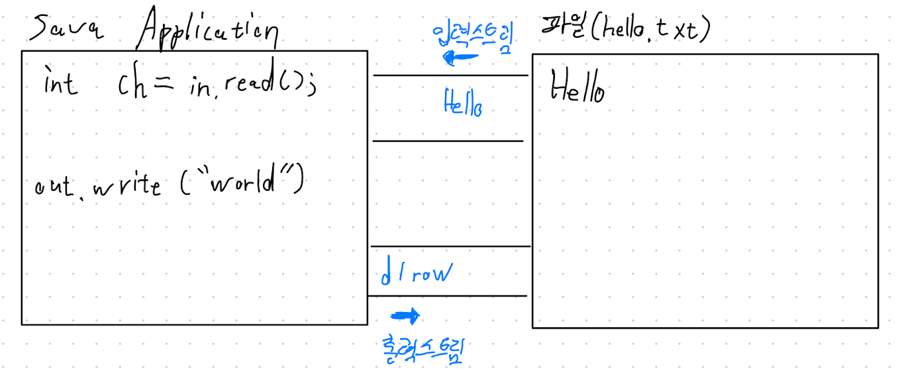
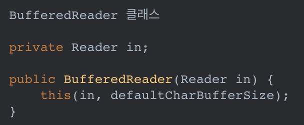

## 13 주차 과제 : I/O    

### 목표 : 자바의 Input과 Output에 대해 학습하세요.   

### 학습할 것(필수)   
* 스트림(Stream) / 버퍼(Buffer) / 채널(Channel) 기반의 I/O   
* InputStream과 OutputStream   
* Byte 와 Character 스트림   
* 표준 스트림 (System.in, System.out, System.err)   
* 파일 읽고 쓰기   

----------------------
### I/O 입출력   
#### 입출력이란 ?   
입출력(I/O)란 Input 과 Output 의 약자로 입력과 출력, 간단히 입출력이라 한다.   
입출력은 컴퓨터 내부 또는 외부 장치와 프로그램간의 데이터를 주고 받는 것을 말한다.   
* 키보드로부터 데이터를 입력받던가   
* System.out.println() 을 이용해 화면에 출력한다던가   

### 스트림(Stream)   
자바에서 어느 한 쪽에서 다른 쪽으로 데이터를 전달하려면, 두 대상을 연결하고 데이터를 전송할 수 있는 무언가가 필요한데, 이것을 스트림(stream) 이라 정의한다.   
```
람다의 스트림에서 얘기하는 스트림과 같은 용어를 사용하지만, 다른 개념이다.    
```
* 스트림이란 데이터를 운반하는데 사용되는 연결 통로이다.   

스트림은 연속적인 데이터의 흐름을 물에 비유해서 붙여진 이름인데, 여러가지로 유사한 점이 많다.   
* 물이 한 쪽 방향으로만 흐르는 것과 같이 스트림은 단방향통신만 가능하기 떄문이다.   
```
즉, 하나의 스트림으로 입력과 출력을 동시에 처리할 수 없다는 것이다.
```
입력과 출력을 동시에 처리하기 위해서는 입력을 위한 입력 스트림(input stream) 과 출력을 위한 출력 스트림(output stream), 모두 2개의 스트림이 필요하다.   
    
Java Application 과 파일 간의 입출력    

* 스트림은 먼저 보낸 데이터를 먼저 받게 되어 있으며   
* 중간에 건너뜀 없이 연속적으로 데이터를 주고 받는다.   
```
큐(Queue) 와 같은 FIFO(First In First Out) 구조로 되어 있다고 생각하면 이해하기 쉽다.
```
### 바이트 기반 스트림 - InputStream, OutputStream   
스트림은 바이트단위로 데이터를 전송하며 입출력 대상에 따라서 다음과 같은 입출력 스트림이 있다.   

#### 입력 스트림과 출력 스트림의 종류   
|입력스트림|출력스트림|입출력 대상의 종류|
|-------|-------|-------|
|FileInputStream|FileOutputStream|파일|
|ByteArrayInputStream|ByteArrayOutputStream|메모리(byte배열)|
|PipedInputStream|PipedOutputStream|프로세스(프로세스간 통신)|
|AudioInputStream|AudioOutputStream|오디오 장치|

어떠한 대상에 대해 작업을 할 것인지, 입력을 할 것인지 출력을 할 것인지에 따라 해당 스트림을 선택해서 사용할 수 있다.   

위 입출력 스트림은 각각 InputStream 과 OutputStream 의 자손들이며, 각각 읽고 쓰는데 필요한 추상 메서드를 자신에 맞게 구현해놓은 구현체이다.   

### 입출력스트림의 부모 InputStream, OutputStream   
|IntputStream|OutputStream|
|------|------|
|abstract int read()|abstract void write(int b)|
|int read(byte[] b)|void write(byte[] b)|
|int read(byte[] b, int off, int len)|void write(byte[] b, int off, int len)|

InputStream 과 OutputStream 에 정의된 읽기와 쓰기를 수행하는 메서드   
```
read() 의 반환타입이 byte가 아닌 int 인 이유는 read() 의 반환값의 번위가 0~255 와 -1 이기 때문이다.
```

위 Input,OutputStream 의 메서드 사용법만 잘 알고 있다면, 데이터를 읽고 쓰는 것은 대상의 종류에 관계 없이 간단한 일이 될 것이다.   
* **InputStream** 의 **read() 와 OutputStream 의 write(int b)** 는 입출력의 대상에 따라 읽고 쓰는 방법이 다를 것이기 때문에, 각 상황에 알맞게 구현하라는 의미의 추상 메서드로 정의되어 있다.    
* read() 와 write(int b) 를 제외한 나머지 *나머지 메서드들은 추상메서드가 아니니까* 굳이 추상메서드인 read()와 write(int b) 를 구현하지 않아도 이들을 사용하면 될 것이라 생각할 수 있겠지만,    
* 사실 추상메서드인 read() 와 write(int b) 를 *이용해서 구현한 것들임으로* read() 와 write(int b)가 구현되어 있지 않으면 이들은 아무런 의미가 없다.    

InputStream 의 실제 코드 일부분   
```java 
public abstract class InputStream {
    ...
    // 입력스트림으로 부터 1byte 를 읽어서 반환한다. 읽을 수 없다면 -1 을 반환한다.   
    abstract int read();

    // 입력스트림으로부터 len 개의 byte 를 읽어서 byte 배열 b의 off 위치까지 저장한다.   
    int read(byte[] b, int off, int len) {
        ...
        for(int i=off ; i < off+len ; i++) {
            // read() 를 호출해서 데이터를 읽어서 배열을 채운다.   
            b[i] = (byte)read();
        }
        ...

        // 입력스트림으로부터 byte 배열 b 의 크기만큼 데이터를 읽어서 배열 b 에 저장한다. 
        int read(byte[] b) {
            return read(b, 0, b.length);
        }
    }
    ...
}
```
*read(byte[] b, int off, int len)* 코드를 보면 read() 를 호출하고 있음을 볼 수 있다.   
read() 가 추상메서드 이지만, 이처럼 *read(byte[] b, int off, int len)* 의 내에서 read() 를 호출할 수 있다.   

*read(byte[] b)* 도 read(byte[] b, int off, int len)을 호출하지만, read(byte[] b, int off, int len) 가 다시 추상메서드 read() 를 호출하기 때문에 *read(bytep[] b)*도 추상메서드 read()를 호출한다고 할 수 있다.   

*결론적으로, read() 는 반드시 구현되어야 하는 핵심적인 메서드이고,* read() 없이는 read(byte[] b, int off, int len)과 read(byte[] b)는 의미가 없다.   

### 보조스트림   
스트림의 기능을 보완하기 위해 보조스트림 이라는 것이 제공된다.   
보조스트림은 *실제 데이터를 주고 받는 스트림이 아니기 때문에 데이터를 입출력할 수 있는 기능은 없지만*, 스트림의 **기능을 향상** 시키거나 **새로운 기능을 추가**할 수 있다.     
즉, 스트림을 먼저 생성한 다음에 이를 이용해 보조스트림을 생성해서 활용한다.   

#### Buffer 를 사용하면 좋은 이유에 대한 근본적인 이유를 고민해야 한다.   
```
Buffer 를 사용하면 좋은 이유  
차이점과 성능상의 장점이 있는지에 대한 이유가 중요 
```
**속도가 왜 빨라질까?**   
* 모아서 보내면 빨라질까?   
* 한 바이트씩 바로바로 보내는 것이 아니라 버퍼에 담았다가 한번에 모아서 보내는 방법인데 왜 이렇게 하는 것이 더 빨라질까?   
* 입출력 횟수가 포인트 이다.   
* 단순히 모아서 보낸다고 이점이 있는 것이 아니다 -> *시스템 콜의 횟수가 줄어들었기 때문에 성능상 이점이 생기는 것이다.*   
* **OS 레벨에 있는 시스템 콜의 횟수 자체를 줄이기 때문에 성능이 빨라지는 것이다.**   

**물을 떠와라 -> 물을 한 모금 씩 떠와라**   
* 매번 한모금 먹고 주방 갔다오고 또 먹고 갔다오고 반복..  

**물을 떠와라 -> 물을 한 컵씩 떠와라**   
* 한 컵이 다 마실 때 까지 물을 마실 수 있다.   

동일한 양의 물을 마신다고 했을 때 한모금 씩 떠와서 마시는 것과 한 컵씩 떠와서 마시는 것의 차이는 ?? -> 시간이 줄어들 것이다.   

예시로 test.txt라는 파일을 읽기 위해 FileInputStream 을 사용할 때, 입력 성능을 향상 시키기 위해 버퍼를 사용하는 보조스트림인 BufferedInputStream 을 사용할 수 있다.   
```java
// 먼저 기반 스트림을 생성한다.  
FileInputStream fileInputStream = new FileInputStream("test.txt");

// 기반 스트림을 이용해 보조 스트림을 생성한다. 
BufferedInputStream bufferedInputStream = new BufferedInputStream(fileInputStream);

// Buffered**Stream 생성 시 사이즈도 정의하여 생성할 수 있다. (2번째 파라미터)
// default : 8192 
BufferedInputStream bis = new BufferedInputStream(fileInputStream, 8192);

// 보조스트림을 이용해 데이터를 읽는다. 
bufferedInputStream.read();
```
 
 코드만 보았을 때 보조스트림인 BufferedInputStream 이 입력 기능을 수행하는 것 처럼 보이지만, 실제 입력 기능은 BufferedInputStream 과 연결된 FileInputStream 이 수행한다.   
 ```java
BufferedInputStream bufferedInputStream = new BufferedInputStream(fileInputStream);
 ```
* BufferedInputStream 은 버퍼만 제공한다. 버퍼를 사용한 입출력과 사용하지 않은 입출력은 성능상 상당한 차이가 나기 떄문에 대부분 버퍼를 이용한 보조스트림을 사용하게 된다.   

보조스트림 그 자체로 존재하는 것이 아니라 부모/자식 관계를 이루고 있는 것임으로, 보조스트림 역시 부모의 입출력 방법과 같다.   
    

보조스트림을 이용해 조립하는 것이 가능하다.   
**데코레이터 패턴**
참조:https://alkhwa-113.tistory.com/entry/IO   
#### java.io - 데코레이터 패턴   
```
자기자신의 타입을 감싸는 패턴이라고 보면 된다.    

데코레이터 패턴 
 객체에 추가적인 요건을 동적으로 첨가한다. 데코레이터는 서브클래스를 만드는 것을 통해서 기능을 유연하게 확장할 수 있는 방법을 제공한다. 
```
* java.io 패키지는 데코레이터 패턴으로 만들어졌다.   
* 데코레이터 패턴이란, A 클래스에서 B 클래스를 생성자로 받아와서, B 클래스에 추가적인 기능을 덧붙여서 제공하는 패턴이다.   
    
* BufferedReader 는 Reader 의 하위 클래스중 하나를 받아와서, 버퍼를 이용한 기능을 추가한 기능을 제공한다.   
* BufferedReader 처럼 출력을 담당하는 래퍼 클래스는 출력을 하는 주체가 아니라 도와주는 역할이다.   
* Stream 을 사용한 클래스들에서 이렇게 도와주는 클래스들을 보조스트림 이라 한다.   

### 보조스트림의 종류   
|입력|출력|설명|
|-------|-------|----------|
|FilterInputStream|FilterOutputStream|필터를 이용한 입출력 처리|
|BufferedInputStream|BufferedOutputStream|버퍼를 이용한 입출력 성능향상|
|DataInputStream|DataOutputStream|int,float 와 같은 primitive Type 으로 데이터를 처리하는 기능|
|SequenceInputStream|없음.|두 개의 스트림을 하나로 연결|
|LineNumberInputStream|없음.|읽어온 데이터의 라인번호를 카운트(jdk1.1부터 LineNumberReader로 대체)|
|ObjectInputStream|ObjectOutputStream|데이터를 객체단위로 읽고 쓰는데 사용 주로 파일을 이용하며 객체 직렬화와 관련|
|없음.|PrintStream|버퍼를 이용하며,추가적인 print관련 기능 (print,printf,println 메서드)|
|PushbackInputStream|없음.|버퍼를 이용해서 읽어온 데이터를 다시 되돌리는 기능 (unread,push back to buffer)|
개수 9   

지금까지 알아본 스트림은 모두 바이트 기반의 스트림이다.   
*바이트기반이라 하는 것은 입출력의 단위가 1byte 라는 의미이다.*   
그러나     
    **Java 에서는 한 문자를 의미하는 char 형이 1byte가 아니라 2byte 이기 때문에 바이트기반의 스트림으로 2byte인 문자를 처리하는데에 어려움이 있다.**   

### 문자기반 스트림 - Reader, Write   

바이트기반의 입출력 스트림의 단점(1byte -> 2byte)을 보완하기 위해 문자기반의 스트림을 제공한다.   
문자데이터를 입출력할 때는 바이트기반 스트림 대신 문자 기반 스트림을 사용하도록 하자.   

**InputStream -> Reader**    
**OutputStream -> Writer**   

#### 바이트기반과 문자기반 스트림의 비교   
|바이트기반 스트림|문자기반스트림|
|--------|--------|
|FileInputStream|FileReader|
|FileOutputStream|FileWriter|
|ByteArrayInputStream|CharArrayReader|
|ByteArrayOutputStream|CharArrayWriter|
|PipedInputStream|PipedReader|
|PipedOutputStream|PipedWriter|
|StringBufferedInputStream(deprecated)|StringReader|
|StringBufferedOutputStream(deprecated)|StringWriter|   

```
StringBufferInputStream, StringBufferOutputStream 은 StringReader 와 StringWriter 로 대체되어 더이상 사용하지 않는다. -> deprecated
```
네이밍 규칙만 보면 문자기반 스트림의 네이밍 중 InputStream 은 Reader로, OutputStream은 Writer로 바꾸면 된다.   

단,ByteArrayInputStream 에 대응하는 문자기반 스트림은 char 배열을 사용하는 CharArrayReader 이다.   
이와 같은 맥락으로 byte 배열 대신 char 배열을 사용한다는 것과 추상메서드가 달라졌다.   
이름만 다소 다를 뿐 활용 방법은 동일하다고 보면 된다.   

#### InputStream 과 Reader    
|InputStream|Reader|
|--------|--------|
|abstract int read()|int read()|
|int read(byte[] b)|int read(char[] cbuf)|
|int read(byte[] b, int off, int len)|abstract int read(char[] cbuf, int off, int len)|

#### OutputStream 과 Writer    
|OutputStream|Writer|
|--------|--------|
|abstract void write(int b)|void writer(int c)|
|void write(byte[] b)|void write(char[] cbuf)|
|void write(byte[] b, int off, int len)|abstract void write(char[] cbuf, int off, int len)|
|   |void write(String str)|
|   |void write(String str, int off, int len)|
개수 5    
```
보조스트림 역시 문자기반 보조스트림이 존재하며 사용목적과 방식은 바이트 기반 보조스트림과 같다. 
```

### NIO(New Input/Output)    

의미 그대로 새로운 입출력이라는 의미를 가진다.   
기존 IO의 단점을 개선하기 위해 java 4 부터 추가된 패키지이다. (java.io)   

#### NIO Package   
|NIO패키지|포함되어 있는 내용|
|--------|----------|
|java.nio|다양한 버퍼 클래스|
|java.nio.channels|파일 채널, TCP 채널, UDP 채널 등의 클래스|
|java.nio.channels.spi|java.nio.channels 패키지를 위한 서비스 제공자 클래스|
|java.nio.charset|문자셋,인코더,디코더 API|
|java.nio.charset.spi|java.nio.charset 패키지를 위한 서비스 제공자 클래스|
|java.nio.file|파일 및 파일 시스템에 접근하기 위한 클래스|
|java.nio.file.attribute|파일 및 파일 시스템의 속성에 접근하기 위한 클래스|
|java.nio.file.spi|java.nio.file 패키지를 위한 서비스 제공자 클래스|
개수 8   

#### IO 와 NIO 의 차이점   
IO와 NIO 는 데이터를 입출력한다는 목적은 동일하지만, 방식에서 큰 차이가 나타난다.   
|구분|IO|NIO|
|------|------|------|
|입출력 방식|스트림 방식|채널 방식|
|버퍼 방식|넌버퍼(Non-buffer)|버퍼(buffer)|
|비동기 방식|지원 안함|지원|
|블로킹/넌블로킹 방식|블로킹 방식만 지원(동기)|블로킹/넌블로킹 방식 모두 지원(동기/비동기 모두 지원)|
개수 5   

#### 스트림과 채널(Stream vs Channel)   
**IO는 스트림(Stream) 기반이다.**   
    스트림은 입력 스트림과 출력 스트림으로 구분되어 있기 때문에 데이터를 읽기 위해서는 입력 스트림을 생성해야 하고, 
    데이터를 출력하기 위해서는 출력 스트림을 생성해야 한다.   
**NIO는 채널(Channel) 기반이다.**   
    채널은 스트림과 달리 양방향으로 입력과 출력이 가능하다.   
    그렇기 때문에 입력과 출력을 위한 별도의 채널을 만들 필요가 없다.   

#### 넌버퍼와 버퍼(non-buffer vs buffer)   
IO 에서는 출력 스트림이 1바이트를 쓰면 입력 스트림이 1바이트를 읽는다.   
이러한 시스템은 대체로 느리다.   

이것보다 **버퍼(Buffer : 메모리 저장소)**를 사용해서 복수 개의 바이트를 한꺼번에 입력받고 출력하는 것이 성능에 이점을 가지게 된다.   

그래서 IO는 버퍼를 제공해주는 보조 스트림인 BufferedInputStream, BufferedOutputStream 을 연결해 사용하기도 한다.   

NIO 는 기본적으로 버퍼를 사용해서 입출력을 하기 떄문에 IO 보다 높은 성능을 가진다.   

    
**IO 는 스트림에서 읽은 데이터를 즉시 처리한다.**   
* 스트림으로부터 입력된 전체 데이터를 별도로 저장하지 않으면, 입력된 데이터의 위치를 이동해 가면서 자유롭게 이용할 수 없다.   
**NIO 는 읽은 데이터를 무조건 버퍼에 저장한다.**   
* 버퍼 내에서 데이터의 위치 이동을 해가면서 필요한 부분만 읽고 쓸 수 있다.    

#### 블로킹과 넌블로킹(Blocking vs non-blocking)   
**IO는 블로킹(Blocking) 된다.**   
    입력 스트림의 read() 메서드를 호출하면 데이터가 입력되기 전까지 Thread는 블로킹(대기상태)가 된다.   
    마찬가지고 출력 스트림의 write() 메서드를 호출하면 데이터가 출력되기 전까지 Thread는 블로킹된다.   
    IO Thread 가 블로킹되면 다른 일을 할 수 없고 블로킹을 빠져나오기 위해 인터럽트(interrupt)도 할 수 없다.   
    -> 블로킹을 빠져나오는 유일한 방법은 스트림을 닫는것이다.   

**NIO는 블로킹과 넌블로킹(non-blocking) 특징을 모두 가진다.**   
    IO블로킹과 NIO블로킹과의 차이점은 NIO 블로킹은 Thread 를 인터럽트(interrupt) 함으로써 빠져나올 수 있다.   
    블로킹의 반대개념이 넌블로킹인데, 입출력 작업 시 Thread가 블로킹되지 않는 것을 말한다.   
    NIO의 넌블로킹은 입출력 작업 준비가 완료된 채널만 선택해서 작업 Thread가 처리하기 떄문에 작업 Thread가 블로킹되지 않는다.   
    -> 작업준비가 완료되었다는 뜻은 지금 바로 읽고 쓸수 있는 상태를 말한다.   

    NIO 넌블로킹의 핵심 객체는 멀티플렉서(multiplexor)인 셀렉터(Selector) 이다.   
    셀렉터는 복수 개의 채널 중에서 준비 완료된 채널을 선택하는 방법을 제공해준다.   


출처 : https://www.notion.so/I-O-af9b3036338c43a8bf9fa6a521cda242
