## 13 주차 과제 : I/O    

### 목표 : 자바의 Input과 Output에 대해 학습하세요.   

### 학습할 것(필수)   
* 스트림(Stream) / 버퍼(Buffer) / 채널(Channel) 기반의 I/O   
* InputStream과 OutputStream   
* Byte 와 Character 스트림   
* 표준 스트림 (System.in, System.out, System.err)   
* 파일 읽고 쓰기   

----------------------
### I/O 입출력   
#### 입출력이란 ?   
입출력(I/O)란 Input 과 Output 의 약자로 입력과 출력, 간단히 입출력이라 한다.   
입출력은 컴퓨터 내부 또는 외부 장치와 프로그램간의 데이터를 주고 받는 것을 말한다.   
* 키보드로부터 데이터를 입력받던가   
* System.out.println() 을 이용해 화면에 출력한다던가   

### 스트림(Stream)   
자바에서 어느 한 쪽에서 다른 쪽으로 데이터를 전달하려면, 두 대상을 연결하고 데이터를 전송할 수 있는 무언가가 필요한데, 이것을 스트림(stream) 이라 정의한다.   
```
람다의 스트림에서 얘기하는 스트림과 같은 용어를 사용하지만, 다른 개념이다.    
```
* 스트림이란 데이터를 운반하는데 사용되는 연결 통로이다.   

스트림은 연속적인 데이터의 흐름을 물에 비유해서 붙여진 이름인데, 여러가지로 유사한 점이 많다.   
* 물이 한 쪽 방향으로만 흐르는 것과 같이 스트림은 단방향통신만 가능하기 떄문이다.   
```
즉, 하나의 스트림으로 입력과 출력을 동시에 처리할 수 없다는 것이다.
```
입력과 출력을 동시에 처리하기 위해서는 입력을 위한 입력 스트림(input stream) 과 출력을 위한 출력 스트림(output stream), 모두 2개의 스트림이 필요하다.   
    
Java Application 과 파일 간의 입출력    

* 스트림은 먼저 보낸 데이터를 먼저 받게 되어 있으며   
* 중간에 건너뜀 없이 연속적으로 데이터를 주고 받는다.   
```
큐(Queue) 와 같은 FIFO(First In First Out) 구조로 되어 있다고 생각하면 이해하기 쉽다.
```
### 바이트 기반 스트림 - InputStream, OutputStream   
스트림은 바이트단위로 데이터를 전송하며 입출력 대상에 따라서 다음과 같은 입출력 스트림이 있다.   

#### 입력 스트림과 출력 스트림의 종류   
|입력스트림|출력스트림|입출력 대상의 종류|
|-------|-------|-------|
|FileInputStream|FileOutputStream|파일|
|ByteArrayInputStream|ByteArrayOutputStream|메모리(byte배열)|
|PipedInputStream|PipedOutputStream|프로세스(프로세스간 통신)|
|AudioInputStream|AudioOutputStream|오디오 장치|

어떠한 대상에 대해 작업을 할 것인지, 입력을 할 것인지 출력을 할 것인지에 따라 해당 스트림을 선택해서 사용할 수 있다.   

위 입출력 스트림은 각각 InputStream 과 OutputStream 의 자손들이며, 각각 읽고 쓰는데 필요한 추상 메서드를 자신에 맞게 구현해놓은 구현체이다.   

### 입출력스트림의 부모 InputStream, OutputStream   
|IntputStream|OutputStream|
|------|------|
|abstract int read()|abstract void write(int b)|
|int read(byte[] b)|void write(byte[] b)|
|int read(byte[] b, int off, int len)|void write(byte[] b, int off, int len)|

InputStream 과 OutputStream 에 정의된 읽기와 쓰기를 수행하는 메서드   
```
read() 의 반환타입이 byte가 아닌 int 인 이유는 read() 의 반환값의 번위가 0~255 와 -1 이기 때문이다.
```

위 Input,OutputStream 의 메서드 사용법만 잘 알고 있다면, 데이터를 읽고 쓰는 것은 대상의 종류에 관계 없이 간단한 일이 될 것이다.   
* **InputStream** 의 **read() 와 OutputStream 의 write(int b)** 는 입출력의 대상에 따라 읽고 쓰는 방법이 다를 것이기 때문에, 각 상황에 알맞게 구현하라는 의미의 추상 메서드로 정의되어 있다.    
* read() 와 write(int b) 를 제외한 나머지 *나머지 메서드들은 추상메서드가 아니니까* 굳이 추상메서드인 read()와 write(int b) 를 구현하지 않아도 이들을 사용하면 될 것이라 생각할 수 있겠지만,    
* 사실 추상메서드인 read() 와 write(int b) 를 **이용해서 구현한 것들임으로** read() 와 write(int b)가 구현되어 있지 않으면 이들은 아무런 의미가 없다.    

InputStream 의 실제 코드 일부분   
```java 
public abstract class InputStream {
    ...
    // 입력스트림으로 부터 1byte 를 읽어서 반환한다. 읽을 수 없다면 -1 을 반환한다.   
    abstract int read();

    // 입력스트림으로부터 len 개의 byte 를 읽어서 byte 배열 b의 off 위치까지 저장한다.   
    int read(byte[] b, int off, int len) {
        ...
        for(int i=off ; i < off+len ; i++) {
            // read() 를 호출해서 데이터를 읽어서 배열을 채운다.   
            b[i] = (byte)read();
        }
        ...

        // 입력스트림으로부터 byte 배열 b 의 크기만큼 데이터를 읽어서 배열 b 에 저장한다. 
        int read(byte[] b) {
            return read(b, 0, b.length);
        }
    }
    ...
}
```
**read(byte[] b, int off, int len)** 코드를 보면 read() 를 호출하고 있음을 볼 수 있다.   
read() 가 추상메서드 이지만, 이처럼 **read(byte[] b, int off, int len)** 의 내에서 read() 를 호출할 수 있다.   

**read(byte[] b)** 도 read(byte[] b, int off, int len)을 호출하지만, read(byte[] b, int off, int len) 가 다시 추상메서드 read() 를 호출하기 때문에 **read(bytep[] b)** 도 추상메서드 read()를 호출한다고 할 수 있다.   

**결론적으로, read() 는 반드시 구현되어야 하는 핵심적인 메서드이고,** read() 없이는 read(byte[] b, int off, int len)과 read(byte[] b)는 의미가 없다.   

### 보조스트림   
스트림의 기능을 보완하기 위해 보조스트림 이라는 것이 제공된다.   
보조스트림은 *실제 데이터를 주고 받는 스트림이 아니기 때문에 데이터를 입출력할 수 있는 기능은 없지만*, 스트림의 **기능을 향상** 시키거나 **새로운 기능을 추가**할 수 있다.     
즉, 스트림을 먼저 생성한 다음에 이를 이용해 보조스트림을 생성해서 활용한다.   

#### Buffer 를 사용하면 좋은 이유에 대한 근본적인 이유를 고민해야 한다.   
```
Buffer 를 사용하면 좋은 이유  
차이점과 성능상의 장점이 있는지에 대한 이유가 중요 
```
**속도가 왜 빨라질까?**   
* 모아서 보내면 빨라질까?   
* 한 바이트씩 바로바로 보내는 것이 아니라 버퍼에 담았다가 한번에 모아서 보내는 방법인데 왜 이렇게 하는 것이 더 빨라질까?   
* 입출력 횟수가 포인트 이다.   
* 단순히 모아서 보낸다고 이점이 있는 것이 아니다 -> **시스템 콜의 횟수가 줄어들었기 때문에 성능상 이점이 생기는 것이다.**   
* **OS 레벨에 있는 시스템 콜의 횟수 자체를 줄이기 때문에 성능이 빨라지는 것이다.**   

**물을 떠와라 -> 물을 한 모금 씩 떠와라**   
* 매번 한모금 먹고 주방 갔다오고 또 먹고 갔다오고 반복..  

**물을 떠와라 -> 물을 한 컵씩 떠와라**   
* 한 컵이 다 마실 때 까지 물을 마실 수 있다.   

동일한 양의 물을 마신다고 했을 때 한모금 씩 떠와서 마시는 것과 한 컵씩 떠와서 마시는 것의 차이는 ?? -> 시간이 줄어들 것이다.   

예시로 test.txt라는 파일을 읽기 위해 FileInputStream 을 사용할 때, 입력 성능을 향상 시키기 위해 버퍼를 사용하는 보조스트림인 BufferedInputStream 을 사용할 수 있다.   
```java
// 먼저 기반 스트림을 생성한다.  
FileInputStream fileInputStream = new FileInputStream("test.txt");

// 기반 스트림을 이용해 보조 스트림을 생성한다. 
BufferedInputStream bufferedInputStream = new BufferedInputStream(fileInputStream);

// Buffered**Stream 생성 시 사이즈도 정의하여 생성할 수 있다. (2번째 파라미터)
// default : 8192 
BufferedInputStream bis = new BufferedInputStream(fileInputStream, 8192);

// 보조스트림을 이용해 데이터를 읽는다. 
bufferedInputStream.read();
```
 
 코드만 보았을 때 보조스트림인 BufferedInputStream 이 입력 기능을 수행하는 것 처럼 보이지만, 실제 입력 기능은 BufferedInputStream 과 연결된 FileInputStream 이 수행한다.   
 ```java
BufferedInputStream bufferedInputStream = new BufferedInputStream(fileInputStream);
 ```
* BufferedInputStream 은 버퍼만 제공한다. 버퍼를 사용한 입출력과 사용하지 않은 입출력은 성능상 상당한 차이가 나기 떄문에 대부분 버퍼를 이용한 보조스트림을 사용하게 된다.   

보조스트림 그 자체로 존재하는 것이 아니라 부모/자식 관계를 이루고 있는 것임으로, 보조스트림 역시 부모의 입출력 방법과 같다.   
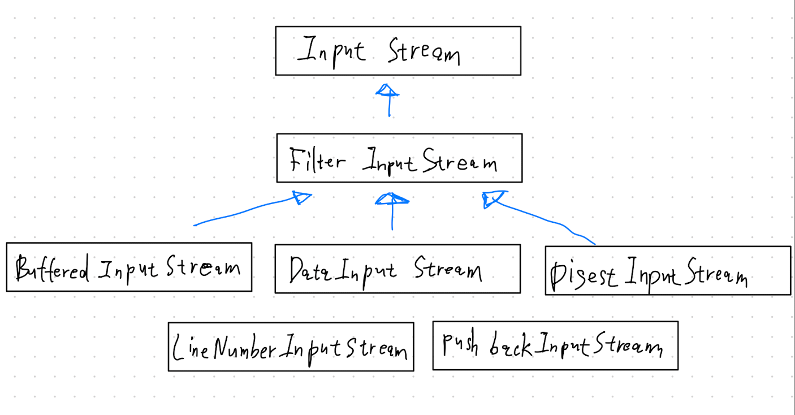    

보조스트림을 이용해 조립하는 것이 가능하다.   
**데코레이터 패턴**
참조:https://alkhwa-113.tistory.com/entry/IO   
#### java.io - 데코레이터 패턴   
```
자기자신의 타입을 감싸는 패턴이라고 보면 된다.    

데코레이터 패턴 
 객체에 추가적인 요건을 동적으로 첨가한다. 데코레이터는 서브클래스를 만드는 것을 통해서 기능을 유연하게 확장할 수 있는 방법을 제공한다. 
```
* java.io 패키지는 데코레이터 패턴으로 만들어졌다.   
* 데코레이터 패턴이란, A 클래스에서 B 클래스를 생성자로 받아와서, B 클래스에 추가적인 기능을 덧붙여서 제공하는 패턴이다.   
    
* BufferedReader 는 Reader 의 하위 클래스중 하나를 받아와서, 버퍼를 이용한 기능을 추가한 기능을 제공한다.   
* BufferedReader 처럼 출력을 담당하는 래퍼 클래스는 출력을 하는 주체가 아니라 도와주는 역할이다.   
* Stream 을 사용한 클래스들에서 이렇게 도와주는 클래스들을 보조스트림 이라 한다.   

### 보조스트림의 종류   
|입력|출력|설명|
|-------|-------|----------|
|FilterInputStream|FilterOutputStream|필터를 이용한 입출력 처리|
|BufferedInputStream|BufferedOutputStream|버퍼를 이용한 입출력 성능향상|
|DataInputStream|DataOutputStream|int,float 와 같은 primitive Type 으로 데이터를 처리하는 기능|
|SequenceInputStream|없음.|두 개의 스트림을 하나로 연결|
|LineNumberInputStream|없음.|읽어온 데이터의 라인번호를 카운트(jdk1.1부터 LineNumberReader로 대체)|
|ObjectInputStream|ObjectOutputStream|데이터를 객체단위로 읽고 쓰는데 사용 주로 파일을 이용하며 객체 직렬화와 관련|
|없음.|PrintStream|버퍼를 이용하며,추가적인 print관련 기능 (print,printf,println 메서드)|
|PushbackInputStream|없음.|버퍼를 이용해서 읽어온 데이터를 다시 되돌리는 기능 (unread,push back to buffer)|
개수 9   

지금까지 알아본 스트림은 모두 바이트 기반의 스트림이다.   
*바이트기반이라 하는 것은 입출력의 단위가 1byte 라는 의미이다.*   
그러나     
    **Java 에서는 한 문자를 의미하는 char 형이 1byte가 아니라 2byte 이기 때문에 바이트기반의 스트림으로 2byte인 문자를 처리하는데에 어려움이 있다.**   

### 문자기반 스트림 - Reader, Write   

바이트기반의 입출력 스트림의 단점(1byte -> 2byte)을 보완하기 위해 문자기반의 스트림을 제공한다.   
문자데이터를 입출력할 때는 바이트기반 스트림 대신 문자 기반 스트림을 사용하도록 하자.   

**InputStream -> Reader**    
**OutputStream -> Writer**   

#### 바이트기반과 문자기반 스트림의 비교   
|바이트기반 스트림|문자기반스트림|
|--------|--------|
|FileInputStream|FileReader|
|FileOutputStream|FileWriter|
|ByteArrayInputStream|CharArrayReader|
|ByteArrayOutputStream|CharArrayWriter|
|PipedInputStream|PipedReader|
|PipedOutputStream|PipedWriter|
|StringBufferedInputStream(deprecated)|StringReader|
|StringBufferedOutputStream(deprecated)|StringWriter|   

```
StringBufferInputStream, StringBufferOutputStream 은 StringReader 와 StringWriter 로 대체되어 더이상 사용하지 않는다. -> deprecated
```
네이밍 규칙만 보면 문자기반 스트림의 네이밍 중 InputStream 은 Reader로, OutputStream은 Writer로 바꾸면 된다.   

단,ByteArrayInputStream 에 대응하는 문자기반 스트림은 char 배열을 사용하는 CharArrayReader 이다.   
이와 같은 맥락으로 byte 배열 대신 char 배열을 사용한다는 것과 추상메서드가 달라졌다.   
이름만 다소 다를 뿐 활용 방법은 동일하다고 보면 된다.   

#### InputStream 과 Reader    
|InputStream|Reader|
|--------|--------|
|abstract int read()|int read()|
|int read(byte[] b)|int read(char[] cbuf)|
|int read(byte[] b, int off, int len)|abstract int read(char[] cbuf, int off, int len)|

#### OutputStream 과 Writer    
|OutputStream|Writer|
|--------|--------|
|abstract void write(int b)|void writer(int c)|
|void write(byte[] b)|void write(char[] cbuf)|
|void write(byte[] b, int off, int len)|abstract void write(char[] cbuf, int off, int len)|
|   |void write(String str)|
|   |void write(String str, int off, int len)|
개수 5    
```
보조스트림 역시 문자기반 보조스트림이 존재하며 사용목적과 방식은 바이트 기반 보조스트림과 같다. 
```

### NIO(New Input/Output)    

의미 그대로 새로운 입출력이라는 의미를 가진다.   
기존 IO의 단점을 개선하기 위해 java 4 부터 추가된 패키지이다. (java.io)   

#### NIO Package   
|NIO패키지|포함되어 있는 내용|
|--------|----------|
|java.nio|다양한 버퍼 클래스|
|java.nio.channels|파일 채널, TCP 채널, UDP 채널 등의 클래스|
|java.nio.channels.spi|java.nio.channels 패키지를 위한 서비스 제공자 클래스|
|java.nio.charset|문자셋,인코더,디코더 API|
|java.nio.charset.spi|java.nio.charset 패키지를 위한 서비스 제공자 클래스|
|java.nio.file|파일 및 파일 시스템에 접근하기 위한 클래스|
|java.nio.file.attribute|파일 및 파일 시스템의 속성에 접근하기 위한 클래스|
|java.nio.file.spi|java.nio.file 패키지를 위한 서비스 제공자 클래스|
개수 8   

#### IO 와 NIO 의 차이점   
IO와 NIO 는 데이터를 입출력한다는 목적은 동일하지만, 방식에서 큰 차이가 나타난다.   
|구분|IO|NIO|
|------|------|------|
|입출력 방식|스트림 방식|채널 방식|
|버퍼 방식|넌버퍼(Non-buffer)|버퍼(buffer)|
|비동기 방식|지원 안함|지원|
|블로킹/넌블로킹 방식|블로킹 방식만 지원(동기)|블로킹/넌블로킹 방식 모두 지원(동기/비동기 모두 지원)|
개수 5   

#### 스트림과 채널(Stream vs Channel)   
**IO는 스트림(Stream) 기반이다.**   
    스트림은 입력 스트림과 출력 스트림으로 구분되어 있기 때문에 데이터를 읽기 위해서는 입력 스트림을 생성해야 하고, 
    데이터를 출력하기 위해서는 출력 스트림을 생성해야 한다.   
**NIO는 채널(Channel) 기반이다.**   
    채널은 스트림과 달리 양방향으로 입력과 출력이 가능하다.   
    그렇기 때문에 입력과 출력을 위한 별도의 채널을 만들 필요가 없다.   

#### 넌버퍼와 버퍼(non-buffer vs buffer)   
IO 에서는 출력 스트림이 1바이트를 쓰면 입력 스트림이 1바이트를 읽는다.   
이러한 시스템은 대체로 느리다.   

이것보다 **버퍼(Buffer : 메모리 저장소)**를 사용해서 복수 개의 바이트를 한꺼번에 입력받고 출력하는 것이 성능에 이점을 가지게 된다.   

그래서 IO는 버퍼를 제공해주는 보조 스트림인 BufferedInputStream, BufferedOutputStream 을 연결해 사용하기도 한다.   

NIO 는 기본적으로 버퍼를 사용해서 입출력을 하기 떄문에 IO 보다 높은 성능을 가진다.   

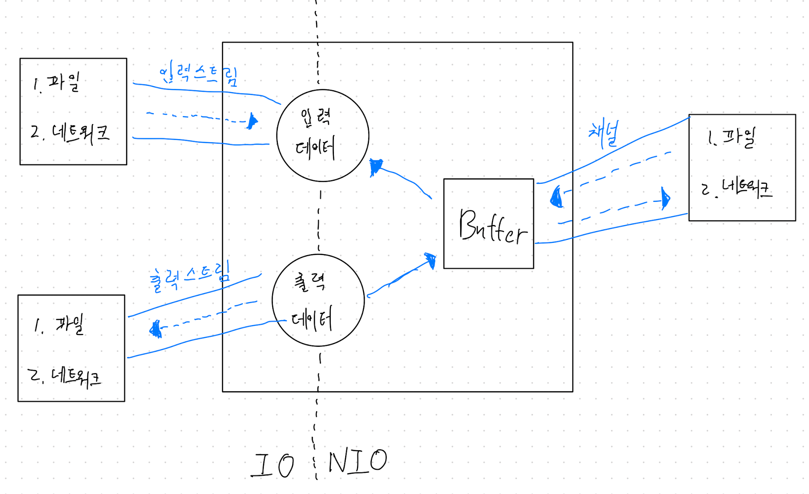    
**IO 는 스트림에서 읽은 데이터를 즉시 처리한다.**   
* 스트림으로부터 입력된 전체 데이터를 별도로 저장하지 않으면, 입력된 데이터의 위치를 이동해 가면서 자유롭게 이용할 수 없다.   
**NIO 는 읽은 데이터를 무조건 버퍼에 저장한다.**   
* 버퍼 내에서 데이터의 위치 이동을 해가면서 필요한 부분만 읽고 쓸 수 있다.    

#### 블로킹과 넌블로킹(Blocking vs non-blocking)   
**IO는 블로킹(Blocking) 된다.**   
    입력 스트림의 read() 메서드를 호출하면 데이터가 입력되기 전까지 Thread는 블로킹(대기상태)가 된다.   
    마찬가지고 출력 스트림의 write() 메서드를 호출하면 데이터가 출력되기 전까지 Thread는 블로킹된다.   
    IO Thread 가 블로킹되면 다른 일을 할 수 없고 블로킹을 빠져나오기 위해 인터럽트(interrupt)도 할 수 없다.   
    -> 블로킹을 빠져나오는 유일한 방법은 스트림을 닫는것이다.   

**NIO는 블로킹과 넌블로킹(non-blocking) 특징을 모두 가진다.**   
    IO블로킹과 NIO블로킹과의 차이점은 NIO 블로킹은 Thread 를 인터럽트(interrupt) 함으로써 빠져나올 수 있다.   
    블로킹의 반대개념이 넌블로킹인데, 입출력 작업 시 Thread가 블로킹되지 않는 것을 말한다.   
    NIO의 넌블로킹은 입출력 작업 준비가 완료된 채널만 선택해서 작업 Thread가 처리하기 떄문에 작업 Thread가 블로킹되지 않는다.   
    -> 작업준비가 완료되었다는 뜻은 지금 바로 읽고 쓸수 있는 상태를 말한다.   

    NIO 넌블로킹의 핵심 객체는 멀티플렉서(multiplexor)인 셀렉터(Selector) 이다.   
    셀렉터는 복수 개의 채널 중에서 준비 완료된 채널을 선택하는 방법을 제공해준다.   

#### 기존 IO 의 단점(속도가 느리다.)   
    
유저 영역은 실행 중인 프로그램이 존재하는 제한된 영역(하드웨어에 직접 접근 불가)을 말한다. 반대로 커널 영역은 하드웨어에 직접 접근이 가능하고 다른 프로세스를 제어할 수 있는 영역을 말한다.    

**※ 자바 I/O 프로세스**   
1) 프로세스가 커널에 파일 읽기 명령을 내림.   
2) 커널은 *시스템 콜[read()]* 을 사용해 디스크 컨트롤러가 물리적 디스크로부터 읽어온 파일 데이터를 커널 영역안의 버퍼에 쓴다.   
    * DMA(Direct Memory Access) : CPU 의 도움없이 물리적 디스크에서 커널영역의 버퍼로 데이터를 읽어 오는 것.   
3) 모든 파일 데이터가 버퍼에 복사되면 다시 프로세스 안의 버퍼로 복사한다.   
4) 프로세스 안의 버퍼의 내용으로 프로그래밍한다.   

위의 I/O 프로세스에서 첫번째 문제는 3) 의 과정이 너무나 비효율적이라는 것이다. 왜냐하면 커널안의 버퍼 데이터를 프로세스 안으로 다시 복사하기 때문이다.   

그렇다면 만약 3)의 과정을 없애고 **커널영역에 바로 접근 할 수 있다면 어떻게 될까? 만약 이게 가능하다면 우리는 버퍼를 복사하는 CPU 를 낭비하지도, GC 관리를 따로 하지 않아도 I/O를 사용**할 수 있게 된다.   

#### 커널 Buffer   
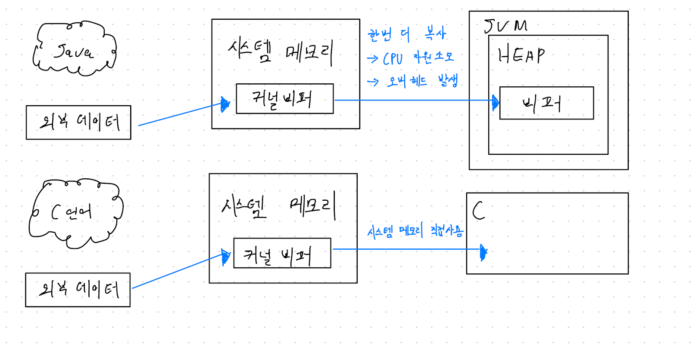    
**커널 버퍼란 운영체제가 관리하는 메모리 영역에 생성되는 버퍼 공간**으로, 자바는 외부데이터를 가져올 때 **OS의 메모리 버퍼에 먼저 담았다가 JVM 내의 버퍼에 한번 더 옮겨**줘야 하기 때문에 
시스템 메모리를 집적 다루는 C언어에 비해 입출력이 느리다.    

이러한 단점을 개선하기 위해 나온 ByteBuffer 클래스의 allocateDirect() 메서드를 사용하면 커널 버퍼를 사용할 수 있다. 그 외로 만들어지는 버퍼는 모두 JVM 내에 생성되는 버퍼이다.   
```
다이렉트 / 넌다이렉트 개념은 본문 하단에서 조금 더 자세히 살펴본다.  
```


### 바이트기반 스트림   

#### InputStream 과 OutputStream   
InputStream 과 OutputStream 은 모든 바이트기반 스트림의 조상이다.   

**InputStream의 메서드**   
|메서드명|설명|
|----------|----------|
|int available()|스트림으로부터 읽어올 수 있는 데이터의 크기를 반환|
|void close()|닫음으로써 사용하고 있던 자원을 반환|
|void mark(int readlimit)|현재 위치를 표시해 놓는다.   후에 reset()에 의해서 표시해놓은 위치로 다시 돌아갈 수 있다.   readlimit 는 되돌아갈 수 있는 byte 의 수이다.|
|abstract int read()|1byte를 읽어온다.(0~255사이의 값.)   더이상 읽어올 값이 없으면  -1을 반환한다.   abstract 추상 메서드임으로 InputStream 의 자손들은 자신의 상황에 알맞게 구현해야 한다.|
|int read(byte[] b)|배열 b의 크기만큼 읽어서 배열을 채우고 읽어 온 데이터의 수를 반환한다. 반환하는 값은 항상 배열의 크기보다 작거나 같다.|
|int read(byte[] b,int off,int len)|최대 len개의 byte를 읽어서, 배열 b의 지정된 위치(off)부터 저장 한다. 실제로 읽어 올 수 있는 데이터가 len 개 보다 적을 수 있다.|
|void read()|스트림에서의 위치를 마지막으로 mark()이 호출되었던 위치로 되돌린다.|
|long skip(long n)|스트림에서 주어진 길이(n) 만큼 건너뛴다.|
개수 8   

**OutputStream의 메서드**   
|메서드명|설명|
|----------|----------|
|void close()|입력소스를 닫음으로써 사용하고 있던 자원을 반납|
|void flush()|스트림의 버퍼에 있는 모든 내용을 출력소스에 쓴다|
|abstract void write(int b)|주어진 값을 출력소스에 쓴다.|
|void wirte(byte[] b)|주어진 배열 b에 저장된 모든 내용을 출력소스에 쓴다.|
|void write(byte[] b,int off,int len)|주어진 배열 b에 저장된 내용 중에서 off번째부터 len개 만큼만 읽어서 출력소스에 쓴다.|
개수 5    

이미 읽은 데이터를 되돌려서 다시 읽을 수 있는 방법   
**-> mark(), reset()**   
```
mark 와 reset 기능을 제공하는 스트림인지 확인하는 방법 
 -> markSupported();
```

버퍼가 있는 출력스트림이 있는 경우 flush()를 이용해 버퍼에 있는 모든 내용을 출력소스에 쓴다.   
-> **버퍼가 있는 출력스트림**에만 의미가 있으며, OutputStream에 정의된 flush()는 의미 없다.   

**close()**   
프로그램이 종료될 때 사용하고 닫지 않은 스트림을 JVM이 자동적으로 닫아주기는 하지만, 스트림을 사용해서 **모든 작업을 마치고 난 후에는 close()를 호출해서 반드시 닫아주어야 한다.**   
```
ByteArrayInputStream과 같이 메모리를 사용하는 스트림과 
System.in, System.out과 같은 표준 입출력 스트림은 닫아주지 않아도 된다! 
```

**ByteArrayInputStream 과 ByteArrayOutputStream**   
ByteArrayInputStream / ByteOutputStream 은 **메모리, 즉 바이트배열에 데이터를 입출력** 하는데 사용되는 스트림이다.   

주로 다른 곳에 입출력하기 전에 데이터를 임시로 바이트배열에 담아서 변환 등의 작업을 하는데 사용된다.   
```
스트림의 종류가 달라도 읽고 쓰는 방법은 동일함으로 스트림에 읽고 쓰는 방법을 잘 익혀두자.
```

```java
package me.herohe.study.io;

import java.io.ByteArrayInputStream;
import java.io.ByteArrayOutputStream;
import java.util.Arrays;

public class App {
    public static void main(String[] args) {
        System.out.println("hi");

        byte[] inSrc = {0,1,2,3,4,5,6,7,8,9};

        ByteArrayInputStream inputStream = new ByteArrayInputStream(inSrc);
        ByteArrayOutputStream outputStream = new ByteArrayOutputStream();

        int data;

        // inputStream 의 read() 메서드를 이용해 1byte 씩 읽어들이며, -1(값이 없을 때까지) 반복한다.
        while((data = inputStream.read()) != -1) {
            outputStream.write(data);
        }

        byte[] outSrc = outputStream.toByteArray();

        System.out.println("input source : " + Arrays.toString(inSrc));
        System.out.println("output source : " + Arrays.toString(outSrc));
    }
}
```
결과   
```
/Library/Java/JavaVirtualMachines/jdk-11.0.8.jdk/Contents/Home/bin/java -agentlib:jdwp=transport=dt_socket,address=127.0.0.1:62090,suspend=y,server=n -javaagent:/Users/seogijin/Library/Caches/JetBrains/IntelliJIdea2020.2/captureAgent/debugger-agent.jar -Dfile.encoding=UTF-8 -classpath /Users/seogijin/workspace/garbage/card/target/classes:/Applications/IntelliJ IDEA.app/Contents/lib/idea_rt.jar App
Connected to the target VM, address: '127.0.0.1:62090', transport: 'socket'
hi
input source : [0, 1, 2, 3, 4, 5, 6, 7, 8, 9]
output source : [0, 1, 2, 3, 4, 5, 6, 7, 8, 9]
Disconnected from the target VM, address: '127.0.0.1:62090', transport: 'socket'

Process finished with exit code 0
```
* 가장 기본적인 read() 와 write() 를 이용해 inSrc 에 있는 배열 값을 outSrc 에 복사하는 예제를 살펴보았다.   
* while((data = input.read()) != -1) 코드   
    - data = input.read() : read() 를 호출한 반환값을 변수 data 에 저장한다.    
    - data != -1 : data 에 저장된 값이 -1 이 아닌지 비교한다.   

**바이트배열은 사용하는 자원이 메모리 밖에 없으므로 가비지컬렉터에 의해 자동적으로 자원을 반환함으로 close()를 이용해 스트림을 닫지 않아도 된다.**    
그러나. read()와 write(int b)를 사용하기 때문에 한 번에 1 byte만 읽고 쓰므로 효율이 떨어진다.     

**read(byte[] b, int off, int len) 와 void write(byte[] b,int off,int len)활용**    
    * byte 배열을 사용해서 한번에 배열의 크기만큼 읽고 쓸 수 있다.   
    * 바구니 같은 역할을 하는 byte[] temp 를 이용하면 한번에 더 많은 물건을 옮길 수 있다.!   
```java
package me.herohe.study.io;

import java.io.ByteArrayInputStream;
import java.io.ByteArrayOutputStream;
import java.util.Arrays;

public class App {
    public static void main(String[] args) {
        System.out.println("hi");

        byte[] inSrc = {0,1,2,3,4,5,6,7,8,9};

        ByteArrayInputStream inputStream = new ByteArrayInputStream(inSrc);
        ByteArrayOutputStream outputStream = new ByteArrayOutputStream();

        int data;

        byte[] temp = new byte[inSrc.length];

        // 읽어온 데이터를 배열 temp에 담는다.   
        inputStream.read(temp, 0, temp.length);

        // temp[5] 부터 5개의 데이터를 outputStream 에 write 한다. 
        outputStream.write(temp, 5, 5);

        byte[] outSrc = outputStream.toByteArray();

        System.out.println("input source : " + Arrays.toString(inSrc));
        System.out.println("temp source : " + Arrays.toString(temp));
        System.out.println("output source : " + Arrays.toString(outSrc));
    }
}
```
결과   
```
/Library/Java/JavaVirtualMachines/jdk-11.0.8.jdk/Contents/Home/bin/java -javaagent:/Applications/IntelliJ IDEA.app/Contents/lib/idea_rt.jar=62406:/Applications/IntelliJ IDEA.app/Contents/bin -Dfile.encoding=UTF-8 -classpath /Users/seogijin/workspace/garbage/card/target/classes App
hi
input source : [0, 1, 2, 3, 4, 5, 6, 7, 8, 9]
temp source : [0, 1, 2, 3, 4, 5, 6, 7, 8, 9]
output source : [5, 6, 7, 8, 9]

Process finished with exit code 0
```
```
배열을 이용한 입출력은 작업의 효율을 증가시키므로 가능하면 입출력 대상에 따라 알맞은 크기의 배열을 사용하는 것이 좋다.  
```

고정된 배열크기를 활용해 위 예제를 변형해 보자.   
```java 
package me.herohe.study.io;

import java.io.ByteArrayInputStream;
import java.io.ByteArrayOutputStream;
import java.io.IOException;
import java.util.Arrays;

public class App {
    public static void main(String[] args) {
        System.out.println("hi");

        byte[] inSrc = {0,1,2,3,4,5,6,7,8,9};

        ByteArrayInputStream inputStream = new ByteArrayInputStream(inSrc);
        ByteArrayOutputStream outputStream = new ByteArrayOutputStream();

        // 배열의 크기를 "4"로 고정한다.  
        byte[] temp = new byte[4];
        byte[] outSrc = null;

        System.out.println("input source : " + Arrays.toString(inSrc));

        try {
            while(inputStream.available() > 0) {
                inputStream.read(temp);

                System.out.println("temp source : " + Arrays.toString(temp));
                outputStream.write(temp);

                outSrc = outputStream.toByteArray();
                System.out.println("output source : " + Arrays.toString(outSrc));
            }
        }catch(IOException e) {
            System.out.println("catched IOException " + e.getMessage());
        }
    }
}
```
결과   
```
/Library/Java/JavaVirtualMachines/jdk-11.0.8.jdk/Contents/Home/bin/java -agentlib:jdwp=transport=dt_socket,address=127.0.0.1:62474,suspend=y,server=n -javaagent:/Users/seogijin/Library/Caches/JetBrains/IntelliJIdea2020.2/captureAgent/debugger-agent.jar -Dfile.encoding=UTF-8 -classpath /Users/seogijin/workspace/garbage/card/target/classes:/Applications/IntelliJ IDEA.app/Contents/lib/idea_rt.jar App
Connected to the target VM, address: '127.0.0.1:62474', transport: 'socket'
hi
input source : [0, 1, 2, 3, 4, 5, 6, 7, 8, 9]
temp source : [0, 1, 2, 3]
output source : [0, 1, 2, 3]
temp source : [4, 5, 6, 7]
output source : [0, 1, 2, 3, 4, 5, 6, 7]
temp source : [8, 9, 6, 7]
output source : [0, 1, 2, 3, 4, 5, 6, 7, 8, 9, 6, 7]
Disconnected from the target VM, address: '127.0.0.1:62474', transport: 'socket'

Process finished with exit code 0
```
* read()나 write() 메서드가 IOException 을 발생 시킬 수 있기 때문에 try/catch 로 감싸주었다.   
* availabe() 은 블락킹(blocking) 없이 읽어 올 수 있는 바이트의 수를 반환한다.   
```
블락킹(blocking) 이란, 
    데이터를 읽어 올 때 데이터를 기다리기 위해 멈춰있던 것을 뜻한다.  
    예를 들어 사용자가 데이터를 입력하기 전까지 기다리고 있을 때 블락킹 상태에 있다고 한다.
```

위 예제의 결과가 원하는 대로 나왔는가?    
마지막 while loop 단계의 temp 배열과 output source 출력결과를 보자.   
```java 
temp source : [8,9,6,7]
output source : [0,1,2,3,4,5,6,7,8,9,6,7]
```
* 마지막에 읽은 배열의 9번째와 10번째 즉, 8,9 만을 출력해야 하는데   
* temp 배열에 남아있던 6,7 까지 출력되었다.   
* 바로 직전의 loop 에서 temp 배열에 담긴 내용은 [4,5,6,7] 이였고   
* 이후 읽어들인 8,9 이후 temp 배열에 담긴 내용은 [8,9,6,7] 이 된다.   
```
원하는 결과를 얻기 위해서는 배열 전체를 출력하는 코드에서 읽어온 만큼만 출력하는 코드로 변경되어야 한다.
```
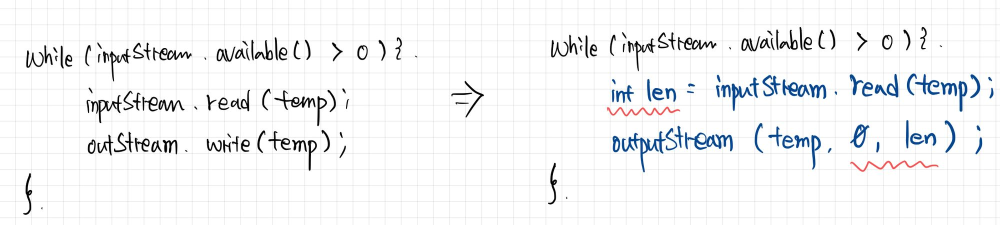    

### FileInputStream 과 FileOutputStream   
파일에 입출력을 하기 위한 스트림이다.   

#### FileInputStream 과 FileOutputStream 의 생성자   
|이름|설명|
|----------|----------|
|FileInputStream(String name)|지정된 파일이름(name)을 가진 실제 파일과 연결된 FileInputStream 을 생성한다.|
|FileInputStream(File file)|파일 이름이 String 이 아닌 File 인스턴스로 지정해야 하는점 제외하고 FileInputStream(String name)과 같다.|
|FileInputStream(FileDescriptor fdObj)|파일 디스크립터로 FileInputStream을 생성한다.|
|FileOutputStream(String name)|지정된 파일이름(name)을 가진 실제 파일과의 연결된 FileOutputStream을 생성한다.|
|FileOutputStream(String name,boolean append)|지정된 파일이름(name)을 가진 실제 파일과 연결된 FileOutputStream을 생성한다. 두번째 인자인 append를 true로 하면, 출력 시 기존의 파일 내용의 마지막에 덧붙이며, false 이면 덮어쓴다.|
|FileOutputStream(File file)|파일의 이름을 String이 아닌 File 인스턴스로 지정해주어야 하는 점을 제외하고 FileOutputStream(String name)과 같다.|
|FileOutputStream(File file,boolean append)|파일 이름을 String이 아닌 File 인스턴스로 지정해주어야 하는 점을 제외하고 FileOutputStream(String name, boolean append)와 같다.|
|FileOutputStream(FileDescriptor fdObj)|파일 디스크립터로 FileOutputStream을 생성한다.|
개수 8   

```java
package com.ssonsh.study.io;

import java.io.FileInputStream;
import java.io.IOException;

public class FileApp {
    public static void main(String[] args) throws IOException {
        FileInputStream fis = new FileInputStream(args[0]);
        int data = 0;

        while((data = fis.read()) != -1) {
            char c = (char)data;
            System.out.println(c);
        }
    }
}
```

실행 시 program arguments (파일경로)를 추가하여 실행    
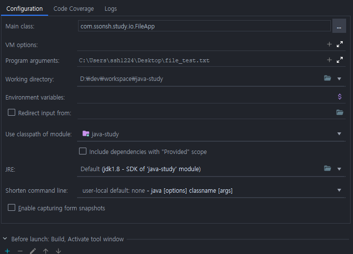    

결과   
```
"C:\Program Files\Java\jdk1.8.0_251\bin\java.exe" "-javaagent:C:\Program Files\JetBrains\IntelliJ IDEA 2019.3.5\lib\idea_rt.jar=53185:C:\Program Files\JetBrains\IntelliJ IDEA 2019.3.5\bin" -Dfile.encoding=UTF-8 -classpath "C:\Program Files\Java\jdk1.8.0_251\jre\lib\charsets.jar;C:\Program Files\Java\jdk1.8.0_251\jre\lib\deploy.jar;C:\Program Files\Java\jdk1.8.0_251\jre\lib\ext\access-bridge-64.jar;C:\Program Files\Java\jdk1.8.0_251\jre\lib\ext\cldrdata.jar;C:\Program Files\Java\jdk1.8.0_251\jre\lib\ext\dnsns.jar;C:\Program Files\Java\jdk1.8.0_251\jre\lib\ext\jaccess.jar;C:\Program Files\Java\jdk1.8.0_251\jre\lib\ext\jfxrt.jar;C:\Program Files\Java\jdk1.8.0_251\jre\lib\ext\localedata.jar;C:\Program Files\Java\jdk1.8.0_251\jre\lib\ext\nashorn.jar;C:\Program Files\Java\jdk1.8.0_251\jre\lib\ext\sunec.jar;C:\Program Files\Java\jdk1.8.0_251\jre\lib\ext\sunjce_provider.jar;C:\Program Files\Java\jdk1.8.0_251\jre\lib\ext\sunmscapi.jar;C:\Program Files\Java\jdk1.8.0_251\jre\lib\ext\sunpkcs11.jar;C:\Program Files\Java\jdk1.8.0_251\jre\lib\ext\zipfs.jar;C:\Program Files\Java\jdk1.8.0_251\jre\lib\javaws.jar;C:\Program Files\Java\jdk1.8.0_251\jre\lib\jce.jar;C:\Program Files\Java\jdk1.8.0_251\jre\lib\jfr.jar;C:\Program Files\Java\jdk1.8.0_251\jre\lib\jfxswt.jar;C:\Program Files\Java\jdk1.8.0_251\jre\lib\jsse.jar;C:\Program Files\Java\jdk1.8.0_251\jre\lib\management-agent.jar;C:\Program Files\Java\jdk1.8.0_251\jre\lib\plugin.jar;C:\Program Files\Java\jdk1.8.0_251\jre\lib\resources.jar;C:\Program Files\Java\jdk1.8.0_251\jre\lib\rt.jar;D:\dev\workspace\java-study\out\production\java-study;D:\dev\workspace\java-study\lib\archunit-0.12.0.jar;D:\dev\workspace\java-study\lib\slf4j-api-1.7.25.jar;D:\dev\workspace\java-study\lib\junit-4.12.jar;D:\dev\workspace\java-study\lib\hamcrest-core-1.3.jar" com.ssonsh.study.io.FileApp C:\Users\ssh1224\Desktop\file_test.txt
go to file input output stream
text file
hello
Picked up JAVA_TOOL_OPTIONS: -Djava.net.preferIPv4Stack=true

Process finished with exit code 0
```
* read() 메서드의 반환값이 int형 (4 byte)이지만, 입력값이 없음을 알리는 -1을 제외하고는 0 ~ 255(1byte) 범위의 정수값임으로,   
* **char형(2 byte)으로 변환하여도 손실되는 데이터는 없다.**   

```java
package com.ssonsh.study.io;

import java.io.FileInputStream;
import java.io.FileOutputStream;
import java.io.IOException;

public class FileApp {
    public static void main(String[] args) throws IOException {
        FileInputStream fis = new FileInputStream(args[0]);
        FileOutputStream fos = new FileOutputStream(args[1]);

        int data = 0;

        while((data = fis.read()) != -1){
            fos.write(data);
        }

        fis.close();
        fos.close();
    }
}
```
* 첫 번째 인자로 읽은 File을 두번째 인자로 넘어온 파일에 Copy하는 예   
* 위 예제와 같이 실행 시 인자를 넘겨주도록 한다.   
    

결과   
    

    

#### 바이트기반 보조스트림   

**BufferedInputStream 과 BufferedOutputStream**   
스트림의 입출력 효율을 높이기 위해 버퍼를 사용하는 보조스트림.   
한 바이트씩 입출력하는 것 보다 버퍼(빠이트배열)을 이용해 한 번에 여러 바이트를 입출력 하는 것이 성능상 이점이 있음으로, 
대부분의 입출력 작업에 사용된다.   

**BufferedInputStream의 생성자**   
|생성자|설명|
|----------|----------|
|BufferedInputStream(InputStream in, int size)|주어진 InputStream인스턴스를 입력소스 (input source)로 하며 지정된 크기(byte 단위)의 버퍼를 갖는 BufferedInputStream 인스턴스를 생성한다.|
|BufferedInputStream(InputStream in)|주어진 InputStream인스턴스를 입력소스 (intput source)로 하여 버퍼의 크기를 지정해주지 않으므로 기본적으로 8192byte 크기의 버퍼를 갖게 된다.|
개수 2   

버퍼의 크기는 입력소스로부터 한 번에 가져올 수 있는 데이터의 크기로 지정하면 좋다.   
보통, 입력소스가 파일인 경우 8192(8K) 정도의 크기로 하는 것이 보통이며, 버퍼의 크기를 변경해가며 테스트하면 최적의 크기를 알아낼 수 있다.   

**BufferedOutputStream의 생성자와 메서드**   
|메서드/생성자|설명|
|----------|----------|
|BufferedOutputStream(OutputStream out,int size)|주어진 OutputStream 인스턴스를 출력소스(output source)로 하며 지정된 크기 (단위byte)의 버퍼를 갖는 BufferedOutputStream인스턴스를 생성한다.|
|BufferedOutputStream(OutputStream out)|주어진 OutputStream 인스턴스를 출력소스(output source)로 하며 버퍼의 크기를 지정해주지 않으므로 기본적으로 8192 byte 크기의 버퍼를 갖게 된다.|
|flush()|버퍼의 모든 내용을 출력소스에 출력한 다음, 버퍼를 지운다.|
|close()|flush() 호출해서 버퍼의 모든 내용을 출력소스에 출력하고, BufferedOutputStream 인스턴스가 사용하던 몯느 자원을 반납한다.|
개수 4   

Input 의 입력 소스로부터 데이터를 읽을 때와는 반대로, 프로그램에서 write 메서드를 이용한 출력이 BufferedOutputStream 의 버퍼에 저장된다.   
버퍼가 가득 차면, 그 때 버퍼의 모든 내용을 출력소스에 출력하며, 그 이후 버퍼를 비우고 다시 프로그램으로 부터의 출력을 저장할 준비를 한다.   

```
버퍼가 가득 찼을 때만 출력소스에 출력을 하기 때문에, 마지막 출력부분이 출력소스에 쓰이지 못하고 BufferedOutputStream의 버퍼에 남아있는 채로 프로그램이 종료될 수 있다는 점을 주의해야 한다.
```
-> 작업을 마치면 close() 나 flush()를 호출해서 마지막 버퍼에 있는 모든 내용이 출력소스에 출력되도록 해야 한다.   
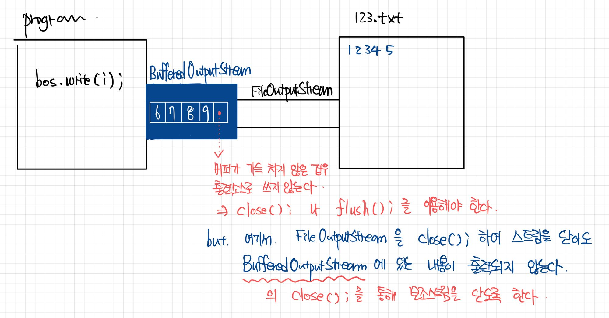    

**PrintStream**   
PrintStream 은 데이터를 기반스트림에 다양한 형태로 출력할 수 있는 print,println,printf 와 같은 메서드를 오버로딩하여 제공한다.   

PrintStream 은 데이터를 적절한 문자로 출력하는 것이기 때문에 문자기반 스트림의 역할을 수행한다.   
```
JDK 1.1에서 부터 PrintStream 보다 향상된 기능의 문자 기반 스트림인 PrintWriter 가 추가되었으나 그동안 매우 빈번하게 사용되던 Sysem.out 이 PrintStream 이다 보니 둘다 사용할 수 밖에 없게 되었다.
```

PrintStream 과 PrintWrite 는 거의 같은 기능을 가지고 PrintWriter 가 PrintStream 에 비해 다양한 언어의 문자를 처리하는데 적합하기 때문에 가능하다면 PrintWriter 를 사용하는 것이 좋다.    
```
PrintStream 은 지금까지 알게 모르게 많이 사용해왔다.   
System 클래스의 Static 멤버인 out과 rr, 즉 System.out, System.err 이 PrintStream 이다.
```

print()나 println() 을 이용해 출력하는 중에 PrintStream 의 기반스트림에서 IOException 이 발생하면 checkError() 를 통해서 인지할 수 있다.   
    * println() 이나 print() 는 예외를 던지지 않고 내부에서 처리하도록 정의되어 있는데, 그 이유는 매우 자주 사용되는 것이기 때문이다.   
    * 만약, 예외를 던지도록 정의되었다면 print(), println()을 사용하는 모든곳에서 try/catch 문을 사용해야 할 것이다.   

PrintStream.java 중..
```java
/**
 * Prints an integer.  The string produced by <code>{@link
 * java.lang.String#valueOf(int)}</code> is translated into bytes
 * according to the platform's default character encoding, and these bytes
 * are written in exactly the manner of the
 * <code>{@link #write(int)}</code> method.
 *
 * @param      i   The <code>int</code> to be printed
 * @see        java.lang.Integer#toString(int)
 */
public void print(int i) {
    write(String.valueOf(i));
}
...
private void write(String s) {
    try {
        synchronized (this) {
            ensureOpen();
            textOut.write(s);
            textOut.flushBuffer();
            charOut.flushBuffer();
            if(autoFlush && (s.indexOf('\n') >= 0))
                out.flush();
        }
    }catch(InterruptedIOException x) {
        Thread.currentThread().interrupt();
    }catch(IOException x) {
        trouble = ture;
    }
}
...
/**
 * Flushes the stream and checks its error state. The internal error state
 * is set to <code>true</code> when the underlying output stream throws an
 * <code>IOException</code> other than <code>InterruptedIOException</code>,
 * and when the <code>setError</code> method is invoked.  If an operation
 * on the underlying output stream throws an
 * <code>InterruptedIOException</code>, then the <code>PrintStream</code>
 * converts the exception back into an interrupt by doing:
 * <pre>
 *     Thread.currentThread().interrupt();
 * </pre>
 * or the equivalent.
 *
 * @return <code>true</code> if and only if this stream has encountered an
 *         <code>IOException</code> other than
 *         <code>InterruptedIOException</code>, or the
 *         <code>setError</code> method has been invoked
 */
public boolean checkError() {
    if(out != null) 
        flush();
    if(out instanceof java.io.PrintStream) {
        PrintStream ps = (PrintStream) out;
        return ps.checkError();
    }
    return trouble;
}
```

```
i+""와 String.valueOf(i) 는 같은 결과를 얻지만, 
String.valueOf(i) 가 더 높은 성능을 나타낸다.
```

printf() 는 JDK 1.5 부터 추가된 것으로 C언어와 같이 편리한 형식화된 출력을 지원하게 되었다.   
* 형식은 Java Formatter 클래스를 참고하자.   
* 본문에선 생략하도록 한다. 다만, 예제 코드 하나만 살펴보고 가자.   
```java
package me.herohe.study.io;

import java.util.Date;

public class App {
    public static void main(String[] args) {
        System.out.println("hi");

        int i = 65;
        float f = 1234.56789f;
        Date d = new Date();

        System.out.printf("문자 %C의 코드는 %d%n" ,i ,i);
        System.out.printf("%d는 8진수로 %o, 16진수로 %x%n", i, i, i);
        System.out.printf("%3d%3d%3d\n", 100, 90 ,80);
        System.out.println();
        System.out.printf("1234567890%n");
        System.out.printf("%s%-5s%5s%n", "123", "123", "123");
        System.out.println();
        System.out.printf("%-8.1f%8.1f %e%n", f, f, f);
        System.out.println();
        System.out.printf("오늘은 %tY년 %tm월 %td일 입니다.%n", d, d, d);
        System.out.printf("지금은 %tH시 %tM분 %tS초 입니다.%n", d, d, d);
        System.out.printf("지금은 %1$tH시 %1$tM분 %1$tS초 입니다.%n", d);
    }
}
```
결과   
```
/Library/Java/JavaVirtualMachines/jdk-11.0.8.jdk/Contents/Home/bin/java -agentlib:jdwp=transport=dt_socket,address=127.0.0.1:63754,suspend=y,server=n -javaagent:/Users/seogijin/Library/Caches/JetBrains/IntelliJIdea2020.2/captureAgent/debugger-agent.jar -Dfile.encoding=UTF-8 -classpath /Users/seogijin/workspace/garbage/card/target/classes:/Applications/IntelliJ IDEA.app/Contents/lib/idea_rt.jar App
Connected to the target VM, address: '127.0.0.1:63754', transport: 'socket'
hi
문자 A의 코드는 65
65는 8진수로 101, 16진수로 41
100 90 80

1234567890
123123    123

1234.6    1234.6 1.234568e+03

오늘은 2021년 05월 04일 입니다.
지금은 10시 43분 05초 입니다.
지금은 10시 43분 05초 입니다.
Disconnected from the target VM, address: '127.0.0.1:63754', transport: 'socket'

Process finished with exit code 0
```
* 형식화된 문자열에 사용된 옵션의 개수와 매개변수의 개수가 일치하도록 신경써야 한다.   
* 마지막 Date 정보를 표현하는 printf 구문을 살펴보면 '1$'를 확인할 수 있는데 첫번째 매개변수를 의미한다.   

### 문자기반 스트림   
문자데이터를 다루는데 사용된 다는 것을 제외하고는 바이트기반 스트림과 문자기반 스트림의 사용법은 거의 같다.   

**Reader와 Writer**   
바이트기반 스트림의 조상이 InputStream 과 OutputStream 인 것과 같이 문자 기반 스트림에서는 Reader 와 Writer 가 그 역할을 수행한다.   
Reader 와 Writer 의 메서드에서는 바이트기반 스트림과 비교하여 byte 배열 대신 char 배열을 사용한다.   

**Reader 메서드**   
|메서드|설명|
|----------|----------|
|abstract void close()|입력 스트림을 닫음으로써 사용하고 있던 자원을 반납한다.|
|void mark(int readlimit)|현재위치를 표시해놓는다. 후에 reset()에 의해서 표시해 놓은 위치로 다시 돌아갈 수 있다.|
|boolean markSupported()|mark()와 reset() 을 지원하는지 알려준다.|
|int read()|하나의 문자를 읽어온다. char의 범위인 0~65535범위의 정수를 반환하며, 입력스트림의 마지막 데이터에 도달하면, -1을 반환한다.|
|int read(char[] c)|입력소스로부터 매개변수로 주어진 배열 c의 크기만큼 읽어서 배열 c에 저장한다. 읽어온 데이터의 개수 또는 -1을 반환한다.|
|abstract int read(char[] c, int off, int len)|입력소스로부터 최대 len개의 문자를 읽어서, 배열 c의 저장된 위치(off)부터 읽은 다음 저장한다. 읽어온 데이터의 개수 또는 -1을 반환한다.|
|int read(CharBuffertarget)|입력소스로부터 읽어서 문자버퍼(target)에 저장한다.|
|boolean ready()|입력소스로부터 데이터를 읽을 준비가 되어있는지 알려준다.|
|void reset()|입력소스에서의 위치를 마지막으로 mark()가 호출되었던 위치로 되돌린다.|
|long skip(long n)|현재 위치에서 주어진 문자 수(n)만큼을 건너뛴다.|
개수 10    

**Writer 메서드**   
|메서드|설명|
|----------|----------|
|Writer append(char c)|지정된 문자를 출력소스에 출력한다.|
|Writer append(charSequence c)|지정된 문자열(CharSequence)을 출력소스에 출력한다.|
|Writer append(CharSequence c, int start, int end)|지정된 문자열(CharSequence)의 일부를 출력소스에 출력 (CharBuffer,String,StringBuffer가 CharSequence를 구현)|
|abstract void close()|출력 스트림을 닫음으로써 사용하고 있던 자원을 반환한다.|
|abstract void flush()|스트림의 버퍼에 있는 모든 내용을 출력소스에 쓴다.(버퍼가 있는 스트림에만 해당한다.)|
|void write(int b)|주어진 값을 출력소스에 쓴다.|
|void wirte(char[] c)|주어진 배열 c에 저장된 모든 내용을 출력소스에 쓴다.|
|abstract void write(char[] c,int off,int len)|주어진 배열 c에 저장된 내용 중에서 off번째부터 len길이만큼만 출력소스에 쓴다.|
|void write(String str)|주어진 문자열(str)을 출력소스에 쓴다.|
|void write(String str,int off, int len)|주어진 문자열(str)의 일부를 출력소스에 쓴다.(off번째 문자부터 len개만큼의 문자열)|
개수 11    

* 문자기반 스트림이라는 것이 바이트기반 스트림과 비교하여 단순히 2byte 스트림을 처리 하는 것만 의미하는 것이 아니다.   
* 문자 데이터를 다루는데 필요한 또 하나의 정보인 인코딩(encoding) 이다.   
```
Reader/Writer 그리고 그 자손들은 여러 종류의 인코딩과 자바에서 사용하는 유니코드(UTF-16)간의 변환을 자동적으로 처리해준다.
```

**FileReader와 FileWriter**    
파일로부터 텍스트데이터를 읽고, 파일을 쓰는데 사용된다.    
사용법은 FileInputStream 과 FileOutputStream 과 다르지 않다.    

테스트 할 txt 파일의 내용은 아래와 같다.(file_test.txt)   
```
안녕하세요.
hi
hello
스트림 학습중입니다.
study stream~!
```
```java
package me.herohe.study.io;

import java.io.FileInputStream;
import java.io.FileReader;
import java.io.IOException;

public class FileApp {
    public static void main(String[] args) throws IOException {
        String fileName = "C:\\Users\\herohe\\Desktop\\file_test.txt";
        FileInputStream fis = new FileInputStream(fileName);
        FileReader fr = new FileReader(fileName);

        int data = 0;
        // fileInputStream 이용 
        while((data = fis.read()) != -1) {
            System.out.print((char)data);
        }

        System.out.println();
        fis.close();

        // fileReader 이용 
        while((data = fr.read()) != -1) {
            System.out.print((char)data);
        }

        System.out.println();
        fr.close();
    }
}
```
결과   
```
"C:\Program Files\Java\jdk1.8.0_251\bin\java.exe" "-javaagent:C:\Program Files\JetBrains\IntelliJ IDEA 2019.3.5\lib\idea_rt.jar=63907:C:\Program Files\JetBrains\IntelliJ IDEA 2019.3.5\bin" -Dfile.encoding=UTF-8 -classpath "C:\Program Files\Java\jdk1.8.0_251\jre\lib\charsets.jar;C:\Program Files\Java\jdk1.8.0_251\jre\lib\deploy.jar;C:\Program Files\Java\jdk1.8.0_251\jre\lib\ext\access-bridge-64.jar;C:\Program Files\Java\jdk1.8.0_251\jre\lib\ext\cldrdata.jar;C:\Program Files\Java\jdk1.8.0_251\jre\lib\ext\dnsns.jar;C:\Program Files\Java\jdk1.8.0_251\jre\lib\ext\jaccess.jar;C:\Program Files\Java\jdk1.8.0_251\jre\lib\ext\jfxrt.jar;C:\Program Files\Java\jdk1.8.0_251\jre\lib\ext\localedata.jar;C:\Program Files\Java\jdk1.8.0_251\jre\lib\ext\nashorn.jar;C:\Program Files\Java\jdk1.8.0_251\jre\lib\ext\sunec.jar;C:\Program Files\Java\jdk1.8.0_251\jre\lib\ext\sunjce_provider.jar;C:\Program Files\Java\jdk1.8.0_251\jre\lib\ext\sunmscapi.jar;C:\Program Files\Java\jdk1.8.0_251\jre\lib\ext\sunpkcs11.jar;C:\Program Files\Java\jdk1.8.0_251\jre\lib\ext\zipfs.jar;C:\Program Files\Java\jdk1.8.0_251\jre\lib\javaws.jar;C:\Program Files\Java\jdk1.8.0_251\jre\lib\jce.jar;C:\Program Files\Java\jdk1.8.0_251\jre\lib\jfr.jar;C:\Program Files\Java\jdk1.8.0_251\jre\lib\jfxswt.jar;C:\Program Files\Java\jdk1.8.0_251\jre\lib\jsse.jar;C:\Program Files\Java\jdk1.8.0_251\jre\lib\management-agent.jar;C:\Program Files\Java\jdk1.8.0_251\jre\lib\plugin.jar;C:\Program Files\Java\jdk1.8.0_251\jre\lib\resources.jar;C:\Program Files\Java\jdk1.8.0_251\jre\lib\rt.jar;D:\dev\workspace\java-study\out\production\java-study;D:\dev\workspace\java-study\lib\archunit-0.12.0.jar;D:\dev\workspace\java-study\lib\slf4j-api-1.7.25.jar;D:\dev\workspace\java-study\lib\junit-4.12.jar;D:\dev\workspace\java-study\lib\hamcrest-core-1.3.jar" me.herohe.study.io.FileApp C:\Users\herohe\Desktop\file_test.txt C:\Users\herohe\Desktop\file_test_copy.txt
안녕하세요.
hi
hello
스트림 학습중입니다.
study stream~!
안녕하세요.
hi
hello
스트림 학습중입니다.
study stream~!
Picked up JAVA_TOOL_OPTIONS: -Djava.net.preferIPv4Stack=true

Process finished with exit code 0
```
* 바이트기반 스트림과 문자기반 스트림 각각 활용하여 txt 파일을 읽어서 print 하였다.   
* 결과에서 볼 수 있듯이 문자기반 스트림을 활용하였을 때 별다른 작업을 하지 않아도 인코딩되어 문자가 정상적으로 출력되는 것을 볼 수 있다.   

### Point ! Exception 스터디에서 학습한 내용이 기억아는가?   
* 위 예제를 살펴보면 FileInputStream 과 FileReader 자원을 활용한 이후 close(); 를 통해 자원을 반납하고 있다.   
* try-resource-catch 를 사용하자 !    
```java
package me.herohe.study.io;

import java.io.FileInputStream;
import java.io.FileReader;
import java.io.IOException;

public class FileApp {
    public static void main(String[] args) {
        String fileName = "C:\\Users\\herohe\\Desktop\\file_test.txt";

        try(FileInputStream fis = new FileInputStream(fileName);
            FileReader fr = new FileReader(fileName)) {
                int data = 0;

                //fileIuputStream 이용 
                while((data = fis.read()) != -1) {
                    System.out.print((char)data);
                }

                System.out.println();
            } catch(IOException e) {
                e.printStackTrace();
            }
    }
}
```
* 위 예제와 다르게 fis, fr 에 대한 close(); 자원반납 메서드가 사라졌음을 볼 수 있다.   

결과   
```java
"C:\Program Files\Java\jdk1.8.0_251\bin\java.exe" "-javaagent:C:\Program Files\JetBrains\IntelliJ IDEA 2019.3.5\lib\idea_rt.jar=64003:C:\Program Files\JetBrains\IntelliJ IDEA 2019.3.5\bin" -Dfile.encoding=UTF-8 -classpath "C:\Program Files\Java\jdk1.8.0_251\jre\lib\charsets.jar;C:\Program Files\Java\jdk1.8.0_251\jre\lib\deploy.jar;C:\Program Files\Java\jdk1.8.0_251\jre\lib\ext\access-bridge-64.jar;C:\Program Files\Java\jdk1.8.0_251\jre\lib\ext\cldrdata.jar;C:\Program Files\Java\jdk1.8.0_251\jre\lib\ext\dnsns.jar;C:\Program Files\Java\jdk1.8.0_251\jre\lib\ext\jaccess.jar;C:\Program Files\Java\jdk1.8.0_251\jre\lib\ext\jfxrt.jar;C:\Program Files\Java\jdk1.8.0_251\jre\lib\ext\localedata.jar;C:\Program Files\Java\jdk1.8.0_251\jre\lib\ext\nashorn.jar;C:\Program Files\Java\jdk1.8.0_251\jre\lib\ext\sunec.jar;C:\Program Files\Java\jdk1.8.0_251\jre\lib\ext\sunjce_provider.jar;C:\Program Files\Java\jdk1.8.0_251\jre\lib\ext\sunmscapi.jar;C:\Program Files\Java\jdk1.8.0_251\jre\lib\ext\sunpkcs11.jar;C:\Program Files\Java\jdk1.8.0_251\jre\lib\ext\zipfs.jar;C:\Program Files\Java\jdk1.8.0_251\jre\lib\javaws.jar;C:\Program Files\Java\jdk1.8.0_251\jre\lib\jce.jar;C:\Program Files\Java\jdk1.8.0_251\jre\lib\jfr.jar;C:\Program Files\Java\jdk1.8.0_251\jre\lib\jfxswt.jar;C:\Program Files\Java\jdk1.8.0_251\jre\lib\jsse.jar;C:\Program Files\Java\jdk1.8.0_251\jre\lib\management-agent.jar;C:\Program Files\Java\jdk1.8.0_251\jre\lib\plugin.jar;C:\Program Files\Java\jdk1.8.0_251\jre\lib\resources.jar;C:\Program Files\Java\jdk1.8.0_251\jre\lib\rt.jar;D:\dev\workspace\java-study\out\production\java-study;D:\dev\workspace\java-study\lib\archunit-0.12.0.jar;D:\dev\workspace\java-study\lib\slf4j-api-1.7.25.jar;D:\dev\workspace\java-study\lib\junit-4.12.jar;D:\dev\workspace\java-study\lib\hamcrest-core-1.3.jar" me.herohe.study.io.FileApp C:\Users\herohe\Desktop\file_test.txt C:\Users\herohe\Desktop\file_test_copy.txt
안녕하세요.
hi
hello
스트림 학습중입니다.
study stream~!
안녕하세요.
hi
hello
스트림 학습중입니다.
study stream~!
Picked up JAVA_TOOL_OPTIONS: -Djava.net.preferIPv4Stack=true

Process finished with exit code 0
```

**PipedReader 와 PipedWriter**   
쓰레드간 데이터를 주고 받을 때 사용된다.   
Piped 는 다른 스트림과 갇ㄹ리 입력과 출력스트림을 하나의 스트림으로 연결(connect)해서 데이터를 주고 받는다는 특징이 있다.   

스트림을 생성한 다음 어느 한 쪽 쓰레드에서 connect()를 호출해서 입력 스트림과 출력 스트림을 연결한다.   
입출력을 마친 후에는 어느 한쪽 스트림만 닫아도 나머지 스트림은 자동으로 닫힌다.   


**StringReader와 StringWriter**   
CharArrayReader / CharArrayWriter 와 같이 입출력 대상이 메모리인 스트림이다.   
StringWriter에 출력되는 데이터는 내부 StringBuffer 에 저장되며, StringWriter의 다음 과 같은 메서드를 이용해 저장된 데이터를 얻을 수 있다.   
```java
StringBuffer getBuffer() // StringWriter에 출력한 데이터가 저장된 StringBuffer 를 반환. 
String toString() // StringWriter에 출력된 (StringBuffer에 저장된) 문자열을 반환.
```
```java
package me.herohe.study.io;

import java.io.IOException;
import java.io.StringReader;
import java.io.StringWriter;

public class FileApp {
    public static void main(String[] args) {
        String inputData = "show me the money";
        try(StringReader input = new StringReader(inputData);
            StringWriter output = new StringWriter()) {
                int data;

                while((data = input.read()) != -1) {
                    output.write(data);
                }
                System.out.println("Input Data : " + inputData);
                System.out.println("Output Data : " + output.toString());
                System.out.println("Ouput Data : " + output.getBuffer().toString());
            }catch (IOException e) {
                e.printStackTrace();
            }
    }
}
```
결과   
```java
"C:\Program Files\Java\jdk1.8.0_251\bin\java.exe" -agentlib:jdwp=transport=dt_shmem,address=javadebug,suspend=y,server=n -javaagent:C:\Users\ssh1224\.IntelliJIdea2019.3\system\captureAgent\debugger-agent.jar -Dfile.encoding=UTF-8 -classpath "C:\Program Files\Java\jdk1.8.0_251\jre\lib\charsets.jar;C:\Program Files\Java\jdk1.8.0_251\jre\lib\deploy.jar;C:\Program Files\Java\jdk1.8.0_251\jre\lib\ext\access-bridge-64.jar;C:\Program Files\Java\jdk1.8.0_251\jre\lib\ext\cldrdata.jar;C:\Program Files\Java\jdk1.8.0_251\jre\lib\ext\dnsns.jar;C:\Program Files\Java\jdk1.8.0_251\jre\lib\ext\jaccess.jar;C:\Program Files\Java\jdk1.8.0_251\jre\lib\ext\jfxrt.jar;C:\Program Files\Java\jdk1.8.0_251\jre\lib\ext\localedata.jar;C:\Program Files\Java\jdk1.8.0_251\jre\lib\ext\nashorn.jar;C:\Program Files\Java\jdk1.8.0_251\jre\lib\ext\sunec.jar;C:\Program Files\Java\jdk1.8.0_251\jre\lib\ext\sunjce_provider.jar;C:\Program Files\Java\jdk1.8.0_251\jre\lib\ext\sunmscapi.jar;C:\Program Files\Java\jdk1.8.0_251\jre\lib\ext\sunpkcs11.jar;C:\Program Files\Java\jdk1.8.0_251\jre\lib\ext\zipfs.jar;C:\Program Files\Java\jdk1.8.0_251\jre\lib\javaws.jar;C:\Program Files\Java\jdk1.8.0_251\jre\lib\jce.jar;C:\Program Files\Java\jdk1.8.0_251\jre\lib\jfr.jar;C:\Program Files\Java\jdk1.8.0_251\jre\lib\jfxswt.jar;C:\Program Files\Java\jdk1.8.0_251\jre\lib\jsse.jar;C:\Program Files\Java\jdk1.8.0_251\jre\lib\management-agent.jar;C:\Program Files\Java\jdk1.8.0_251\jre\lib\plugin.jar;C:\Program Files\Java\jdk1.8.0_251\jre\lib\resources.jar;C:\Program Files\Java\jdk1.8.0_251\jre\lib\rt.jar;D:\dev\workspace\java-study\out\production\java-study;D:\dev\workspace\java-study\lib\archunit-0.12.0.jar;D:\dev\workspace\java-study\lib\slf4j-api-1.7.25.jar;D:\dev\workspace\java-study\lib\junit-4.12.jar;D:\dev\workspace\java-study\lib\hamcrest-core-1.3.jar;C:\Program Files\JetBrains\IntelliJ IDEA 2019.3.5\lib\idea_rt.jar" me.herohe.study.io.FileApp C:\Users\herohe\Desktop\file_test.txt C:\Users\herohe\Desktop\file_test_copy.txt
Connected to the target VM, address: 'javadebug', transport: 'shared memory'
Input Data : show me the money
Output Data : show me the money
Output Data : show me the money
Disconnected from the target VM, address: 'javadebug', transport: 'shared memory'
Picked up JAVA_TOOL_OPTIONS: -Djava.net.preferIPv4Stack=true

Process finished with exit code 0
```

#### 문자기반의 보조스트림     

**BufferedReader 와 BufferedWriter**    
버퍼를 이용해 입출력의 효율을 높일 수 있도록 해주는 보조 역할을 수행한다.   
버퍼를 이용하면 입출력의 효율이 비교할 수 없을 정도로 좋아지기 때문에 사용하도록 하자.   
* BufferedReader의 readLine()을 사용하면 데이터를 라인 단위로 읽을 수 있고   
* BufferedWriter는 newLine() 이라는 줄바꿈을 해주는 메서드를 가지고 있다.   

작성한 테스트 java 파일 그대로 읽어서 출력해본다.   
* for loop 내부를 살펴보면 BufferedReader 의 readLine() 메서드를 활용하여 라인만큼 읽어들여 출력하고 있음을 볼 수 있다.   
```java
package me.herohe.study.io;

import java.io.BufferedReader;
import java.io.FileReader;
import java.io.IOException;

public class FileApp {
    public static void main(String[] args) {
        try(FileReader fr = new FileReader("D:/dev/workspace/java-study/src/com/ssonsh/study/io/FileApp.java"));
            BufferedReader br = new BufferedReader(fr)) {
                String line;
                    for(int i = 1; (line = br.readLine()) != null; i++) {                        
                        System.out.println(i + ":" + line);
                }
            }catch (IOExepcetion e) {
                e.printStackTrace();
            }
    }
}
```
결과   
```java
"C:\Program Files\Java\jdk1.8.0_251\bin\java.exe" -agentlib:jdwp=transport=dt_shmem,address=javadebug,suspend=y,server=n -javaagent:C:\Users\ssh1224\.IntelliJIdea2019.3\system\captureAgent\debugger-agent.jar -Dfile.encoding=UTF-8 -classpath "C:\Program Files\Java\jdk1.8.0_251\jre\lib\charsets.jar;C:\Program Files\Java\jdk1.8.0_251\jre\lib\deploy.jar;C:\Program Files\Java\jdk1.8.0_251\jre\lib\ext\access-bridge-64.jar;C:\Program Files\Java\jdk1.8.0_251\jre\lib\ext\cldrdata.jar;C:\Program Files\Java\jdk1.8.0_251\jre\lib\ext\dnsns.jar;C:\Program Files\Java\jdk1.8.0_251\jre\lib\ext\jaccess.jar;C:\Program Files\Java\jdk1.8.0_251\jre\lib\ext\jfxrt.jar;C:\Program Files\Java\jdk1.8.0_251\jre\lib\ext\localedata.jar;C:\Program Files\Java\jdk1.8.0_251\jre\lib\ext\nashorn.jar;C:\Program Files\Java\jdk1.8.0_251\jre\lib\ext\sunec.jar;C:\Program Files\Java\jdk1.8.0_251\jre\lib\ext\sunjce_provider.jar;C:\Program Files\Java\jdk1.8.0_251\jre\lib\ext\sunmscapi.jar;C:\Program Files\Java\jdk1.8.0_251\jre\lib\ext\sunpkcs11.jar;C:\Program Files\Java\jdk1.8.0_251\jre\lib\ext\zipfs.jar;C:\Program Files\Java\jdk1.8.0_251\jre\lib\javaws.jar;C:\Program Files\Java\jdk1.8.0_251\jre\lib\jce.jar;C:\Program Files\Java\jdk1.8.0_251\jre\lib\jfr.jar;C:\Program Files\Java\jdk1.8.0_251\jre\lib\jfxswt.jar;C:\Program Files\Java\jdk1.8.0_251\jre\lib\jsse.jar;C:\Program Files\Java\jdk1.8.0_251\jre\lib\management-agent.jar;C:\Program Files\Java\jdk1.8.0_251\jre\lib\plugin.jar;C:\Program Files\Java\jdk1.8.0_251\jre\lib\resources.jar;C:\Program Files\Java\jdk1.8.0_251\jre\lib\rt.jar;D:\dev\workspace\java-study\out\production\java-study;D:\dev\workspace\java-study\lib\archunit-0.12.0.jar;D:\dev\workspace\java-study\lib\slf4j-api-1.7.25.jar;D:\dev\workspace\java-study\lib\junit-4.12.jar;D:\dev\workspace\java-study\lib\hamcrest-core-1.3.jar;C:\Program Files\JetBrains\IntelliJ IDEA 2019.3.5\lib\idea_rt.jar" me.herohe.study.io.FileApp C:\Users\herohe\Desktop\file_test.txt C:\Users\herohe\Desktop\file_test_copy.txt
Connected to the target VM, address: 'javadebug', transport: 'shared memory'
1:package me.herohe.study.io;
2:
3:import java.io.BufferedReader;
4:import java.io.FileReader;
5:import java.io.IOException;
6:
7:public class FileApp {
8:    public static void main(String[] args) {
9:        try (FileReader fr = new FileReader("D:/dev/workspace/java-study/src/com/ssonsh/study/io/FileApp.java");
10:             BufferedReader br = new BufferedReader(fr)) {
11:
12:            String line;
13:            for(int i = 1 ; (line = br.readLine()) != null ; i++){
14:                    System.out.println(i + ":" + line);
15:            }
16:        }
17:        catch (IOException e) {
18:            e.printStackTrace();
19:        }
20:    }
21:}
Disconnected from the target VM, address: 'javadebug', transport: 'shared memory'
Picked up JAVA_TOOL_OPTIONS: -Djava.net.preferIPv4Stack=true

Process finished with exit code 0
```

**InputStreamReader 와 OutputStreamWriter**    
바이트 기반 스트림을 문자 기반 스트림으로 연결시켜주는 역할을 수행한다.   
추가적으로 바이트기반 스트림의 데이터를 지정된 인코딩의 문자데이터로 변환하는 작업을 수행한다.   
```
InputStreamReader 와 OutputStreamWriter 는 Reader 와 Writer의 자손이다.
```

**InputStreamReader의 생성자와 메서드**    
|생성자/메서드|설명|
|----------|-----------|
|InputStreamReader(InputStream in)|OS에서 사용하는 기본 인코딩의 문자로 변환하는 InputStreamReader를 생성한다.|
|InputStreamReader(InputStream in, String encoding)|지정된 인코딩을 사용하는 InputStreamReader를 생성한다,|
|String getEncoding()|InputStreamReader의 인코딩을 반환한다.|
개수 3    

**OutputStreamWriter의 생성자와 메서드**    
|생성자/메서드|설명|
|----------|----------|
|OutputStreamWriter(OutputStream out)|OS에서 사용하는 기본 인코딩의 문자로 변환하는 OutputStreamWriter를 생성한다.|
|OutputStreamWriter(OutputStream out,String encoding)|지정된 인코딩을 사용하는 OutputStreamWriter를 생성한다.|
|String getEncoding()|OutputStreamWriter 의 인코딩을 알려준다.|
개수 3   

```java
package me.herohe.study.io;

import java.io.BufferedReader;
import java.io.IOException;
import java.io.InputStreamReader;

public class FileApp {
    public static void main(String[] args) {
        String line;
        try (InputStreamReader isr = new InputStreamReader(System.in);
        BufferedReader br = new BufferedReader(isr)) {
            System.out.println("사용중인 OS의 인코딩 : " + isr.getEncoding());
            do {
                System.out.println("문장을 입력하세요. 마치시려면 q를 입력하세요.>");
                line = br.readLine();
                System.out.pritln("입력한 문장 : " + line);
            }while (!line.equalsIgnoreCase("q"));
            System.out.println("종료합니다.");
        }catch(IOException e) {
            e.printStackTrace();
        }
    }
}
```
```java
"C:\Program Files\Java\jdk1.8.0_251\bin\java.exe" "-javaagent:C:\Program Files\JetBrains\IntelliJ IDEA 2019.3.5\lib\idea_rt.jar=64283:C:\Program Files\JetBrains\IntelliJ IDEA 2019.3.5\bin" -Dfile.encoding=UTF-8 -classpath "C:\Program Files\Java\jdk1.8.0_251\jre\lib\charsets.jar;C:\Program Files\Java\jdk1.8.0_251\jre\lib\deploy.jar;C:\Program Files\Java\jdk1.8.0_251\jre\lib\ext\access-bridge-64.jar;C:\Program Files\Java\jdk1.8.0_251\jre\lib\ext\cldrdata.jar;C:\Program Files\Java\jdk1.8.0_251\jre\lib\ext\dnsns.jar;C:\Program Files\Java\jdk1.8.0_251\jre\lib\ext\jaccess.jar;C:\Program Files\Java\jdk1.8.0_251\jre\lib\ext\jfxrt.jar;C:\Program Files\Java\jdk1.8.0_251\jre\lib\ext\localedata.jar;C:\Program Files\Java\jdk1.8.0_251\jre\lib\ext\nashorn.jar;C:\Program Files\Java\jdk1.8.0_251\jre\lib\ext\sunec.jar;C:\Program Files\Java\jdk1.8.0_251\jre\lib\ext\sunjce_provider.jar;C:\Program Files\Java\jdk1.8.0_251\jre\lib\ext\sunmscapi.jar;C:\Program Files\Java\jdk1.8.0_251\jre\lib\ext\sunpkcs11.jar;C:\Program Files\Java\jdk1.8.0_251\jre\lib\ext\zipfs.jar;C:\Program Files\Java\jdk1.8.0_251\jre\lib\javaws.jar;C:\Program Files\Java\jdk1.8.0_251\jre\lib\jce.jar;C:\Program Files\Java\jdk1.8.0_251\jre\lib\jfr.jar;C:\Program Files\Java\jdk1.8.0_251\jre\lib\jfxswt.jar;C:\Program Files\Java\jdk1.8.0_251\jre\lib\jsse.jar;C:\Program Files\Java\jdk1.8.0_251\jre\lib\management-agent.jar;C:\Program Files\Java\jdk1.8.0_251\jre\lib\plugin.jar;C:\Program Files\Java\jdk1.8.0_251\jre\lib\resources.jar;C:\Program Files\Java\jdk1.8.0_251\jre\lib\rt.jar;D:\dev\workspace\java-study\out\production\java-study;D:\dev\workspace\java-study\lib\archunit-0.12.0.jar;D:\dev\workspace\java-study\lib\slf4j-api-1.7.25.jar;D:\dev\workspace\java-study\lib\junit-4.12.jar;D:\dev\workspace\java-study\lib\hamcrest-core-1.3.jar" me.herohe.study.io.FileApp C:\Users\herohe\Desktop\file_test.txt C:\Users\herohe\Desktop\file_test_copy.txt
사용중인 OS의 인코딩 : UTF8
문장을 입력하세요. 마치시리면 q를 입력하세요.>
show me the money
입력한 문장 : show me the money
문장을 입력하세요. 마치시리면 q를 입력하세요.>
쇼미더 머니
입력한 문장 : 쇼미더 머니
문장을 입력하세요. 마치시리면 q를 입력하세요.>
q
입력한 문장 : q
종료합니다.
Picked up JAVA_TOOL_OPTIONS: -Djava.net.preferIPv4Stack=true

Process finished with exit code 0
```
### 표준 입출력 - System.in , System.out, System.err    
표준입출력은 콘솔을 통한 데이터 입력과 콘솔로의 데이터 출력을 의미한다.   
자바에서는 표준 입출력(standard I/O)를 위해 3가지 입출력 스트림을 제공한다.   
* System.in   
* System.out   
* System.err   
이 들은 자바 애플리케이션의 실행과 동시에 사용할 수 있게 자동적으로 생성되기 때문에 개발자가 별도로 스트림을 생성하는 코드를 작성하지 않아도 된다.   
* 지금껏 사용해온 System.out 만 봐도 이해할 것이다.   
```java
System.in   // 콘솔로부터 데이터를 입력받는데 사용 
System.out  // 콘솔로 데이터를 출력하는데 사용   
System.err  // 콘솔로 데이터를 출력하는데 사용 
```
     

System 클래스를 살펴보면   
* in, out, err 는 System클래스에 선언된 클래스변수(static) 이다.   
```java 
public final static InputStream in = null;

...
public final static PrintStream out = null;

...
public final static PrintStream err = null;
```
-> 선언부만 봐서는 in, out, err의 타입이 InputStream 과 PrintStream 이지만 실제로는 버퍼를   
이용하는 BufferedInputStream과 BufferedOutputStream의 인스턴스를 사용한다.   
```java
/**
 * Create PrintStream for stdout/err based on encoding.
 */
private static PrintStream newPrintStream(FileOutputStream fos, String enc) {
   if (enc != null) {
        try {
            return new PrintStream(new BufferedOutputStream(fos, 128), true, enc);
        } catch (UnsupportedEncodingException uee) {}
    }
    return new PrintStream(new BufferedOutputStream(fos, 128), true);
}
```
```java
package me.herohe.study.io;

import java.io.IOException;

public class App {
    public static void main(String[] args) {
        int input = 0;
        try {
            while((input = System.in.read()) != -1) {
                System.out.println("input : "+input+ ", (char)input: "+(char)input);
            }
        }catch(IOException e) {
            e.printStackTrace();
        }
    }
}
```
결과   
```java
"C:\Program Files\Java\jdk1.8.0_251\bin\java.exe" "-javaagent:C:\Program Files\JetBrains\IntelliJ IDEA 2019.3.5\lib\idea_rt.jar=60735:C:\Program Files\JetBrains\IntelliJ IDEA 2019.3.5\bin" -Dfile.encoding=UTF-8 -classpath "C:\Program Files\Java\jdk1.8.0_251\jre\lib\charsets.jar;C:\Program Files\Java\jdk1.8.0_251\jre\lib\deploy.jar;C:\Program Files\Java\jdk1.8.0_251\jre\lib\ext\access-bridge-64.jar;C:\Program Files\Java\jdk1.8.0_251\jre\lib\ext\cldrdata.jar;C:\Program Files\Java\jdk1.8.0_251\jre\lib\ext\dnsns.jar;C:\Program Files\Java\jdk1.8.0_251\jre\lib\ext\jaccess.jar;C:\Program Files\Java\jdk1.8.0_251\jre\lib\ext\jfxrt.jar;C:\Program Files\Java\jdk1.8.0_251\jre\lib\ext\localedata.jar;C:\Program Files\Java\jdk1.8.0_251\jre\lib\ext\nashorn.jar;C:\Program Files\Java\jdk1.8.0_251\jre\lib\ext\sunec.jar;C:\Program Files\Java\jdk1.8.0_251\jre\lib\ext\sunjce_provider.jar;C:\Program Files\Java\jdk1.8.0_251\jre\lib\ext\sunmscapi.jar;C:\Program Files\Java\jdk1.8.0_251\jre\lib\ext\sunpkcs11.jar;C:\Program Files\Java\jdk1.8.0_251\jre\lib\ext\zipfs.jar;C:\Program Files\Java\jdk1.8.0_251\jre\lib\javaws.jar;C:\Program Files\Java\jdk1.8.0_251\jre\lib\jce.jar;C:\Program Files\Java\jdk1.8.0_251\jre\lib\jfr.jar;C:\Program Files\Java\jdk1.8.0_251\jre\lib\jfxswt.jar;C:\Program Files\Java\jdk1.8.0_251\jre\lib\jsse.jar;C:\Program Files\Java\jdk1.8.0_251\jre\lib\management-agent.jar;C:\Program Files\Java\jdk1.8.0_251\jre\lib\plugin.jar;C:\Program Files\Java\jdk1.8.0_251\jre\lib\resources.jar;C:\Program Files\Java\jdk1.8.0_251\jre\lib\rt.jar;D:\dev\workspace\java-study\out\production\java-study;D:\dev\workspace\java-study\lib\archunit-0.12.0.jar;D:\dev\workspace\java-study\lib\slf4j-api-1.7.25.jar;D:\dev\workspace\java-study\lib\junit-4.12.jar;D:\dev\workspace\java-study\lib\hamcrest-core-1.3.jar" com.ssonsh.study.io.App
show
input : 115, (char)input : s
input : 104, (char)input : h
input : 111, (char)input : o
input : 119, (char)input : w
input : 10, (char)input : 

me
input : 109, (char)input : m
input : 101, (char)input : e
input : 10, (char)input : 

the
input : 116, (char)input : t
input : 104, (char)input : h
input : 101, (char)input : e
input : 10, (char)input : 

money
input : 109, (char)input : m
input : 111, (char)input : o
input : 110, (char)input : n
input : 101, (char)input : e
input : 121, (char)input : y
input : 10, (char)input : 

^D
Picked up JAVA_TOOL_OPTIONS: -Djava.net.preferIPv4Stack=true

Process finished with exit code 0
```
콘솔입력(System.in) 은 버퍼를 가지고 있기 때문에 한번에 버퍼의 크기만큼 입력이 가능하다.   
입력의 끝을 알리는 Enter 키나 '^z' 를 누르기 전까지는 데이터가 입력중인 것으로 간주하여 커서가 입력을 기다리는 상태(블락킹)에 머무르게 된다.   

**표준입출력의 대상 변경 - setOut(), setErr(), setIn()**    
최초 초기에는 System.in, System.out, System.err 의 입출력대상이 콘솔화면 이지만,    
setIn(), setOut(), setErr() 를 사용하면 입출력을 콘솔 이외에 다른 입출력 대상으로 변경하는 것도 가능하다.   

**setOut, setErr, setIn**   
|메서드|설명|
|---------|---------|
|static void setOut(PrintStream out)|System.out 의 출력을 지정된 PrintStream 으로 변경|
|static void setErr(PrintStream err)|System.err 의 출력을 지정된 PrintStream 으로 변경|
|static void setIn(InputStream in)|System.in 의 입력을 지정한 InputStream 으로 변경|
개수 3     
```java
package me.herohe.study.io;

import java.io.FileOutputStream;
import java.io.IOException;
import java.io.PrintStream;

public class App {
    public static void main(String[] args) {
        try(FileOutputStream fos = new FileOutputStream("test.txt");
            PrintStream ps = new PrintStream(fos)) {

            // System.out 의 출력 대상을 test.txt 파일로 변경 
            System.setOut(ps);

            System.out.println("out - show me the money");
            System.err.println("err - show me the money");
        }catch (IOExceptoon e) {
            e.printStackTrace();
        }
    }
}
```
결과   
```java
"C:\Program Files\Java\jdk1.8.0_251\bin\java.exe" -agentlib:jdwp=transport=dt_shmem,address=javadebug,suspend=y,server=n -javaagent:C:\Users\ssh1224\.IntelliJIdea2019.3\system\captureAgent\debugger-agent.jar -Dfile.encoding=UTF-8 -classpath "C:\Program Files\Java\jdk1.8.0_251\jre\lib\charsets.jar;C:\Program Files\Java\jdk1.8.0_251\jre\lib\deploy.jar;C:\Program Files\Java\jdk1.8.0_251\jre\lib\ext\access-bridge-64.jar;C:\Program Files\Java\jdk1.8.0_251\jre\lib\ext\cldrdata.jar;C:\Program Files\Java\jdk1.8.0_251\jre\lib\ext\dnsns.jar;C:\Program Files\Java\jdk1.8.0_251\jre\lib\ext\jaccess.jar;C:\Program Files\Java\jdk1.8.0_251\jre\lib\ext\jfxrt.jar;C:\Program Files\Java\jdk1.8.0_251\jre\lib\ext\localedata.jar;C:\Program Files\Java\jdk1.8.0_251\jre\lib\ext\nashorn.jar;C:\Program Files\Java\jdk1.8.0_251\jre\lib\ext\sunec.jar;C:\Program Files\Java\jdk1.8.0_251\jre\lib\ext\sunjce_provider.jar;C:\Program Files\Java\jdk1.8.0_251\jre\lib\ext\sunmscapi.jar;C:\Program Files\Java\jdk1.8.0_251\jre\lib\ext\sunpkcs11.jar;C:\Program Files\Java\jdk1.8.0_251\jre\lib\ext\zipfs.jar;C:\Program Files\Java\jdk1.8.0_251\jre\lib\javaws.jar;C:\Program Files\Java\jdk1.8.0_251\jre\lib\jce.jar;C:\Program Files\Java\jdk1.8.0_251\jre\lib\jfr.jar;C:\Program Files\Java\jdk1.8.0_251\jre\lib\jfxswt.jar;C:\Program Files\Java\jdk1.8.0_251\jre\lib\jsse.jar;C:\Program Files\Java\jdk1.8.0_251\jre\lib\management-agent.jar;C:\Program Files\Java\jdk1.8.0_251\jre\lib\plugin.jar;C:\Program Files\Java\jdk1.8.0_251\jre\lib\resources.jar;C:\Program Files\Java\jdk1.8.0_251\jre\lib\rt.jar;D:\dev\workspace\java-study\out\production\java-study;D:\dev\workspace\java-study\lib\archunit-0.12.0.jar;D:\dev\workspace\java-study\lib\slf4j-api-1.7.25.jar;D:\dev\workspace\java-study\lib\junit-4.12.jar;D:\dev\workspace\java-study\lib\hamcrest-core-1.3.jar;C:\Program Files\JetBrains\IntelliJ IDEA 2019.3.5\lib\idea_rt.jar" me.herohe.study.io.App
Connected to the target VM, address: 'javadebug', transport: 'shared memory'
err - show me the money
Disconnected from the target VM, address: 'javadebug', transport: 'shared memory'
Picked up JAVA_TOOL_OPTIONS: -Djava.net.preferIPv4Stack=true

Process finished with exit code 0
```
* System.err 의 경우 별도 변경하지 않았음으로 콘솔에 출력됨을 확인 할 수 있다.   
* System.out 의 경우 FileOutputStream 으로 변경하였음으로 test.txt 파일에 작성된 것을 확인할 수 있다.   
     

#### RandomAccessFile   
자바는 기본적으로 입력과 출력이 각각 분리되어 별도로 작업을 하도록 설계되어 있는데, RandomAccessFile 만은 하나의 클래스로 파일에 대한 입력과 출력을 모두 할 수 있도록 되어 있다.   

InputStream 이나 OutputStream 으로부터 상속받지 않고, DataInput 인터페이스와 DataOutput 인터페이스를 모두 구현했기 때문에 읽기와 쓰기가 모두 가능하다.   
     

**RandomAccessFile 의 큰 장점은 파일의 어느 위치에나 읽기/쓰기가 가능하다는 것이다.**     
다른 입출력 클래스들은 입출력소스에 순차적으로 읽기/쓰기를 하기 때문에 읽기와 쓰기가 제한적인데 반하여 RandomAccessFile 클래스는 파일에 읽고 쓰는 위치에 제한이 없다.   
* 이것을 가능케 하기 위해 내부적으로 파일 포인터를 사용한다.    
* 물론 다른 입출력에 사용되는 클래스들도 내부적으로 포인터를 가지고 있지만, 작업자 즉 개발자가 그 포인터를 마음대로 변경할 수 없다는 것이 RandomAccessFile 과의 차이라고 볼 수 있다.    


### 직렬화(Serialization)   

**직렬화란?**    
직렬화(serialization) 란 객체를 데이터 스트림으로 만드는 것을 뜻한다.   
객체에 저장된 데이터를 스트림에 쓰기(write)위해 연속적인(serial) 데이터로 변환하는 것을 의미한다.   

반대로 스트림으로부터 데이터를 읽어서 객체를 만드는 것을 역직렬화(deserialization) 이라 한다.   

**객체의 직렬화와 역직렬화 도식**    
     

**객체에 대해 다시 짚고 넘어가보자.**   
객체는 클래스에 정의된 인스턴스변수의 집합이다.   
객체에는 클래스변수나 메서드가 포함되지 않는다. 객체는 오직 인스턴스 변수들로만 구성되어 있따.   
표현시에 인스턴스 변수와 메서드를 함께 그리곤 했지만, 사실 객체에는 메서드가 포함되지 않는다.   

인스턴스 변수는 인스턴스마다 다른 값을 가질 수 있어야 하기 때문에 별도의 메모리 공간이 필요하지만   
메서드는 변하는 것이 아니라서 메모리를 낭비해 가면서 인스턴스마다 같은 내용의 코드(메서드)를 포함시킬 이유가 없다.   
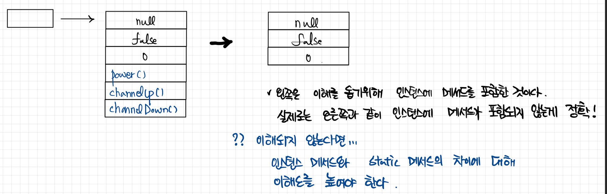     

**객체를 저장한다는 것은 바로 객체의 모든 인스턴스변수의 값을 저장한다는 것과 같은 의미이다.**   
어떤 객체를 저장하고자 한다면, 현재 객체의 모든 인스턴스변수의 값을 저장하기만 하면 된다. 그리고 저장했던 객체를 다시 생성하려면, 객체를 생성한 후에 
저장했던 값을 읽어서 생성한 객체의 인스턴스변수에 저장하면 되는 것이다.   

#### ObjectInputStream , ObjectOutputStream   
직렬화 (스트림에 객체를 출력) 에는 ObjectOutputStream 을 사용   
역직렬화 (스트림으로부터 객체를 입력) 에는 ObjectInputStream 을 사용   

ObjectInputStream, ObjectOutputStream 은 각각 InputStream 과 OutputStream 을 직접 상속받지만 기반스트림을 필요로 하는 보조스트림이다.   
-> 객체를 생성할 때 입출력(직렬화/역직렬화) 할 스트림을 지정해주어야 한다.   
```java
ObjectInputStream(InputStream in) 
ObjectOutputStream(OutputStream out)
```

파일에 객체를 저장(직렬화) 하고 싶다면?   
```java
FileOutputStream fos = new FileOutputStream("objectfile.ser");
ObjectOutputStream out = new ObjectOutputStream(fos);

out.writeObject(new UserInfo());
```

반대로 파일에 있는 객체를 역직렬화 하고 싶다면?   
```java
FileInputStream fis = new FileInputStream("objectfile.ser");
ObjectInputStream in = new ObjectInputStream(fis);

UserInfo userInfo = (UserInfo)in.readObject();
```

* ObjectInputStream, ObjectOutputStream 의 각 메서드와 의미는 별도 정리하지 않는다.   

#### 직렬화가 가능한 클래스 만들기 - Serializable, transient   
모든 객체가 직렬화/역직렬화가 가능한가?   
그렇지 않다. 직렬화/역직렬화가 가능한 클래스를 만들어줘야 한다.   

직렬화가 가능한 클래스를 만드는 방법은 직렬화 하고자 하는 클래스가    
"java.io.Serializable" 인터페이스를 구현하도록 하면 된다.   

일반적인 클래스   
```java
public class UserInfo {
    String name;
    String password;
    int age;
}
```

직렬화가 가능한 클래스로 구현   
```java 
public class UserInfo implements java.io.Serializable {
    String name;
    String password;
    int age;
}
```
* Serializable 인터페이스를 아무런 내용이 없는 빈 인터페이스지만, 직렬화를 고려하여 작성한 클래스인지를 판단하는 기준이 된다.   

#### v. 상속구조 - 1    
만약 구현하고 있는 클래스가 특정 클래스를 상속받는데,   
그 상속받고 있는 특정 크래스가 직렬화를 구현하였다면? 현재 내가 구현하고 있는 자식 클래스는 별도로 직렬화를 구현하지 않아도 자연스럽게 직렬화가 가능하다.   

```java
public class SuperUserInfo implements java.io.Serializable {
    String name;
    String password;
}

public class UserInfo extends SuperUserInfo {
    Integer age;
}
```
* UserInfo 의 부모 SuperUserInfo 가 직렬화를 구현하였음으로, UserInfo 또한 직렬화 가능하다.    

#### v. 상속구조 - 2    
위 상속구조 - 1 과는 반대로    
조상클래스가 Serializable 을 구현하지 않고 자식 클래스에서 구현했다면?   
* 조상클래스에 정의된 인스턴스 변수는 직렬화 대상에서 제외된다.   
```java 
public class SuperUserInfo {
    String name;
    String password;
}

public class UserInfo extends SuperUserInfo implements java.io.Serializable {
    Integer age;
}
```
* UserInfo 클래스가 직렬화되며 인스턴스 변수 age 만 직렬화 된다.   
* 부모클래스 SuperUserInfo 의 name, password 인스턴스 변수는 직렬화에서 제외된다.   

#### v. 타 객체가 포함된 경우   
Serializable 을 구현하고 있지만, 이 클래스 내부 인스턴스 변수가 Serializable 할 수 없는 객체를 참조하고 있는 경우 NotSerializableException 이 발생한다.   

```java 
public class UserInfo implements java.io.Serializable {
    String name;
    String password;
    int age;

    Object obj = new Object();
}
```
* Object obj 는 직렬화 할 수 없는 객체임으로, UserInfo 클래스를 직렬화 하게 되면 NotSerializableException 이 발생한다.   
* Object 는 모든 객체의 최고 조상이며, 이 Object는 Serializable 을 구현하지 않았다.   

#### 직렬화를 제외할 수 있다.   
transient 제어자를 붙여서 직렬화 대상에서 제외할 수 있다.    
* 제외시킨 후 역직렬화 하면 값은 null 이 된다.   
```java 
public class UserInfo implements java.io.Serializable {
    String name;
    transient String password;
    int age;

    transient Object obj = new Object();
}
```
```
짐을 차곡차곡 쌓는 것을 직렬화  
-> 이사해서 짐을 하나하나 푸는 것을 역직렬화
```


#### 직렬화 가능한 클래스의 버전관리   
* 직렬화된 객체를 역직렬화할 때는 직렬화 했을 때와 같은 클래스를 사용해야 한다.   
* 클래스 이름이 같아도 클래스의 내용이 변경됬다면 역직렬화는 실패하고 에러가 발생한다.   
위에서 만든 UserInfo 클래스에 인스턴스 변수를 하나 추가해보자.   
```java 
public class UserInfo implements Serializable {
    double weight;
    ...
}
```
몸무게 weight 변수를 추가하였다.   
위의 SerialEx2 예제인 역직렬화를 다시 실행시켜보자.   
```
java.io.InvalidClassException: me.herohe.javastudycode.week13.UserInfo; 
local class incompatible: stream classdesc serialVersionUID = 6546280052364076434, local class serialVersionUID = -3670788073303903862
...

```
직렬화 할 때와 역직렬화 할 때의 클래스의 버전이 다르다는 에러가 발생한다.   

객체가 직렬화될 때 클래스에 정의된 멤버들의 정보를 이용해서 serialVersionUID 라는 클래스의 버전을 자동생성해서 직렬화 내용에 포함된다.   

**그래서 역직렬화 할 때 클래스의 버전을 비교하고 직렬화할 때의 클래스의 버전과 일치하는지 비교할 수 있었고 에러가 발생한 것이다.**   
```java
public UserInfo implements Serializable {
    private static final long serialVersionUID = 1L;
    ...
}
```
**이렇게 클래스 내에 serialVersionUID 를 정의해주면, 클래스의 내용이 바뀌어도 클래스의 버전이 자동생성된 값으로 변경되지 않는다.**   

컴파일 후 다시 직렬화 -> 인스턴스변수 추가 -> 역직렬화를 진행하여도 에러없이 정상적으로 동작한다.   


### 버퍼(Buffer)    
NIO 에서는 데이터를 입출력하기 위해 항상 버퍼를 사용해야 한다.   
버퍼는 읽고 쓰기가 가능한 메모리 배열 이다.   
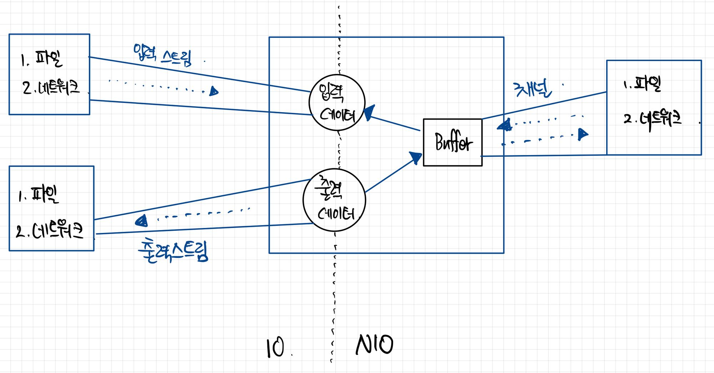     

#### Buffer 종류    
Buffer 는 저장되는 데이터 타입에 따라 분류될 수 있고,   
어떤 메모리를 사용하느냐에 따라 종류가 구분될 수 있다.   
* 다이렉트 (Direct)   
* 넌다이렉트 (NonDirect)   

#### 데이터 타입에 따른 버퍼   
저장되는 데이터 타입에 따라서 별도의 클래스로 제공된다.   
이 버퍼 클래스들은 Buffer 추상 클래스를 모두 상속하고 있다.   
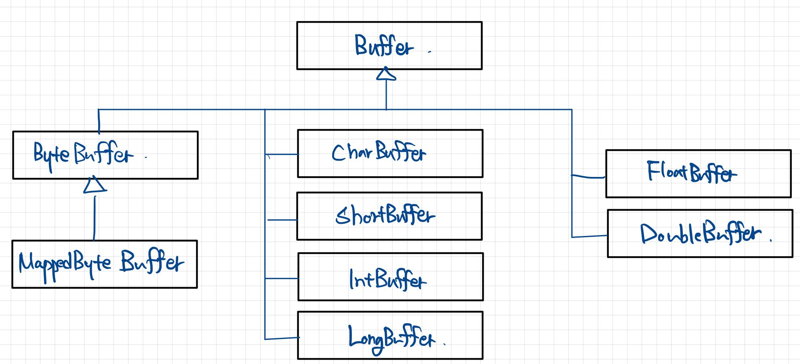     

#### 넌다이렉트와 다이렉트 버퍼   
버퍼가 사용하는 메모리 위치에 따라서 넌다이렉트(non-direct) 버퍼와 다이렉트(direct) 버퍼로 분류된다.   
**넌다이렉트 버퍼는 JVM이 관리하는 힙 메모리 공간을 이용하는 버퍼** 이고,    
**다이렉트 버퍼는 운영체제가 관리하는 메모리 공간을 이용하는 버퍼**이다.    

#### 버퍼종류   
|구분|넌다이렉트 버퍼|다이렉트 버퍼|
|-----|-----|-----|
|사용하는 메모리 공간|JVM의 힙 메모리|운영체제의 메모리|
|버퍼 생성 시간|버퍼 생성이 빠르다|버퍼 생성이 느리다|
|버퍼의 크기|작다|크다(큰 데이터 처리에 유리)|
|입출력 성능|낮다|높다(입출력이 빈번할 때 유리)|
개수 5   

넌다이렉트 버퍼는 JVM 힙 메모리를 사용하므로 생성 시간이 빠르지만,   
다이렉트 버퍼는 운영체제의 메모리를 할당받기 위해 운영체제의 네이티브(native) C함수를 호출해야 하고 여러가지 잡다한 처리를 해야하므로 상대적으로 생성이 느리다.   
그렇기 때문에 다이렉트 버퍼는 자주 생성하기보단 한 번 생성해놓고 재사용하는 것이 유리하다.   

넌다이렉트 버퍼는 JVM의 제한된 힙 메모리를 사용하므로 버퍼의 크기를 크게 잡을 수 없고,   
다이렉트 버퍼는 운영체제가 관리하는 메모리를 사용하므로 운영체제가 허용하는 범위 내에서 대용량 버퍼를 생성시킬 수 있다.   


#### 간단한 넌다이렉트와 다이렉트의 크기 비교    
allocate 와 allocateDirect 메서드를 이용해 넌다이렉트, 다이렉트 버퍼를 생성할 수 있따.   
파라미터로는 byte 의 capacity 를 정의할 수 있으며,   
컴퓨터 성능에 따라 OutOfMemoryError 가 발생할 수 있다.   
```java
package me.herohe.study.nio;

import java.nio.ByteBuffer;

public class App {
    public static void main(String[] args) {
        ByteBuffer directBuffer = ByteBuffer.allocateDirect(200*1024*1024);
        System.out.println("Created Direct Buffer - " + directBuffer.capacity());

        ByteBuffer nonDirectBuffer = ByteBuffer.allocate(200*1024*1024);
        System.out.println("Create Non-Direct Buffer - " + nonDirectBuffer.capacity());
    }
}
```
결과    
```java
"C:\Program Files\Java\jdk1.8.0_251\bin\java.exe" -agentlib:jdwp=transport=dt_shmem,address=javadebug,suspend=y,server=n -javaagent:C:\Users\ssh1224\.IntelliJIdea2019.3\system\captureAgent\debugger-agent.jar -Dfile.encoding=UTF-8 -classpath "C:\Program Files\Java\jdk1.8.0_251\jre\lib\charsets.jar;C:\Program Files\Java\jdk1.8.0_251\jre\lib\deploy.jar;C:\Program Files\Java\jdk1.8.0_251\jre\lib\ext\access-bridge-64.jar;C:\Program Files\Java\jdk1.8.0_251\jre\lib\ext\cldrdata.jar;C:\Program Files\Java\jdk1.8.0_251\jre\lib\ext\dnsns.jar;C:\Program Files\Java\jdk1.8.0_251\jre\lib\ext\jaccess.jar;C:\Program Files\Java\jdk1.8.0_251\jre\lib\ext\jfxrt.jar;C:\Program Files\Java\jdk1.8.0_251\jre\lib\ext\localedata.jar;C:\Program Files\Java\jdk1.8.0_251\jre\lib\ext\nashorn.jar;C:\Program Files\Java\jdk1.8.0_251\jre\lib\ext\sunec.jar;C:\Program Files\Java\jdk1.8.0_251\jre\lib\ext\sunjce_provider.jar;C:\Program Files\Java\jdk1.8.0_251\jre\lib\ext\sunmscapi.jar;C:\Program Files\Java\jdk1.8.0_251\jre\lib\ext\sunpkcs11.jar;C:\Program Files\Java\jdk1.8.0_251\jre\lib\ext\zipfs.jar;C:\Program Files\Java\jdk1.8.0_251\jre\lib\javaws.jar;C:\Program Files\Java\jdk1.8.0_251\jre\lib\jce.jar;C:\Program Files\Java\jdk1.8.0_251\jre\lib\jfr.jar;C:\Program Files\Java\jdk1.8.0_251\jre\lib\jfxswt.jar;C:\Program Files\Java\jdk1.8.0_251\jre\lib\jsse.jar;C:\Program Files\Java\jdk1.8.0_251\jre\lib\management-agent.jar;C:\Program Files\Java\jdk1.8.0_251\jre\lib\plugin.jar;C:\Program Files\Java\jdk1.8.0_251\jre\lib\resources.jar;C:\Program Files\Java\jdk1.8.0_251\jre\lib\rt.jar;D:\dev\workspace\java-study\out\production\java-study;D:\dev\workspace\java-study\lib\archunit-0.12.0.jar;D:\dev\workspace\java-study\lib\slf4j-api-1.7.25.jar;D:\dev\workspace\java-study\lib\junit-4.12.jar;D:\dev\workspace\java-study\lib\hamcrest-core-1.3.jar;C:\Program Files\JetBrains\IntelliJ IDEA 2019.3.5\lib\idea_rt.jar" me.herohe.study.nio.App
Connected to the target VM, address: 'javadebug', transport: 'shared memory'
Created Direct Buffer - 209715200
Created Non-Direct Buffer - 209715200
Disconnected from the target VM, address: 'javadebug', transport: 'shared memory'
Picked up JAVA_TOOL_OPTIONS: -Djava.net.preferIPv4Stack=true

Process finished with exit code 0
```


#### 간단한 넌다이렉트와 다이렉트 버퍼 성능 비교   
* 동일한 이미지 파일을 100번 복사하는데 소요되는 시간 측정 결과   
```java
pakcage me.herohe.study.nio;

import java.io.IOException;
import java.nio.ByteBuffer;
import java.nio.channels.FileChannel;
import java.nio.file.Files;
import java.nio.file.Path;
import java.nio.file.Paths;
import java.nio.file.StandardOpenOption;
import java.util.EnumSet;

public class App {
    public static void main(String[] args) throws IOException {
        Path from = Paths.get("src/me/herohe/study/nio/t1.png");
        Path to1 = Paths.get("src/me/herohe/study/nio/t2.png");
        Path to2 = Paths.get("src/me/herohe/study/nio/t3.png");

        long size = Files.size(from);

        System.out.println("size : " + size);

        FileChannel fileChannel_from = FileChannel.open(from);
        FileChannel fileChannel_to1 = FileChannel.open(to1, EnumSet.of(StandardOpenOption.CREATE, StandardOpenOption.WRITE));
        FileChannel fileChannel_to2 = FileChannel.open(to2, EnumSet.of(StandardOpenOption.CREATE, StandardOpenOption.WRITE));

        ByteBuffer nonDirectBuffer = ByteBuffer.allocate((int)size);
        ByteBuffer directBuffer = ByteBuffer.allocateDirect((int)size);

        long start, end;

        start = System.nanoTime();
        for(int i=0 ; i< 100; i++) {
            fileChannel_from.read(nonDirectBuffer);
            nonDirectBuffer.flip();

            fileChannel_to1.write(nonDirectBuffer);
            nonDirectBuffer.clear();
        }
        end = System.nanoTime();

        System.out.println("넌다이렉트 :\t" + (end - start) + "ns");

        fileChannel_from.position(0);

        start = System.nanoTime();
        for(int i=0 ; i<100 ; i++) {
            fileChannel_from.read(directBuffer);
            directBuffer.flip();

            fileChannel_to2.write(directBuffer);
            directBuffer.clear();
        }
        end = System.nanoTime();

        System.out.println("다이렉트 :\t" + (end - start) + "ns");

        fileChannel_from.close();
        fileChannel_to1.close();
        fileChannel_to2.close();
    }
}
```
결과   
```java
"C:\Program Files\Java\jdk1.8.0_251\bin\java.exe" -agentlib:jdwp=transport=dt_shmem,address=javadebug,suspend=y,server=n -javaagent:C:\Users\ssh1224\.IntelliJIdea2019.3\system\captureAgent\debugger-agent.jar -Dfile.encoding=UTF-8 -classpath "C:\Program Files\Java\jdk1.8.0_251\jre\lib\charsets.jar;C:\Program Files\Java\jdk1.8.0_251\jre\lib\deploy.jar;C:\Program Files\Java\jdk1.8.0_251\jre\lib\ext\access-bridge-64.jar;C:\Program Files\Java\jdk1.8.0_251\jre\lib\ext\cldrdata.jar;C:\Program Files\Java\jdk1.8.0_251\jre\lib\ext\dnsns.jar;C:\Program Files\Java\jdk1.8.0_251\jre\lib\ext\jaccess.jar;C:\Program Files\Java\jdk1.8.0_251\jre\lib\ext\jfxrt.jar;C:\Program Files\Java\jdk1.8.0_251\jre\lib\ext\localedata.jar;C:\Program Files\Java\jdk1.8.0_251\jre\lib\ext\nashorn.jar;C:\Program Files\Java\jdk1.8.0_251\jre\lib\ext\sunec.jar;C:\Program Files\Java\jdk1.8.0_251\jre\lib\ext\sunjce_provider.jar;C:\Program Files\Java\jdk1.8.0_251\jre\lib\ext\sunmscapi.jar;C:\Program Files\Java\jdk1.8.0_251\jre\lib\ext\sunpkcs11.jar;C:\Program Files\Java\jdk1.8.0_251\jre\lib\ext\zipfs.jar;C:\Program Files\Java\jdk1.8.0_251\jre\lib\javaws.jar;C:\Program Files\Java\jdk1.8.0_251\jre\lib\jce.jar;C:\Program Files\Java\jdk1.8.0_251\jre\lib\jfr.jar;C:\Program Files\Java\jdk1.8.0_251\jre\lib\jfxswt.jar;C:\Program Files\Java\jdk1.8.0_251\jre\lib\jsse.jar;C:\Program Files\Java\jdk1.8.0_251\jre\lib\management-agent.jar;C:\Program Files\Java\jdk1.8.0_251\jre\lib\plugin.jar;C:\Program Files\Java\jdk1.8.0_251\jre\lib\resources.jar;C:\Program Files\Java\jdk1.8.0_251\jre\lib\rt.jar;D:\dev\workspace\java-study\out\production\java-study;D:\dev\workspace\java-study\lib\archunit-0.12.0.jar;D:\dev\workspace\java-study\lib\slf4j-api-1.7.25.jar;D:\dev\workspace\java-study\lib\junit-4.12.jar;D:\dev\workspace\java-study\lib\hamcrest-core-1.3.jar;C:\Program Files\JetBrains\IntelliJ IDEA 2019.3.5\lib\idea_rt.jar" me.herohe.study.nio.App
Connected to the target VM, address: 'javadebug', transport: 'shared memory'
size : 225237
넌다이렉트:	1690200ns
다이렉트:	537500ns
Disconnected from the target VM, address: 'javadebug', transport: 'shared memory'
Picked up JAVA_TOOL_OPTIONS: -Djava.net.preferIPv4Stack=true

Process finished with exit code 0
```


### 파일 입출력(IO)   

#### File 클래스   
IO 패키지(java.io)에서 제공하는 File 클래스는 파일의 크기, 속성, 이름 등의 정보를 얻어내는 기능과 파일의 생성 및 삭제 기능을 제공한다.   
또한, 디렉토리를 생성하고 디렉토리에 존재하는 파일 리스트를 얻어내는 기능이 존재한다.   
그러나,    
**파일의 데이터를 읽고 쓰는 기능은 지원하지 않는다.**   
**파일의 입출력은 스트림을 사용해야 한다.**   

특정 위치에 있는 파일을 File 객체로 생성하는 방법   
```java  
File file = new File("C:/Temp/file.txt");
File file = new File("C:\\Temp\\file.txt");
```

```
디렉토리를 구분하는 구분자는 OS마다 다르다.
윈도우 에서는 "\" 또는 "/" 을 사용할 수 있고, 
유닉스와 리눅스에서는 "/"를 사용한다.  

"\"을 사용한다면 이스케이프 문자(\\) 로 기술해야 한다.
```


**주의**   
File 객체를 생성했다고 해서 파일이나 디렉토리가 생성되는 것은 아니다.   
생성자 매개값으로 주어진 경로가 유효하지 않더라도 컴파일 에러나 예외가 발생하지 앟는다.   
* 생성한 객체를 통해 실제로 파일이나 디렉토리가 있는지 확인하기 위해 exist() 메서드를 호출하여 확인한다.   
```java 
boolean isExist = file.exist();
```
exist() 메서드의 결과가 false 인 경우 -> 파일 또는 디렉토리를 생성할 수 있다.   
#### exist() 메서드 false 일때,   
|리턴타입|메서드|설명|
|------|------|------|
|boolean|createNewFile()|새로운 파일을 생성|
|boolean|mkdir()|새로운 디렉토리를 생성|
|boolean|mkdirs()|경로상에 없는 모든 디렉토리를 생성|
|boolean|delete()|파일 또는 디렉토리 삭제|
개수 4    

exit() 메서드의 결과가 true 인 경우 -> 정보를 얻어낼 수 있다.   
#### exist() 메서드 true 일때,   
|리턴타입|메서드|설명|
|----------|----------|----------|
|boolean|canExecute()|실행할 수 있는 파일인지 여부|
|boolean|canRead()|읽을 수 있는 파일인지 여부|
|boolean|canWrite()|수정 및 저장할 수 있는 파일인지 여부|
|String|getName()|파일의 이름을 리턴|
|String|getParent()|부모 디렉토리를 리턴|
|File|getParentFile()|부모 디렉토리를 File 객체로 생성 후 리턴|
|String|getPath()|전체 경로를 리턴|
|boolean|isDirectory()|디렉토리인지 여부|
|boolean|isFile()|파일인지 여부|
|boolean|isHidden()|숨김 파일인지 여부|
|long|lastModified()|마지막 수정 날짜 및 시간을 리턴|
|long|length()|파일의 크기를 리턴|
|String[]|list()|디렉토리에 포함된 파일 및 서브 디렉토리 목록 전부를 String 배열로 리턴|
|String[]|list(FilenameFilter fileter)|디렉토리에 포함된 파일 및 서브디렉토리 목록 중에 FilenameFilter에 맞는 것만 String 배열로 리턴|
|File[]|listFiles()|디렉토리에 포함된 파일 및 서브 디렉토리 목록 전부를 File 배열로 리턴|
|File[]|listFiles(FilenameFilter filter)|디렉토리에 포함된 파일 및 서브디렉토리 목록 중에 FilenameFilter에 맞는 것만 File 배열로 리턴|
개수 16   

간단한 File 클래스 예제   
```java
package me.herohe.study.file;

import java.io.File;
import java.io.IOException;
import java.net.URI;
import java.net.URISyntaxException;
import java.text.SimpleDateFormat;
import java.util.Date;

public class App {
    public static void main(String[] args) throws URISyntaxException, IOException {
        System.out.println("hi");

        File dir = new File("D:/dev/workspace/java-study/src/me/herohe/study/file/dir");
        File file1 = new File("D:/dev/workspace/java-study/src/me/herohe/study/file/file1.txt");
        File file2 = new File("D:/dev/workspace/java-study/src/me/herohe/study/file/file2.txt");
        File file3 = new File(new URI("file:///D:/dev/workspace/java-study/src/me/herohe/study/file/file3.txt"));

        if (!dir.exists()) {dir.mkdirs();}
        if (!file1.exists()) {file1.createNewFile();}
        if (!file2.exists()) {file2.createNewFile();}
        if (!file3.exists()) {file3.createNewFile();}

        File fileDir = new File("D:/dev/workspace/java-study/src/me/herohe/study/file");
        SimpleDateFormat sdf = new SimpleDateFormat("yyyy-MM-dd a HH:mm");
        File[] contents = fileDir.listFiles();

        System.out.println("날짜           시간       형태      크기      이름");
        System.out.println("----------------------------------------------------------------");
        for (File file : contents) {
            System.out.print(sdf.format(new Date(file.lastModified())));
            if(file.isDirectory()){
                System.out.print("\t<DIR>\t\t\t" + file.getName());
            }else{
                System.out.print("\t\t\t" + file.length() + "\t" + file.getName());
            }
            System.out.println();
        }

    }
}
```
결과    
```java
 '"C:\Program Files\Java\jdk1.8.0_251\bin\java.exe" -agentlib:jdwp=transport=dt_shmem,address=javadebug,suspend=y,server=n -javaagent:C:\Users\ssh1224\.IntelliJIdea2019.3\system\captureAgent\debugger-agent.jar -Dfile.encoding=UTF-8 -classpath "C:\Program Files\Java\jdk1.8.0_251\jre\lib\charsets.jar;C:\Program Files\Java\jdk1.8.0_251\jre\lib\deploy.jar;C:\Program Files\Java\jdk1.8.0_251\jre\lib\ext\access-bridge-64.jar;C:\Program Files\Java\jdk1.8.0_251\jre\lib\ext\cldrdata.jar;C:\Program Files\Java\jdk1.8.0_251\jre\lib\ext\dnsns.jar;C:\Program Files\Java\jdk1.8.0_251\jre\lib\ext\jaccess.jar;C:\Program Files\Java\jdk1.8.0_251\jre\lib\ext\jfxrt.jar;C:\Program Files\Java\jdk1.8.0_251\jre\lib\ext\localedata.jar;C:\Program Files\Java\jdk1.8.0_251\jre\lib\ext\nashorn.jar;C:\Program Files\Java\jdk1.8.0_251\jre\lib\ext\sunec.jar;C:\Program Files\Java\jdk1.8.0_251\jre\lib\ext\sunjce_provider.jar;C:\Program Files\Java\jdk1.8.0_251\jre\lib\ext\sunmscapi.jar;C:\Program Files\Java\jdk1.8.0_251\jre\lib\ext\sunpkcs11.jar;C:\Program Files\Java\jdk1.8.0_251\jre\lib\ext\zipfs.jar;C:\Program Files\Java\jdk1.8.0_251\jre\lib\javaws.jar;C:\Program Files\Java\jdk1.8.0_251\jre\lib\jce.jar;C:\Program Files\Java\jdk1.8.0_251\jre\lib\jfr.jar;C:\Program Files\Java\jdk1.8.0_251\jre\lib\jfxswt.jar;C:\Program Files\Java\jdk1.8.0_251\jre\lib\jsse.jar;C:\Program Files\Java\jdk1.8.0_251\jre\lib\management-agent.jar;C:\Program Files\Java\jdk1.8.0_251\jre\lib\plugin.jar;C:\Program Files\Java\jdk1.8.0_251\jre\lib\resources.jar;C:\Program Files\Java\jdk1.8.0_251\jre\lib\rt.jar;D:\dev\workspace\java-study\out\production\java-study;D:\dev\workspace\java-study\lib\archunit-0.12.0.jar;D:\dev\workspace\java-study\lib\slf4j-api-1.7.25.jar;D:\dev\workspace\java-study\lib\junit-4.12.jar;D:\dev\workspace\java-study\lib\hamcrest-core-1.3.jar;C:\Program Files\JetBrains\IntelliJ IDEA 2019.3.5\lib\idea_rt.jar" me.herohe.study.file.App
Connected to the target VM, address: 'javadebug', transport: 'shared memory'
hi
날짜           시간       형태      크기      이름
----------------------------------------------------------------
2021-02-17 오전 07:44			1771	App.java
2021-02-17 오전 07:41	<DIR>			dir
2021-02-17 오전 07:41			0	file1.txt
2021-02-17 오전 07:41			0	file2.txt
2021-02-17 오전 07:41			0	file3.txt
Disconnected from the target VM, address: 'javadebug', transport: 'shared memory'
Picked up JAVA_TOOL_OPTIONS: -Djava.net.preferIPv4Stack=true

Process finished with exit code 0!
```
```
File 클래스는 File 자체의 정보를 핸들링 하는 것이지  
File의 데이터를 입출력 하지 않는다.  
-> File 데이터의 입출력은 Stream이 담당한다. (FileInputStream / FileOutputStream)
```

#### FileInputStream   
파일로부터 바이트 단위로 읽어들일 때 사용하는 바이트 기반 입력 스트림이다.   
바이트단위로 읽기 때문에 그림,오디오,비디오,텍스트 파일 등 모든 종류의 파일을 읽을 수 있다.   
```java
// 첫번째 방법 
FileInputStream fis = new FileInputStream("C:/Temp/image.gif");

// 두번째 방법 
File file = new File("C:/Temp/image.gif");
FileInputStream fis = new FileInputStream(file);
```

FileInputStream 객체가 생성될 때 파일과 직접 연결이 되는데,    
만약 파일이 존재하지 않으면 FileNotFoundException 이 발생하게 된다.   
-> 해당 예외에 대한 처리를 해야 한다.   

FileInputStream 은 InputStream 의 하위 클래스이기 때문에 사용 방법이 InputStream 과 동일하다.   

작성하는 App.java 파일을 FileInputStream 을 이용해 읽는 예제   
* 리소스 사용에 대한 예외처리를 위해 try-resource-catch 문을 활용하였다.   
```java 
package me.herohe.study.file;

import java.io.FileInputStream;

public class App {
    public static void main(String[] args) {
        System.out.println("hi");

        try(FileInputStream fis = new FileInputStream("D:/dev/workspace/java-study/src/me/herohe/study/file/App.java")) {
            int data;
            while((data = fis.read()) != -1) {
                System.out.write(data);
            }
        }catch(Exception e) {
            e.printStackTrace();
        }
    }
}
```
결과    
```java
"C:\Program Files\Java\jdk1.8.0_251\bin\java.exe" -agentlib:jdwp=transport=dt_shmem,address=javadebug,suspend=y,server=n -javaagent:C:\Users\ssh1224\.IntelliJIdea2019.3\system\captureAgent\debugger-agent.jar -Dfile.encoding=UTF-8 -classpath "C:\Program Files\Java\jdk1.8.0_251\jre\lib\charsets.jar;C:\Program Files\Java\jdk1.8.0_251\jre\lib\deploy.jar;C:\Program Files\Java\jdk1.8.0_251\jre\lib\ext\access-bridge-64.jar;C:\Program Files\Java\jdk1.8.0_251\jre\lib\ext\cldrdata.jar;C:\Program Files\Java\jdk1.8.0_251\jre\lib\ext\dnsns.jar;C:\Program Files\Java\jdk1.8.0_251\jre\lib\ext\jaccess.jar;C:\Program Files\Java\jdk1.8.0_251\jre\lib\ext\jfxrt.jar;C:\Program Files\Java\jdk1.8.0_251\jre\lib\ext\localedata.jar;C:\Program Files\Java\jdk1.8.0_251\jre\lib\ext\nashorn.jar;C:\Program Files\Java\jdk1.8.0_251\jre\lib\ext\sunec.jar;C:\Program Files\Java\jdk1.8.0_251\jre\lib\ext\sunjce_provider.jar;C:\Program Files\Java\jdk1.8.0_251\jre\lib\ext\sunmscapi.jar;C:\Program Files\Java\jdk1.8.0_251\jre\lib\ext\sunpkcs11.jar;C:\Program Files\Java\jdk1.8.0_251\jre\lib\ext\zipfs.jar;C:\Program Files\Java\jdk1.8.0_251\jre\lib\javaws.jar;C:\Program Files\Java\jdk1.8.0_251\jre\lib\jce.jar;C:\Program Files\Java\jdk1.8.0_251\jre\lib\jfr.jar;C:\Program Files\Java\jdk1.8.0_251\jre\lib\jfxswt.jar;C:\Program Files\Java\jdk1.8.0_251\jre\lib\jsse.jar;C:\Program Files\Java\jdk1.8.0_251\jre\lib\management-agent.jar;C:\Program Files\Java\jdk1.8.0_251\jre\lib\plugin.jar;C:\Program Files\Java\jdk1.8.0_251\jre\lib\resources.jar;C:\Program Files\Java\jdk1.8.0_251\jre\lib\rt.jar;D:\dev\workspace\java-study\out\production\java-study;D:\dev\workspace\java-study\lib\archunit-0.12.0.jar;D:\dev\workspace\java-study\lib\slf4j-api-1.7.25.jar;D:\dev\workspace\java-study\lib\junit-4.12.jar;D:\dev\workspace\java-study\lib\hamcrest-core-1.3.jar;C:\Program Files\JetBrains\IntelliJ IDEA 2019.3.5\lib\idea_rt.jar" me.herohe.study.file.App
Connected to the target VM, address: 'javadebug', transport: 'shared memory'
hi
package me.herohe.study.file;

import java.io.FileInputStream;
import java.io.IOException;
import java.net.URISyntaxException;

public class App {
    public static void main(String[] args) throws URISyntaxException, IOException {
        System.out.println("hi");

        try(FileInputStream fis = new FileInputStream("D:/dev/workspace/java-study/src/me/herohe/study/file/App.java")){
            int data;
            while((data = fis.read()) != -1){
                System.out.write(data);
            }
        }catch(Exception e){
            e.printStackTrace();
        }
    }
}

Disconnected from the target VM, address: 'javadebug', transport: 'shared memory'
Picked up JAVA_TOOL_OPTIONS: -Djava.net.preferIPv4Stack=true

Process finished with exit code 0
```

#### FileOutputStream    
바이트 단위로 데이터를 파일에 저장할 때 사용하는 바이트 기반 출력 스트림이다.    
바이트 단위로 저장하기 때문에 그림,오디오,비디오,텍스트 등 모든 종류의 데이터를 파일로 저장할 수 있다.    
```java
// 첫번째 방법  
FileOutputStream fos = new FileOutputStream("C:/Temp/image.gif");

// 두번째 방법  
File file = new File("C:/Temp/image.gif");
FileOutputStream fos = new FileOutputStream(file);
```

주의점    
파일이 이미 존재할 경우, 데이터를 출력하면 파일을 덮어쓰게 되므로, 기존의 파일 내용은 사라지게 된다.   

기존의 파일 내용 끝에 데이터를 추가하고자 하는 경우 FileOutputStream 생성자의 두번째 매개 값을 "true" 로 생성한다.   
```java
FileOutputStream fos = new FileOutputStream("C:/Temp/image.gif", true);

FileOutputStream fos = new FileOutputStream(file, true);
```

```
write() 메서드를 호출한 이후 "flust()" 메서드로 출력 버퍼에 잔류하는 데이터를 완전히 출력하도록 하며, 모든 작업이 끝난 후 close() 로 파일을 닫아줘야 한다.

flush() 를 해주지 않고 close()를 하지 않음으로써 원하는 결과를 얻어내지 못해 이상하다고 생각하는 케이스가 있을 수 있다.   
이것은 사용법과 개념의 숙지가 다소 부족한 거시잊, 애플리케이션이 이상한게 아니다. 
```


파일을 복사하는 예제   
```java
package com.ssonsh.study.file;

import java.io.FileInputStream;
import java.io.FileOutputStream;

public class App {
    public static void main(String[] args) {
        System.out.println("hi");

        String originFileName = "D:/dev/workspace/java-study/src/com/ssonsh/study/file/App.java";
        String targetFileName = "D:/dev/workspace/java-study/src/com/ssonsh/study/file/App_Copy.java";

        try (FileInputStream fis = new FileInputStream(originFileName);
             FileOutputStream fos = new FileOutputStream(targetFileName)) {

            int readByteNum;
            byte[] readBytes = new byte[100];
            while((readByteNum = fis.read(readBytes)) != -1){
                fos.write(readBytes, 0, readByteNum);
            }

            fos.flush();

            System.out.println("복사가 완료되었습니다.");
        }
        catch (Exception e) {
            e.printStackTrace();
        }
    }
}
```
결과    
```java
"C:\Program Files\Java\jdk1.8.0_251\bin\java.exe" -agentlib:jdwp=transport=dt_shmem,address=javadebug,suspend=y,server=n -javaagent:C:\Users\ssh1224\.IntelliJIdea2019.3\system\captureAgent\debugger-agent.jar -Dfile.encoding=UTF-8 -classpath "C:\Program Files\Java\jdk1.8.0_251\jre\lib\charsets.jar;C:\Program Files\Java\jdk1.8.0_251\jre\lib\deploy.jar;C:\Program Files\Java\jdk1.8.0_251\jre\lib\ext\access-bridge-64.jar;C:\Program Files\Java\jdk1.8.0_251\jre\lib\ext\cldrdata.jar;C:\Program Files\Java\jdk1.8.0_251\jre\lib\ext\dnsns.jar;C:\Program Files\Java\jdk1.8.0_251\jre\lib\ext\jaccess.jar;C:\Program Files\Java\jdk1.8.0_251\jre\lib\ext\jfxrt.jar;C:\Program Files\Java\jdk1.8.0_251\jre\lib\ext\localedata.jar;C:\Program Files\Java\jdk1.8.0_251\jre\lib\ext\nashorn.jar;C:\Program Files\Java\jdk1.8.0_251\jre\lib\ext\sunec.jar;C:\Program Files\Java\jdk1.8.0_251\jre\lib\ext\sunjce_provider.jar;C:\Program Files\Java\jdk1.8.0_251\jre\lib\ext\sunmscapi.jar;C:\Program Files\Java\jdk1.8.0_251\jre\lib\ext\sunpkcs11.jar;C:\Program Files\Java\jdk1.8.0_251\jre\lib\ext\zipfs.jar;C:\Program Files\Java\jdk1.8.0_251\jre\lib\javaws.jar;C:\Program Files\Java\jdk1.8.0_251\jre\lib\jce.jar;C:\Program Files\Java\jdk1.8.0_251\jre\lib\jfr.jar;C:\Program Files\Java\jdk1.8.0_251\jre\lib\jfxswt.jar;C:\Program Files\Java\jdk1.8.0_251\jre\lib\jsse.jar;C:\Program Files\Java\jdk1.8.0_251\jre\lib\management-agent.jar;C:\Program Files\Java\jdk1.8.0_251\jre\lib\plugin.jar;C:\Program Files\Java\jdk1.8.0_251\jre\lib\resources.jar;C:\Program Files\Java\jdk1.8.0_251\jre\lib\rt.jar;D:\dev\workspace\java-study\out\production\java-study;D:\dev\workspace\java-study\lib\archunit-0.12.0.jar;D:\dev\workspace\java-study\lib\slf4j-api-1.7.25.jar;D:\dev\workspace\java-study\lib\junit-4.12.jar;D:\dev\workspace\java-study\lib\hamcrest-core-1.3.jar;C:\Program Files\JetBrains\IntelliJ IDEA 2019.3.5\lib\idea_rt.jar" com.ssonsh.study.file.App
Connected to the target VM, address: 'javadebug', transport: 'shared memory'
hi
복사가 완료되었습니다.
Disconnected from the target VM, address: 'javadebug', transport: 'shared memory'
Picked up JAVA_TOOL_OPTIONS: -Djava.net.preferIPv4Stack=true

Process finished with exit code 0
```
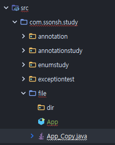    

#### FileReader   
텍스트 파일을 프로그램으로 읽어들일 때 사용하는 문자 기반 스트림이다.   
**문자 단위로 읽기 때문에 텍스트가 아닌 그림, 오디오, 비디오 등의 파일은 읽을 수 없다.**   
```java 
// 첫번째 방법   
FileReader fr = new FileReader("C:/Temp/file.txt");

// 두번째 방법  
File file = new File("C:/Temp/file.txt");
FileReader fr = new FileReader(file);
```
FileReader 객체가 생성될 때 파일과 직접 연결이 되는데,   
만약 파일이 존재하지 않으면 FileNotFoundException 읇 발생시키므로 적절한 예외처리를 해야 한다.   

FileReader 는 Reader 의 하위 크래스이기 때문에 사용 방법이 Reader 와 같다.    

작성중인 App.java 파일을 읽어서 출력하기.   
```java
package com.ssonsh.study.file;

import java.io.FileReader;

public class App {
    public static void main(String[] args) {
        System.out.println("hi");

        try (FileReader fr = new FileReader("D:/dev/workspace/java-study/src/com/ssonsh/study/file/App.java")) {

            int readCharNo;
            char[] cbuf = new char[100];

            while ((readCharNo = fr.read(cbuf)) != -1) {
                String data = new String(cbuf, 0, readCharNo);
                System.out.print(data);
            }

        }
        catch (Exception e) {
            e.printStackTrace();
        }
    }
}
```
결과    
```java
"C:\Program Files\Java\jdk1.8.0_251\bin\java.exe" -agentlib:jdwp=transport=dt_shmem,address=javadebug,suspend=y,server=n -javaagent:C:\Users\ssh1224\.IntelliJIdea2019.3\system\captureAgent\debugger-agent.jar -Dfile.encoding=UTF-8 -classpath "C:\Program Files\Java\jdk1.8.0_251\jre\lib\charsets.jar;C:\Program Files\Java\jdk1.8.0_251\jre\lib\deploy.jar;C:\Program Files\Java\jdk1.8.0_251\jre\lib\ext\access-bridge-64.jar;C:\Program Files\Java\jdk1.8.0_251\jre\lib\ext\cldrdata.jar;C:\Program Files\Java\jdk1.8.0_251\jre\lib\ext\dnsns.jar;C:\Program Files\Java\jdk1.8.0_251\jre\lib\ext\jaccess.jar;C:\Program Files\Java\jdk1.8.0_251\jre\lib\ext\jfxrt.jar;C:\Program Files\Java\jdk1.8.0_251\jre\lib\ext\localedata.jar;C:\Program Files\Java\jdk1.8.0_251\jre\lib\ext\nashorn.jar;C:\Program Files\Java\jdk1.8.0_251\jre\lib\ext\sunec.jar;C:\Program Files\Java\jdk1.8.0_251\jre\lib\ext\sunjce_provider.jar;C:\Program Files\Java\jdk1.8.0_251\jre\lib\ext\sunmscapi.jar;C:\Program Files\Java\jdk1.8.0_251\jre\lib\ext\sunpkcs11.jar;C:\Program Files\Java\jdk1.8.0_251\jre\lib\ext\zipfs.jar;C:\Program Files\Java\jdk1.8.0_251\jre\lib\javaws.jar;C:\Program Files\Java\jdk1.8.0_251\jre\lib\jce.jar;C:\Program Files\Java\jdk1.8.0_251\jre\lib\jfr.jar;C:\Program Files\Java\jdk1.8.0_251\jre\lib\jfxswt.jar;C:\Program Files\Java\jdk1.8.0_251\jre\lib\jsse.jar;C:\Program Files\Java\jdk1.8.0_251\jre\lib\management-agent.jar;C:\Program Files\Java\jdk1.8.0_251\jre\lib\plugin.jar;C:\Program Files\Java\jdk1.8.0_251\jre\lib\resources.jar;C:\Program Files\Java\jdk1.8.0_251\jre\lib\rt.jar;D:\dev\workspace\java-study\out\production\java-study;D:\dev\workspace\java-study\lib\archunit-0.12.0.jar;D:\dev\workspace\java-study\lib\slf4j-api-1.7.25.jar;D:\dev\workspace\java-study\lib\junit-4.12.jar;D:\dev\workspace\java-study\lib\hamcrest-core-1.3.jar;C:\Program Files\JetBrains\IntelliJ IDEA 2019.3.5\lib\idea_rt.jar" com.ssonsh.study.file.App
Connected to the target VM, address: 'javadebug', transport: 'shared memory'
hi
package com.ssonsh.study.file;

import java.io.FileReader;

public class App {
    public static void main(String[] args) {
        System.out.println("hi");

        try (FileReader fr = new FileReader("D:/dev/workspace/java-study/src/com/ssonsh/study/file/App.java")) {

            int readCharNo;
            char[] cbuf = new char[100];

            while ((readCharNo = fr.read(cbuf)) != -1) {
                String data = new String(cbuf, 0, readCharNo);
                System.out.print(data);
            }

        }
        catch (Exception e) {
            e.printStackTrace();
        }
    }
}

Disconnected from the target VM, address: 'javadebug', transport: 'shared memory'
Picked up JAVA_TOOL_OPTIONS: -Djava.net.preferIPv4Stack=true

Process finished with exit code 0
```

#### FileWriter   
텍스트 데이터를 파일에 저장할 때 사용하는 문자 기반 스트림이다.   
문자 단위로 저장하기 때문에 텍스트가 아닌 데이터는 파일로 저장할 수 없다.   
```java
// 첫번째 방법
FileWriter fw = new FileWriter("C:/Temp/file.txt");

// 두번째 방법
File file = new File("C:/Temp/file.txt");
FileWriter fw = new FileWriter(file);
```

FileWriter 를 생성하면 지정된 파일이 이미 존재할 경우 그 파일을 덮어쓰게 되므로, 기존의 파일 내용이 사라지게 된다.   
-> 기존파일 내용 끝에 추가하고자 한다면 FielWriter 생성 시 두번째 매개 값으로 true 를 전달   
```java
FileWriter fw = new FileWriter("C:/Temp/file.txt", true);
FileWriter fw = new FileWriter(file, true);
```

문자열을 파일에 저장하는 예    
```java
package com.ssonsh.study.file;

import java.io.FileWriter;

public class App {
    public static void main(String[] args) {
        System.out.println("hi");

        try (FileWriter fw = new FileWriter("D:/dev/workspace/java-study/src/com/ssonsh/study/file/file_writer_test.txt")) {

            fw.write("FileWriter는 한글로된 " + "\r\n");
            fw.write("문자열을 바로 출력할 수 잆다." + "\r\n");
            fw.write("show me the money");

            fw.flush();

            System.out.println("파일에 저장되었습니다.");

        }
        catch (Exception e) {
            e.printStackTrace();
        }
    }
}
```
결과 
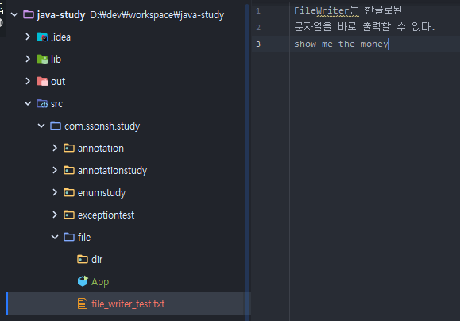    

```
\r\n 은 
캐리지 리턴(\r)과 라인피드(\n) 로 Enter 키와 동일한 역할을 한다.
-> 행 변환
```

### 파일 입출력 (NIO)    

#### 파일 채널   
java.nio.channels.FileChannel 을 이용하면 파일 읽기와 쓰기를 할 수 있다.   
FileChannel 은 동기화 처리가 되어 있기 때문에 멀티 스레드 환경에서도 안전하다.   
(thread-safe)   

    

#### FileChannel 생성과 닫기   
FileChannel 은 정적 메서드인 open() 을 호출해서 얻을 수 있지만,   
IO 의 FileInputStream , FileOutputStream  의 getChannel() 메서드를 호출해서 얻을 수도 있다.   
```java
FileChannel filechannel = FileChannel.open(Path path, OpenOption... options);
```
* Path 매개값은 열거나 생성하고자 하는 파일의 경로를 Path 객체로 생성해서 지정한다.   
* OpenOption 매개값은 열기 옵션값이며 StandardOpenOption 의 상수를 나열한다.   

#### StandardOpenOption   

|열거 상수|설명|
|------|----------|
|READ|읽기용 파일로 연다.|
|WRITE|쓰기용 파일로 연다.|
|CREATE|파일이 없다면 새 파일을 생성한다.|
|CREATE_NEW|새 파일을 만든다.이미 파일이 있으면 예외와 함께 실패한다.|
|APPEND|파일끝에 데이터를 추가한다.(WRITE 나 CREATE 와 함께 사용된다.)|
|DELETE_ON_CLOSE|채널을 닫을 때 파일을 삭제한다.(임시파일을 삭제할 때 사용된다.)|
|TRUNCATE_EXISTING|파일을 0바이트로 잘라낸다.(WRITE 옵션과 함께 사용된다.)|
개수 7    

file.txt 파일을 생성하고, 어떤 내용을 쓰고 싶다면?   
```java
FileChannel fileChannel = FileChannel.open(
	Paths.get("C:/Temp/file.txt"),
	StandardOpenOption.CREATE_NEW,
	StandardOpenOption.WRITE
);
```

file.txt 파일을 읽고, 쓸 수 있도록 생성한다면?   
```java
FileChannel fileChannel = FileChannel.open(
	Paths.get("C:/Temp/file.txt"),
	StandardOpenOption.READ,
	StandardOpenOption.WRITE
);
```

#### 파일 쓰기와 읽기    
파일에 바이트를 쓰려면 FileChannel 의 write() 메서드를 호출한다.   
파일에 쓰여지는 바이트는 ByteBuffer 의 position 부터 limit 까지 이다.   
* write() 메서드의 리턴 값은 ByteBuffer 에서 파일로 쓰여진 바이트 수이다.   
```java
int bytesCount = fileChannel.write(ByteBuffer src);
```

FileChannel 을 이용해 문자열을 특정 파일에 저장하기   
```java
package com.ssonsh.study.filechannel;

import java.nio.ByteBuffer;
import java.nio.channels.FileChannel;
import java.nio.charset.Charset;
import java.nio.file.Path;
import java.nio.file.Paths;
import java.nio.file.StandardOpenOption;

public class App {
    public static void main(String[] args) {
        System.out.println("hi");

        Path path = Paths.get("D:/dev/workspace/java-study/src/com/ssonsh/study/filechannel/test.txt");

        try(FileChannel fileChannel = FileChannel.open(path, StandardOpenOption.CREATE, StandardOpenOption.WRITE)){

            String data = "show me the money";
            Charset charset = Charset.defaultCharset();

            ByteBuffer byteBuffer = charset.encode(data);
            int byteCount = fileChannel.write(byteBuffer);

            System.out.println("file.txt : " + byteCount + " bytes written");

        }catch(Exception e){
            e.printStackTrace();
        }
    }
}
```
결과   
```java
"C:\Program Files\Java\jdk1.8.0_251\bin\java.exe" -agentlib:jdwp=transport=dt_shmem,address=javadebug,suspend=y,server=n -javaagent:C:\Users\ssh1224\.IntelliJIdea2019.3\system\captureAgent\debugger-agent.jar -Dfile.encoding=UTF-8 -classpath "C:\Program Files\Java\jdk1.8.0_251\jre\lib\charsets.jar;C:\Program Files\Java\jdk1.8.0_251\jre\lib\deploy.jar;C:\Program Files\Java\jdk1.8.0_251\jre\lib\ext\access-bridge-64.jar;C:\Program Files\Java\jdk1.8.0_251\jre\lib\ext\cldrdata.jar;C:\Program Files\Java\jdk1.8.0_251\jre\lib\ext\dnsns.jar;C:\Program Files\Java\jdk1.8.0_251\jre\lib\ext\jaccess.jar;C:\Program Files\Java\jdk1.8.0_251\jre\lib\ext\jfxrt.jar;C:\Program Files\Java\jdk1.8.0_251\jre\lib\ext\localedata.jar;C:\Program Files\Java\jdk1.8.0_251\jre\lib\ext\nashorn.jar;C:\Program Files\Java\jdk1.8.0_251\jre\lib\ext\sunec.jar;C:\Program Files\Java\jdk1.8.0_251\jre\lib\ext\sunjce_provider.jar;C:\Program Files\Java\jdk1.8.0_251\jre\lib\ext\sunmscapi.jar;C:\Program Files\Java\jdk1.8.0_251\jre\lib\ext\sunpkcs11.jar;C:\Program Files\Java\jdk1.8.0_251\jre\lib\ext\zipfs.jar;C:\Program Files\Java\jdk1.8.0_251\jre\lib\javaws.jar;C:\Program Files\Java\jdk1.8.0_251\jre\lib\jce.jar;C:\Program Files\Java\jdk1.8.0_251\jre\lib\jfr.jar;C:\Program Files\Java\jdk1.8.0_251\jre\lib\jfxswt.jar;C:\Program Files\Java\jdk1.8.0_251\jre\lib\jsse.jar;C:\Program Files\Java\jdk1.8.0_251\jre\lib\management-agent.jar;C:\Program Files\Java\jdk1.8.0_251\jre\lib\plugin.jar;C:\Program Files\Java\jdk1.8.0_251\jre\lib\resources.jar;C:\Program Files\Java\jdk1.8.0_251\jre\lib\rt.jar;D:\dev\workspace\java-study\out\production\java-study;D:\dev\workspace\java-study\lib\archunit-0.12.0.jar;D:\dev\workspace\java-study\lib\slf4j-api-1.7.25.jar;D:\dev\workspace\java-study\lib\junit-4.12.jar;D:\dev\workspace\java-study\lib\hamcrest-core-1.3.jar;C:\Program Files\JetBrains\IntelliJ IDEA 2019.3.5\lib\idea_rt.jar" com.ssonsh.study.filechannel.App
Connected to the target VM, address: 'javadebug', transport: 'shared memory'
hi
file.txt : 17 bytes written
Disconnected from the target VM, address: 'javadebug', transport: 'shared memory'
Picked up JAVA_TOOL_OPTIONS: -Djava.net.preferIPv4Stack=true

Process finished with exit code 0
```
    

파일로부터 바이트를 읽기 위해서는 FileChannel 의 read() 메서드를 호출한다.   
매개 값으로 ByteBuffer 객체를 전달하는데, 파일에서 읽혀지는 바이트는 ByteBuffer 의 position 부터 저장된다.   
* position 이 0 이면, ByteBuffer 의 첫 바이트부터 저장된다.   
read() 메서드의 리턴 값은 파일에서 ByteBuffer 로 읽혀진 바이트 수이다.   
```java
int bytesCount = fileChannel.read(ByteBuffer dst);
```

FileChannel 을 이용해 위 예제에서 생성한 파일을 읽어보자.   
```java
package com.ssonsh.study.filechannel;

import java.nio.ByteBuffer;
import java.nio.channels.FileChannel;
import java.nio.charset.Charset;
import java.nio.file.Path;
import java.nio.file.Paths;
import java.nio.file.StandardOpenOption;

public class App {
    public static void main(String[] args) {
        System.out.println("hi");

        Path path = Paths.get("D:/dev/workspace/java-study/src/com/ssonsh/study/filechannel/test.txt");

        try(FileChannel fileChannel = FileChannel.open(path, StandardOpenOption.READ)){

            ByteBuffer byteBuffer = ByteBuffer.allocate(100);

            Charset charset = Charset.defaultCharset();
            StringBuilder data = new StringBuilder();

            int byteCount;

            while(true){
                byteCount = fileChannel.read(byteBuffer);
                if(byteCount == -1) break;

                byteBuffer.flip();
                data.append(charset.decode(byteBuffer).toString());
                byteBuffer.clear();
            }

            System.out.println("file.txt : " + data);

        }catch(Exception e){
            e.printStackTrace();
        }
    }
}
```
결과   
```java
"C:\Program Files\Java\jdk1.8.0_251\bin\java.exe" -agentlib:jdwp=transport=dt_shmem,address=javadebug,suspend=y,server=n -javaagent:C:\Users\ssh1224\.IntelliJIdea2019.3\system\captureAgent\debugger-agent.jar -Dfile.encoding=UTF-8 -classpath "C:\Program Files\Java\jdk1.8.0_251\jre\lib\charsets.jar;C:\Program Files\Java\jdk1.8.0_251\jre\lib\deploy.jar;C:\Program Files\Java\jdk1.8.0_251\jre\lib\ext\access-bridge-64.jar;C:\Program Files\Java\jdk1.8.0_251\jre\lib\ext\cldrdata.jar;C:\Program Files\Java\jdk1.8.0_251\jre\lib\ext\dnsns.jar;C:\Program Files\Java\jdk1.8.0_251\jre\lib\ext\jaccess.jar;C:\Program Files\Java\jdk1.8.0_251\jre\lib\ext\jfxrt.jar;C:\Program Files\Java\jdk1.8.0_251\jre\lib\ext\localedata.jar;C:\Program Files\Java\jdk1.8.0_251\jre\lib\ext\nashorn.jar;C:\Program Files\Java\jdk1.8.0_251\jre\lib\ext\sunec.jar;C:\Program Files\Java\jdk1.8.0_251\jre\lib\ext\sunjce_provider.jar;C:\Program Files\Java\jdk1.8.0_251\jre\lib\ext\sunmscapi.jar;C:\Program Files\Java\jdk1.8.0_251\jre\lib\ext\sunpkcs11.jar;C:\Program Files\Java\jdk1.8.0_251\jre\lib\ext\zipfs.jar;C:\Program Files\Java\jdk1.8.0_251\jre\lib\javaws.jar;C:\Program Files\Java\jdk1.8.0_251\jre\lib\jce.jar;C:\Program Files\Java\jdk1.8.0_251\jre\lib\jfr.jar;C:\Program Files\Java\jdk1.8.0_251\jre\lib\jfxswt.jar;C:\Program Files\Java\jdk1.8.0_251\jre\lib\jsse.jar;C:\Program Files\Java\jdk1.8.0_251\jre\lib\management-agent.jar;C:\Program Files\Java\jdk1.8.0_251\jre\lib\plugin.jar;C:\Program Files\Java\jdk1.8.0_251\jre\lib\resources.jar;C:\Program Files\Java\jdk1.8.0_251\jre\lib\rt.jar;D:\dev\workspace\java-study\out\production\java-study;D:\dev\workspace\java-study\lib\archunit-0.12.0.jar;D:\dev\workspace\java-study\lib\slf4j-api-1.7.25.jar;D:\dev\workspace\java-study\lib\junit-4.12.jar;D:\dev\workspace\java-study\lib\hamcrest-core-1.3.jar;C:\Program Files\JetBrains\IntelliJ IDEA 2019.3.5\lib\idea_rt.jar" com.ssonsh.study.filechannel.App
Connected to the target VM, address: 'javadebug', transport: 'shared memory'
hi
file.txt : show me the money
Disconnected from the target VM, address: 'javadebug', transport: 'shared memory'
Picked up JAVA_TOOL_OPTIONS: -Djava.net.preferIPv4Stack=true

Process finished with exit code 0
```

#### 파일 비동기 채널   
**FileChannel 의 read(), write() 메서드는 파일 입출력 작업 동안 블로킹 된다.**   
* 만약 UI 및 이벤트를 처리하는 Thread 에서 이 메서드를 호출하면 블로킹되어 있는 동안 어떤 조작도 하지 못한다.   
즉, 별도의 작업 스레드를 생성해서 이 메서드를 호출해야 한다.   
만약 동시에 처리해야 할 파일 수가 많다면 스레드의 수도 증가하기 때문에 문제가 될 수 있다.   

이러한, 문제를 해결하기 위해 Java NIO 는 불특정 다수의 파일 및 대용량 파일의 입출력 작업을 위해서 비동기 파일 채널을 별도로 제공한다.   
-> AsynchronousFileChannel   

**AsynchronousFileChannel 의 특징은**   
파일의 데이터 입출력을 위해 read() 와 write() 메서드를 호출하면 "스레드풀"에게 작업 처리를 요청하고 이 메서드들은 즉시 리턴된다.   
* 실질적인 입출력 작업은 스레드풀이 진행하게 된다.   
* 작업 스레드가 해당 작업을 완료하게 되면 콜백(callback) 메서드가 자동으로 호출되며, 작업 완료후의 실행 해야할 코드가 있다면 callback 메서드를 활용하면 된다.   

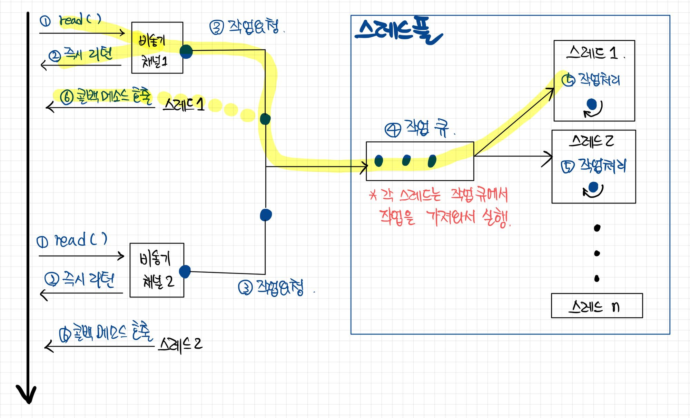    


출처 : https://www.notion.so/I-O-af9b3036338c43a8bf9fa6a521cda242
