## 14 주차 과제 : 제네릭    

### 목표 : 자바의 제네릭에 대해 학습하세요.   

### 학습할 것(필수)   
* 제네릭 사용법    
* 제네릭 주요 개념(바운디드 타입, 와일드 카드)   
* 제네릭 메소드 만들기   
* Erasure   

--------------------
보통, 제네릭이라고 말하지만, 참고하고 있는 도서 자바의정석 에서는 제네릭스, 제네릭 으로 설명하고 있다.   
크게 중요하지 않다고 생각되지만, 칭하는 용어가 달라서 혼동이 있을 수 있을 것 같아서 미리 언급하고 들어간다.   
제네릭스나 제네릭   

#### 제네릭스 (Generics)   
```
제네릭스는 JDK 1.5 에서 처음 도입되었다.
```
제네릭스는 다양한 타입의 객체를 다루는 메서드나 컬렉션 클래스에 **컴파일 시의 타입 체크(compile-time type check)를 해주는 기능이다.**   
-> 객체의 타입을 컴파일 시에 체크하기 때문에 객체의 타입 안정성을 높이고 형변환의 번거로움이 줄어든다.   

타입 안정성을 높인다?   
* 의도하지 않은 타입의 객체가 저장되는 것을 막고, 저장된 객체를 꺼내올 때 원래의 타입과 다른 타입으로 잘못 형변환 되어 발생할 수 있는 오류를 줄어준다는 것이다.   

#### 제네릭스의 장점   
1. 타입 안정성을 제공한다.   
    -> 컴파일시에 타입 체크를 하기 때문에 런타임에서 ClassCastException 과 같은 UncheckedException 을 보장받을 수 있다.   
2. 타입체크와 형변환을 생략할 수 있으므로 코드가 간결해진다.   

```
기본적으로 제네릭 타입은 클래스와 메서드에 선언할 수 있다.   
```

#### 제네릭을 사용하는 이유   
* 제네릭 타입을 사용함으로써 잘못된 타입이 사용될 수 있는 문제를 컴파일과정에서 제거할 수 있기 때문이다.   
* 자바 컴파일러는 코드에서 잘못 사용된 타입 떄문에 발생하는 문제점을 제거하기 위해 제네릭 코드에 대해 강한 타입 체크를 한다.   
* 실행 시 타입 에러가 나는 것보다 컴파일 시에 미리 타입을 강하게 체크해서 에러를 사전에 방지하는 것이 좋다.   
* 제네릭 코드를 사용하면 타입을 국한하기 때문에 요소를 찾아올 때 타입 변환을 할 필요가 없어 프로그램 성능이 향상되는 효과를 얻을 수 있다.   

#### 제네릭 클래스의 선언   
클래스에 선언하는 제네릭 타입에 대해 살펴본다.   
```java 
public class Champion {

    Object passive;

    public Object getPassive() {
        return passive;
    }

    public void setPassive(Object passive) {
        this.passive = passive;
    }
}
```

위 클래스를 제네릭 클래스로 변경한다고 하면 아래와 같이 클래스 옆에 '<T>' 를 붙이면 된다.   
그리고 Object 를 모두 T 로 바꾼다.   
```java
// 제네릭 타입 T를 선언한다.
public class Champion<T> {

    T passive;

    public T getPassive() {
        return passive;
    }

    public void setPassive(T passive) {
        this.passive = passive;
    }
}
```

Champion<T> 에서 T 를 "타입 변수(type variable)" 라고 한다.   
```
Type 이라는 단어의 첫 스펠링을 따서 T 라 한다. 
-> T 가 아닌 다른 것을 사용해도 된다.   
```
* ArrayList<E> 의 경우, 타입 변수 E 는 'Element(요소)' 의 첫 글자를 따서 사용했다.   
* 타입 변수가 여러 개인 경우에는 Map<K,V> 와 같이 콤마로 구분하여 나열한다.    
    - K 는 Key 를 의미하고, V 는 Value를 의미한다.   
```
위 글에서 봤듯이 T,E,K,V 등 어떤 것을 사용하던 제네릭 타입으로 선언 가능하다.
다만, 위 케이스들과 같이 상황에 맞게 의미있는 문자를 선택하여 사용하는 것이 중요하다.
```

기호의 종류만 다를 뿐 '임의의 참조형 타입' 을 의미한다는 것은 모두 같다.    
* 마치 수학식 [f(x,y) = x+y] 가 [f(k,v) = k+v] 와 다르지 않는 것 처럼   

제네릭스 이전 다양한 종류의 타입을 다루는 메서드의 매개변수나 리턴타입으로 Object 타입의 참조변수를 많이 사용했고, 그로 인해 형변환이 불가피했지만, 이젠 
Object 타입 대신 원하는 타입을 지정하기만 하면 되는 것이다.   
```
Object 는 모든 객체의 조상임으로 과거에는 다양한 종류의 타입을 다룰 때 Object 를 활용했었다.
```
위에서 정의한 Champion 클래스를 타입 T 대신, 실제 타입을 지정하여 생성하였다.   
* <String> 과 같이 String 타입으로 객체를 생성하였음으로 ".setPassive(..)" 메서드의 파라미터는 String 타입으로 호출 가능하다.   
* 만약 .setPassive(new Object()); 와 같이 호출한다면 컴파일 에러가 발생한다.   
* 또한 .getPassive(); 를 통해 값을 가져올 때에도 별도의 형변환이 필요 없다.   
```java
public class App {
    public static void main(String[] args) {
        System.out.println("hi");

        Champion<String> champion = new Champion<>();
        champion.setPassive("징크스는 적 챔피언이나 에픽 정글 몬스터 처치 또는 구조물 파괴를 도우면 이동 속도와 공격 속도가 대폭 상승합니다.");
        String passive = champion.getPassive();

        System.out.println("passive : " + passive);
    }
}
```
결과     
```java
/Library/Java/JavaVirtualMachines/jdk-11.0.8.jdk/Contents/Home/bin/java -agentlib:jdwp=transport=dt_socket,address=127.0.0.1:55519,suspend=y,server=n -javaagent:/Users/seogijin/Library/Caches/JetBrains/IntelliJIdea2020.2/captureAgent/debugger-agent.jar -Dfile.encoding=UTF-8 -classpath /Users/seogijin/workspace/whitewhip-java/14week_generics/generics/target/classes:/Applications/IntelliJ IDEA.app/Contents/lib/idea_rt.jar App
Connected to the target VM, address: '127.0.0.1:55519', transport: 'socket'
hi
passive : 징크스는 적 챔피언이나 에픽 정글 몬스터 처치 또는 구조물 파괴를 도우면 이동 속도와 공격 속도가 대폭 상승합니다.
Disconnected from the target VM, address: '127.0.0.1:55519', transport: 'socket'

Process finished with exit code 0
```

타입 T 대신 String 을 지정해줬으므로, 제네릭 클래스 Champion<T> 는 아래와 같이 정의 된 것과 같다.   
```java
public class Champion {

    String passive;

    public String getPassive() {
        return passive;
    }

    public void setPassive(String passive) {
        this.passive = passive;
    }
}
```
제네릭이 도입되기 전의 코드와 호환을 위해, 제네릭 클래스임에도 예전의 방식으로 객체를 생성하는 것이 허용된다. 하지만, 제네릭 타입을 지정하지 않아서 안전하지 않다고 경고가 발생한다.   
```java
public class App {
    public static void main(String[] args) {
        System.out.println("hi");

        Champion chmp = new Champion();
        chmp.setPassive("애니비아는 치명적인 피해를 입으면 알 형태로 돌아가 체력을 완전히 회복한 후 환생합니다.");
        String psv = (String) chmp.getPassive();

        System.out.println("psv : " + psv);
    }
}
```
결과    
```java
/Library/Java/JavaVirtualMachines/jdk-11.0.8.jdk/Contents/Home/bin/java -agentlib:jdwp=transport=dt_socket,address=127.0.0.1:55534,suspend=y,server=n -javaagent:/Users/seogijin/Library/Caches/JetBrains/IntelliJIdea2020.2/captureAgent/debugger-agent.jar -Dfile.encoding=UTF-8 -classpath /Users/seogijin/workspace/whitewhip-java/14week_generics/generics/target/classes:/Applications/IntelliJ IDEA.app/Contents/lib/idea_rt.jar App
Connected to the target VM, address: '127.0.0.1:55534', transport: 'socket'
hi
psv : 애니비아는 치명적인 피해를 입으면 알 형태로 돌아가 체력을 완전히 회복한 후 환생합니다.
Disconnected from the target VM, address: '127.0.0.1:55534', transport: 'socket'

Process finished with exit code 0
```
* chmp.setPassive(..) 코드 라인의 경고 메세지   
Unchecked or unsafe operation    
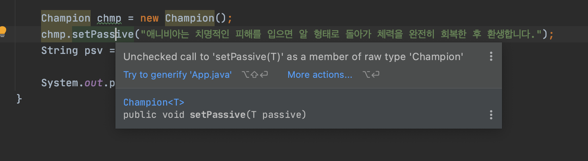     

#### 제네릭스의 용어   
제네릭 클래스 Champion 이 선언되어 있을 때   
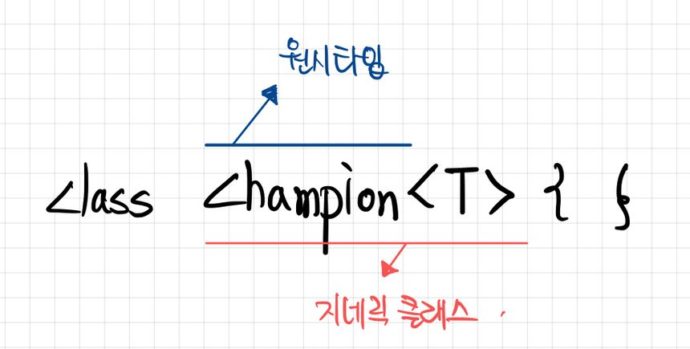     
* Champion<T> : 제네릭 클래스. [T의 Champion] 혹은 [T Champion] 라고 읽는다.   
* T : 타입 변수 또는 타입 매개변수. (T는 타입 문자)   
* Champion : 원시 타입 (raw type)   
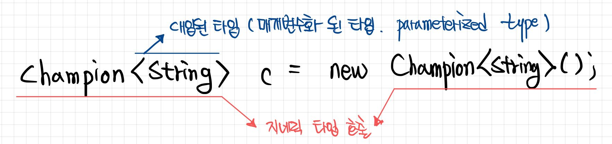     

#### 제네릭스의 제한   
제네릭 클래스의 객체를 생성할 때, 객체별로 다른 타입을 짖어하는 것은 적절하다.   
제네릭스는 이처럼 인스턴스별로 다르게 동작하도록 하려고 만든 기능이다.   
```java
public class Box <T>{

    T item;

    public T getItem() {
        return item;
    }

    public void setItem(T item) {
        this.item = item;
    }
}
```
```java
public class App {
    public static void main(String[] args) {
        System.out.println("hi");

        Box<Apple> appleBox = new Box<Apple>();
        Box<Grape> grapeBox = new Box<Grape>();
    }
}
```

모든 객체에 대해 동일하게 동작해야하는 static 멤버에 타입 변수 T 를 사용할 수 없다.   
* T 는 인스턴스변수로 간주되기 때문이다.   
* static 멤버는 인스턴스 변수를 참조할 수 없다.   
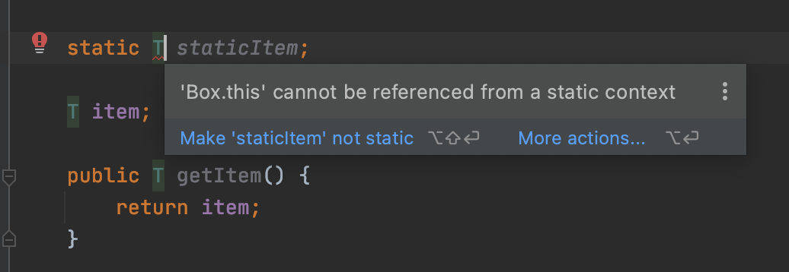     

제네릭 타입의 배열을 생성하는 것도 허용되지 않는다.   
* 제네릭 배열 타입의 참조변수를 선언하는 것은 가능하지만,   
* new T[10] 과 같이 배열을 생성하는 것은 안된다.   
    - 이유는 new 연산자 때문이다.   
    - 이 연산자는 컴파일 시점에 타입 T 가 무엇인지 명확히 알아야 하기 때문이다.   
         
```
꼭 제네릭 배열을 생성해야할 필요가 있을 때는, 
new 연산자 대신 'Reflection API' 의 newInstance() 와 같이 동적으로 객체를 생성하는 메서드를 생성하거나, 
Object 배열을 생성해서 형변환 하는 방법등을 사용할 수 있겠다.
```

#### 제네릭 클래스의 객체 생성과 사용     
예제 Box<T> 의 객체를 생성할 때는 다음과 같이 한다.   
```java
Box<Apple> appleBox = new Box<Apple>();
```
참조변수와 생성자에 대입된 타입(매개변수화된 타입)이 일치해야 한다.   
일치하지 않으면 컴파일 오류가 발생한다.   
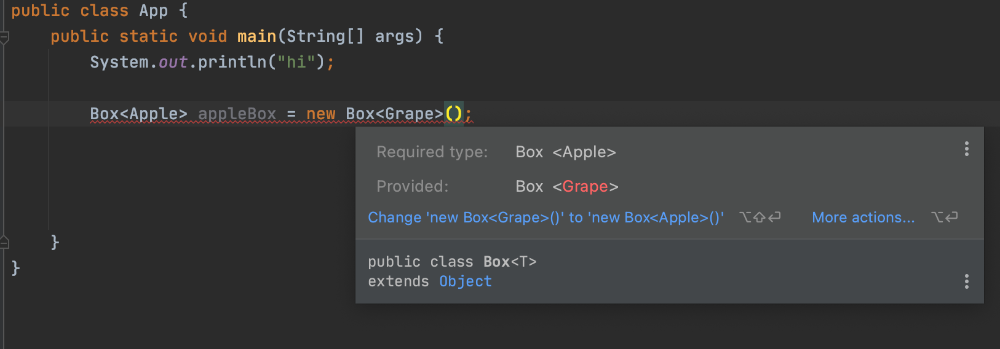     

두 타입이 상속관계에 있어도 마찬가지다.   
```java 
public class Fruit {
    String name;
    int weight; 

    ...
}
///

public class Apple extends Fruit {
    public Apple(String name, int weight) {
        super(name, weight);
    }
}
```
위와 같이 Apple 클래스는 Fruit 을 상속받은 자식 클래스로 구성을 한 다음 아래와 같이 제네릭 클래스를 생성하게 된다면?    
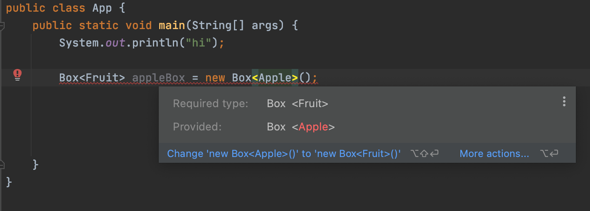     

그러나, 두 제네릭 클래스의 타입이 상속관계에 있고, 대입된 타입이 다른 것은 괜찮다.   
```java 
public class Box <T>{

    T item;

    T[] itemArray;

    public T getItem() {
        return item;
    }

    public void setItem(T item) {
        this.item = item;
    }
}

///
public class FruitBox<T> extends Box {

}
```
위와 같이 Box<T> 제네릭 클래스를 상속받은 FruitBox<T> 가 있다고 가정하였을 때    
아래와 같이 제네릭 클래스를 생성할 수 있다.   
```java
Box<Apple> appleBox = new FruitBox<Apple>();
```
-> 다형성의 개념이다.   


```
지금까지 제네릭 클래스를 생성해 봤는데, 
JDK 1.7 부터는 추정이 가능한 경우 타입을 생략할 수 있다.   

실제 IDE 를 활용하여 예제코드를 작성해보았다면 알 수 있었을 것이다. 

참조변수의 타입으로부터 Box 가 Apple 타입의 객체만 저장한다는 것을 알 수 있기 때문에, 생성자에서 반복적으로 타입을 지정해주지 않아도 되는 것이다.   
```
```java 
Box<Apple> appleBox = new Box<Apple>();
Box<Apple> appleBox = new Box<>();      // JDK 1.7 부터 생략 가능  
```

생성된 Box<T> 객체에 'void setItem(T item)'으로 객체를 추가할 때, 대입된 다른 타입의 객체는 추가할 수 없다.   
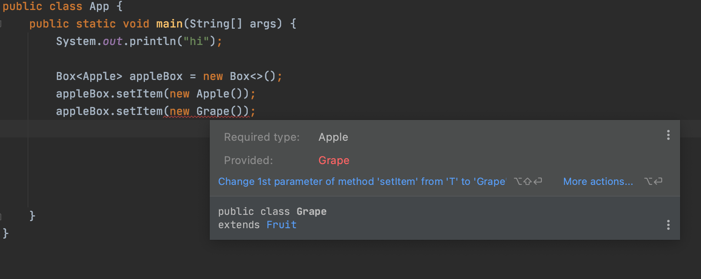     

만약 타입 T 가 'Fruit' 인 경우 'void setItem(Fruit item)' 이 되므로 Fruit의 자손들 은 이 메서드의 매개변수가 될 수 있다.   
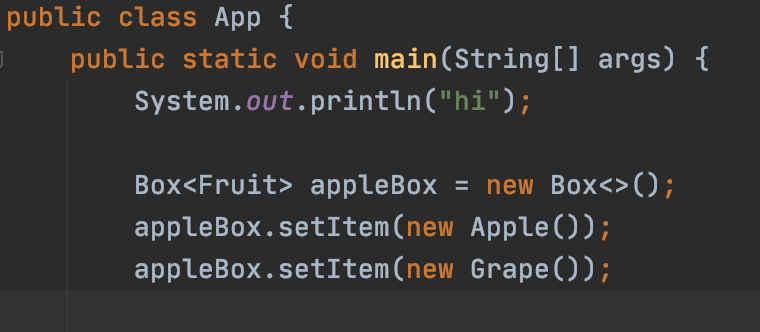     

#### 제한된 제네릭 클래스    
타입 문자로 사용할 타입을 명시하면 한 종류의 타입만 저장할 수 있도록 제한할 수 있지만, 그래도 여전히 모든 종류의 타입을 지정할 수 있다는 것에는 변함없다.   
그렇다면, 타입 매개변수 T 에 지정할 수 있는 타입의 종류를 제한할 수 있는 방법은?   
* 개념적으로 과일상자라는 FruitBox 에는 과일만 담아야 하지만, 전혀 다른 Toy 장난감을 담을 수 있는 구조라는 것이다.   
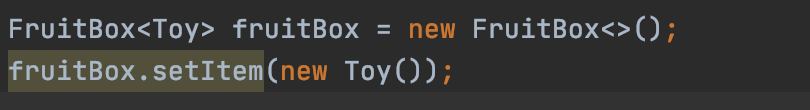     
-> 제네릭 타입에 'extends'를 사용하면, 특정 타입의 자손들만 대입할 수 있게 제한할 수 있다.   

```java 
public class Box <T>{

    T item;

    T[] itemArray;

    public T getItem() {
        return item;
    }

    public void setItem(T item) {
        this.item = item;
    }
}

///

public class FruitBox<T extends Fruit> extends Box {

}
```
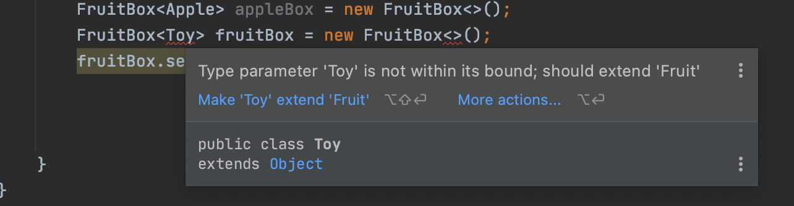     

만약, 클래스가 아니라 인터페이스를 구현해야 한다는 제약이 필요하다면?   
이때도 'extends'를 사용 한다. 'implements'를 사용하지 않는 다는 점을 주의하자.   
```java 
public class FruitBox<T extends Eatable> extends Box {

}
```

-> Fruit 의 자식이면서 Eatable 인터페이스도 구현해야 한다면? '&' 기호로 연결한다.   
```java 
public class FruitBox<T extends Fruit & Eatable> extends Box {

}
```

#### 바운디드 타입    
바운디드 타입 매개변수 (Bounded Type Parameter)   
* 바운드타입은 특정 타입의 서브 타입으로 제한한다.   
* 클래스나 인터페이스 설계할 때 가장 흔하게 사용할 정도로 많이 볼 수 있는 개념이다.
```java
public class BoundTypeSample <T extends Number> {
    public void set(T value) {}
    public static void main(String[] args) {
        BoundTypeSample<Integer> boundTypeSample = new BoundTypeSample<>();
        boundTypeSample.set("HI");
    }
}
```
* 위 예시 코드는 boundTypeSample.set("HI"); 구문에서 컴파일 에러가 발생한다.   
* BoundTypeSample 클래스는 <T extends Number>로 선언하고 있다.   
* 즉, BoundTypeSample 의 타입으로 Number의 서브 타입만 허용한다는 것이다.   


#### 와일드 카드   
제네릭으로 구현된 메서드의 경우 선언된 타입으로만 매개변수를 입력해야 한다.   
이름 상속받은 클래스 혹은 부모클래스를 사용하고 싶어도 불가능하고 어떤 타입이 와도 상관없는 경우에 대응하기 좋지 않다.   
* 이러한 해법으로 WildCard 를 사용한다.   

와일드 카드 종류   

**Unbounded WildCard**    
* Unbounded WildCard 는 List<?> 와 같은 형태로 물음표만 가지고 정의되어지게 된다.   
* 내부적으로 Object 로 정의되어서 사용하고 있는 모든 타입의 인자를 받을 수 있다.   
* 타입 파라미터에 의존하지 않는 메서드만을 사용하거나 Object 메서드에서 제공하는 기능으로 충분한 경우 사용하게 된다.   
* Unbounded 뜻 - 무한한, 끝이없는   
* Object 클래스에서 제공되는 기능을 사용하여 구현할 수 있는 메서드를 작성하는 경우   
* 타입 파라미터에 의존적이지 않는 일반 클래스의 메서드를 사용하는 경우  
    - ex. List.clear, List.size 등..    

**Upper Bounded**    
* Upper Bounded WilrdCard 는 List<? extends Foo> 의 형태로 사용한다.   
* 특정 클래스의 자식 클래스만 을 인자로 받는다는 의미이다.   
* 임의 Foo 클래스를 상속받는 어느 클래스가 와도 되지만 사용할 수 있는 기능은 Foo 클래스에 정의된 기능만 사용할 수 있다.   
```
보통 Upper Bounded 형태로 제한하는 경우가 대부분이다.
```

**Lower Bounded WildCard**    
* Lower Bounded WildCard 는 List<? super Foo> 의 형태로 사용한다.   
* Upper Bounded WildCard 와 다르게 특정 클래스의 부모 클래스만 을 인자로 받는다는 것이다.    

**인터페이스에 대해 Upper Lower Bounded WildCard**   
* 클래스 뿐만 아니라 인터페이스에 대해서도 적용된다.   
```
클래스 제네릭 선언 시 extends 와일드카드는 사용할 수 있지만, super 와일드 카드는 정의할 수 없다.  
```
```java
public class Game {
}
///
public class LoL extends Game implements Rankable {
}
///
public class WoW extends Game {
}
///
public interface Rankable {
}
///
public class Play<T> {
    public static void main(String[] args) {
        Play<?> lolplay = new Play<>();
        lolplay.doSomething(new Play<LoL>());
        lolplay.doSomething(new Play<Game>());
        lolplay.doSomething(new Play<Rankable>());
    }

    public void doSomething(Play<? super LoL> play) {
        System.out.println(play);
    }
}

```
* doSometing 메서드의 파라미터로 Play<? super LoL> 을 선언하였고   
* 이는, LoL 클래스의 상위타입을 받겠다는 의미이다.   
* 추가적으로 확인할 수 있는 부분은 Rankable 은 인터페이스 이지만 넘길 수 있다.   
    - lolPlay.doSomething(new Play<Rankable>());


매개변수에 과일박스를 대입하면 주스를 만들어 반환하는 Juicer 클래스가 있고,   
이 클래스에는 과일을 주스로 만들어서 반환하는 makeJuice() 라는 static 메서드가 정의되어 있다고 하자.   
```java 
public class Juicer {
    static Juice  makeJuice(FruitBox<Fruit> box) {
        // FruitBox<Fruit>
        // 제네릭의 타입 매개변수를 받지 않고 특정 타입을 받도록 한다. Fruit

        String temp = "";
        for (Fruit fruit : box.getList()) {
            temp += fruit + " ";
        }
        return new Juice(temp);
    }
}
```

Juicer 클래스는 제네릭 클래스도 아닌데다,   
제네릭 클래스라고 해도 static 메서드는 타입 매개변수 T를 매개변수에 사용할 수 없으므로   
아예 제네릭스를 적용하지 않던가, 위와 같이 타입 매개변수 대신, 특정 타입을 지정해줘야 한다.   


위 Juicer 를 이용해보면 아래와 같이 사용할 수 있다.   
```java 
public class App {
    public static void main(String[] args) {
        System.out.println("hi");

        FruitBox<Fruit> fruitFruitBox = new FruitBox<>();
        System.out.println(Juicer.makeJuice(fruitFruitBox));
    }
}
```
이렇게 제네릭 타입 'FruitBox<Fruit>' 으로 고정을 하게 되면, Fruit으로 고정된 제네릭 타입 매개변수가 아닌 Apple 과 같은 타입의 객체는 makeJice() 의 매개변수가 될 수 없다.   

그렇게 되면 매개변수 타입에 맞는 별도의 makeJuice() 메서드를 구현해야 할 것이다.   
* 그럼 위 Juicer 클래스에 추가적으로 FruitBox<Apple> 을 매개변수로 한 makeJuice 메서드를 추가해본다.   
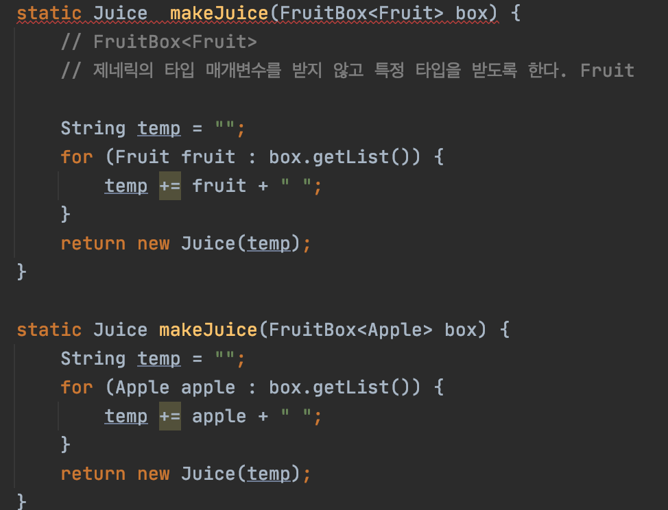     

* 위와 같이 오버로딩하게 되면, 보는 것과 같이 컴파일 에러가 발생한다.   
* 제네릭 타입이 다른 것만으로는 오버로딩이 성립하지 않는다.   
    -> 제네릭 타입은 컴파일러가 컴파일 할 때만 사용하고 제거해버린다.   
    -> 즉, 위의 두 메서드는 오버로딩이 아니라 '메서드의 중복 정의' 이다.   
* 이러한 상황에서 사용하기 위해 고안된 것이 바로 '와일드 카드' 이다.   
* 와일드카드는 기호 '?' 로 표현하는데, 와일드카드는 어떠한 타입도 될 수 있다.   

**'?' 만으로는 Object 타입과 다를 게 없으므로, 다음과 같이 'extends'와 'super' 로 상한과 하한을 제한할 수 있다.**    
* <? extends T> : 와일드 카드의 상한 제한. T와 그 자손들만 가능   
* <? super T> : 와일드 카드의 하한 제한. T와 그 조상들만 가능   
* <?> : 제한 없음. 모든타입이 가능. <? extends Object> 와 동일하다.   

```
제네릭 클래스와 달리 와일드 카드에는 '&'를 사용할 수 없다.  
```

위 Juicer 클래스의 makeJuice 메서드의 매개변수 타입을 아래와 같이 변경할 수 있다.   
* FruitBox<Fruit> -> FruitBox<? extends Fruit>   
```java 
public class Juicer {
    static Jice makeJuice(FruitBox<? extends Fruit> box) {
        String temp = "";
        for (Fruit fruit : box.getList()) {
        temp += fruit = ""; 
        }
        return new Juice(temp);
    }
}
```

상한 제한 예제 (상한 제한 -> <? extends T> )
```java 
class Fruit {
    public String toString() { return "fruit"; }
}

class Apple extends Fruit {
    public String toString() { return "Apple"; }
}

class Grape extends Fruit {
    public String toString() { return "Grape"; }
}

class Juice {
    String name; 
    Juice(String name) { this.name = name + "Juice"; }
    public String toString() { return name; }
}

class Juicer {
    static Juice makeJuice (FruitBox <? extends Fruit> box) {
        String temp = "";
        for (Fruit fruit : box.getList()) {
            temp += fruit + " ";
        }
        return new Juice(temp);
    }
}

public class App {
    public static void main(String[] args) {
        FruitBox<Fruit> fruitBox = new FruitBox<>();
        FruitBox<Apple> appleBox = new FruitBox<>();

        fruitBox.add(new Apple());
        fruitBox.add(new Grape());

        appleBox.add(new Apple());
        appleBox.add(new Apple());

        System.out.println(Juicer.makeJuice(fruitBox));
        System.out.println(Juicer.makeJuice(appleBox));
    }
}
```
결과   
```java
/Library/Java/JavaVirtualMachines/jdk-11.0.8.jdk/Contents/Home/bin/java -agentlib:jdwp=transport=dt_socket,address=127.0.0.1:59162,suspend=y,server=n -javaagent:/Users/seogijin/Library/Caches/JetBrains/IntelliJIdea2020.2/captureAgent/debugger-agent.jar -Dfile.encoding=UTF-8 -classpath /Users/seogijin/workspace/whitewhip-java/14week_generics/generics/target/classes:/Applications/IntelliJ IDEA.app/Contents/lib/idea_rt.jar App
Connected to the target VM, address: '127.0.0.1:59162', transport: 'socket'
Apple Grape Juice
Apple Apple Juice
Disconnected from the target VM, address: '127.0.0.1:59162', transport: 'socket'

Process finished with exit code 0
```

하한 제한 예제 (하한 제한 -> <? super T>)   
* Comparator<T> 를 implements 한 클래스를 생성하였따.   
* 예제는 weight 값을 기준으로 오름차순 내림차순으로 정렬한 결과를 출력한다.   
```java 
import java.util.Collections;
import java.util.Comparator;

class Fruit {
    String name;
    int weight;

    Fruit(String name, int weight) {
        this.name = name;
        this.weight = weight;
    }

    public String toString() { return name + "(" + weight + ")"; }
}

class Apple extends Fruit {
    Apple(String name, int weight) {
        super(name,weight);
    }
}

class Grape extends Fruit {
    Grape(String name, int weight) {
        super(name, weight);
    }
}

class AppleComp implements Comparator<Apple> {
    public int compare(Apple t1, Apple t2) {
        return t2.weight - t1.weight;
    }
}

class GrapeComp implements Comparator<Grape> {
    public int compare(Grape t1, Grape t2) {
        return t2.weight - t1.weight;
    }
}

class FruitComp implements Comparator<Fruit> {
    public int compare(Fruit t1, Fruit t2) {
        return t1.weight - t2.weight;
    }
}

public class App {
    public static void main(String[] args) {
        FruitBox<Apple> appleBox = new FruitBox<>();
        FruitBox<Grape> grapeBox = new FruitBox<>();

        appleBox.add(new Apple("GreenApple", 300));
        appleBox.add(new Apple("GreenApple", 200));
        appleBox.add(new Apple("GreenApple", 100));

        grapeBox.add(new Grape("GreenGrape", 400));
        grapeBox.add(new Grape("GreenGrape", 300));
        grapeBox.add(new Grape("GreenGrape", 200));

        Collections.sort(appleBox.getList(), new AppleComp());
        Collections.sort(grapeBox.getList(), new GrapeComp());

        System.out.println(appleBox);
        System.out.println(grapeBox);
        System.out.println();

        Collections.sort(appleBox.getList(), new FruitComp());
        Collections.sort(grapeBox.getList(), new FruitComp());

        System.out.pritnln(appleBox);
        System.out.println(grapeBox);
    }
}
```

Collections.sort() 를 이용하여 정렬을 하였고 해당 메서드는 아래와 같이 정의되어 있다.   
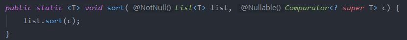     

* static 옆에 있는 <T> 는 메서드에 선언된 제네릭 타입이다.   
    - 이러한 메서드를 제네릭 메서드라 한다.   
* 메서드의 첫 매개변수는 정렬할 대상이고   
* 두번째 매개변수는 정렬할 방법이 정의된 Comparator 이다.   
* 여기서 Comparator 의 제네릭 타입에 하한 제한이 걸려있는 와일드 카드가 사용되었다.   
    - <? super T>   

* 여기서 와일드 카드를 제거하고 살펴보면 아래와 같다.    
```java 
static <T> void sort(List<T> list, Comparator<T> c)  
```
* 이 상황에서 타입 매개변수 T 에 Apple 이 대입되면 아래와 같다.   
```java 
static void sort(List<Apple> list, Comparator<Apple> c) 
```
* 이것은 List<Apple>을 정렬하기 위해서는 Comparator<Apple> 이 필요하다는 것을 의미한다.   
* 그래서 Comparator<Apple> 을 구현한 AppleComp 클래스를 정의하고 전달한다.   

이 상황에서 만약 Apple 대신 Grape 가 대입된다면?    
* List<Grape> 를 정렬하기 위해 Comparator<Grape> 가 필요하다.   
    - Comparator<Apple> 로는 List<Grape> 를 정렬할 수 없다.   

AppleComp 와 GrapeComp 는 타입만 다를 뿐 완전히 같은 코드이다.   
코드의 중복도 문제이지만, 새로운 Fruit의 자손이 생길 때 마다 위와 같은 코드를 반복해서 만들어줘야 한다는 문제가 가장 크다.   
* 이러한 문제를 해결하기 위해 타입 매개변수에 하한 제한의 와일드카드를 적용해야 한다.   
* 애초에 정의되었던 sort 메서드의 매개변수를 다시 살펴보자 <? super T>   

Apple 이 타입 매개변수로 대입되면 아래와 같이 정의될 것이다.   
```java
static void sort(List<Apple> list, Comparator<? super Apple> c)
```
* 매개변수 타입이 Comparator<? super Apple> 이라는 의미는     
* Comparator 의 타입 매개변수로 Apple 과 그 조상이 가능하다는 뜻이다.   
```java
Comparator<? super Apple> : Comparator<Apple>, Conparator<Fruit> Comparator<Object>
Comparator<? super Grape> : Comparator<Grape>, Comparator<Fruit> Comparator<Object>
```

```
코드 상으로 와일드카드 제네릭스가 정의되어 있으면 다소 해석하기 어려웠을 것이다. 
위와 같이 와일드카드를 제거한 다음 다시 살펴보는 것도 분석에 큰 도움이 될 것 같다.

또한, 와일드카드에는 상한과 하한의 개념이 있으므로 키워드도 알아둬야 분석에 용이할 것이며 구현 시 명확하게 구현할 수 있을 것이다.
- ?
- extends 
- super
```


### 제네릭 메서드    
메서드 선언부에 제네릭 타입이 선언된 메서드를 제네릭 메서드라 한다.    
주로 사용되는 컬렉션 메서드인 Collections.sort() 메서드가 바로 제네릭 메서드이며, 제네릭 타입의 선언 위치는 반화 타입 바로 앞이다.   
```java 
static <T> void sort(List<T> list, Comparator<? super T> c)
```

제네릭 클래스에 정의된 타입 매개변수와 제네릭 메서드에 정의된 타입 매개변수는 전혀 별개의 것이다.    
같은 타입 문자 T 를 사용해도 같은 것이 아니다 !!    
```java 
class FruitBox<T> {
    ...
    static <T> void sort(List<T> list, Comparator<? super T> c) {
        ...
    }
}
```
* static 멤버에는 타입 매개변수를 사용할 수 없지만,    
* 위 sort 메서드와 같이 메서드에 제네릭 타입을 선언하고 사용하는 것은 가능하다.    

```
메서드에 선언된 제네릭 타입은 지역 변수를 선언한 거소가 같다고 생각하면 이해가 쉽다.   

이 타입 매개변수는 메서든 내에서만 지역적으로 사용될 것이므로 메서드가 static 이건 아니건 상관없다.
```

위 예제에서 살펴보던 makeJuice(..) 메서드를 제네릭 메서드로 변경하면 아래와 같다.   

기존    
```java 
static Juice makeJuice(FruitBox<? extends Fruit> box) {
    String temp = "";
    for (Fruit fruit : box.getList()) {
        temp += fruit + " ";
    }
    return new Juice(temp);
}
```
제네릭 메서드로 변경   
```java 
static <T extends Fruit> Juice makeJuice(FruitBox<T> box) {
    String temp = "";
    for (Fruit fruit : box.getList()) {
        temp += fruit + " ";
    }
    return new Juice(temp);
}
```

제네릭 메서드를 사용하면 매개변수의 타입이 복잡할 때 유용하게 사용될 수 있다.   

기존    
```java 
public static void printAll(ArrayList<? extends Product> list,
                            ArrayList<? extends Product> list2) {
    for(Unit u : list) {
        System.out.println(u);
    }
}
```
제네릭 메서드로 변경    
```java 
public static <T extends Product> void printAll(ArrayList<T> list,
                                                ArrayList<T> list2) {
    for(Unit u : list) {
        System.out.println(u);
    }
}
```

#### 제네릭 타입의 형변환   
```java 
Box box = null;
Box<Object> object = null;

box = (Box)object;
object = (Box<Object>)box;
```
위 코드를 보면 제네릭 타입과 원시 타입(rawtype)간의 형변환이 가능할까?   
* 컴파일 상 오류는 발생하지 않는다.   
* 다만 경고가 발생한다.   
-> Unchecked cast   
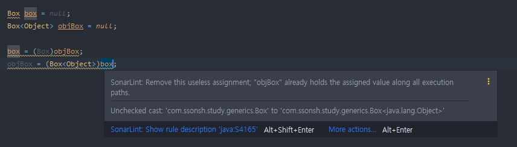     
제네릭 타입과 넌제네릭(non-generic) 타입간의 형변환은 항상 가능하지만, 경고가 발생할 뿐이다.   

그렇다면, 대입된 타입이 다른 제네릭 타입 간의 형변환은 가능한가?   
* 컴파일 오류가 발생한다.   
```java 
Box<Object> object = null;
Box<String> strBox = null;

objBox = (Box<Object>)strBox;
strBox = (Box<String>)objBox;
```
결과    
-> Inconvertible types   
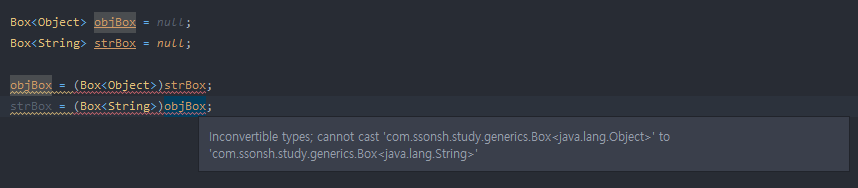     
* 대입된 타입이 Object 타입일지라도 위와 같이 오류가 발생한다.   
* Object 타입은 모든 객체의 부모임으로 될 것 같지만, 안된다.   

그렇다면, <? extends Object> 형태로 제네릭 타입을 정의한다면 가능할까?   
```java 
Box<? extends Object> box = new Box<String>();
```
* 와일드카드를 이용하여 상한제한 Object 형태로 제네릭 타입을 정의하였다.   
    - <? extends Object> : Object 자손들을 제네릭 타입으로 받을 수 있다는 것으로 해석한다.   
* 즉, 매개변수에 다형성이 적용될 수 있는 것이다.   
* 하지만, 직접 코드를 작성해보면 확인되지 않은 형변환이라는 경고가 발생할 것이다.   
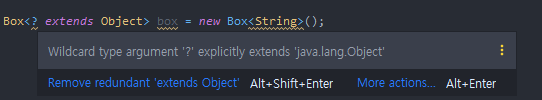     
-> Box<? extends Object> 에 대입될 수 있는 타입은 여러개인데,   
-> Box<String> 을 제외한 다른 다입은 Box<String> 으로 형변환 될 수 없기 때문이다.   

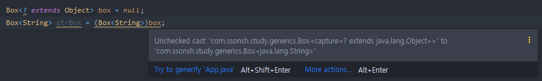     

```
현변환이 가능하긴 하지만, 와일드 카드는 타입이 확정된 타입이 아니므로 컴파일러는 미확정 타입으로 형변환 하는 것이라고 경고한다. 
```

### 제네릭 타입의 제거 (Erasure)     
컴파일러는 제네릭 타입을 이용해 소스파일을 체크하고, 필요한 곳에 형변환을 넣어준다.   
그리고 제네릭 타입을 제거한다.   
즉, 컴파일된 파일(*.class) 에는 제네릭 타입에 대한 정보가 없는 것이다.   
```java 
public class App {
    public static void main(String[] args) {
        Box<String> strBox = new Box<>();

        strBox.setItem("string box!");
    }
}
```
* 이렇게 처리되는 이유는 제네릭이 도입되기 이전의 소스코드와의 호환성을 유지하기 위해서다.   
* JDK1.5 부터 제네릭스가 도입되었지만, 아직도 원시 타입을 사용해서 코드를 작성하는 것을 허용한다.    
    - 언젠가 새로운 기능을 위해 하위 호환성을 포기하기 될 때가 올 것이다.   

```
이렇게 하위호환성을 유지해야 함으로 인해 raw type 지원 + 제네릭을 구현할 때 소거(erasure) 방식을 이용하였다.
```

#### 추가(참고) https://blog.naver.com/hsm622/222251602836    
* 제네릭에 대해 알아보면 다양한 코드를 접하고 작성해봤겠지만 특이한 점이 있다.   
* 바로 타입 파라미터에 primitive 타입을 사용하지 않는다는 것이다.   
* 왜일까?   
    - primitive 타입도 타입인데 타입으로 사용하지 못한다는게 이상하다고 생각되어야 한다.   
    - 결론은 타입 소거 (type Erasure) 때문이다.    
* 이해를 위한 List<Integer> 를 정의해본다.   
```java 
List<Integer> list = new ArrayList<>();
```
* 위 코드의 바이트 코드를 보면 아래와 같다.   
```java 
...
INVOKESPECIAL java/util/ArrayList. <init> ()V
...
```
* 주목해야 할 점은 ArrayList 가 생성될 때 타입정보가 없다는 것이다.   
* 제네릭을 사용하지 않고 Raw Type 으로 ArrayList 를 생성해도 똑같은 바이트코드로 볼 수 있다.   
* 그리고 내부에서 타입 파라미터를 사용할 경우 Object 타입으로 취급되어 처리한다.   
* 이것이 타입 소거 (type Erasure) 라고 한다.   
* 타입 소거는 제네릭 타입이 특정 타입으로 제한 되어 있을 경우 해당 타입에 맞춰 컴파일시 타입 변경이 발생하고 타입 제한이 없을 경우 Object 타입으로 변경된다.   

-> 바로 하위 호환성을 지키기 위해 같은 개념이 등장한 것이다.   
-> 제네릭을 사용하더라도 하위 버전에서도 동일하게 동작해야 하기 때문이다.   

자 그렇다면 알 수 있다. primitive 타입을 사용하지 못하는 것도 바로 이 기본 타입은 Object 클래스를 상속받고 있지 않기 때문이다.   
* 그래서 기본 타입 자료형을 사용하기 위해서는 Wrapper 클래스를 사용해야 한다.   
* Wrapper 클래스를 사용할 경우 Boxing, UnBoxing 을 명시적으로 사용할 수도 있지만 암묵적으로 사용할 수 있으니 구현 자체에는 크게 신경쓸 부분이 없다.   

한가지 더 생각해볼 수 있는 문제   
* 제네릭 타입 파라미터를 사용해서 배열을 생성하는 예제에서 발견할 수 있다.   
```java 
public class Example<T> {
    private T[] array;
    Example(int size) {
        // array = new T[size];      // Type Parameter 'T' cannot be instantiated directly
        array = (T[])new Object[size];
    }
    ....
}
```
* 제네릭 타입을 사용해서 배열을 생성하려면 array = new T[size]; 와 같이 사용하면 편할탠데 왜 사용하지 못하고 array = (T[])new Object[size]; 와 같이 사용해야 할까?   
* 그 이유는 new 연산자를 사용하기 때문이다.   
    - new 연산자는 동적 메모리 할당 영역인 heap 영역에 생성한 객체를 할당한다.   
    - 하지만 제네릭은 컴파일 타임에 동작하는 문법이다.   
    - 컴파일 타임에는 T 의 타입이 어떤 타입인지 알 수 없기 때문에 Object 타입으로 생성한 다음 타입 캐스팅을 해주어야 사용할 수 있다.   

제네릭 타입의 제거 과정    
1. 제네릭 타입의 경계 (bound)를 제거한다.   
제네릭 타입이 <T exetends Fruit> 라면 T 는 Fruit 로 치환된다.    
<T> 인 경우는 T 는 Object 로 치환된다.   
* Object 로 변경하는 경우 unbounded 된 경우를 뜻한다.   

이것이   
```java 
class Box<T extends Fruit> {
    void add(T t){
        ...
    }
}
```
이렇게   
```java 
class Box {
    void add(Fruit t) {
        ...
    }
}
```
2. 제네릭 타입을 제거한 후에 타입이 일치하지 않으면, 형변환을 추가한다.   
* List 의 get() 은 Object 타입을 반환하므로 형변환이 필요하다.   
이것이   
```java 
T get(int i) {
    return list.get(i);
}
```
이렇게   
```java 
Fruit get(int i) {
    return (Fruit)list.get(i);
}
```
3. 와일드 카드가 포함되어 있는 경우 다음과 같이 적절한 타입으로의 형변환이 추가된다.   
이것이   
```java 
static Juice makeJuice(FruitBox<? extends Fruit> box) {
    String temp = "";
    for(Fruit f : box.getList()) {
        temp += f + " ";
    }
    return new Juice(temp);
}
```
이렇게   
```java 
static Juice makeJuice(FruitBox box) {
    String temp = "";
    Iterator it = box.getList().iterator();
    while(it.hasNext()) {
        temp += (Fruit)it.next() + " ";
    }
    return new Juice(temp);
}
```
[+]. 확장된 제네릭 타입에서 다형성을 보존하기 위해 bridge method 를 생성하기도 한다.   
* java Compiler 는 제네릭 타입의 안정성을 위해 Bridge Method 도 만들어 낼 수 있다.   
* Bridge Method 는 java Compiler 가 컴파일 할 때 메서드 시그니처가 조금 다르거나 애매할 경우에 대비해 작성된 메서드이다.   
* 이 경우는 파라미터화된 클래스나 인터페이스를 확장한 클래스를 컴파일 할 때 생길 수 있다.   


-----------------------
### 로우 (Raw Type) 타입은 사용하지 말아라.   
클래스와 인터페이스 선언에 타입 매개변수(type parameter)가 쓰이면, 이를 제네릭 클래스 혹은 제네릭 인터페이스라 한다.   

List 인터페이스는 원소의 타입을 나타내는 타입 매개변수 E 를 받는다.   
그래서 이 인터페이스의 완전한 이름은 List<E> 이지만, 짧게 그냥 List 라고도 자주 쓴다.   

제네릭 클래스와 인터페이스를 통틀어 제네릭 타입(generic type)이라고 한다.   

각각의 제네릭 타입은 일련의 매개변수화 타입 (parameterized type) 을 정의한다.   
예컨대 List<String> 은 원소의 타입이 String 인 리스트를 뜻하는 매개변수화 타입이다.   
* 여기서 String 이 정규 (formal) 타입 매개변수 E 에 해당하는 실제(actual) 타입 매개변수다.   

마지막으로, 제네릭 타입을 하나 정의하면 그에 딸린 로우 타입(raw type) 도 함께 정의된다.   
* 로우 타입(raw type) 이란 제네릭 타입에서 타입 매개변수를 전혀 사용하지 않을 때를 말한다.   
* 예컨대 List<E> 의 로우 타입은 List 이다.   
* 로우 타입은 타입 선언에서 제네릭 타입 정보가 전부 지워진 것처럼 동작하는데, 제네릭이 도래하기 전 코드와 호환되도록 하기 위한 방책이라 할 수 있다.   

컬렉션의 로우 타입 - 따라하지 말것   
```java 
// stamp 인스턴스만 취급하기 위해 선언한다. 
private final Collection stamps = ....;
```
하지만, 위 stamps 에는 도장 (Stamp) 대신 동전(Coin) 을 넣어도 아무런 오류 없이 컴파일 된다.   
* 물론 컴파일러가 모호한 경고 메세지를 보여주긴 한다.   

```java 
stamps.add(new Coin(...));      // "unchecked call" 경로
```
* 컬렉션에서 위에서 넣은 동전(new Coin(..)) 을 다시 꺼내기 전에는 오류를 알아채지 못한다.   


반복자의 Raw 타입 - 따라하지 말것 .   
```java 

```for (Iterator i = stamps.iterator(); i.hasNext();) {
    Stamp stamp = (Stamp) i.next();     // ClassCastException 이 발생된다.
    stamp.cancel();
}


오류가 가능한 한 발생 즉시, 이상적으로는 컴파일할 때 발견하는 것이 좋다.   
```
위와 같이 선언하고 사용하게 된다면 오류가 발생하고 한참 뒤인 런타임에서 알아챌 수 있는데,   
이럭헤 되면 런타임에 무제를 겪는 코드와 원인을 제공한 코드가 물리적으로 상당히 떨어져 있을 가능성이 커진다.
```

위 stamps 를 선언할 때 주석으로 표현하지 않고 실질적으로 타입을 선언하도록 한다.   
```java 
private final Collection<Stamp> stamps = ...;
```
* 이렇게 되면 컴파일러는 stamps 에는 Stamp 인스턴스만 넣어야 함을 인지하게 된다.   
* 아무런 경고 없이 컴파일 된다면 의도대로 동작할 것임을 보장한다. -> 물론 컴파일러 경고를 숨기지 않아야 한다.    
* 이렇게 되면, Stamp 가 아닌 다른 인스턴스를 넣으려 하면 컴파일 오류가 발생하여 무엇이 잘못되었는지 명확히 알려줄 수 있게 된다.   

위 예로 살펴봤듯이,   
로우 타입 (rawtype) 을 쓰면 제네릭이 안겨주는 안정성과 표현력을 모두 잃게 된다.   
물론, 그렇다면 쓰지 못하도록 막으면 되지 않느냐? 라고 할 수 있지만 위에서도 언급 하였듯이 호환성 때문이다.   


**정리**    
로우 타입을 사용하면 런타임 예외가 일어날 수 있으니 사용하면 안된다.   
로우 타입은 제네릭이 도입되기 이전 코드와의 호환성을 위해 제공될 뿐이다.   

빠르게 훑어보자면, Set<Object>는 어떤 타입의 객체도 저장할 수 있는 매개변수화 타입이고, Set<?> 는 모종의 타입 객체만 저장할 수 있는 와일드카드 타입이다.   
그리고 이들의 로우 타입인 Set 은 제네릭 타입 시스템에 속하지 않는다.   
Set<Object> 와 Set<?> 은 안전하지만, 로우 타입인 Set 은 안전하지 않다.   


### 비검사 경고를 제거하라.    
제네릭을 사용하기 시작하면 수많은 컴파일러 경고를 보게 될 것이다.   
* 비검사 형변환 경고   
* 비검사 메서드 호출 경고   
* 비검사 매개변수화 가변변수 타입 경고   
* 비검사 변환 경고   
* 등..   

제네릭에 익숙해질 수록 마주치는 경고는 줄어들겠지만 새로 작성한 코드가 한번에 깨끗하게 컴파일 되리라 기대하지는 말자.   

비검사에 대한 다양한 예시는 살펴보자 읺겠지만, 대게 IDE 의 도움을 받아 해결방안을 확인할 수 있다.   

**정리**   
비검사 경고는 중요하니 무시하지 말자.   
모든 비검사 경고는 런타임에 ClassCastException 을 일으킬 수 있는 잠재적 가능성을 뜻한다.   
경고를 없앨 방법을 차지 못하겠다면, 그 코드가 타입 안전함을 증명하고 가능한 한 범위를 좁혀 @SuppressWarnings("unchecked") 애노테이션으로 경고를 숨겨라.   
그런 다음 경고를 숨기기로 한 근거를 주석으로 남겨야 한다.   


### 배열보다는 리스트를 사용하라.   
배열과 제네릭 타입에는 중요한 차이 두가지가 있다.   
**첫번째. 공변과 불공변**     
1. 배열은 공변(convariant) 이다.   
Sub 가 Super의 하위타입이라면 배열 Sub[] 는 배열 Super[] 의 하위 타입이 된다.   
공변 즉, 함게 변한다는 뜻이다.   
2. 제네릭은 불공변이다.     
서로 다른 타입 Type1 과 Type2 가 있을 때, List<Type1> 은 List<Type2> 의 하위 타입도 아니고 상위 타입도 아니다.   

```java 
Object[] objectArray = new Long[1]
objectArray[0] = "입력";
```

결과   
* 런타임 에러가 발생한다.   
```java
Exception in thread "main" java.lang.ArrayStoreException: java.lang.String
	at com.ssonsh.study.generics.App.main(App.java:9)
Picked up JAVA_TOOL_OPTIONS: -Djava.net.preferIPv4Stack=true
```


```java 
List<Object> objectList = new ArrayList<Long>();
objectList.add("입력");
```
결과    
* 컴파일 에러가 발생한다.   
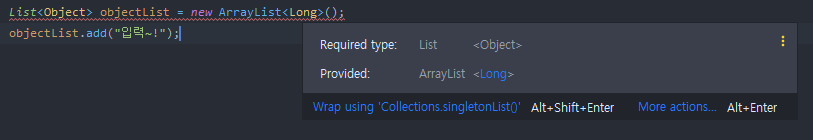     

위의 2가지 코드 모두 Long 용 저장소에 String 을 넣을 수 없다.   
다만, 배열의 경우 런타임에야 알게 되지만, 제네릭을 상요하면 컴파일 때 바로 알 수 있다.   
-> 컴파일 시 알아채는 쪽이 선호 될 수 있다.   

**두번째. 실체화와 소거**     
1. 배열은 실체화(reify) 된다.   
배열은 런타임에도 자신이 담기로 한 원소 타입을 인지하고 확인한다.   
그렇기 때문에 위에서 본 코드와 같이 Long 배열에 String 을 넣으려 하면 ArrayStoreException 이 발생하게 된다.   
2. 제네릭 타입은 정보가 런타임에는 소거(erasure) 된다.   
원소 타입을 컴파일타임에만 검사하며 런타임에는 알수조차 없다는 뜻이다.   
소거는 제네릭이 지원되기 전 레거시 코드와 제네릭 타입을 함께 사용할 수 있게 해주는 매커니즘이다.   

```
핵심 
배열과 제네릭에는 매우 다른 타입 규칙이 적용된다. 
배열은 공변이고 실체화되는 반면, 
제네릭은 불공변이고 타입 정보가 소거된다.   

그 결과 
배열은 런타임에는 타입에 안전하지만 컴파일 타임에는 그렇지 않다. 
제네릭은 컴파일시에 에러가 발생한다.

그래서 둘을 섞어 쓰기란 쉽지 않다. 둘을 섞어 쓰다가 컴파일 오류가 경고를 만나면, 가장 먼저 배열을 리스트로 대체하는 방법을 적용하자.
```

### 이왕이면 제네릭 타입으로 만들어라    
JDK 가 제공하는 제네릭 타입과 메서드를 사용하는 일은 일반적으로 쉬운 편이지만, 제네릭 타입을 새로 만드는 일은 조금 더 어렵다.   

Object 기반의 스택   
```java 
import java.util.Arrays;
import java.util.EmptyStackException;

public class Stack {
    private Object[] elements;
    private int size = 0;
    private static final int DEFAULT_INITIAL_CAPABILITY = 16;

    public Stack() {
        elements = new Object[DEFAULT_INITIAL_CAPABILITY];
    }

    public void push(Object e) {
        ensureCapacity();
        elements[size++] = e;
    }

    public Object pop() {
        if(size == 0) {
            throw new EmptyStackException();
        }

        Object result = elements[--size];
        elements[size] = null;
        return result;
    }

    public boolean isEmpty() {
        return size == 0;
    }

    private void ensureCapacity() {
        if(elements.length == size) {
            elements = Arrays.copyOf(elements, 2 * size + 1);
        }
    }
}
```
* 이 클래스는 원래 제네릭 타입이어야 마땅하다. -> 제네릭 클래스로 만들어 보자.   
* 제네릭으로 바꾼다 해도 현재 버전을 사용하는 클라이언트에는 아무런 해가 없다.   
    - 오히려, 현재 클래스를 사용하면서 스택에서 꺼낸 객체를 형변환해야 하는데, 이때 런타임 오류를 만날 수 있는 위험이 크다.   

첫번째 해야할 일 - 클래스 선언에 타입 매개변수를 선언하기.   
* 스택이 담을 원소의 타입 하나만 추가하면 된다.   
* 보통 이름으로 E 를 사용한다. (Element)    
위 코드에서 Object -> E 로 변경하였다.   

```java 
import java.util.Arrays;
import java.util.EmptyStackException;

public class Stack<E> {
    private E[] elements;
    private int size = 0;
    private static final int DEFAULT_INITIAL_CAPABILITY = 16;

    public Stack() {
        elements = new E[DEFAULT_INITIAL_CAPABILITY];
    }

    public void push(E e) {
        ensureCapacity();
        elements[size++] = e;
    }

    public E pop() {
        if(size == 0) {
            throw new EmptyStackException();
        }

        E result = elements[--size];
        elements[size] = null;
        return result;
    }

    public boolean isEmpty() {
        return size == 0;
    }

    private void ensureCapacity() {
        if(elements.length == size) {
            elements = Arrays.copyOf(elements, 2 * size + 1);
        }
    }
}
```
* 이러면 오류가 발생됨을 확인할 수 있다.   
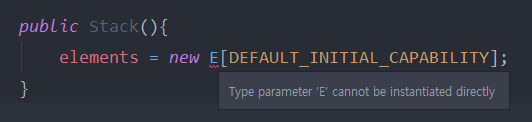     

이 오류는, E 와 같은 실체화 불가 타입으로는 배열을 만들 수 없다 는 것이다.   
배열을 사용하는 코드를 제네릭으로 만들려 할 때 항상 이 문제가 발생한다.   
1. 제네릭 배열 생성을 금지하는 제약을 대놓고 우회하는 방법    
-> 오류는 사라졌지만 경고가 발생한다. (Unchekced cast)   
-> 가능은 하지만, 타입에 안전하지 않다.   
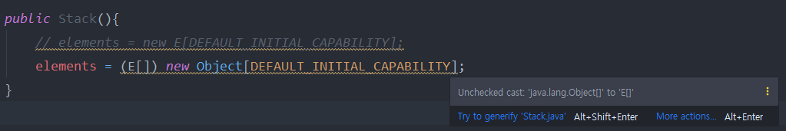     

2. elements 필드의 타입을 E[] 에서 Object[]로 바꾸는 것이다.   
```java 
private Object[] elements;
private int size = 0;
private static int DEFAULT_INITIAL_CAPABILITY = 16;

public Stack() {
    elements = new Object[DEFAULT_INITIAL_CAPABILITY];
}
...
```
-> 이또한 오류가 발생한다. pop() 메서드에서 발생하게 되는 오류를 보자.   
     

-> elements[--size]; 로 반환한 결과를 E 로 형변환 하게되면 오류 대신 경고가 발생한다.   
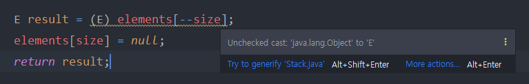     

E는 실체화 불가 타입이므로 컴파일러는 런타임에 이뤄지는 형변환이 안전한지를 증명할 방법이 없는 것이다.   

```
첫번째, 두번째에서 Unchecked Cast 경고를 숨기기 위해 

비검사 형변환이 안전함을 직접 증명했다면 범위를 최소로 좁혀 
@SuppressWarnings 애노테이션으로 해당 경고를 숨기는 방법을 활용할 수 있다. 
```

위에서 살펴본 우회하는 두가지 방법 중 첫번째 방법이 현업에서 더 선호하는 방식이다.    
```java 
@SuppressWarnings("unchecked")
public Stack() {
    elements = (E[]) new Object[DEFAULT_INITIAL_CAPABILITY];
}
```
* 가독성이 더 좋다.   
* 배열의 타입을 E[] 로 선언하여 오직 E 타입의 인스턴스만 받음을 확실히 어필한다.   
* 형변환을 배열 생성 시 한 번만 해주면 되지만, 두번째 방식에서는 배열에서 원솔르 읽을 때마다 형변환을 해줘야 한다.   
그러나.   
배열의 런타임 타입이 컴파일타입과 달라 힙 오염(heap pollution) 을 일으킨다.   
* 힙 오염이 맘에 걸리는 프로그래머는 두번째 방식을 고수하기도 한다.   

```
정리 
클라이언트에서 직접 형변환해야 하는 타입보다 제네릭 타입이 더 안전하고 쓰기 편하다. 
그러나 새로운 타입을 설계할 때는 형변환 없이도 사용할 수 있도록 하자.   
그렇게 하려면 제네릭 타입으로 만들어야 할 경우가 많다.   

기존 타입 중 제네릭 이었어야 하는게 있다면 제네릭 타입으로 변경하자.
기존 클라이언트에는 아무 영향을 주지 않으면서 새로운 사용자를 훨씬 편하게 해주는 길이다.   
```

#### 이왕이면 제네릭 메서드로 만들어라.   
매갭변수화 타입을 받는 정적 유틸리티 메서드는 보통 제네릭이다.    
예컨대 Collections 의 알고리즘 메서드(binarySearch, sort 등) 은 모두 제네릭이다.    

두집합의 합집합을 반환하는 코드로 살펴보자.   
```java 
public static Set union(Set s1, Set s2) {
    Set result = new HashSet(1);
    result.addAll(s2);
    return result;
}
```
* 컴파일은 되지만 2가지 경고가 발생한다.   
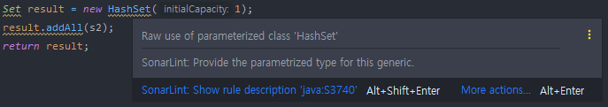     

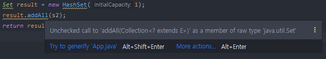     

* 경고를 없애고자 한다면 메서드를 타입 안전하게 만들어야 한다.    
    -> 메서드 선언에서의 세 집합(입력2, 반환 1) 의 원소 타입을 타입 매개변수로 명시하고 메서드 안에서도 이 타입 매개변수만 사용하게 수정하면 된다.   
    -> (타입 매개변수들을 선언하는) 타입 매개변수 목록은 메서드의 제한자와 반환 타입 사이에 온다.   

```java 
public static <E> Set<E> union(Set<E> s1, Set<E> s2) {
    Set<E> result = new HashSet<>(s1);
    result.addAll(s2);
    return result;
}
```
* 경고가 모두 사라졌음을 확인할 수 있다.   
* 사용   
```java 
import java.util.HashSet;
import java.util.Set;

public class App { 
    public static void main(String[] args) {
        Set<String> adcs = new HashSet<>();
        adcs.add("카이사");
        adcs.add("루시안");
        adcs.add("미스포츈");

        Set<String> sups = new HashSet<>();
        sups.add("질리언");
        sups.add("쓰레쉬");
        sups.add("유미");
        Set<String> union = union(adcs, sups);
        System.out.println(union);
    }
}
```

결과    
```java 
/Library/Java/JavaVirtualMachines/jdk-11.0.8.jdk/Contents/Home/bin/java -agentlib:jdwp=transport=dt_socket,address=127.0.0.1:59162,suspend=y,server=n -javaagent:/Users/seogijin/Library/Caches/JetBrains/IntelliJIdea2020.2/captureAgent/debugger-agent.jar -Dfile.encoding=UTF-8 -classpath /Users/seogijin/workspace/whitewhip-java/14week_generics/generics/target/classes:/Applications/IntelliJ IDEA.app/Contents/lib/idea_rt.jar App
Connected to the target VM, address: '127.0.0.1:59162', transport: 'socket'
[유미, 카이사, 질리언, 루시안, 쓰레쉬, 미스포츈]]
Disconnected from the target VM, address: '127.0.0.1:59162', transport: 'socket'

Process finished with exit code 0
```

```
정리    
제네릭 타입과 마찬가지로, 클라이언트에서 입력 매개변수와 반환값을 명시적으로 형변환해야 하는 메서드보다 제네릭 메서드가 더 안전하며 사용하기 쉽다. 

타입과 마찬가지로, 메서드도 형변환없이 사용할 수 있는 편이 좋으며, 많은 경우 그렇게 하려면 제네릭 메서드가 되어야 한다.   

역시 타입과 마찬가지로, 형변환을 해줘야 하는 기존 메서드는 제네릭하게 만들자. 기존 클라이언트는 그대로 둔 채 새로운 사용자의 삶을 훨씬 편하게 만들어 줄 것이다. 
```

### 한정적 와일드카드를 사용해 API 유연성을 높여라.   
매개변수화 타입은 불공변(invariant) 이다.   
즉, 서로 다른 타입 Type1 과 Type2 가 있을 때   
List<Type1> 은 List<Type2> 의 하위 타입도 상위 타입도 아니다.   

직관적이지 않겠지만 List<String> 은 List<Object> 의 하위 타입이 아니라는 뜻이다.   
* List<Object> 에는 어떤 객체든 넣을 수 있지만   
* List<String> 에는 문자열만 넣을 수 있다.   
* 즉, List<String> 은 List<Object> 가 하는 일을 제대로 수행하지 못하니 하위 타입이 될 수 없다.   
-> SOLID 원칙 중 리스코프 치환 원칙에 어긋난다.   


불공변 방식보다 유연한 무언가가 필요하다.   
Stack 클래스를 이용해 살펴본다.   
Stack 클래스의 public API를 추려보면 아래와 같다.   
```java 
public class Stack<E> {
    public Stack();
    public void push(E e);
    public E pop();
    public boolean isEmpty();
}
```

여기에 일련의 원소를 스택에 넣는 메서드를 추가해야 한다고 해보자.   
```java 
public void pushAll(Iterable<E> src) {
    for(E e : src) {
        push(e);
    }
}
```
* 코드를 작성해보면 깨끗하게 컴파일되는 것을 볼 수 있다.   
* 하지만 완벽하지 않다. Iterable src 의 원소 타입이 스택의 원소타입과 일치하면 잘 동작할 것이다.   
    - Stack<Number> 로 선언한 후 pushAll(intVal) 을 호출하면 어떻게 될까? (intVal = Integer)   
    - Integer 는 Number 의 하위 타입이니 잘 작동해야 할 것이다.   
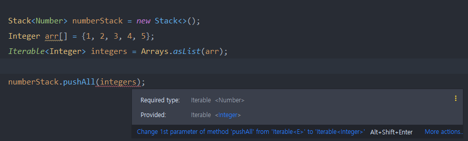     
    - incompatible types : ... cannot be converted to ... 에러 발생   

자바는 위 케이스에 대처할 수 있는 한정적 와일드카드 타입이라는 특별한 매개변수화 타입을 지원한다.   
pushAll 메서드의 입력 매개변수 타입은 'E의 Iterable' 이 아니라 'E 의 하위 타입의 Iterable' 이어야 하며,    
와일드카드 타입 Iterable<? extends E> 가 정확히 이런 뜻이다.   

위 내용을 바탕으로 pushAll 메서드를 수정해본다.    
-> 생산자(producer) 매개변수에 와일드카드 타입 적용   
```java 
public void pushAll(Iterable<? extends E> src) {
    for(E e : src) {
        push(e);
    }
}
```


```
위에서 입력 매개변수를 생산자(producer) 이라 한 것은  
입력 매개변수로부터 이 컬렉션으로 원소를 옮겨담는다는 뜻이다.   

반대로 이 컬렉션 인스턴스의 원소를 입력 매개변수로 옮겨 담는다면 그 매개변수를 
소비자(consumer) 라 한다.   
```

위에서 살펴본 pushAll 과 짝이되는 popAll 을 작성해본다.   
```java 
public void popAll(Collection<E> dst) {
    while(!isEmpty()) {
        dst.add(pop());
    }
}
```
* 이 또한 위에서 살펴본 pushAll 과 같은 맥락이다. 주어진 컬렉션의 원소 타입이 스택의 원소 타입과 일치하다면 말끔히 컴파일 되고 문제가 없을 것이다.   
* Stack<Number> 의 원소를 Object 용 컬렉션으로 옮기려 한다고 해보자. 과연?   
    -> Collection<Object> 는 Collection<Number> 의 하위 타입이 아니다.   
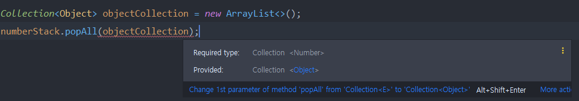     

popAll 의 입력 매개변수의 타입이   
'E의 Collection' 이 아니라 'E의 상위타입 Collection' 이어야 한다.   
(모든 타입은 자기 자신의 상위타입이다.)   
-> 와일드카드 타입을 사용한 Collection<? super E> 가 정확히 이 의미이다.   
```java 
public void popAll(Collection<? super E> dst) {
    while(!isEmpty()) {
        dst.add(pop());
    }
}
```
pushAll 메서드와 popAll 메서드로 와일드카드의 상한/하한에 대해 살펴보았다.   
메세지는 분명하다.   
**유성을 극대화 하라면 원소의 생산자나 소비자용 입력 매개변수에 와일드카드 타입을 사용해라.**    
한편, 입력 매개변수가 생산자나 소비자 역할을 동시에 한다면? 와일드카드 타입을 써도 좋을게 없다.   
그렇다면, 와일드카드 타입을 언제 써야 하는가?   
```
펙스(PECS) : Producer-Extends , Consumer-Super
```
매개변수화 타입 T가 생산자라면 <? extends T>   
매개변수화 타입 T가 소비자라면 <? super T>    

```
정리   
조금 복잡하더라도 와일드카드 타입을 적용하면 API가 훨씬 유연해진다.  
그러니 널리 쓰일 라이브러리를 작성한다면 반드시 와일드카드 타입을 적절히 사용해줘야 한다. 
PECS 공식을 기억하자.
```


----------------

### 추가   
* 실제 코드를 보면서 제네릭의 효과를 확인해보자 !!!   
```java 
public class Apple {
    private Integer id;
    public Integer getId() {
        return id;
    }
    public static Apple of(Integer id) {
        Apple apple = new Apple();
        apple.id = id;
        return apple;
    }
}
public class Banana {
    private Integer id;
    public Integer getId() {
        return id;
    }
    public static Banana of(Integer id) {
        Banana banana = new Banana();
        banana.id = id;
        return banana;
    }
}
```
```java 
public class AppleDao {
    private Map<Integer, Apple> datasource = new HashMap<>();
    public void save(Apple apple) {
        datasource.put(apple.getId(), apple);
    }
    public void delete(Apple apple) {
        datasource.remove(apple);
    }
    public void delete(Integer integer) {
        datasource.remove(integer);
    }
    public List<Apple> findAll() {
        return new ArrayList<> (datasource.values());
    }
    public Apple findById(Integer id) {
        return datasource.get(id);
    }
}
```
* AppleDao 가 위와 같이 구현되어 있는 경우에 BananaDao 가 추가로 필요한 경우??    
    - AppleDao 를 복사 생성해서 만들고   
    - Apple 대신에 Banana 로 변경하는 작업을 수행할 것이다.   
```java 
public class BananaDao {
    private Map<Integer, Banana> datasource = new HashMap<>();
    public void save(Banana banana) {
        datasource.put(apple.getId(), apple) {}
    }
    public void delete(Banana banana) {
        datasource.remove(apple);
    }
    public void delete(Integer integer) {
        datasource.remove(integer);
    }
    public List<Banana> findAll() {
        return new ArrayList<>(datasource.values());
    }
    public Banana findById(Integer id) {
        return datasource.get(id);
    }
}
```

사용하는 코드    
```java 
public class Store {
    public static void main(String[] args) {
        AppleDao appleDao = new AppleDao();
        appleDao.save(Apple.of(1));
        appleDao.save(Apple.of(2));

        List<Apple> all = appleDao.findAll();
        for(Apple apple : all) {
            System.out.println("apple : " + apple);
        }
    }
}
```

위와 같이 Apple, AppleDao, Banana, BananaDao 가 있을 때    
AppleDao 와 BananaDao 의 코드 중복을 제거해보자.   
* 제네릭 사용 -> 특화된 코드를 일반화로 하는 과정이다.   
* GenericDao 를 만들어보자   
* Entity<K> 라는 인터페이스를 만들고 Apple, Banana 가 구현하도록 한다.    
```java 
public interface Entity<K> {
    K getId();
}

/**
    -> Apple과 Banana 클래스는 위에서 정의한 Entity 인터페이스를 구현한다.
*/
public class Apple implements Entity<Integer> {
    private Integer id;
    public Integer getId() {
        return id;
    }
    public static Apple of(Integer id) {
        Apple apple = new Apple();
        apple.id = id;
        return apple;
    }
}

public class Banana implements Entity<Integer> {
    private Integer id;
    public Integer getId() {
        return id;
    }
    public static Banana of(Integer id) {
        Banana banana = new Banana();
        banana.id = id;
        return banana;
    }
}
```
```java 
public class GenericDao<E extends Entity<K>, K> {
    private Map<K, E> datasource = new HashMap<>();
    public void save(E e) {
        datasource.put(e.getId(), e);
    }
    public void delete(E e) {
        datasource.remove(e.getId());
    }
    public void delete(K k) {
        datasource.remove(k);
    }
    public List<E> findAll() {
        return new ArrayList<>(datasource.values());
    }
    public E findById(K id) {
        return datasource.get(id);
    }
}
```
* 이렇게 만들어진 GenericDao 를 사용해본다.   
    - 위에서 만든 AppleDao, BananaDao 에 구현한 구체적인 메서드들은 필요없어진다.   
    ```java 
    public class AppleDao extends GenericDao<Apple, Integer> {
    }
    public class BananaDao extends GenericDao<Banana, Integer> {
    }
    ```
실행하는 코드는 변경할 필요없이 그대로 사용가능하다.   
```java 
public class Store {
    public static void main(String[] args) {
        AppleDao appleDao = new AppleDao();
        appleDao.save(Apple.of(1));
        appleDao.save(Apple.of(2));

        List<Apple> all = appleDao.findAll();
        for(Apple apple : all ) {
            System.out.println("apple : " + apple);
        }
    }
}
```

심지어 AppleDao, BananaDao 가 필요 없이도 가능하다.   
```java 
public class Store {
    public static void main(String[] args) {
        GenericDao<Apple, Integer> appleDao = new GenericDao<>();
        appleDao.save(Apple.of(1));
        appleDao.save(Apple.of(2));

        List<Apple> all = appleDao.findAll();
        for(Apple apple : all) {
            System.out.println("apple : " + apple);
        }
    }
}
```
* 마치 List<String> 을 만들어 쓰는 것과 같은 것이다.   
```
파일이 필요없이 기능을 제공할 수 있다면 굳이 왜 파일을 만드냐? 비효율적인 것 아니냐? 
-> 혹시라도 부가적인 기능을 추가하기 위해서 
-> 특화된 구현체의 무언가를 제공해야 할 것들이 필요할 수 있으니
```

위 코드를 스프링에서 사용한다고 하면?   
```java 
@Configration
public class AppleConfig {
    @Bean
    public GenericDao<Apple, Integer> appleDao() {
        return new GenericDao<>();
    }
    @Bean
    public GenericDao<Banana, Integer> bananaDao() {
        return new GenericDao<>();
    }
}
```
```java 
@Repository
public class AppleDao extends GenericDao<Apple, Integer> {
}
@Repository   
public class BananaDao extends GenericDao<Banana, Integer> {
}
```

### 런타임 중에 제네릭 타입을 알아낼 수 있을까?   

* 제네럴한 클래스에서 어떤 타입의 클래스인지 알고 싶을때? Apple, Banana    
```java 
public class GenericDao<E extends Entity<K>, K> {
    private Class<E> entityClass;
    public Class<E> getEntityClass() {
        return entityClass;
    }

    private Map<K,E> datasource = new HashMap<>();
    public void save(E e) {
        datasource.put(e.getId(), e);
    }
    public void delete(E e) {
        datasource.remove(e.getId());
    }
    public void delete(K k) {
        datasource.remove(k);
    }
    public List<E> findAll() {
        return new ArrayList<>(datasource.values());
    }
    public E findById(K id) {
        return datasource.get(id);
    }
}
```
실행코드   
```java 
public class Store { 
    public static void main(Stringp[] args) {
        GenericDao<Apple, Integer> appleDao = new GenericDao<>();
        appleDao.save(Apple.of(1));
        appleDao.save(Apple.of(2));

        List<Apple> all = appleDao.findAll();
        for(Apple apple : all) {
            System.out.println("apple : " + apple);
        }
    }
    System.out.println(appleDao.getEntityClass());
}
```

Ensure 를 학습한 토대로 본다면 컴파일 된 파일(.class) 에는 제네릭한 타입 정보가 없다.   
* 그런데 어떻게 런타임 중에 알아낼 수 있을까? (학습 내용으로는 알아낼 수 없다.)   

예전 방식   
* 타입을 받는다. (생성자)   
```java 
public class GenericDao<E extends Entity<K>, K> {
    private Class<E> entityClass; 

    public GenericDao(Class<E> entityClass) {
        this.entityClass = entityClass;
    }
}
```
-> 이렇게 되면 만들때 마다 상위클래스에 던져줘야 한다.   
```java 
@Repository
public class AppleDao extends GenericDao<Apple, Integer> {
    public AppleDao() {
        super(Apple.class);
    }
}

@Repository
public class BananaDao extends GenericDao<Banana, Integer> {
    public BananaDao() {
        super(Banana.class);
    }
}
```
* 번거로워 진다.    
* 매번 이런 생성자를 만들어내야 한다.   

```
실제 Erasure 로 지운다고 하지만 메타 데이터로 남는다.
-> 리플렉션으로 찾아낼 수 있다.
```
```java 
public class GenericDao<E extends Entity<K>, K> {
    private Class<E> entityClass;

    public GenericDao() {
        this.entityClass = (Class<E>)(ParameterizedType)this.getClass()
                                                            .getGenericSuperclass())
                                                            .getActualTypeArguments()[0];
    }
}
```
* parameterizedType   
* getGenericSuperclass   
* 상속의 개념으로 정의하였을 때 뽑아낼 수 있다. 그렇지 않으면 리플렉션 코드에서 Exception 발생   

#### 위 interface Entity를 class 로    
```java 
public class Entity<K> {
    protected K id; 
    public K getId() {
        return id;
    }
}
```
```java 
public class Apple extends Entity<Integer> {
    public static Apple of(Integer id) {
        Apple apple = new Apple();
        apple.id = id;
        return apple;
    }
}
///
public class Banana extends Entity<Integer> {
    public static Banana of(Integer id) {
        Banana banana = new Banana);
        banana.id = id;
        return banana;
    }
}
```
* 각각 구현체마다 있었던 id와 관련한 코드를 제거할 수 있게 되었다.   


출처 : https://www.notion.so/4735e9a564e64bceb26a1e5d1c261a3d    
