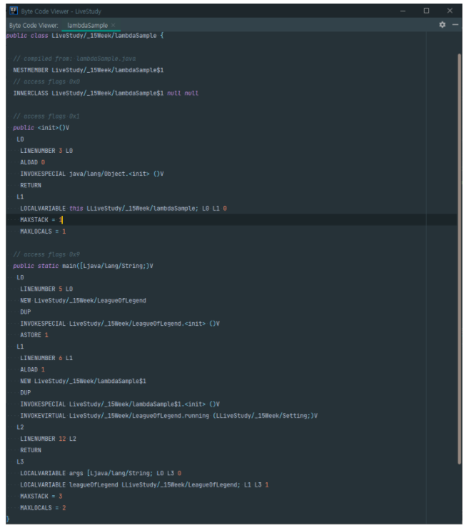
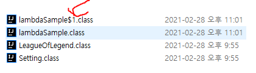
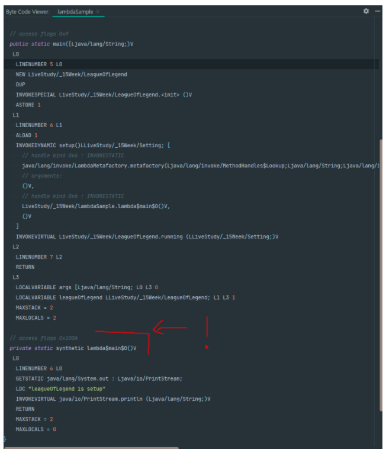
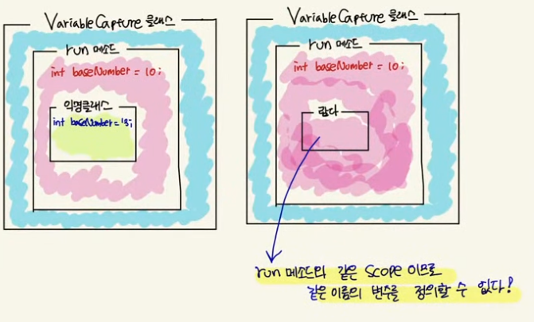
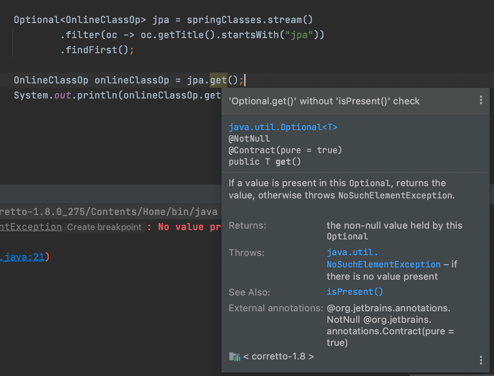

## 15 주차 과제 : 람다식   
 
### 목표 : 자바의 람다식에 대해 학습하세요.   

### 학습할 것(필수)   
* 람다식 사용법   
* 함수형 인터페이스   
* Variable Capture   
* 메소드, 생성자 레퍼런스   

------------------------

### 람다식 (Lambda Expression)   
자바가 1996년 등장한 이후 두번의 큰 변화가 있었다.   
첫번째 JDK 1.5 부터 추가된 제네릭의 등장이고,   
두번째 JDK 1.8 부터 추가도니 람다식의 등장이다.   

람다식의 도입으로 인해 자바는 객체지향언어인 동시에 ㅎ마수형 언어가 되었다.   

### 람다식이란?   
람다식은 간단히 말해 메서드를 하나의 식(xpression) 으로 표현한 것이다.   
람다식은 함수를 간략하면서도 명확한 식으로 표현할 수 있게 해준다.   

메서드를 람다식으로 표현하면 메서드의 이름과 반환값이 없어지므로,    
람다식을 '익명 함수(anonymous function)' 이라고도 한다.   

```java 
ㅏㅁt[] arr = new int[5];
Arrays.setAll(arr, (i) -> (int)(Math.random() * 5) + 1);
```

위 예시코드에서 '() -> (int)(Math.randon() * 5 ) + 1' 구문이 람다식이다.   
이 람다식이 하는 일을 메서드로 표현한다면 다음과 같다.   
```java 
int method() {
    return (int)(Math.random() * 5) + 1;
}
```

메서드 형태보다 람다식이 간결하면서도 이해하기 쉽다.   
게다가 모든 메서드는 클래스에 포함되어야 하므로 클래스도 새로 만들어야 하고, 객체도 생성해야 이 메서드를 호출할 수 있지만, 람다식은 이 과정 없이 오직 람다식 자체만으로 이 메서드의 역할을 수행할 수 있는 것이 큰 장점이다.   

```
메서드와 함수의 차이   

전통적으로 프로그래밍에서 함수라는 이름은 수학에서 따온 것이다. 
수학의 함수와 개념이 유사하기 때문이다. 
그러나 객체지향개념에서는 함수(function) 대신 객체의 행위나 동작을 의미하는 메서드(method) 라는 용어를 사용한다.   

메서드는 함수와 같은 의미이지만, 특정 클래스에 반드시 속해야 한다는 제약이 있기 때문에 기존의 함수와 같은 의미를 다른 용어를 선택해서 사용한 것이다.  

그러나 이제 다시 람다식을 통해 메서드가 하나의 독립적인 기능을 하기 때문에 함수라는 용어를 사용하게 되었다.
```


### 람다식 작성하기   
람다식은 '익명 함수' 답게 메서드에서 이름과 반환타입을 제거하고 매개변수 선언부와 몸통 { } 사이에 '->' 를 추가한다.   
```
AS - IS 
반환타입 메서드이름(매개변수 선언) {
    문장들
}

TO - BE 
(매개변수 선언) -> {
    문장들
}
```

예시    
```java 
AS - IS 
int max(int a, int b) {
    return a>b ? a : b;
}

TO - BE
(int a, int b) -> { return a>b ? a : b; }
```

* TO-BE 에서 반환값이 있는 메서드의 경우   
* return 문 대신 '식(expression)' 으로 대신할 수 있다.   
* 식의 연산결과가 자동적으로 반환값이 된다.    
    - 문장이 아닌 식으로 끝에 ';'를 붙이지 않는다.   
```java 
TO - BE  
(int a, int b) -> a>b ? a : b
```

* 선언된 매개변수의 타입은 추론이 가능한 경우 생략할 수 있다.   
* 람다식에 반환타입이 없는 이유도 항상 추론이 가능하기 때문이다.   
```java 
TO - BE 
(a, b) -> a>b ? a : b
```

* 선언된 매개변수가 하나인 경우 괄호 ()를 생략할 수 있다.    
* 단, 매개변수의 타입이 있으면 괄호 ()를 생략할 수 없다.   
```java 
TO - BE  
a -> a * a      // Ok
int a -> a * a  // Error
```

* 괄호 {} 안의 문장이 하나일 때는 괄호 {}를 생략할 수 있다.   
* 문장의 끝에 ';'을 붙이지 않아야 한다는 것에 주의한다.   
```java 
AS - IS 
(String name, int i) -> { System.out.println(name + "=" + i); }

TO - BE 
(String name, int i) -> System.out.println(name + "=" + i)
```


### 함수형 인터페이스 (Functional Interface)    
자바에서 모든 메서드는 클래스 내에 포함되어야 하는데,    
람다식은 어떤 클래스에 포함되는 것일까?   

람다식은 익명 클래스의 객체와 동등하다.   
```java 
(int a, int b) -> a > b ? a : b 

// 위(람다식) 와 아래(익명 클래스의 객체 내부 메서드) 와 같다

new Object() {
    int max(int a, int b) {
        return a > b ? a : b;
    }
}
```
위 익명 클래스 max 메서드명은 임의로 붙인 것이지 의미는 없다.    


그렇다면, 람다식으로 정의된 익명 객체의 메서드를 어떻게 호출할 수 있을 것인가?    
* 참조변수가 있어야 객체의 메서드를 호출할 수 있으니 이 익명 객체의 주소를 f 라는 ㅊ마조변수에 저장해본다.   
```java 
타입 f = (int a, int b) -> a > b ? a : b;       // 여기서 참조변수 f의 타입은 ?
```
* 참조변수 f의 타입은 어떤 것이어야 할까?   
    - 참조형이니까 클래스 또는 인터페이스가 가능하다.   
* 그리고 람다식과 동등한 메서드가 정의되어 있는 것이어야 한다.   
    - 그래야만 참조변수로 익명 객체(람다식)의 메서드를 호출할 수 있기 때문이다.   


위 내용을 바탕으로 예를 들어 max() 라는 메서드가 정의된 MyFunction 인터페이스가 정의되어 있다고 가정해본다.   
```java 
interface MyFunction {
    public abstract int max(int a, int b);
}
```


위 인터페이스를 구현한 익명 클래스의 객체는 아래와 같이 생성가능하다.   
```java 
MyFunction f = new MyFunction() {
    public int max(int a, int b) {
        return a > b ? a : b;
    }
}
int big = f.max(5, 3);
```

여기서 MyFunction 인터페이스에 정의된 메서드 max() 는    
람다식 '(int a, int b) -> a > b ? a : b' 와 일치한다.    
-> 익명 객체를 람다식으로 아래와 같이 대체할 수 있다.   
```java 
MyFunction f = (int a, int b) -> a > b ? a : b;         // 익명 객체를 람다식으로 대체   
int big = f.max(5,3);       // 익명 객체의 메서드를 호출   
```
위와 같이 MyFunction 인터페이스를 구현한 익명 객체를 람다식으로 대체할 수 있는 이유는    
람다식도 실제로는 익명 객체이고, MyFunction 인터페이스를 구현한 익명 객체의 메서드 max() 와 람다식의 참조변수 타입과 개수 그리고 반환값이 일치하기 때문이다.   


하나의 메서드가 선언된 인터페이스를 정의해서    
람다식을 다루는 것은 기존의 자바의 규칙들을 어기지 않으면서도 자연스럽다.   
* 그렇기 때문에 인터페이스를 통해 람다식을 다루기로 결정되었으며,   
* 람다식을 다루기 위한 인터페이스를 함수형 인터페이스(functional interface) 라 부르기로 했다.   
```java 
@FunctionalInterface 
interface MyFunction {
    public abstract int max(int a, int b);
}
```
단, 함수형 인터페이스에서는 오직 하나의 추상 메서드만 정의되어 있어야 한다는 제약이 있다.   
* 그래야 람다식과 인터페이스의 메서드가 1:1로 연결될 수 있기 때문이다.   
* 다만, static 메더스와 default 메서드의 개수에는 제약이 없다.   
* 함수형 인터페이스로 구현한 인터페이스라면 반드시 '@FunctionalInterface' 애노테이션을 정의하도록 하자.   
    - 컴파일러가 함수형 인터페이스를 올바르게 정의하였는지 확인을 해준다.   


### 바이트 코드로 확인    
* 람다는 익명 내부 클래스와 다르다.   
기본 예제와 람다 예제로 살펴본다.    

기본예제    
LeagueOfLegend, Setting   
```java 
@FunctionalInterface   
interface Setting() {
    void setup();
}
public class LegueOfLegend {
    public void running(Setting setting) {
        setting.setup();
        System.out.println("LeagueOfLegend running");
    }
}
```
lambdaSample   
```java 
public class lambdaSample {
    public static void main(String[] args) {
        LeagueOfLegend leagueOfLegend = new LeagueOfLegend();
        leagueOfLegend.running(new Setting() {
            @Override 
            public void setup() {
                System.out.println("leagueOfLegend is setup");
            }
        });
    }
}
```

람다 예제   
lambdaSample    
```java 
public class lambdaSample {
    public static void main(String[] args) {
        LeagueOfLegend leagueOfLegend = new LeagueOfLegend();
        leagueOfLegend.running(() -> System.out.println("leagueOfLegend is setup");
    }
}
```
위의 기본 예제와 람다 예제로 작성하였을 시 결과는 동일한데 어떻게 실행되고 코드가 동일한지 확인해보았다.   
     
* 기본 예제에서 익명클래스인 lambdaSample$1 새로운 클래스를 생성하여 초기화를 해주고 Setting 인터페이스를 실행하는 것과 같이 확인된다.   
* 컴파일 시 익명내부클래스는 $ 와 같은 클래스파일이 생성된다.   
     
* 익명클래스는 INVOKESPECIAL 이란 OPCODE 로 생성자를 호출하고, INVOKEVIRTUAL 로 Setting 을 호출한다.   


#### 익명클래스 & Function Type   
* 자바에서 왜 람다를 내부적으로 익명클래스로 컴파일하지 않을까?    
* Java8 이전 버전에서 람다를 쓰기 위한 retrolambda 같은 라이브러리나, kotlin 같은 언어에서는 컴파일 시점에 람다를 단순히 익명클래스로 치환이 된다.    
* 다만, 익명 클래스로 사용할 경우 아래와 같은 문제가 발생할 수 있다.   
    - 항상 새로운 인스턴스로 할당한다.   
    - 람다식마다 클래스가 하나씩 생기게 된다.   

람다 예제 바이트코드    
     
* 람다예제의 바이트코드에서는 기본예제의 바이트코드와 다른점이 있었다.   
* 새로운 메서드를 static 으로 생성하고 있는 부분을 볼 수 있다.   
* 중간 쯤 INVOKEDYNAMIC setup()... 이라는 구문을 볼 수 있는데 이 부분이 바로    
    - INVOKEDYNAMIC CALL -> INDY 이다.    
* INDY 가 호출되게 되면 bootstrap 영역의 lambdafactory.metafactory() 를 수행하게 된다.   
    - lambdafactory.metafactory() : java runtime library 의 표준화 method    
    - 어떤 방법으로 객체를 생성할지 dynamically 를 결정한다.    
        - 클래스를 새로 생성, 재사용, 프록시, 래퍼클래스 등등 성능향상을 위한 최적화된 방법을 사용하게 된다.   
* java.lang.invoke.CallSite 객체를 return 한다.   
    - LambdaMetaFactory ~ 이렇게 되어 있는 곳의 끝에 CallSite 객체를 리턴하게 된다.    
    - 해당 lambda 의 lambda factory, MethodHandle 을 멤버변수로 가지게 된다.   
    - 람다가 변환되는 함수 인터페이스의 인터페이스를 반환한다.   
    - 한번만 생성되고 재호출시 재사용이 가능하다.   

```
INVOKEDYNAMIC 으로 구현되어 있는 이유는 여러가지가 있지만   

자바의 버전이 올라갈 때 인보크 다이나믹으로 구현한 부분은 하위호환성을 유지하면서 개선할 여지를 가지고 있다.
```


### 함수형 인터페이스 (Functional Interface)    
* 추상 메서드를 딱 하나만 가지고 있는 인터페이스   
* SAM(Single Abstract Method) 인터페이스
* @FunctionalInterface 애노테이션을 가지고 있는 인터페이스   

### 람다 표현식 (Lambda Expressions)    
* 함수형 인터페이스의 인스턴스를 만드는 방법으로 쓰일 수 있다.   
* 코드를 줄일 수 있다.   
* 메서드 매개변수, 리턴타입, 변수로 만들어 사용할 수 있다.    

### 자바에서 함수형 프로그래밍   
* 함수를 First Class Object 로 사용할 수 있다.    
* 순수 함수 (Pure Function)    
    - 사이드 이팩트를 만들 수 없다. (함수 밖에 있는 값을 변경하지 못한다.)    
    - 상태가 없다. (함수 밖에 정의되어 있는)    
* 고차 함수 (High - Order Function)    
    - 함수가 함수를 매개변수로 받을 수 있고 함수를 리턴할 수 있다.   

-------------------
### 추상 메서드 하나만 있으면 함수형 인터페이스다.    
* RunSomething.java Interface 는 추상메서드 하나만 가지고 있기 때문에 함수형 인터페이스 이다.   
```java 
@FunctionalIterface 
public interface RunSomething {
    void doIt();
}
```
* @FunctionalInterface 애노테이션을 정의하고 나서 추가적인 추상 메서드를 입력하면, 컴파일 시 에러가 발생된다. (함수형 인터페이스가 아니게 된다.)    


**plus**     
* 인터페이스에 static, default 메서드를 선언할 수 있다.   
* 아래와 같이 다른 형태(static, default) 메서드가 있더라도, 추상 메서드 하나만 있다면 FunctionalInterface 이다.    
```java 
@FunctionalInterface 
public interface RunSomething {
    void doIt();

    static void printName() {
        System.out.println("sson");
    }

    default void printAge() {
        System.out.println("33");
    }
}
```
위에서 정의한 함수형 인터페이스를 사용해보자.    
```java 
public class Foo {
    public static void main(String[] args) {
        RunSomething runSomething = new RunSomething() {
            @Override  
            public void doIt() {
                System.out.println("Hello");
            }
        };
    }
}
```
* 위와 같은 방식은 익명 내부 클래스를 정의하는 방식이다.    


-> 람다 형식으로 표현할 수 있다.    
```java 
public class Foo {
    public static void main(String[] args) {
        RunSomething runSomething = () -> System.out.println("Hello");
    }
}

///
public class Foo {
    public static void main(String[] args) {
        RunSomething runSomething = () -> {
            System.out.println("Hello");
            System.out.println("Lambda");
        };
        runSomething.doIt();
    }
}
```
* 함수형 인터페이스를 인라인으로 구현한 오브젝트로 볼 수 있다.   
* 위 예시와 같이 구현한 자체를 Return 하거나, 메서드의 파라미터로 전달할  수도 있다.    


RunSomething.java    
```java 
@FunctionalInterface 
public interface RunSomething {
    int doIt(int num);

    static void printName() {
        System.out.println("sson");
    }
    default void printAge() {
        System.out.println("33");
    }
}
```

Use RunSomething.java     
```java 
public class Foo {
    public static void main(String[] args) {
        RunSomething runSomething = (number) -> number + 10;

        System.out.println(runSomething.doIt(1));
        System.out.println(runSomething.doIt(1));
    }
}

///
results.
11
11
```

같은 값을 넣었을 때 같은 값이 나오는 것. pure한 함수   
* 그렇지 않으면, 함수형 프로그래밍이 아니다.   
* 그렇지 않은 경우가 어떻게 있을까?    
    -> 함수 밖에 있는 값을 참조해서 사용하는 경우 (상태값에 의존한다는 의미이다.)   
    -> 외부에 있는 값을 변경하려는 경우    
    ```java 
    public class Foo {
        public static void main(String[] args) {
            RunSomething runSomething = new RunSomething() {
                int baseNumber = 10; 

                @OVerride 
                public int doIt(int num) {
                    baseNumber++;
                    return num + baseNumber;
                }
            };
        }
    }
    ```
    * 아래와 같은 경우 참조는 할 수 있지만, 변경할 수 없다.    
    * final 이라 가정하고 사용될 수 있는 경우이다.   
    ```java 
    public class Foo {
        public static void main(String[] args) {
            int baseNumber = 10;
            RunSomething = runSomething = num -> num + baseNumber;
        }
    }
    ```
    이러한 경우들은 함수형 프로그래밍과 거리가 멀다.     

---------------------------

### Java 에서 기본으로 제공하는 함수형 인터페이스 
* Java.lang.function 패키지    
* 자바에서 미리 정의해둔 자주 사용할만한 함수 인터페이스    
    - Function<T, R>    
    - BiFunction<T, U, R>   
    - Consumer<T>    
    - Supplier<T>   
    - Predicate<T>   
    - UnaryOperator<T>   
    - BinaryOperator<T>    
    - ....     

#### Function<T, R>   
값을 하나 받아서 리턴하는 일반적인 함수   
```java 
R apply<T> 
```
Plus10.java Class -> implements Function<Integer, Integer>    
* Integer 값을 받아서 Integer 값으로 반환하고자 함.    
```java 
import java.util.function.Function;

public class Plus10 implements Function<Integer, Integer> {
    @Override 
    public Integer apply(Integer integer) {
        return integer + 10; 
    }
}
```

Use Plush10.java    
```java 
public class Foo {
    public static void main(String[] args) {
        Plus10 plus10 = new Plus10();
        System.out.println(plus10.apply(1));
    }
}
```

위와 같은 동작을 하는 함수를 Plus10.java 라는 별도 클래스 없이도 사용할 수 있다.   
* Function<Integer, Integer> 함수형 인터페이스를 바로 구현   
```java 
import java.util.function.Function;   

public class Foo {
    public static void main(String[] args) {
        Function<Integer, Integer> plus10 = (number) -> number + 10;
        System.out.println(plus10.apply(1));
    }
}
```

함수의 조합도 가능하다.    
* compose   
    - 입력값을 가지고 먼저 뒤에 오는 함수를 적용한다.   
    - 그 결과값을 다시 입력값으로 사용하는 것이다.   
    ```java 
    import java.util.function.Function;

    public class Foo {
        public static void main(String[] args) {
            Function<Integer, Integer> plus10 = (number) -> number + 10;    
            Function<Integer, Integer> multiply2 = (number) -> number * 2;

            System.out.println(plus10.apply(1));
            System.out.println(mulitply2.apply(1));

            Function<Integer, Integer> multiply2AndPlus10 = plus10.compose(multiply2);
            System.out.println(multiply2AndPlus10.apply(2));
        }
    }
    ```

* andThen    
    - compose 와 반대로 먼저 적용하고 뒤에 오는 함수를 적용한다.   
    ```java
    import java.util.function.Function;

    public class Foo {
        public static void main(String[] args){
            Function<Integer, Integer> plus10 = (number) -> number + 10;
            Function<Integer, Integer> multiply2 = (number) -> number * 2;

            System.out.println(plus10.apply(1));
            System.out.println(multiply2.apply(1));

            Function<Integer, Integer> plus10AndMultiply2 = plus10.andThen(multiply2);
            System.out.println(plus10AndMultiply2.apply(2));

        }
    }
    ```

#### BiFunction <T,U,R>   
* Function<T,R> 과 유사하지만, 입력값을 2개를 받는 것이다.    
(T,R) -> R    
```java 
R apply(T t,U u) 
```

#### Consumer<T>    
* 리턴이 없다. |  함수 조합용 메서드 : andThen    
```java 
void Accept(T t)
```

* Consumer<T> 함수형 인터페이스 사용 예시   
```java
import java.util.function.Consumer;

public class Foo {
    public static void main(String[] args){
        Consumer<Integer> printT = System.out::println;
        printT.accept(10);
    }
}
```

#### Supplier<T>   
* T 타입의 값을 제공해주는 함수형 인터페이스    
```java 
T get()
```

* Supplier<T> 사용 예시    
```java
import java.util.function.Supplier;

public class Foo {
    public static void main(String[] args){
        Supplier<Integer> get10 = () -> 10;
        System.out.println(get10.get());
    }
}
```

#### Predicate<T>   
* T 타입의 값을 받아서 boolean 을 반환하는 함수 인터페이스    
```java 
boolean test(T t)
```

* 함수 조합용 메서드   
    - And, Or, Negate    


* Predicate<T> 사용 예시    
```java
import java.util.function.Predicate;

public class Foo {
    public static void main(String[] args){
        Predicate<String> startsWithSson = (str) -> str.startsWith("sson");
        Predicate<Integer> isEven = (i) -> i % 2 == 0;
    }
}
```


#### UnaryOperator<T>   
* Function<T, R> 의 특수한 형태    
* 입력값 하나를 받아서 동일한 타입을 리턴하는 함수 인터페이스    
* 입력/리턴 값이 같으므로 이전의 Function<T,R> 을 아래와 같이 변경할 수 있다.   
```java
import java.util.function.Function;
import java.util.function.UnaryOperator;

public class Foo {
    public static void main(String[] args){
        // Function<Integer, Integer> plus10 = (number) -> number + 10;
        UnaryOperator<Integer> plus10 = (number) -> number + 10;

        // Function<Integer, Integer> multiply2 = (number) -> number * 2;
        UnaryOperator<Integer> multiply2 = (number) -> number * 2;

    }
}
```

#### BinaryOperator<T>    
* BiFunction<T,U,R> 의 특수한 형태   
* 동일한 타입의 입력값 2개를 받아서 리턴하는 함수 인터페이스   
* 3개의 타입이 다 같을 것이라는 가정으로 작성되었다.   


### Plus.자바 api 에서 제공해주는 함수형 인터페이스의 별명 (외우기 좋겠다)    
Function   
* 별명 : 트랜스포머(변신로봇)   
* 이유 : 값을 변환하기 때문에   

Consumer    
* 별명 : Spartan (스파르탄!)   
* 이유 : 모든 것을 빼앗고 아무것도 내주지 마라.    

Predicate    
* 별명 : 판사   
* 이유 : 참 거짓으로 판단하기 때문에   

Suppliers   
* 별명 : 게으른 공급자   
* 이유 : 입력값이 존재하지 않는데, 내가 원하는 것을 미리 준비하기 때문에    


--------------------------------

#### 람다    
* (인자리스트) -> {바디}    


#### 인자리스트    
* 인자가 없을 때 : ()    
* 인자가 한개 일 때 : (one) 또는 one    
* 인자가 여러개 일 때 : (one, two)    
* 인자 타입은 생략 가능    
    -> 컴파일러가 추론(infer)하지만 명시할 수도 있다.    
    -> (Integer one, Integer two)    


#### 바디    
* 화살표 오른쪽에 함수 본문을 정의   
* 여러 줄인 경우 { } 을 사용하여 묶는다.   
* 한 줄인 경우 생략 가능, return 또한 생략 가능하다.   


### 변수 캡처 (Variable Capture)    
* 로컬 변수 캡쳐    
    - final 이거나 effective final 인 경우에만 참조할 수 있다.    
        - 변수를 변경되도록 수정해보면 이것은 effective final 인지 아닌지 확인가능하다.   
        - 변경이 되면 effective final 이 아니게 되며, 람다에서 사용할 수 없게 된다.   
    - 그렇지 않을 경우 concurrency 문제가 생길 수 있어서 컴파일이 불가능하다.    

* effective final   
    - 이것 역시 자바 8 부터 지원하는 기능으로 "사실상" final 인 변수이다.    
    - final 키워드 사용하지 않은 변수를 익명 클래스 구현체 또는 람다에서 참조할 수 있다.   
* 익명 클래스 구현체와 달리 "쉐도윙" 하지 않는다.   
    - 익명 클래스는 새로 스콥을 만들지만, 람다는 람다를 감싸고 있는 스콥과 같다.    


변수 캡쳐 케이스 예시    
-> run() 메서드의 int baseNumber 는 IntConsumer 람다에서 참조되고 있다.   
```java
import java.util.function.Consumer;
import java.util.function.IntConsumer;

public class Foo {
    public static void main(String[] args){
        Foo foo = new Foo();
        foo.run();
    }

    private void run() {
        // 참조는 할 수 있다.
        // java8 부터는 final 키워드를 생략할 수 있는 케이스가 있다.
        //    이 변수가 사실상 final인 경우이다. (어디서도 이 변수를 변경하지 않는 경우)
        int baseNumber = 10;

        // 1. 로컬 클래스
        class LocalClass{
            void PrintBaseNumber(){
                System.out.println(baseNumber);
            }
        }

        // 2. 익명 클래스
        Consumer<Integer> integerConsumer = new Consumer<Integer>() {
            @Override
            public void accept(Integer integer) {
                System.out.println(baseNumber);
            }
        };

        // 3. 람다
        IntConsumer printInt = (i) -> {
            System.out.println(i + baseNumber);
        };

        printInt.accept(10);
    }
}
```

모든 클래스와 익명 클래스 <> 람다와 다른 점   
-> 쉐도윙 (가려지는것, 덮어지는 것)    
* 로컬 클래스와 익명 클래스는 메서드 내에서 새로운 Scope 이다.   
-> 쉐도윙 발생   
```java
int baseNumber = 10;

// 1. 로컬 클래스
class LocalClass{
    void PrintBaseNumber(){
        int baseNumber = 11;
        // baseNumber 값은 11이 찍힐 것이다. (scope)
        // run 메소드에서 선언한 baseNumber에 대해 쉐도잉이 발생
        System.out.println(baseNumber);
    }
}

// 2. 익명 클래스
Consumer<Integer> integerConsumer = new Consumer<Integer>() {
    @Override
    public void accept(Integer baseNumber) {
        // 파라미터로 전달받은 baseNumber 가 찍힐 것이다.
        // run 메소드에서 선언한 baseNumber에 대해 쉐도잉이 발생
        System.out.println(baseNumber);
    }
};
```

* 람다는 람다를 감싸고 있는 메서드와 같은 Scope 이다.   
-> 같은 이름의 변수를 선언할 수 없다.   
= 람다에 들어있는 변수와 람다가 사용되고 있는 클래스의 변수들은 같은 Scope 이다.   
```java 
int baseNumber = 10; 

// 3. 람다   
IntConsumer printInt = (baseNumber) -> {
    System.out.println(baseNumber);
};
```
위와 같이 선언하게 되는 경우 에러가 발생하게 된다.   
-> Variable 'baseNumber' is already defined in the scope    
     
    

### Variable Capture 의 자세한 설명 추가   

람다식의 실행 코드 블록 내에서 클래스의 멤버 필드와 멤버 메서드, 그리고 지역 변수를 사용할 수 있다.    
클래스의 멤버 필드와 멤버 메서드는 특별한 제약없이 사용 가능하지만, 지역변수를 사용함에 있어 제약이 존재한다.    
* 이 내용을 이해하기 위해서는 jvm 메모리에 대해 알아야 한다.   

잠시 람다식이 아닌 다른 얘기를 해보자.   
멤버 메서드 내부에서 클래스의 객체를 생성해서 사용할 경우 다음과 같은 문제가 있다.   
익명 구현 객체를 포함해서 객체를 생성할 경우 new 라는 키워드를 사용한다.   

new 라는 키워드를 사용한다는 것은 동적 메모리 할당 영역 (이하 heap) 에 객체를 생성 한다는 의미이다.   

이렇게 생성된 객체는 자신을 감싸고 있는 멤버 메서드의 실행이 끝난 이후에도 heap 영역에 존재하므로 사용할 수 있지만, 이 멤버 메서드에 
정의된 매개변수나 지역 변수는 런타임 스택 영역(이하 stack)에 할당되어 메서드 실행이 끝나면 해당 영역에서 사라져 더 이상 사용할 수 없게 된다.   

그렇기 때문에 멤버 메서드 내부에서 생성된 객체가 자신을 감싸고 있는 메서드의 매개변수나 지역변수를 사용하려 할 때 문제가 생길 수 있다.   

1. 클래스의 멤버 메서드의 매개변수와 이 메서드 실행 블록 내부의 지역변수는 JVM의 STACK에 생성되고 실행이 끝나면 STACK 에서 사라진다.    
2. new 연산자를 사용해서 생성한 객체는 JVM의 HEAP 영역에 객체가 생성되고 GC(Garbage Collector)에 의해 관리되며, 더 이상 사용하지 않는 객체에 대해 필요한 경우 메모리에서 제거한다.    

heap에 생성된 객체가 stack의 변수를 사용하려고 하는데, 사용하는 시점에 stack에 더 이상 해당 변수가 존재하지 않을 수도 있다는 것이다.   
왜냐하면 stack 은 메서드 실행이 끝나면 매개변수나 지역변수에 대해 제거하기 때문이다.   
그래서 더 이상 존재하지 않는 변수를 사용하려 할 수 있기 때문에 오류가 발생한다.   

-> 자바는 이 문제를 Variable Capture 라고 하는 값 복사를 사용해서 해결한다.   

즉, 컴파일 시점에 멤버 메서드의 매개변수나 지역변수를 멤버 메서드 내부에서 생성한 객체가 사용할 경우 객체 내부로 값을 복사해서 사용한다.   
    * 하지만 모든 값을 복사해서 사용할 수 있는 것은 아니다.    


여기에도 제약이 존재하는데 final 키워드로 작성되었거나 final 성격을 가져야 한다.   
final 키워드는 알겠는데 final 성격을 가져야 한다는 것은 왜그럴까?   
* final 성격을 가진다는 것은 final 키워드로 선언된 것은 아니지만 값이 한번만 할당되어 final 처럼 쓰이는 것을 뜻한다.    

```
복잡한 내용과 예제가 존재하지만, 쉽게 생각한다면 익명 구현 객체를 사용할 때와 람다식을 사용했을 때 다음과 같은 차이점이 있다는 것만이라도 기억해보자.   
1. 람다식은 익명 구현 객체 처럼 별도의 객체를 생성하거나 컴파일 결과 별도의 클래스를 생성하지 않는다는 것이다.   
2. 람다식 내부에서 사용하는 변수는 Variable Capture 가 발생하며, 이 값은 final 이거나 final 처럼 사용해야 한다는 것이다.   
```


----------------------------------

### 메서드 레퍼런스    
람다가 하는 일이 기준 메서드 또는 생성자를 호출하는 것이라면,    
메서드 레퍼런스를 사용해서 매우 간결하게 표현할 수 있다.   

메서드 참조하는 방법   
1. 스태틱 메서드 참조 -> 타입 :: 스태틱 메서드    
2. 특정 객체의 인스턴스 메서드 참조 - > 객체 래퍼런스 :: 인스턴스 메서드    
3. 임의 객체의 인스턴스 메서드 참조 -> 타입 :: 인스턴스 메서드    
4. 생성자 참조 -> 타입 :: new    

* 메서드 또는 생성자의 매개변수로 람다의 입력값을 받는다.   
* 리턴값 또는 생성한 객체는 람다의 리턴 값이다.   


예시 클래스 Greeting.java    
```java
public class Greeting {
    private String name;
    public Greeting(){
    }
    public Greeting(String name){
        this.name = name;
    }
    public String hello(String name){
        return "hello " + name;
    }
    public static String hi(String name){
        return "hi " + name;
    }
}
```

Use Greeting.java    
* Function<T,R> 을 이용해 구현 가능하지만, 동일한 작업을 하는 Greeting 객체의 메서드를 활용하여 아래와 같이 작업해볼 수 있다.   
* 메서드 레퍼런스 -> Greeting :: hi   
```java
import java.util.function.UnaryOperator;

public class App {
    public static void main(String[] args){
        UnaryOperator<String> hiUseFunction = (s) -> "hi " + s;
        UnaryOperator<String> hiUseGreetingObj = Greeting::hi;
				System.out.println(hiUseGreetingObj.apply("sson"));
    }
}
```

인스턴스 메서드 사용   
```java
import java.util.function.UnaryOperator;

public class App {
    public static void main(String[] args){
        Greeting greeting = new Greeting();
        UnaryOperator<String> hello = greeting::hello;
				System.out.println(hello.apply("sson"));
    }
}
```

생성자 사용   
-> Supplier를 이용한 것과 Function을 이용한 생성자 호출은 엄연히 다르다.   
-> Supplier는 인자가 없고 Function은 인자가 있다.   
-> 사용하는 부분인 메서드 레퍼런스만 보면 "Greeting::new" 와 동일하지만 다르다는 점이 있다.   
```java
import java.util.function.Supplier;

public class App {
    public static void main(String[] args){
        // 입력값은 없는데 반환값은 있는 함수형 인터페이스 > Supplier
        Supplier<Greeting> newGreeting = Greeting::new;
        Greeting greeting = newGreeting.get();
    }
}
```
```java
import java.util.function.Function;
import java.util.function.Supplier;

public class App {
    public static void main(String[] args){
        // 입력값 T 를 받아 R 반환 함수형 인터페이스 > Function
        Function<String, Greeting> ssonGreeting = Greeting::new;
        Greeting greeting = ssonGreeting.apply("sson");
    }
}
```

임의의 객체를 참조하는 메서드 레퍼런스   
* 정렬 예시    
```java
import java.util.Arrays;

public class App {
    public static void main(String[] args){
        String[] names = {"A", "B", "C", "D"};
        Arrays.sort(names, String::compareToIgnoreCase);
        System.out.println(Arrays.toString(names));
    }
}
```

----------------------
### 람다식의 타입과 형변환 정리 !    

함수형 인터페이스로 람다식을 참조할 수 있는 것일 뿐, 람다식의 타입이 함수형 인터페이스의 타입과 일치하는 것은 아니다.    
람다식은 익명 객체이고 익명 객체는 타입이 없다.   

정확히는 타입은 있지만 컴파일러가 임의로 이름을 정하기 때문에 알 수 없는 것이다.   
그래서 대입 연산자의 양변의 타입을 일치시키기 위해 형변환이 필요하다.   
```java 
MyFunction f = (MyFunction)(() -> {...});
```
람다식은 MyFunction 인터페이스를 직접 구현하지 않았지만, 이 인터페이스를 구현한 클래스의 객체와 완전히 동일하기 때문에 위와 같은 형변환을 허용한다. 그리고 이 형변환은 생략 가능하다.   

람다식은 이름이 없을 뿐 분명히 객체인데도, Object 타입으로 형변환할 수 없다.   
람다식은 오직 함수형 인터페이스로만 형변환이 가능하다.   
```java 
Object obj = (Object)( () -> {...});    // ERROR. 함수형 인터페이스로만 가능하다.    
```
굳이 변경하고자 한다면, 함수형 인터페이스로 변환하고 난 후 가능하다.    
다음 예제를 통해 컴파일러가 람다식의 타입을 어떤 형식으로 만들어내는지 알아보자.    

* MyFunction02.java    
```java
public interface MyFunction02 {
    void myMethod();
}
```
* Ex02.java    
```java
public class App {
    public static void main(String[] args) {
        MyFunction02 f = () -> {};
        Object obj = (MyFunction02) (() -> {});
        String str = ((Object) (MyFunction02) (() -> {})).toString();

        System.out.println(f);
        System.out.println(obj);
        System.out.println(str);

        System.out.println((MyFunction02) (() -> {}));
        System.out.println(((Object) (MyFunction02) (() -> {})).toString());
    }
}
```
결과    
```java 
/Library/Java/JavaVirtualMachines/jdk-11.0.8.jdk/Contents/Home/bin/java -agentlib:jdwp=transport=dt_socket,address=127.0.0.1:55490,suspend=y,server=n -javaagent:/Users/seogijin/Library/Caches/JetBrains/IntelliJIdea2020.2/captureAgent/debugger-agent.jar -Dfile.encoding=UTF-8 -classpath /Users/seogijin/workspace/whitewhip-java/15week_lambda/generics/target/classes:/Applications/IntelliJ IDEA.app/Contents/lib/idea_rt.jar App
Connected to the target VM, address: '127.0.0.1:55490', transport: 'socket'
App$$Lambda$14/0x0000000800065840@4909b8da
App$$Lambda$15/0x0000000800065c40@3a03464
App$$Lambda$16/0x0000000800090040@6615435c
App$$Lambda$17/0x0000000800090440@617c74e5
App$$Lambda$18/0x0000000800090840@67b6d4ae
Disconnected from the target VM, address: '127.0.0.1:55490', transport: 'socket'

Process finished with exit code 0
```
일반적인 익명 객체라면, 객체의 타입이 외부클래스이름$번호 와 같은 형식으로 타입이 결정되었을 탠데, 람다식의 타입은 외부클래스이름$Lambda$번호 와 같은 형식으로 되어 있는 것을 확인할 수 있다.   

---------------------------

### Stream    
* 데이터를 담고 있는 저장소(컬렉션)이 아니다.   
* Functional in nature, 스트림이 처리하는 데이터 소스를 변경하지 않는다.   
    -> Functional 하다.   
    -> 결과가 또 다른 stream 이 되는 것이지, 전달받은 데이터 자체가 변경되는 것이 아니다.   
* 스트림으로 처리하는 데이터는 오직 한번만 처리한다.   
    -> 컨베이어 벨트에 항목이 한번 지나가는 것이라고 보면 된다.(한번 지나면 끝)    
* 무제한일 수도 있다. (Short Circuit 메서드를 사용해서 제한할 수 있다.)    
* 중개 오퍼레이션은 근본적으로 lazy 하다.   
    -> stream 에 사용하는 것은 2개로 나눌 수 있다. (중개, 종료)   
    -> 중개형 오퍼에리션은 종료 오퍼레이션이 오기 전까지 실행되지 않는다.     
```java
import java.util.*;

public class App {
    public static void main(String[] args){
        List<String> names = new ArrayList<>();
        names.add("sson");
        names.add("ssh");
        names.add("sunghyun");
        names.add("son");
        names.add("son sung hyun");

        names.stream().map(x -> {
            System.out.println(x);
            return x.toUpperCase(Locale.ROOT);
        });

        System.out.println("==========");
        names.forEach(System.out::println);

    }
}
///
결과
==========
sson
ssh
sunghyun
son
son sung hyun
```
.map() 바디에 선언한 System.out.println 은 찍히지 않는 것을 볼 수 있다.   

종료형 오퍼레이션이 반드시 한번 와야 하며,    
종료형 오퍼레이션이 오지 않으면 중계형 오퍼레이터는 실행되지 않는다.   

```java
names.stream().map(x -> {
    System.out.println(x);
    return x.toUpperCase(Locale.ROOT);
})
.forEach(System.out::println);

System.out.println("==========");
names.forEach(System.out::println);

/// 
결과

sson
SSON
ssh
SSH
sunghyun
SUNGHYUN
son
SON
son sung hyun
SON SUNG HYUN
==========
sson
ssh
sunghyun
son
son sung hyun
```

* 손쉽게 병렬 처리 할 수 있다.   
    -> 병렬처리를 하는 것이 모두 빠른 것이 아니다. 더 느릴 수 있다.   
    -> Thread 를 만들어서 Thread 별로 병렬로 처리하고 수집하는 일련의 과정이 발생된다.    
    -> 데이터가 정말 방대하게 큰 경우 유용하게 사용될 수 있으나, 그게 아니라면 stream 을 권장한다.   
```java
List<String> collect = names.parallelStream()
                            .map(String::toUpperCase)
                            .collect(Collectors.toList());

collect.forEach(System.out::println);
```

-> 처리되는 Thread 확인    
```java
List<String> collect =
        names.parallelStream().map(x -> {
            System.out.println(x + " " + Thread.currentThread().getName());
            return x.toUpperCase();
        })
        .collect(Collectors.toList());

collect.forEach(System.out::println);

/////
sunghyun main
ssh ForkJoinPool.commonPool-worker-1
son ForkJoinPool.commonPool-worker-4
sson ForkJoinPool.commonPool-worker-3
son sung hyun ForkJoinPool.commonPool-worker-2
SSON
SSH
SUNGHYUN
SON
SON SUNG HYUN
```

-> parallelStream() 이 아니라 stream() 을 사용하게 되면?   
```java
sson main
ssh main
sunghyun main
son main
son sung hyun main
SSON
SSH
SUNGHYUN
SON
SON SUNG HYUN
```

#### Stream Pipline    
* 0 또는 다수의 중개 오퍼레이션 (intermediate operation)과 한개의 종료 오퍼레이션 (terminal operation) 으로 구성한다.   
* 스트림의 데이터 소스는 오직 터미널 오퍼레이션을 실행할 때만 처리한다.    


#### 중개 오퍼레이션   
* Stream 을 리턴한다.   
* Stateless / Stateful 오퍼레이션으로 더 상세하게 구분할 수도 있다.   
    - 대부분 Stateless 지만 distinct 나 sorted 처럼 이전 소스 데이터를 참조해야 하는 오퍼에리션은 Stateful 오퍼레이션이다.    
* filter, map, limit, skip, sorted ...    


#### 종료 오퍼레이션    
* Stream을 리턴하지 않는다.   
* collect, allMatch, count, forEach, min, max    


-----------------

### Stream API   

#### 걸러내기   
* Filter(Predicate)   
* 예 ) 이름이 3글자 이상인 데이터만 새로운 스트림으로    


#### 변경하기    
* Map(Function) 또는 FlatMap(Function)    
* 예) 각각의 Post인스턴스에서 String Title 만 새로운 스트림으로   
* 예) List<Stream<String>> 을 String의 스트림으로    


#### 생성하기    
* generate(Supplier) 또는 Iterate(T seed, UnaryOperator)    
* 예) 10부터 1씩 증가하는 무제한 숫자 스트림   
* 예) 랜덤 int 무제한 스트림    


#### 제한하기    
* limit(long) 또는 skip(long)    
* 예) 최대 5개의 요소가 담긴 스트림을 리턴한다.   
* 예) 앞에서 3개를 뺀 나머지 스트림을 리턴한다.   

------------------------

OnlineClass.java    
```java
public class OnlineClass {
    private Integer id;
    private String title;
    private boolean closed;

    public OnlineClass(Integer id, String title, boolean closed){
        this.id = id;
        this.title = title;
        this.closed = closed;
    }

    public Integer getId() {
        return id;
    }

    public void setId(Integer id) {
        this.id = id;
    }

    public String getTitle() {
        return title;
    }

    public void setTitle(String title) {
        this.title = title;
    }

    public boolean isClosed() {
        return closed;
    }

    public void setClosed(boolean closed) {
        this.closed = closed;
    }
}
```


Use OnlineClass.java    
```java
import java.util.ArrayList;
import java.util.List;

public class StreamMain {
    public static void main(String[] args){
        List<OnlineClass> springClasses = new ArrayList<>();
        springClasses.add(new OnlineClass(1, "spring boot", true));
        springClasses.add(new OnlineClass(2, "spring data jpa", true));
        springClasses.add(new OnlineClass(3, "spring mvc", false));
        springClasses.add(new OnlineClass(4, "spring core", false));
        springClasses.add(new OnlineClass(5, "rest api development", false));

        System.out.println("spring 으로 시작하는 수업");
        // todo.

        System.out.println("close 되지 않은 수업");
        // todo.

        System.out.println("수업 이름만 만들어서 스트림 만들기");
        // todo.

    }
}
```

1. spring 으로 시작하는 수업 만들기   
```java
System.out.println("spring 으로 시작하는 수업");
List<OnlineClass> classesByTitleIsSpringStartWith =
        springClasses.stream()
                    .filter(x -> x.getTitle().startsWith("spring"))
                    .collect(Collectors.toList());

classesByTitleIsSpringStartWith.forEach(x -> System.out.println("   > " + x.getTitle()));

///////
결과

spring 으로 시작하는 수업
   > spring boot
   > spring data jpa
   > spring mvc
   > spring core
```

2. closed 되지 않은 수업   
-> Predicate.not 을 이용하면 메서드 레퍼런스를 활용할 수 있다. (java 11 이상)    
```java
System.out.println("close 되지 않은 수업");
List<OnlineClass> classesByNotClosed =
        springClasses.stream()
                    .filter(x -> !x.isClosed())
                    .collect(Collectors.toList());

// java 11 이상 > Predicate.not(OnlineClass::isClosed) 사용 가능
classesByNotClosed.forEach(x -> System.out.println("   > " + x.getTitle()));
```

3. 수업 이름만 모아서 스트림 만들기    
```java
System.out.println("수업 이름만 만들어서 스트림 만들기");
List<String> classesByTitle =
        springClasses.stream()
                    .map(OnlineClass::getTitle)
                    .collect(Collectors.toList());

classesByTitle.forEach(x -> System.out.println("    > " + x));
```

------------------------

StreamMain2.java    
```java
import java.util.ArrayList;
import java.util.List;
import java.util.stream.Collectors;

public class StreamMain2 {
    public static void main(String[] args){
        List<OnlineClass> springClasses = new ArrayList<>();
        springClasses.add(new OnlineClass(1, "spring boot", true));
        springClasses.add(new OnlineClass(2, "spring data jpa", true));
        springClasses.add(new OnlineClass(3, "spring mvc", false));
        springClasses.add(new OnlineClass(4, "spring core", false));
        springClasses.add(new OnlineClass(5, "rest api development", false));

        List<OnlineClass> javaClasses = new ArrayList<>();
        javaClasses.add(new OnlineClass(6, "The Java, Test", true));
        javaClasses.add(new OnlineClass(7, "The Java, Code manipulation", true));
        javaClasses.add(new OnlineClass(8, "The Java, 8 to 11", false));

        List<List<OnlineClass>> ssonEvents = new ArrayList<>();
        ssonEvents.add(springClasses);
        ssonEvents.add(javaClasses);

        // todo 1.
        System.out.println("두 수업 목록에 들어있는 모든 수업 아이디 출력");

        // todo 2.
        System.out.println("10부터 1씩 증가하는 무제한 스트림 중에서 앞에 10개 빼고 최대 10개 까지만");

        // todo 3.
        System.out.println("자바 수업 중에 Test가 들어있는 수업이 있는지 확인");
				
		// todo 4.
		System.out.println("스프링 수업 중에 제목에 spring이 들어간 것만 모아서 List로 만들기");
    }
}
```

1. 두 수업 목록에 들어있는 모든 수업 아이디 출력   
리스트를 항목으로 갖고 있는 것을 Flat 하게 변형한다. -> 안에 있는 것들을 풀어낸다.   
FlatMap -> 모든 항목들을 풀어내는 것    
```java 
System.out.println("두 수업 목록에 들어있는 모든 수업 아이디 출력");
ssonEvents.stream().flatMap(Collection::stream)
                   .forEach(oc -> System.out.println(oc.getId()));
```

2. 10 부터 1씩 증가하는 무제한 스트림 중에서 앞에 10개 빼고 최대 10개 까지만    
Stream.iterator -> skip, limit    
```java
System.out.println("자바 수업 중에 Test가 들어있는 수업이 있는지 확인");
boolean isTestClasses = javaClasses.stream().anyMatch(x -> x.getTitle().contains("Test"));
System.out.println("isTestClasses : " + isTestClasses);
```

3. 자바 수업 중에 Test가 들어있는 수업이 있는지 확인   
Match (any, all, ...)    
```java
System.out.println("자바 수업 중에 Test가 들어있는 수업이 있는지 확인");
boolean isTestClasses = javaClasses.stream().anyMatch(x -> x.getTitle().contains("Test"));
System.out.println("isTestClasses : " + isTestClasses);
```

4. 스프링 수업 중에 제목에 spring 이 들어간 타이틀만 모아서 List로 만들기    
```java
System.out.println("스프링 수업 중에 제목에 spring이 들어간 제목만 모아서 List로 만들기");
List<String> springTitleClasses =
        springClasses.stream()
                        .filter(x -> x.getTitle().contains("spring"))
                        .map(OnlineClass::getTitle)
                        .collect(Collectors.toList());

springTitleClasses.forEach(x -> System.out.println("    > " + x));
```

------------------------

### Optional 소개    

자바 프로그래밍에서 NullPointerException 을 종종 보게 되는 이유    
* null 을 리턴하기 때문   
* null 체크를 깜빡했기 때문    


메서드에서 작업 중 특별한 상황에서 값을 제대로 리턴할 수 없는 경우 선택할 수 있는 방법   
* 예외를 던진다.   
-> 비싸다. 스택 트레이스를 찍어두기 때문   
* null 을 리턴한다.   
-> 비용 문제는 없지만, 코드를 사용하는 클라이언트가 주의해야 한다.   
* Optional 을 리턴한다.    
-> 클라이언트에게 명시적으로 빈값일수도 있다는 것을 아려주고, 빈 값에 대한 처리를 강제한다.   


#### Optional    
* 오직 값 한개가 들어있을 수도, 없을 수도 있는 컨테이너   

#### 주의할 것   
* 리턴값으로만 쓰기를 권장한다.   
-> 메서드 매개변수 타입, 맵의 키 타입, 인스턴스 필드 타입으로 쓰지 말자.   
* Optional 을 리턴하는 메서드에서 null을 리턴하지 말자.    
-> 정말 리턴할 것이 없다면 Optional.empty(); 를 반환하자.    
* 프리미티브 타입용 Optional은 따로 있다.   
-> OptionalInt, OptionalLong, ...   
-> Optional.of(10) 으로 사용할 수 있지만 성능상 좋지 않다.   
    - Boxing, unBoxing 이 일어나는 것 자체가 성능에 저하가 되기 때문, OptionalInt 를 사용하도록 하자    
* Collection, Map, Stream Array, Optional 은 Optional 로 감싸지 않는다.   
-> 그 자체로 비어 있음을 알 수 있음으로 Optional 로 감쌀 필요가 없다.   
-> 감싸게 된다는 것 자체는 성능 저하를 발생할 수 있고 의미 없는 코드 이다.    

OnlineClassOp.java    
```java
public class OnlineClassOp {
    private Integer id;
    private String title;
    private boolean closed;
    private Progress progress;

    public OnlineClassOp(Integer id, String title, boolean closed){
        this.id = id;
        this.title = title;
        this.closed = closed;
    }

    public Integer getId() {
        return id;
    }

    public void setId(Integer id) {
        this.id = id;
    }

    public String getTitle() {
        return title;
    }

    public void setTitle(String title) {
        this.title = title;
    }

    public boolean isClosed() {
        return closed;
    }

    public void setClosed(boolean closed) {
        this.closed = closed;
    }

    public Progress getProgress() {
        return progress;
    }

    public void setProgress(Progress progress) {
        this.progress = progress;
    }
}
```

Progress.java    
```java
import java.time.Duration;

public class Progress {
    private Duration studyDuration;

    private boolean finished;

    public Duration getStudyDuration(){
        return studyDuration;
    }

    public void setStudyDuration(Duration studyDuration){
        this.studyDuration = studyDuration;
    }

}
```

Use OnlineClassOp.java    
```java
import me.ssonsh.java8to11.streamapi.OnlineClass;

import java.time.Duration;
import java.util.ArrayList;
import java.util.List;

public class App {
    public static void main(String[] args){
        List<OnlineClassOp> springClasses = new ArrayList<>();
        springClasses.add(new OnlineClassOp(1, "spring boot", true));
        springClasses.add(new OnlineClassOp(2, "spring data jpa", true));
        springClasses.add(new OnlineClassOp(3, "spring mvc", false));
        springClasses.add(new OnlineClassOp(4, "spring core", false));
        springClasses.add(new OnlineClassOp(5, "rest api development", false));

        OnlineClassOp springBoot = new OnlineClassOp(1, "spring boot", true);
        Duration studyDuration = springBoot.getProgress().getStudyDuration();
        System.out.println(studyDuration);

    }
}
```

위 코드를 실행하게 되면 결과는 어떻게 될까?   
포인트는 studyDuration 영역이다.    
```java 
Duration studyDuration = springBoot.getProgress().getStudyDuration();
```
-> 결과는 NullPoionterException 이 발생하게 된다.   
getProgress() 의 결과가 null이기 때문이다.   
null 인 결과에 getStudyDuration(); 을 호출하면서 NullPointerException이 발생하게 된다.     

아래와 같이 일반적인 코드로 작업할 수 있을 것이다.    
```java 
Progress progress = springBoot.getProgress();
if(progress != null) {
    System.out.println(progress.getStudyDuration());
}
```
그러나    
일반적인 방법이긴 하지만, 이러한 방법은 에러를 만들어내기 좋은 코드이다.    
* null 체크를 깜빡할 수 있기 때문이다.   
* null 리턴하는 것 자체가 문제이다.    


-----------------------------

### Optional   

비어있는 값이 전달될 수 있다는 것을 클아이언트단에 알려주기 위한 방법으로 Optional 을 사용할 수 있다.   
* 문법적으로 Optional 사용의 제한은 없지만.   
* return 타입으로 사용하는 것 만이 권장사항 이다.   

```
파라미터를 호출할 때 Optional 을 사용하는 경우, 결국 넘어온 파라미터를 null check를 해야한다. (의도하지 않았더라도), 즉 의미가 없다는 것이다.
-> 사용자의 실수는 언제든지 발생할 수 있는 케이스가 열려 있다.   
```

```java 
public Optional<Progress> getProgress() {
    // 객체가 null 일 수 있다면, ofNullable 로 Optional 을 사용한다.  
    // of 는 객체가 null 이 아닐 때 사용 하도록 한다. 
    return Optional.ofNullable(progress);
}
```
     

------------------------------

### Optional API    


#### Optional 만들기   
* Optional.of()    
* Optional.ofNullable()    
* Optional.empty()     


#### Optional 에 값 있는지 없는지 확인하기    
* isPresent()   
* isEmpty() -> Java11 부터 제공    

#### Optional 에 있는 값 가져오기    
* get()    
* 만약 비어있는 Optional 에서 무언가를 꺼낸다면?    

#### Optional 에 값이 있는 경우에 그 값을 가지고 ~~ 를 하라.    
* ifPresent(Consumer)    
* ex.Spring 으로 시작하는 수업이 있으면 id를 출력하라.   

#### OPtional 에 값이 있으면 가져오고 없는 경우에 ~~ 를 리턴하라.    
* orElseGet(Supplier)    
* ex. JPA로 시작하는 수업이 없다면 새로 만들어서 리턴하라.    


#### Optional에 값이 있으면 가져오고 없는 경우에 에러를 발생시켜라.     
* orElseThrow()    


#### Optional 에 들어있는 값 걸러내기    
* Optional filter(Predicate)    

#### Optional 에 들어있는 값 변환하기   
* Optional map(Function)    
* Optional flatMap(Function) -> Optional 안에 들어있는 인스턴스가 Optional 인 경우 사용하면 편리하다.    


```java
import java.util.ArrayList;
import java.util.List;
import java.util.Optional;

public class App {
    public static void main(String[] args){
        List<OnlineClassOp> springClasses = new ArrayList<>();
        springClasses.add(new OnlineClassOp(1, "spring boot", true));
        springClasses.add(new OnlineClassOp(2, "spring data jpa", true));
        springClasses.add(new OnlineClassOp(3, "spring mvc", false));
        springClasses.add(new OnlineClassOp(4, "spring core", false));
        springClasses.add(new OnlineClassOp(5, "rest api development", false));
    }
}
```
* 기존 Stream 에서도 Optional 을 반환하는 종료 오퍼레이션들이 존재한다.   
findFirst(), findAny() .....    
```java
Optional<OnlineClassOp> spring = springClasses.stream()
                .filter(oc -> oc.getTitle().startsWith("spring"))
                .findFirst();
        
spring.ifPresent(onlineClassOp -> System.out.println(onlineClassOp.getTitle()));
```

Optional 에서 null check 를 하지 않고 값을 꺼내려고 한다면?    
-> 아래와 같이 IDE 가 알려주기도 한다.    
     
```java
/Library/Java/JavaVirtualMachines/jdk-11.0.8.jdk/Contents/Home/bin/java -agentlib:jdwp=transport=dt_socket,address=127.0.0.1:55490,suspend=y,server=n -javaagent:/Users/seogijin/Library/Caches/JetBrains/IntelliJIdea2020.2/captureAgent/debugger-agent.jar -Dfile.encoding=UTF-8 -classpath /Users/seogijin/workspace/whitewhip-java/15week_lambda/generics/target/classes:/Applications/IntelliJ IDEA.app/Contents/lib/idea_rt.jar App
Exception in thread "main" java.util.NoSuchElementException: No value present
	at java.util.Optional.get(Optional.java:135)
	at me.herohe.java8to11.optional.App.main(App.java:21)

Process finished with exit code 1
```


----------------------------

### Optional 이 제공하는 다양한 API 로 값을 처리할 수 있다.   

#### ifPresent   
* if 문을 이용해 empty 상태를 확인하여 데이터를 처리하는 방식을 수월하게 할 수 있다.   
```java
Optional<OnlineClassOp> jpa = springClasses.stream()
                .filter(oc -> oc.getTitle().startsWith("jpa"))
			    .findFirst();

jpa.ifPresent(oc -> System.out.println(oc.getTitle()));
```


#### orElse    
* 값을 가져오는데 없으면 특정 행위 (ex. 새로운 객체를 만들어서)를 통해 가져와라    
-> 값이 있으면 일반적인 .get() 으로 값을 가져오게 되고   
-> 값이 없다면 orElse 내부에 선언된 "createNewJpaClass()" 메서드를 호출하여 그 객체를 반환한다.   
```java
OnlineClassOp onlineClassOp = jpa.orElse(createNewJpaClass());

....
private static OnlineClassOp createNewJpaClass() {
    return new OnlineClassOp(10, "new class", false);
}
```
그러나    
값이 있던, 없던   
orElse 메서드 내부에서 호출하고 있는 createNewJpaClass() 는 무조건 실행된다.    

-> 이부분에 대해, 나는 값이 없을 때만 호출하여 생성시키고 싶은데? 라고 생각할 수 있다.    
그럴 때 사용하는 것이 orElseGet    


#### orElseGet    
* orElse 에서 확장된 것으로 값이 없을 때만 처리하고 싶을때 사용한다.    
* Supplier 를 전달 받음으로, 람다 표현식 혹은 메서드 레퍼런스를 사용하여 처리할 수 있다.    
```java
// 메소드 레퍼런스 방식으로 Supplier 처리
OnlineClassOp onlineClassOp = jpa.orElseGet(App::createNewJpaClass);
// OnlineClassOp onlineClassOp = jpa.orElseGet(() -> createNewJpaClass);

System.out.println(onlineClassOp.getTitle());

....
private static OnlineClassOp createNewJpaClass() {
    return new OnlineClassOp(10, "new class", false);
}
```


#### orElse 와 orElseGet 의 고찰   
* 값이 없을 떄 뭔가 미리 준비되어 있는 Default 정보들이 있는 경우가 있다면 orElse 로써 처리하는 이점을 가져갈 수 있을 것 같다.   
* 그렇지 않은 경우, 뭔가 상황에 따라 동적으로 처리되어야 하는 케이스라고 한다면? orElseGet 으로 이점을 가져갈 수 있을 것 같다.    


#### orElseThrow   
* 값이 없는 경우 Exception 을 처리하고자 할 때    
* Supplier    
```java
// supplier -> 메소드 레퍼런스 / 람다 표현식
jpa.orElseThrow(IllegalStateException::new);
jpa.orElseThrow(() -> {return new IllegalStateException()});
```


#### filter   
* 값이 있다는 가정하에 작성하는 로직이라 볼 수 있다.   
* Optional 이 반환된다.   
```java
List<OnlineClassOp> springClasses = new ArrayList<>();
springClasses.add(new OnlineClassOp(1, "spring boot", true));
springClasses.add(new OnlineClassOp(2, "spring data jpa", true));
springClasses.add(new OnlineClassOp(3, "spring mvc", false));
springClasses.add(new OnlineClassOp(4, "spring core", false));
springClasses.add(new OnlineClassOp(5, "rest api development", false));

Optional<OnlineClassOp> jpa = springClasses.stream()
        .filter(oc -> oc.getTitle().startsWith("spring"))
        .findFirst();

Optional<OnlineClassOp> onlineClassOp = 
	jpa.filter(oc -> oc.isClosed());

onlineClassOp.ifPresent(oc -> System.out.println(oc.getTitle()));
```


#### map   
* Optional이 반환된다.   
```java
Optional<Integer> ocId = jpa.map(OnlineClassOp::getId);
ocId.ifPresent(System.out::println);
```
-> 만약 map 으로 만드려고 하는 객체가 Optional 인 경우? 복잡해질 수 있다.   
map 자체도 Optional 이고 이를 담고 있는 정보도 Optional 이다.    
```java
Optional<Optional<Progress>> progress = jpa.map(OnlineClassOp::getProgress);
Optional<Progress> progress1 = progress.orElseThrow(IllegalStateException::new);
progress1.ifPresent(Progress::getStudyDuration);
```
-> 이 때 조금 더 수월하게 사용할 수 있는 것이 "flatMap"    
   


#### flatMap    
* map 으로 반환하는 결과가 Optional 인 경우 Optional 를 제거한 이후 정보로 반환해준다.   
```java
Optional<Progress> progress = jpa.flatMap(OnlineClassOp::getProgress);
progress.ifPresent(pg -> System.out.println(pg.getStudyDuration()));
```  
<> Stream 에서의 flatMap 과는 다름을 주의하자.   


출처 : https://www.notion.so/758e363f9fb04872a604999f8af6a1ae   
