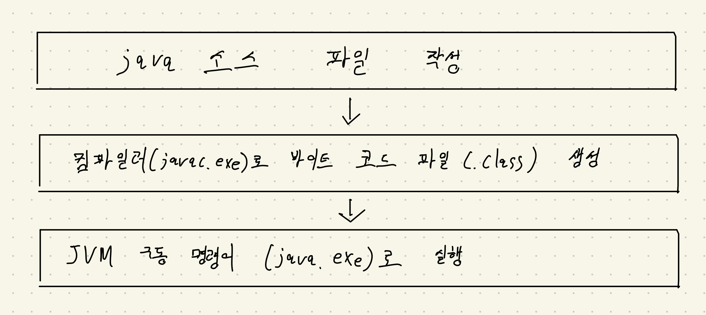
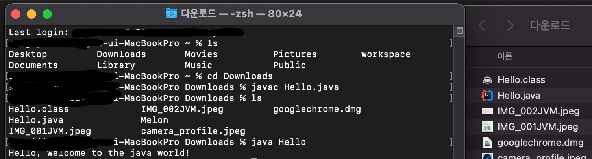

`학습할 것`
- JVM이란 무엇인가
- 컴파일 하는 방법
- 실행하는 방법
- 바이트코드란 무엇인가
- JIT컴파일러라 무엇이며 어떻게 동작하는지
- JVM 구성 요소
- JDK와 JRE의 차이

## JVM 은 무엇인가? 
 Java Virtual Machine 의 줄임말이며 Java Byte Code를 OS에 맞게 해석 해주 역할을 합니다. 
 
 운영체제는 자바 프로그램을 바로 실행할 수 없는데, 그 이유는 자바 프로그램은 완전한 기계어가 아닌, 중간 단계의 바이트 코드이기 때문에 이것을 해석하고 실행할 수 있는 가상의 운영체제가 필요하다. 이것이 자바 가상 기계 JVM (Java Virtual Machine) 이다. JVM은 실 운영체제를 대신해서 자바 프로그램을 실행하는 가상의 운영체제 역할을 한다.
프로그램을 별도로 개발하는 것보다는 운영체제와 잡 프로그램을 중계하는 JVM을 두어 자바 프로그램이 여러 운영체제에서 동일한 실행 결과가 나오도록 설계한 것이다. 따라서 개발자는 운영체제와 상관없이 자바 프로그램을 개발 할 수 있다.


자바 프로그램은 확장자가 .java 인 파일을 작성하는 것부터 시작된다. 이것을 소스파일이라고 하는데, 이 소스 파일을 컴파일러로(javac.exe)로 컴파일하면 확장자가 .class인 바이트 코드 파일이 생성된다.바이트 코드 파일은 JVM 구동 명령어 (java.exe)에 의해 JVM에서 해석되고 해당 운영체제에 맞게 기계어로 번역된다.
바이트 코드는 하나지만, JVM에 의해서 번역되는 기계어는 운영체제에 따라서 달라진다.

* Write once, run anywhere (한 번 작성하면 어디서든 실행된다.)

## 컴파일 하는 방법
 자바 프로그램을 개발하려면 다음과 같은 순서로 진행해야 한다.


*[Hello.java] 자바 소스 파일*
```
public class Hello {
    public static void main(String[] args) {
        System.out.println("Hello, welcome to the java world!");
    }
}
```
*Hello.java 소스 파일을 다음과 같이 컴파일*   
```
C:/Temp>javac Hello.java
```   

Hello.class가 생성되었는지 확인한다.  
 
## 실행하는 방법    
*JVM 구동 명령어인 java.exe를 다음과 같이 입력*   
```
C:/Temp>java Hello
```
   
Hello, welcome to the java world! 가 출력되는 것을 볼수 있다.

## 바이트코드란 무엇인가   
바이트코드(Bytecode, portable code, p-code)는 특정 하드웨어가 아닌 가상 컴퓨터에서 돌아가는 실행 프로그램을 위한 이진표현법이다. 하드웨어가 아닌 소프트웨어에 의해 처리되기 때문에 보통 기계어 보다 더 추상적이다.   

JVM이 사용자가 작성한 .java 소스 코드 파일을 운영체제에 실행 가능한 명령어 집합 파일로 컴파일 하는 과정 중에서 필요한 코드   
 * JVM이 이해할 수 있는 언어로 변환된 자바 소스 코드를 의미
 * 자바 컴파일러에 의해 변환되는 코드의 명령어의 크기가 1byte라서 자바 바이트 코드라고 불림
 * 자바 바이트 코드는 자바 가상 머신만 설치되어 있다면 어느 운영체제에서도 실행 가능   

## JIT 컴파일러란 무엇이며 어떻게 동작하는지
 JIT(Just-In-Time) 컴파일러는 바이트코드를 컴퓨터 프로세서(CPU)로 직접 보낼 수 있는 명령어로 바꾸는 프로그램이다.   
 일반적으로 컴파일러는 개발자와 최종 사용자를 위한 애플리케이션의 속도를 결정하는데 있어 핵심이다.
 Just-in-time 컴파일러는 성능 최적화를 위해 애플리케이션 런타임을 향상시킬 수 있다.   
 다른 컴파일러 유형과는 달리, JIT 컴파일러의 주요 정의 특성은 프로그램이 시작되고 코드를 컴파일한 후에 JIT 컴파일러를 실행한다는 것이다.
 이것을 말하는 일반적인 방법은 JIT 컴파일러는 즉시 또는 다시 말해서 시간에 맞추어 코드를 컴파일한다는 것이다.   
 컴파일된 코드, 즉 바이트 코드 시퀀스는 더 빠르고 읽기 쉬운 기계 언어 또는 네이티브 코드로 바뀐다.
 소스 코드를 호스트 CPU가 기본적으로 이해하는 언어로 변환하는 것은 일반적으로 더 빠르고 읽기 쉬운 명령 집합을 의미한다.

    
참조 https://m.blog.naver.com/ki630808/221844888233

### Just-In-Time 컴파일 작동 방식   
 바이트코드는 교차 플랫폼 실행을 돕는 어플리케이션에서 중요한 기능이다. 또한 바이트코드는 CPU가 제대로 이해할 수 있는 언어로 컴파일되고 번역되어야 한다.   
  그러나 그 바이트코드가 모국어로 번역되는 방법은 애플리케이션의 속도와 성능에 큰 영향을 미칠 수 있다. 성능을 개선하기 위해 JIT 컴파일러는 런타임에 적절한 바이트 코드 시퀀스를 기계 코드로 컴파일한다.   

  코드는 일반적으로 프로세서에 전송되며, 여기에서 코드 지침이 수행된다. 동일한 바이트 코드 블록이 다시 필요한 경우 이전에 생성된 개체 코드가 사용된다. 코드를 다시 최적화할 수 있는 것처럼 보이는 코드를 "핫"이라고 한다.
  코드를 모니터링할 수 있으며, 동일한 시퀀스의 코드를 여러 번 해석하는 것과 반대로 핫 코드 경로를 만들어 코드를 최적화할 수 있다. 
  다른 컴파일러 유형에서 발생할 수 있다. 코드를 여러 번 해석할 가능성이 적기 떄문에 오버헤드가 적어 실행 속도가 빨라진다. 
  이것이 JVM의 대부분의 구현이 J를 사용하는 이유다.
  
  참조 https://m.blog.naver.com/ki630808/221844888233
## JVM 구성 요소
