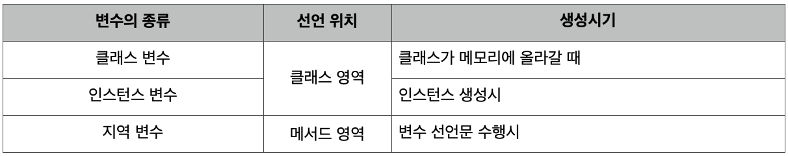

# 2주차 과제 : 자바 데이터 타입, 변수 그리고 배열

### 목표   
자바의 프리미티브 타입, 변수 그리고 배열을 사용하는 방법을 익힙니다.

`학습할 것`   

 * 프리미티브 타입 종류와 값의 범위 그리고 기본 값
 * 프리미티브 타입과 레퍼런스 타입
 * 리터럴
 * 변수 선언 및 초기화하는 방법
 * 변수의 스코프와 라이프타임
 * 타입 변환, 캐스팅 그리고 타입 프로모션
 * 1차 및 2차 배열 선언하기 
 * 타입 추론, var 


## 프리미티브 타입 종류와 값의 범위 그리고 기본 값    

 프리미티브 타입 (primitive type) ,또는 원시 타입 또는 기본형 타입 이라고 하기도 한다.
우선 타입이란 데이터 타입을 줄인 말로 자료형 이라고 하기도 한다.   
 데이터 타입 이란 데이터가 메모리에 어떻게 저장될 것이고 어떻게 다뤄져야 하는지에 대한 것이다.
즉, 데이터 타입을 보면 컴퓨터에서 어떤 형태를 가지며 어떻게 처리될 수 있는지 머릿속에 그릴 수 있다.


1 byte 는 8bit 이다. 그리고 1 bit 는 2진수 한 자리를 뜻한다.   
우리가 일반적으로 사용하는 10진수는 한 자리에 10가지를 표현할 수 있다.(0 ~ 9)   
2진수는 한 자리에 2가지 표현을 할 수 있다.(0 ~ 1)   

1 bit가 2진수 한 자리를 뜻하면, 2 비트는 2 진수 두자리를 뜻하고 다음과 같은 값을 표현할 수 있다.   
00, 01, 10, 11   
비트가 1 증가하자 표현할 수 있는 가지수가 2배가 되었다.   

3 bit로 표현 가능한 값은 다음과 같다.   
000, 001, 010, 011, 100, 101, 110, 111   
비트가 1 증가하지 표현할 수 있는 가지수가 역시 2배가 되었다.   

(** 10진수에서 자릿수가 늘어나면 표현 가능한 수가 10배가 되는 것을 생각하면 된다. ex 10 -> 100)   

여기서 우리는 1비트가 증가 할 때마다 표현할 수 있는 값이 두 배가 되는 것을 알 수 있다.   
2 비트로 표현 가능했던 모든 값의 앞에 0을 붙인 것과 1을 붙인 것, 두 그룹으로 만들 수 있다.   
**2비트로 표현 가능했던 모든 값 : 00, 01, 10, 11
 -> 모든 값 앞에 0을 붙인 값 : 000, 001, 010, 011
 -> 모든 값 앞에 1을 붙인 값 : 100, 101, 110, 111
결국 비트가 1 증가 할 경우 표현 가능한 값의 표현 범위가 2배가 된다는 것을 알 수 있다.
그리고 비트의 수와 표현 가능한 값의 수는 2의 거듭제곱으로 나타낼 수 있는 것도 알 수 있다. (두배씩 커지기 때문에)

정수형 프리미티브 타입 중 byte 자료형의 메모리 크기는 1 byte 이다.
즉 8비트 이다. 8비트로 표현 가능한 값의 개수는 2의 8제곱 이다.
2의 8제곱은 256인데 0 ~255 가 아니고 -128 ~ 127 까지 이다.
컴퓨터에서 음수를 표현하기 위해 MSB라는 것을 사용한다. 
Most Significant Bit 의 줄임 말로 가장 왼쪽에 위치한 비트인 최상위 비트를 뜻한다. 

8비트를 다음과 같이 표현할 수 있으면 

검게 색칠한 가장 왼쪽의 비트를 MSB 라고 부르고 부호 비트라고도 한다.
이 값이 1이면 음수, 0이면 양수라고 판단한다.

즉, 부호가 있는 자료형의 경우 1비트를 부호를 표현하기 위해 사용하기 떄문에
현재 예시를 기준으로 -128 ~ 127 까지의 값 표현 범위를 가진다.   
양수는 0이 포함되기 때문에 128이 아니다.   
만약 0 ~ 255 까지 표현하고 싶다면, 다시 말해 부호 비트의 자리도 데이터로 취급하려 한다면 unsigned (부호가 없는) 자료형을 사용하면 된다.    
음수는 표현하지 못하는 대신 양수 표현 범위가 두 배 늘어난다.

아쉽게도 자바에는 unsigned 타입의 자료형을 지원하지 않는다.   
그래서 보통 표현 범위를 넘을 때 큰 자료형을 사용하고는 한다.   
하지만 자바 8부터 Integer 와 Long 의 wrapper 클래스에 unsigned 관련한 static 메소드가 추가 되었다.

실수의 경우에는 정수형과 비교했을때 메모리 크기는 별반 다르지 않은데, 값의 표현 범위가 훨씬 넓다.

실수는 부호(-,+), 가수(mantissa),지수(exponent)로 구성되며, 부동 소수점 방식을 사용한다.   
부동 소수점 방식을 사용하여 모든 가수를 0 보다 크거나 같고 1보다 작은 값 범위의 값으로 만들고 원래 수를 표현하기 위해 
10을 몇 번 거듭 제곱해야 하는지 지수로 표현한다.

즉, 1.234 라는 값을 0.1234 * 10^1 로 표현한다는 것을 의미한다.

실수형 중 float 타입은 부호(1비트) + 지수(8비트) + 가수(23비트) = 32비트를 사용하고   
double 타입은 부호(1비트) + 지수(11비트) + 가수(52비트) = 64비트를 사용한다.

## 프리미티브(기본형) 타입과 레퍼런스(참조형) 타입   

자바 언어에서는 실제 값이 저장되어 있는 곳의 위치를 저장한 값(주소 값)을 뜻한다.
참조 타입의 종류는 배열, 열거(enum), 클래스, 인터페이스가 있다.

기본 타입과 참조타입을 구분하는 방법은 생각보다 단순하다.
저장되는 값이 실제 값 그 자체이냐 아니면 메모리의 주소값이냐에 따라 구분할 수 있다.

```
package me.xxx.xxx.week2;

public class Exam {
    public static void main(String[] args) {
        String name = "whiteship";
        int age = 20;
    }
}
```

레퍼런스 타입의 name 변수와 프리미티브 타입의 age 변수는 런타임 스택 영역에 생성 되고   
그리고 레퍼런스 타입의 값인 주소값과, 프리미티브 타입의 값인 17 역시 런타임 스택 영역에 저장 된다.

다만, 레퍼런스 타입의 값인 주소값이 가리키는 실제 값은 가비지 컬렉션 힙 영역에 객체가 생성 된다.
그래서 값을 복사할 때 조심해야 한다.

그 이유는 프리미티브 타입의 경우 실제 값이 아닌 주소값이 복사되기 때문이다.   
보통 기본서에서는 값에 의한 복사 (call by value)와 참조 또는 주소에 의한 복사 (call by reference) 라고 한다.   
값에 의한 복사가 아닌 경우 두가지 경우가 있는데 얕은 복사와 깊은 복사로 또 나뉜다. 

얕은 복사는 주소값을 복사하여 결국 동일한 가비지 컬렉션 힙 영역의 객체를 참조한다.   
그래서 이런 복사를 의도하지 않았을 경우 치명적인 오류가 발생할 수 있다.

깊은 복사는 프리미티브 타입에서의 값에 의한 복사처럼 완전히 똑같은 새로운 객체를 만들어 복사하는 것을 뜻한다.

## 리터럴
고정된 값을 갖는 소스코드 표현 형태 
` int a = 10 `
에서 바로 10이 리터럴 이다.   

고정된 값을 표현하는 리터럴은 정수를 표현하는 리터럴, 실수를 표현하는 리터럴, 문자를 표현하는 리터럴, boolean을 표현하는 리터럴, 문자열을 표현하는 리터럴 등이 있다.

### 정수 리터럴   
정수를 표현하는 방법은 여러가지가 있다. 일반적으로 사용하는 10진법 부터 2진법 8진법과 같은 방법이 있고 
자바에서는 다양한 진법을 지원한다.   

10진수 26을 다양한 리터럴로 표현해보자.
```
int decimal = 26; // 일반적인 형태 10진법
int ocatal = 032; // 제일 앞에 0 이 붙으면 8진법
int heaxaDecimal = 0x1a; // 0x가 붙으면 16진법
int binary = 0b11010; // 0b가 붙으면 2진법
```

정수 리터럴은 기본적으로 int 형이고, long 타입을 표현하려면 l,L을 마지막에 붙여야 한다.

### 실수 리터럴

실수 타입의 리터럴은 double 타입이고, float 타입으로 표현하려면 f를 명시적으로 붙여야한다.
```
double a = 0.1; // 0.1
double b = 1E-1; // 0.1
float c = 0.1f; // 0.1
```

### 문자 리터럴
문자는 작은따옴표(')안에 표현할 수 있다.
```
char a = 'a'; // a
```
또 한, 특수문자를 위한 리터럴들도 있다.
'\b' // 백스페이스(backspace)
'\t' // 탭(tab)
'\n' // 라인피드(line feed)
'\f' // 폼피드(form feed)
'\r' // 캐리지 리턴(carriage return)
'\"' // 이중 인용부호(double quote)
'\'' // 단일 인용부호(single quote)
'\\' // 백슬래시(backslash)

### 문자열 리터럴
문자열은 큰따옴표 (")안에 표현할 수 있다.
```
String a = "abc"; // abc
```
그런데, 문자열 리터럴에는 조금 특이한 점이 있다. 다른 리터럴들은 프리미티브 타입의 값을 표현하기 위해 존재한다. 
그런데 문자열 (String)은 레퍼런스 타입이지, 프리미티브 타입이 아니다. 그럼에도 String타입은 
literal을 지원하는데, literal 방식으로 String 에 값을 주면 Heap 영역에서 String constant pool 이라는 특수한 영역에 값이 저장된다. 그리고, 
동일한 값을 쓰는 경우에 다른 일반적인 레퍼런스타입 처럼 Heap에 올라가지 않고, String constant pool 에 존재하는 값을 참조하는 방식으로 작동한다. 

### boolean 리터럴
true, false로 표현할 수 있다.
```
boolean a = true;
boolean b = false;
```

## 변수 선언 및 초기화하는 방법 
* 변수 선언 (Declaration)     
변수를 선언한다는 것은, 저장공간을 확보하겠다는 의미로 해석할 수 있다.
```
int a; 
```
위의 코드가 변수를 선언한 것인데, 해석하자면 다음과 같다.   
int 타입의 값을 저장할 수 있는 공간을 확보했고 (int 타입은 4 byte) 그 공간을 지칭할 이름은 a 이다.

* 초기화 (Initialization)     
변수를 초기화 한다는 것은, 저장공간에 원하는 값을 저장하는 것을 의미한다. 
변수를 선언하고 나면, 해당 공간에는 아무런 의미 없는 쓰레기값이 들어가있게 된다. 
그리고 그 상태에서 컴파일을 시도하면 
Error : java: variable a might not have been initialized 와 같은 컴파일 에러코드를 볼 수 있다.   
그러므로 변수는 선언 후에 초기화를 해야하며 위에 선언한 변수에 대한 초기화는 다음과 같이 할 수 있다.
``` 
a = 10; 

int a = 10; // 변수의 선언과 초기화를 한 줄에 하는 것도 가능합니다.
```

## 변수의 스코프와 라이프타임 

"변수의 선언위치가 변수의 종류와 범위(scope)를 결정한다."   

   

   

### 선언위치에 따른 변수의 종류 
* 인스턴스 변수 (instance variable)    
 각 인스턴스의 개별적인 저장공간. 인스턴스마다 다른 값 저장가능   
 인스턴스 생성 후, '참조변수.인스턴스변수명'으로 접근   
 인스턴스를 생성할 때 생성되고, 참조변수가 없을 때 가비지컬렉터에 의해 자동제거됨   
* 클래스 변수 (class variable)     
 같은 클래스의 모든 인스턴스들이 공유하는 변수   
 인스턴스 생성없이 '클래스이름.클래스변수명'으로 접근   
 클래스가 로딩될 때 생성되고 프로그램이 종료될 때 소멸   
* 지역 변수 (local variable)    
 메서드 내에 선언되며, 메서드의 종료와 함께 소멸   
 조건문,반복문의 블럭{} 내에 선언된 지역변수는 블럭을 벗어나면 소멸    


## 타입 변환, 캐스팅 그리고 타입 프로모션 

타입캐스팅이란 크기가 더 큰 자료형을 크기가 더 작은 자료형에 대입하는 것을 의미한다. 예를 들어 
int(4byte) 타입의 데이터를 byte(1byte) 타입에 대입하는 경우가 있을 수 있겠다. 
데이터 크기가 더 크기 때문에 변환과정에서 데이터의 손실이나 변형이 올 수도 있다.
``` 
int a = 10;
byte b = (byte)a;
System.out.println(b); //10
// byte 는 -256 ~ 255 까지 표현할 수 있음으로 타입캐스팅을 했음에도 데이터 변형이나 손실은 오지 않는다.

int a = 10000;
byte b = (byte)a;
System.out.println(b); //16
// 표현범위를 벗어나는 값을 강제로 타입캐스팅해 데이터에 변형이 생겼다.
```

타입 프로모션 이란 타입캐스팅과 반대로 크기가 더 작은 자료형을 더 큰 자료형에 대입하는 것을 의미한다. 예를 들어 
byte(1byte)타입의 데이터를 int (4byte) 타입에 대입하는 경우이다. 그리고 이 경우에는 데이터 손실이나, 변형이 
오지 않음으로 캐스팅할 때 처럼 명시적으로 적지 않아도 자동으로 변환이 가능하다.
```
byte a = 10;
int b = a;
System.out.println(b); // 10
```

위와 같은 타입변환은 프리미티브 타입뿐만 아니라 레퍼런스 타입에서도 가능하다. 그런데 레퍼런스 타입에도 크기라는 개념으로 캐스팅과 프로모션을 
구분지어 생각하면 햇갈릴 수도 있다. 부모클래스로의 타입변환은 자동적으로 가능하지만 자식클래스로의 타입변환은 타입캐스팅이 필요하다. 조금만 생강해보면 
당연한 이유인데, 자식클래스는 부모클래스의 필드나 메소드를 물려받음으로 자식클래스 타입의 객체를 부모클래스 타입으로 바꾼다고 해서 데이터의 손실이나 변형이 
일어나진 않기 때문이다. 

## 1차 및 2차 배열 선언하기
배열이란 동일한 타입의 데이터를 연속된 공간에 저장하기 위한 자료구조이다. 

* 1차 배열의 선언    
배열을 선언하기 위해선 [ ] 를 사용해야 한다.
```
int [] arr1;
int arr2 [];
```
다음과 같이 변수명 앞에 [] 혹은 변수명 뒤에 [] 붙여서 선언하고 초기화는 
```
int [] arr = new int[10];
```
다음과 같이 배열의 크기를 정해줘야 한다.    
위 코드를 해석하자면 int 타입의 연속된 10개의 데이터를 저장하는 공간을 arr 이라는 이름으로 주겠다. 이다.    
그리고 배열에는 값을 할당할 수 있는데   
```
arr[0] = 10;
arr[1] = 20;
```
위와 같은 방식으로 할당할 수 있고 선언과 초기화 할당을 다음과 같이 한 줄로 할 수 있다.
```
int arr[] = {1,2,3}
//이 코드는 다음 코드와 동일
int arr[] = new int[3];
arr[0] = 1;
arr[1] = 2;
arr[2] = 3;
```
* 2차 배열의 선언    
2차 배열도 1차배열과 유사하며 다음과 같이 사용할 수 있다.
```
int [][] arr = new int [2][2];
arr[0][0] = 1;
arr[0][1] = 2;
arr[1][0] = 3;
arr[1][1] = 4;
//위 코드는 다음 코드와 동일
int arr[][] = {{1,2},{3,4}};
```

## 타입추론, var
타입 추론이란 데이터 타입을 소스코드에 명시하지 않아도, 컴파일 단계에서 컴파일러가 타입을 유추해 정해주는 것을 뜻한다.   
1.5버전 부터 추가된 Generic 이나 자바 8 버전에서 추가된 lamda 에서 타입추론이 사용된다. 자바10 에서는 이러한 타입추론을 사용하는 var 이라는 
Local Variable Type- Inference가 추가되었다.
```
var a = "hello"; // String a = "hello";
var b = 10;      // int b = 10;
```
