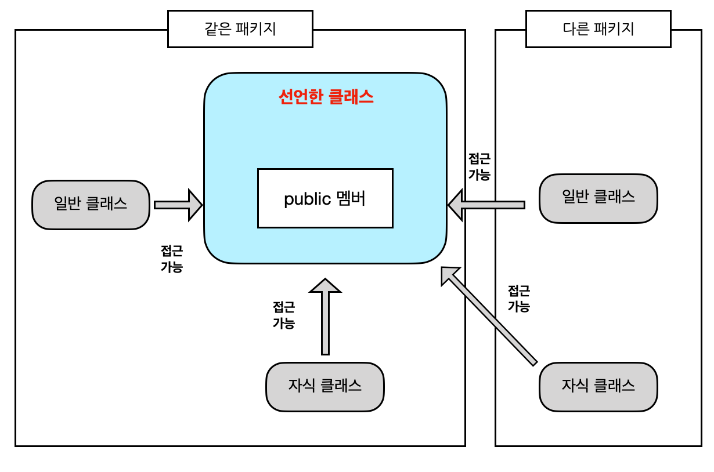
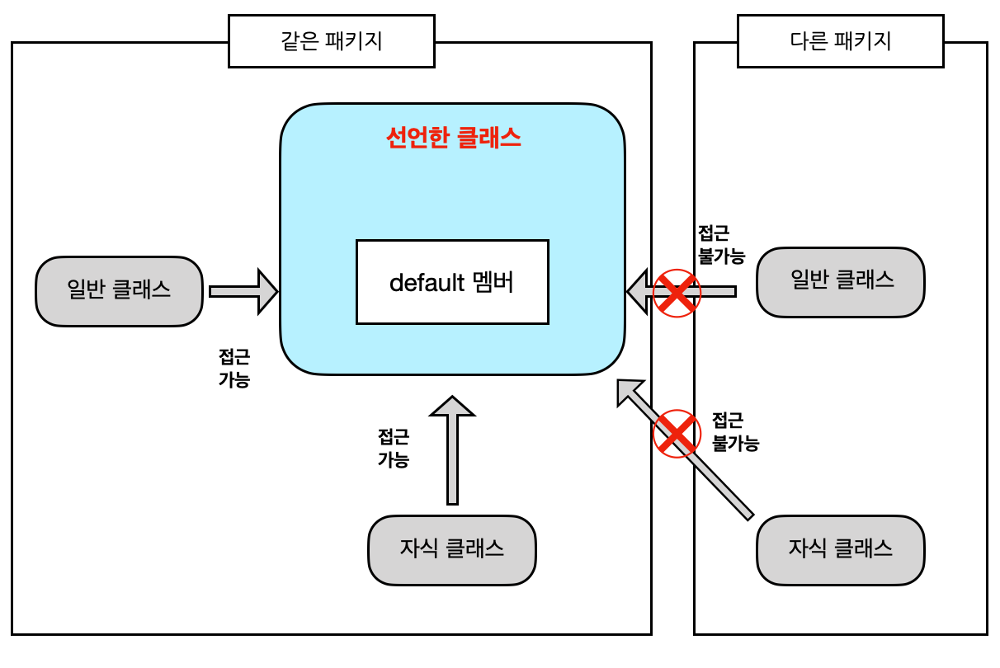
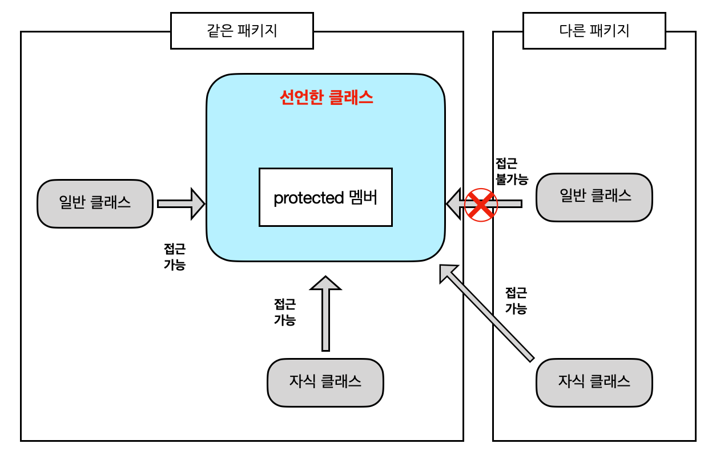

## 과제 6 : 상속   

### 목표 : 자바의 상속에 대해 학습하세요.   

### 학습할 것 (필수)      
* 자바 상속의 특징   
* super 키워드   
* 메소드 오버라이딩   
* 다이나믹 메소드 디스패치 (Dynamic Method Dispatch)   
* 추상 클래스   
* final 키워드   
* Object 클래스   

-------------

### 상속   

상속이라는 단어의 뜻과 마찬가지로 자바에서도 상속은 부모클래스의 변수와 메소드를 물려받는 것을 말한다.   
이런 상속은 코드의 재사용성을 통해 코드의 간결성을 확보해준다.   

* 상속 받틑 클래스 = 하위클래스 = 자식클래스 = 서브클래스   
* 상속 해주는 클래스 = 상위클래스 = 부모클래스 = 슈퍼클래스   

```java
class 자식클래스명 extends 부모클래스명 {

}
```

자바의 상속은 extends 라는 키워드를 통해 이루어진다.   

### 상속의 대상   

위에서 말한 대로 상속을 받으면 부모클래스의 변수와 메소드를 가져다 쓸 수 있다. 하지만 모두 다 사용 가능한 것은 아니다. 
접근지정자에 따라 상속하여도 사용할 수 없는 변수 및 메소드들이 생겨난다.

접근제어자
|접근제어자|같은클래스멤버|같은패키지멤버|자식클래스멤버|그외의영역|
|:---:|----|----|----|----|
|public|yes|yes|yes|yes|
|protected|yes|yes|yes||
|default|yes|yes|||
|private|yes||||

public 접근제어자   
public 으로 선언된 클래스 멤버 및 메서드는 프로그램 어디에서나 접근이 가능하다.   
    

default 접근제어자   
자바에서 기본적으로 명시되는 접근제어자로 접근제어자를 따로 몇시하지 않을ㄷ 때 해당 권한을 가지게 된다.   
해당 권한으로 선언되었을 때는 같은 패키지만 접근이 가능하다.   
   

private 접근제어자   
외부로부터는 접근할 수 없게 해주는 접근제어자로 정보은닉을 위한 접근제어자 이다. 선언한 클래스 이외에는 어느 패키지에서도 접근할 수 없다.   
(이에 접근하기 위해 보통 getter/setter를 설정하여 사용한다.)   
     

protected 접근제어자   
default 접근제어자에서 권한이 하나 더 추가된 접근제어자 이다. 다른패키지에서 해당 클래스를 상속받을 경우 사용권한이 생기게 된다.   
     

