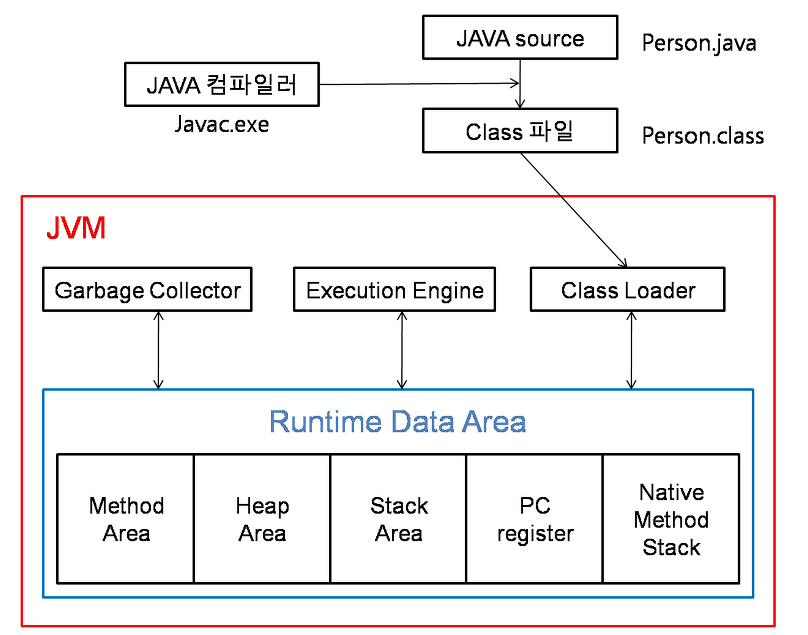

## 과제 7 : 패키지   

### 목표 : 자바의 패키지에 대해 학습하세요.    

### 학습할 것 (필수)      
* package 키워드   
* import 키워드   
* 클래스패스   
* CLASSPATH 환경변수   
* -classpath 옵션   
* 접근지시자   


-------------

### 패키지   
* 클래스를 구분짓는 폴더 개념   
* 자바는 패키지의 가장 상위 디렉토리(root)에서 실행해야 한다는 약속이 있기 때문에 해당 패키지로 가서 컴파일 하지 않는다.    
* 소스에 가장 첫 줄에 있어야하고, 패키지 선언은 소스 하나에 하나만 있어야 한다.   
* 패키지 이름은 모두 소문자여야 한다.   
* 자바의 예약어를 사용하면 안된다. (ex. int, static)    
* 개발 패키지 표준은 정하는 것에 따라 지정하면 된다.   
* 패키지 이름과 위치한 폴더의 이름이 같이야 한다.   
* 패키지 이름을 java 로 시작하면 안된다.   
* 모든 클래스에는 정의된 클래스 이름과 패키지 이름이 있다. 이 둘을 합쳐야 완전하게 한 클래스를 표현한다고 할 수 있으며 FQCN(Fully Qualified Class Name) 이라고 한다.   

예를 들어 String 클래스의 패키지는 java.lang 이먀 FQCN 은 java.lang.String 이 된다.   

패키지 구조 사진
    

대부분의 패키지 이름 지정 규칙    
|패키지 시작이름|내용|
|:---|:---|
|java|자바 기본 패키지(java vendor 개발)|
|javax|자바 확장 패키지(java vendor 개발)|
|org|일반적으로 비영리단체(오픈소스)패키지|
|corm|일반적으로 영리단체 패키지|

빌트-인 패키지(Built-in Package)    
자바는 개발자들이 사용할 수 있도록 여러 많은 패키지 및 클래스를 제공한다.   
가장 자주 쓰이는 패키지로는 java.lang과 java.util이 있다.   
java.lang 은 자주 사용하는 패키지이지만 한번도 import 하여 사용한적이 없다.   
즉, 자바에서 java.lang 패키지는 아주 기본적인 것들이기 때문에 import로 불러오지 않아도 자바가 알아서 java.lang의 클래스를 불러온다.    

```java
import java.lang.String; 
import java.lang.System;
public class Main {
    public static void main(String[] args) {
        String str = "this is from java.lang.String";
        System.out.println(str);
    }
}
```

### Import 키워드    
import 키워드는 다른 패키지에 있는 클래스나 인터페이스 등을 참조할 때 사용한다.   
동일 패키지나 클래스나 java.lang 패키지의 클래스는 imprt 구문 없이 참조 가능하다.   
이때 규칙은 FQCN 을 입력해야 한다.   

```
import 패키지명.클래스명   
```
다른 패키지명에 있는 클래스를 찾지 못할때 사용한다.    
패키지에 다수의 클래스를 import 하는 경우 ```import 패키지명.*``` 처럼 import 할 수 있다.    
```import static``` 의 경우, static 한 변수(클래스 변수)와 static 한 메소드를 사용하고자 할 때 용이하다. (이것이 없다면, 클래스함수, 클래스.변수 형태로 이용해야 한다.)   

import 를 하지 않아도 되는 패키지의 경우는    
1. java.lang 패키지    
2. 같은 패키지   

```java
package me.whiteship.livestudy.week7.model;         // 클래스의 패키지 

import me.whiteship.livestudy.week7.ExampleClass;   // 타 패키지 클래스 임포트
import me.whiteship.livestudy.week7.SampleClass;    // 타 패키지 클래스 임포트  

public class Week7Medel {
    ExampleClass example = new ExampleClass();
    SampleClass sample = new SampleClass();
}
```
만약 한 패키지의 여러 클래스를 import 한다면 * 를 사용하여 가능하다. 하지만 추천하지 않는다.   
```java
package me.whiteship.livestudy.week7.model;

import me.whiteship.livestudy.week7.*;          // week7 패키지 모든 클래스 참조 가능 

public class Week7Medel {
    ExampleClass example = new ExampleClass();
    SampleClass sample = new SampleClass();
}
```
또한 정적(static) 멤버도 import 가능하다.   
```java 
pacakge me.whiteship.livestudy.week7.model;

import static java.lang.System.out;             // static 임포트

public class Week7Model {
    public void print() {
        out.print("println");
        out.print("print");
    }
}
```

### 클래스패스 (ClassPath)    
클래스패스는 JVM 혹은 Java 컴파일러가 사용하는 파라미터인데 클래스나 패키지를 찾을 때 기준이 되는 경로를 말한다.   
즉, java 명령을 통해 클래스 파일을 실행할 때 클래스 파일을 찾는 기준이 되는 경로를 클래스패스라고 하며 기본적으로 java 명령을 실행하는 위치를 의미 한다.   

클래스를 찾기위한 경로   
JVM이 (누가) 프로그램을 실행할 때(언제), 클래스파일을 찾는 데(왜) 클래스패스(기준이 되는 파일 경호)(무엇을)를 사용한다.   
즉, JVM은 CLASSPATH의 경로를 확인하여 라이브러리 클래스들의 위치를 참조하게 된다. 그러나 J2JDK 버전부터는 /jre/lib/ext 폴더에 필요한 클래스 라이브러리들을 복사해 놓으면 
사용가능하여 특별한 경우가 아니면 설정을 하지 않는다.

JVM 구성 이미지 넣기
    
소스코드(.java로 끝나는 파일)를 컴파일하면 소스코드가 "바이트코드"로 변환된다.    
java runtime(java 또는 jre)으로 이 .class 파일에 포함된 명령을 실행하려면, 이 파일을 찾을 수 있어야 한다.   
class 파일을 찾을 때, classpath에 지정된 경로를 사용한다.   

classpath는 .class 파일이 포함된 디렉토리와 파일을 콜론(;)으로 구분한 목록이다.   
이 classpath 를 지정하기 위한 두 가지 방법이 있다.   
* CLASSPATH 환경변수 사용   
* java runtime에 -classpath 옵션 사용   

### CLASSPATH 환경변수   
위에서 설명한 클래스패스를 환경 변수를 통해 설정할 수 있다.   
```CLASSPATH =.;C:Program Files/Java/jdk-11.0.1/lib/tools.jar ```   
컴퓨터 시스템 변수 설정을 통해 지정할 수 있다.   
JVM이 시작될 때 JVM의 클래스 로더는 이 환경 변수를 호출한다. 그래서 환경 변수에 설정되어 있는 디렉토리가 호출되면 그 디렉토리에 있는 클래스들을 먼저 JVM에 로드한다.   
그러므로 CLASSPATH 환경 변수에는 필수 클래스들이 위치한 디렉토리를 등록하도록 한다.   

### -classpath 옵션    
``` javac<options> <source files> ```   
컴파일러가 컴파일 하기 위해서 필요로 하는 참조할 클래스 파일들을 찾기 위해서 컴파일시 파일 경로를 지정해주는 명령어 이다.   
Hello.java 파일이 C:/Java 디렉토리에 존재하고, 필요한 클래스 파일들이 C:/Java/Fileclasses 에 위치한다면,   
```javac -classpath C:/Java/Fileclasses C:/Java/Hello.java ``` 로 해주면 된다.   

만약 참조할 클래스 파일들이 그 외의 다른 디렉토리, 그리고 현 디렉토리에도 존재한다면,   
``` javac -classpath.;C:/Java/Fileclasses;C:/Java/Otherclasses C:/Java/Hello.java ```    
과 같이 ; 으로 구분해줄 수 있다. (. 은 현 디렉토리 , .. 은 현 디렉토리에서 상위 디렉토리를 의미 한다. )   

### 접근지시자 (Access Modifier)   
접근 지시자는 멤버 변수나 메소드들의 접근 범위를 정의하기 위해 사용 한다.   
* public : 접근을 제한하지 않아 어디서든 접근이 가능하다.   
* private : 클래스 내부에서만 접근을 허용 한다.   
* protected : 클래스 내부, 동일 패키지, 상속받은 클래스에서만 접근을 허용 한다.   
* default(명시X) : 클래스 내부와 동일 패키지에서만 접근이 가능 하다.   

|지시자|클래스 내부|동일 패키지|상속받은 클래스|이외|
|---|---|---|---|---|
|private|O|X|X|X|
|default|O|O|X|X|
|protected|O|O|O|X|
|public|O|O|O|O|   

